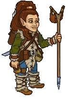
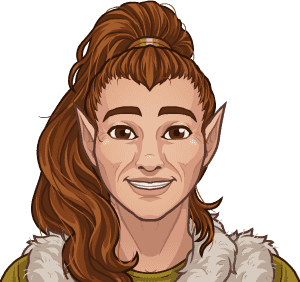
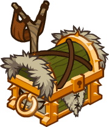
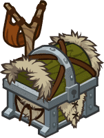

[Back to Main](index.md)

    
        
            
        
        
            Portrait
        
    
    
        
            
        
        
            Model
        
    

# Tasslehoff

Tasslehoff Burrfoot was born the son of unknown parents, but does have a little sister. Tas grew up with his parents and sister until 341 AC, when at the age of sixteen, he got the Wanderlust itch. He had a cousin Latchlifter Furrfoot, Uncle Remo Lockpick, an Uncle Bertie, and an Uncle Wilfre. He may have had an Uncle Trapspringer Furrfoot, but many kender claim relation to Uncle Trapspringer so this might not be true.

[Dragonlace Fandom Wiki](https://dragonlance.fandom.com/wiki/Tasslehoff_Burrfoot/){:target="_blank"}

# Basic Information

Tasslehoff will be a new champion in the Festival of Fools event on 1 April 2026.

    
        
            **Seat**:
        
        
            Unknown
        
    
    
        
            **Species**:
        
        
            Kender (Guess)
        
    
    
        
            **Class**:
        
        
            Rogue (Guess)
        
    
    
        
            **Roles**:
        
        
            Unknown
        
    
    
        
            **Age**:
        
        
            Unknown
        
    
    
        
            **Gender**:
        
        
            Male (Guess)
        
    
    
        
            **Alignment**:
        
        
            Unknown
        
    
    
        
            **Affiliation**:
        
        
            Heroes of the Lance (Guess)
        
    

# Formation

Unknown.


    



# Attacks

Unknown.

# Abilities

**Borrower** (Guess)
> Unknown effect.

<em>Raw Data</em>

<pre>
{
    "id": 28631,
    "graphic": "Icons/Events/2018FestivalofFools/FestivalofFools_Y9/Icon_Formation_Tasslehoff_Borrower",
    "v": 2,
    "fs": 0,
    "p": 0,
    "type": 1,
    "export_params": {
        "uses": [
            "formation_icon"
        ],
        "quantize": true
    }
}
</pre>

**Diversion** (Guess)
> Unknown effect.

<em>Raw Data</em>

<pre>
{
    "id": 28632,
    "graphic": "Icons/Events/2018FestivalofFools/FestivalofFools_Y9/Icon_Formation_Tasslehoff_Diversion",
    "v": 2,
    "fs": 0,
    "p": 0,
    "type": 1,
    "export_params": {
        "uses": [
            "formation_icon"
        ],
        "quantize": true
    }
}
</pre>

**Wanderlust** (Guess)
> Unknown effect.

<em>Raw Data</em>

<pre>
{
    "id": 28633,
    "graphic": "Icons/Events/2018FestivalofFools/FestivalofFools_Y9/Icon_Formation_Tasslehoff_Wanderlust",
    "v": 2,
    "fs": 0,
    "p": 0,
    "type": 1,
    "export_params": {
        "uses": [
            "formation_icon"
        ],
        "quantize": true
    }
}
</pre>

# Specialisations

**Fast Friends** (Guess)
> Unknown effect.

<em>Raw Data</em>

<pre>
{
    "id": 28634,
    "graphic": "Icons/Events/2018FestivalofFools/FestivalofFools_Y9/Icon_Specialization_Tasslehoff_FastFriends",
    "v": 2,
    "fs": 0,
    "p": 0,
    "type": 1,
    "export_params": {
        "uses": [
            "specialization_icon"
        ],
        "quantize": true
    }
}
</pre>

**Old Friends** (Guess)
> Unknown effect.

<em>Raw Data</em>

<pre>
{
    "id": 28638,
    "graphic": "Icons/Events/2018FestivalofFools/FestivalofFools_Y9/Icon_Specialization_Tasslehoff_OldFriends",
    "v": 2,
    "fs": 0,
    "p": 0,
    "type": 1,
    "export_params": {
        "uses": [
            "specialization_icon"
        ],
        "quantize": true
    }
}
</pre>

**Small Friends** (Guess)
> Unknown effect.

<em>Raw Data</em>

<pre>
{
    "id": 28639,
    "graphic": "Icons/Events/2018FestivalofFools/FestivalofFools_Y9/Icon_Specialization_Tasslehoff_SmallFriends",
    "v": 2,
    "fs": 0,
    "p": 0,
    "type": 1,
    "export_params": {
        "uses": [
            "specialization_icon"
        ],
        "quantize": true
    }
}
</pre>

**Map Collector: Pre-Cataclysm** (Guess)
> Unknown effect.

<em>Raw Data</em>

<pre>
{
    "id": 28635,
    "graphic": "Icons/Events/2018FestivalofFools/FestivalofFools_Y9/Icon_Specialization_Tasslehoff_MapCollector_PreCataclysm",
    "v": 2,
    "fs": 0,
    "p": 0,
    "type": 1,
    "export_params": {
        "uses": [
            "specialization_icon"
        ],
        "quantize": true
    }
}
</pre>

**Map Collector: Time of Darkness** (Guess)
> Unknown effect.

<em>Raw Data</em>

<pre>
{
    "id": 28636,
    "graphic": "Icons/Events/2018FestivalofFools/FestivalofFools_Y9/Icon_Specialization_Tasslehoff_MapCollector_TimeOfDarkness",
    "v": 2,
    "fs": 0,
    "p": 0,
    "type": 1,
    "export_params": {
        "uses": [
            "specialization_icon"
        ],
        "quantize": true
    }
}
</pre>

**Map Collector: War of the Lance** (Guess)
> Unknown effect.

<em>Raw Data</em>

<pre>
{
    "id": 28637,
    "graphic": "Icons/Events/2018FestivalofFools/FestivalofFools_Y9/Icon_Specialization_Tasslehoff_MapCollector_WarOfTheLance",
    "v": 2,
    "fs": 0,
    "p": 0,
    "type": 1,
    "export_params": {
        "uses": [
            "specialization_icon"
        ],
        "quantize": true
    }
}
</pre>

# Items

Unknown.

# Feats

Unknown.

# Legendaries

Unknown.

# Adventures and Variants

Unknown.

# Other Champion Images

    
        
            Console Portrait
        
    
    
        
            Gold Chest Icon
        
        
            Silver Chest Icon
        
    

[Back to Top](#top)

*Last Modified: {{ site.time }}*