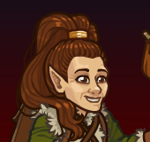
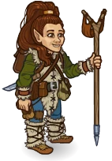
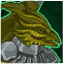
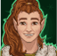
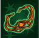

[Back to Main](index.md)

    
        
            
        
        
            Portrait
        
    
    
        
            
        
        
            Model
        
    

# Tasslehoff

Tasslehoff Burrfoot was born the son of unknown parents, but does have a little sister. Tas grew up with his parents and sister until 341 AC, when at the age of sixteen, he got the Wanderlust itch. He had a cousin Latchlifter Furrfoot, Uncle Remo Lockpick, an Uncle Bertie, and an Uncle Wilfre. He may have had an Uncle Trapspringer Furrfoot, but many kender claim relation to Uncle Trapspringer so this might not be true.

[Dragonlace Fandom Wiki](https://dragonlance.fandom.com/wiki/Tasslehoff_Burrfoot/){:target="_blank"}

# Basic Information

Tasslehoff will be a new champion in the Festival of Fools event on 1 April 2026.

    
        
            **Seat**:
        
        
            Unknown
        
    
    
        
            **Species**:
        
        
            Kender (Guess)
        
    
    
        
            **Class**:
        
        
            Rogue (Guess)
        
    
    
        
            **Roles**:
        
        
            Support (Guess)
        
    
    
        
            **Age**:
        
        
            Unknown
        
    
    
        
            **Gender**:
        
        
            Male (Guess)
        
    
    
        
            **Alignment**:
        
        
            Unknown
        
    
    
        
            **Affiliation**:
        
        
            Heroes of the Lance (Guess)
        
    

# Formation

    <svg xmlns="http://www.w3.org/2000/svg" id="Tasslehoff" fill="#aaa" data-formationName="Tasslehoff" data-campaignName="Festival of Fools" width="294" height="160"><circle cx="135" cy="85" r="15"/><circle cx="135" cy="125" r="15"/><circle cx="95" cy="25" r="15"/><circle cx="95" cy="65" r="15"/><circle cx="95" cy="105" r="15"/><circle cx="95" cy="145" r="15"/><circle cx="55" cy="45" r="15"/><circle cx="55" cy="85" r="15"/><circle cx="55" cy="125" r="15"/><circle cx="15" cy="65" r="15"/><text x="165" y="25" fill="#dcdcdc" font-size="25" font-family="Arial" font-weight="bold">Tasslehoff</text><text x="165" y="65" fill="#dcdcdc" font-size="15" font-family="Arial" font-weight="bold">Festival of Fools</text></svg>

# Attacks

**Base Attack: Hoopak** (Ranged)
> Tasslehoff fires a stone at the closest enemy, dealing one hit.  
> Cooldown: 3.5s (Cap 0.875s)

<em>Raw Data</em>

<pre>
{
    "id": 960,
    "name": "Hoopak",
    "description": "Tasslehoff fires a stone at the closest enemy, dealing one hit.",
    "long_description": "",
    "graphic_id": 0,
    "target": "front",
    "num_targets": 1,
    "aoe_radius": 0,
    "damage_modifier": 1,
    "cooldown": 3.5,
    "animations": [
        {
            "type": "ranged_attack",
            "projectile": "pd_generic_projectile",
            "shoot_offset_x": 48,
            "shoot_offset_y": -115,
            "shoot_frame": 31,
            "shoot_sound": 149,
            "hit_sound": 133,
            "projectile_details": {
                "hash": "hoopak",
                "projectile_speed": 1500,
                "rotation_speed": 467,
                "percent_height_offset": 12,
                "projectile_graphic_id": 28671,
                "__projectile_hit_graphic_id": 750,
                "trail": {
                    "lifespan": 0.2,
                    "spawn_rate": 367,
                    "particle_graphic_ids": [
                        12485
                    ],
                    "initial_velocity": {
                        "x": "0",
                        "y": "0"
                    },
                    "velocity_jitter": {
                        "x": "50",
                        "y": "50"
                    },
                    "alpha_lerp": {
                        "0": 0,
                        "0.1": 0.75,
                        "1": 0
                    },
                    "scale_lerp": [
                        {
                            "x": 0.25,
                            "y": 0.25
                        },
                        {
                            "x": 0,
                            "y": 0
                        }
                    ],
                    "tint": {
                        "r": 1,
                        "g": 1,
                        "b": 1,
                        "a": 1
                    }
                }
            }
        }
    ],
    "tags": [
        "ranged"
    ],
    "damage_types": [
        "ranged"
    ]
}
</pre>

**Ultimate Attack: I'm Not the Hero** (Guess)
> Tasslehoff encourages the next Champion to use their ultimate to deal 400% more damage with that ultimate.  
> Cooldown: 3.5s (Cap 0.875s)

ⓘ *Note: Very short ultimate cooldowns are almost always for testing purposes and are likely to be increased later.*

<em>Raw Data</em>

<pre>
{
    "id": 961,
    "name": "I'm Not the Hero",
    "description": "Tasslehoff causes the next ultimate used to deal 400% more damage with that ultimate.",
    "long_description": "Tasslehoff encourages the next Champion to use their ultimate to deal 400% more damage with that ultimate.",
    "graphic_id": 28640,
    "target": "none",
    "num_targets": 1,
    "aoe_radius": 0,
    "damage_modifier": 1,
    "cooldown": 3.5,
    "animations": [
        {
            "content_set_id": 10,
            "type": "ultimate_attack",
            "ultimate": "dm",
            "no_damage_display": true,
            "no_cooldown_display": true,
            "hero_reset_blacklist": [],
            "shoot_offset_x": 50,
            "shoot_offset_y": -25,
            "shoot_frame": 8,
            "bonus_half_time_effect": {
                "effect_string": "global_dps_multiplier_mult,400"
            }
        }
    ],
    "tags": [
        "ranged"
    ],
    "damage_types": [
        "ranged"
    ]
}
</pre>

# Abilities

**Borrower** (Guess)
> Unknown effect.

<em>Raw Data</em>

<pre>
{
    "id": 28631,
    "graphic": "Icons/Events/2018FestivalofFools/FestivalofFools_Y9/Icon_Formation_Tasslehoff_Borrower",
    "v": 2,
    "fs": 0,
    "p": 0,
    "type": 1,
    "export_params": {
        "uses": [
            "formation_icon"
        ],
        "quantize": true
    }
}
</pre>

**Diversion** (Guess)
> Unknown effect.

<em>Raw Data</em>

<pre>
{
    "id": 28632,
    "graphic": "Icons/Events/2018FestivalofFools/FestivalofFools_Y9/Icon_Formation_Tasslehoff_Diversion",
    "v": 2,
    "fs": 0,
    "p": 0,
    "type": 1,
    "export_params": {
        "uses": [
            "formation_icon"
        ],
        "quantize": true
    }
}
</pre>

**Wanderlust** (Guess)
> Unknown effect.

<em>Raw Data</em>

<pre>
{
    "id": 28633,
    "graphic": "Icons/Events/2018FestivalofFools/FestivalofFools_Y9/Icon_Formation_Tasslehoff_Wanderlust",
    "v": 2,
    "fs": 0,
    "p": 0,
    "type": 1,
    "export_params": {
        "uses": [
            "formation_icon"
        ],
        "quantize": true
    }
}
</pre>

# Specialisations

**Fast Friends** (Guess)
> Unknown effect.

<em>Raw Data</em>

<pre>
{
    "id": 28634,
    "graphic": "Icons/Events/2018FestivalofFools/FestivalofFools_Y9/Icon_Specialization_Tasslehoff_FastFriends",
    "v": 2,
    "fs": 0,
    "p": 0,
    "type": 1,
    "export_params": {
        "uses": [
            "specialization_icon"
        ],
        "quantize": true
    }
}
</pre>

**Old Friends** (Guess)
> Unknown effect.

<em>Raw Data</em>

<pre>
{
    "id": 28638,
    "graphic": "Icons/Events/2018FestivalofFools/FestivalofFools_Y9/Icon_Specialization_Tasslehoff_OldFriends",
    "v": 2,
    "fs": 0,
    "p": 0,
    "type": 1,
    "export_params": {
        "uses": [
            "specialization_icon"
        ],
        "quantize": true
    }
}
</pre>

**Small Friends** (Guess)
> Unknown effect.

<em>Raw Data</em>

<pre>
{
    "id": 28639,
    "graphic": "Icons/Events/2018FestivalofFools/FestivalofFools_Y9/Icon_Specialization_Tasslehoff_SmallFriends",
    "v": 2,
    "fs": 0,
    "p": 0,
    "type": 1,
    "export_params": {
        "uses": [
            "specialization_icon"
        ],
        "quantize": true
    }
}
</pre>

**Map Collector: Pre-Cataclysm** (Guess)
> Unknown effect.

<em>Raw Data</em>

<pre>
{
    "id": 28635,
    "graphic": "Icons/Events/2018FestivalofFools/FestivalofFools_Y9/Icon_Specialization_Tasslehoff_MapCollector_PreCataclysm",
    "v": 2,
    "fs": 0,
    "p": 0,
    "type": 1,
    "export_params": {
        "uses": [
            "specialization_icon"
        ],
        "quantize": true
    }
}
</pre>

**Map Collector: Time of Darkness** (Guess)
> Unknown effect.

<em>Raw Data</em>

<pre>
{
    "id": 28636,
    "graphic": "Icons/Events/2018FestivalofFools/FestivalofFools_Y9/Icon_Specialization_Tasslehoff_MapCollector_TimeOfDarkness",
    "v": 2,
    "fs": 0,
    "p": 0,
    "type": 1,
    "export_params": {
        "uses": [
            "specialization_icon"
        ],
        "quantize": true
    }
}
</pre>

**Map Collector: War of the Lance** (Guess)
> Unknown effect.

<em>Raw Data</em>

<pre>
{
    "id": 28637,
    "graphic": "Icons/Events/2018FestivalofFools/FestivalofFools_Y9/Icon_Specialization_Tasslehoff_MapCollector_WarOfTheLance",
    "v": 2,
    "fs": 0,
    "p": 0,
    "type": 1,
    "export_params": {
        "uses": [
            "specialization_icon"
        ],
        "quantize": true
    }
}
</pre>

# Items

Unknown.

# Feats

Unknown.

# Legendaries

Unknown.

# Adventures and Variants

**Unlock Adventure: A Fool's Errand (Tasslehoff)** (Complete Area 50)
> Save the village from a foolish prank gone wrong.

 **Variant 1: Did I Ever Tell You About...?** (Complete Area 75)
> Tasslehoff starts in the formation. He can be moved, but not removed.  
> Only Tasslehoff and Champions in the 3 rear-most columns can deal damage.  
> Champions next to Tasslehoff attack slower due to his stories. Their base attack cooldowns are increased by 2 seconds.  
> 1-2 Bozak Draconians spawn with each wave. They don't drop gold nor count towards quest progress.  
> <b>Getting to Know Tasslehoff:</b> Tasslehoff's buff can be set to one of the three columns in the back of the formation. Place your damage dealers to take advantage of this!

 **Variant 2: Fizban's Fabulous Friendship** (Complete Area 125)
> Tasslehoff starts in the formation. He can be moved, but not removed.  
> Fizban joins the formation. Champions in Fizban's column deal 1000% additional damage. This bonus counts as a positional formation ability.  
> You may only use Champions that have positional formation abilities.  
> Only Tasslehoff and Champions not next to him can deal damage.  
> 1-2 Baaz Draconians spawn with each wave. They don't drop gold nor count towards quest progress.  
> In each boss area, a Sivak Draconian boss spawns as part of the first wave. (Monster ID 2335) It must also be defeated to progress.  
> <b>Getting to Know Tasslehoff:</b> Tasslehoff's Diversion ability turns off positional formation buffs affecting his slot and neighboring slots, but his buff increases in power each time that happens. Place your damage dealer away from Tasslehoff to get the most of this!

 **Variant 3: A Loyal Friend** (Complete Area 175)
> Tasslehoff starts in the formation. He can be moved, but not removed.  
> You may only use Champions that count for any of Tasslehoff's second specialization choices.  
> Only Tasslehoff and Champions not next to him can deal damage.  
> The enemy/boss enrage bar starts out on the screen and begins to fill immediately. When one or more Monstrosity enemies are alive, the bar fills four times faster.  
> 1-2 Kapak Draconians spawn with each wave. They don't drop gold nor count towards quest progress.  
> In each boss area, an Aurak Draconian boss spawns as part of the first wave. It must also be defeated to progress.  
> <b>Getting to Know Tasslehoff:</b> Tasslehoff's second specialization choice determines which Champions he works best with. Who will you choose?

# Other Champion Images

    
        
            Console Portrait
        
    
    
        
            Gold Chest Icon
        
        
            Silver Chest Icon
        
    

[Back to Top](#top)

*Last Modified: {{ site.time }}*