[Back to Main](index.md)

    
        
            
        
        
        Portrait
        
    
    
        
            
        
        
        Model
        
    

# Tess

Tessalynde is an ambitious young rogue who dreams of leading Faerûn's foremost adventuring party. While the crew she’s gathered isn't the stuff of legend yet, she's confident her guidance can get them there.

[The Fallbacks: Bound for Ruin - Fandom Wiki](https://forgottenrealms.fandom.com/wiki/The_Fallbacks:_Bound_for_Ruin)

# Basic Information

Tess will be a new champion in the Founders' Day event on 2 July 2025.

    
        
            **Seat**:
        
        
            Unknown
        
    
    
        
            **Species**:
        
        
            Unknown
        
    
    
        
            **Class**:
        
        
            Rogue (Guess)
        
    
    
        
            **Roles**:
        
        
            Support (Guess)
        
    
    
        
            **Age**:
        
        
            Unknown
        
    
    
        
            **Gender**:
        
        
            Female (Guess)
        
    
    
        
            **Alignment**:
        
        
            Unknown
        
    
    
        
            **Affiliation**:
        
        
            The Fallbacks (Guess)
        
    

# Formation

Unknown.


    



# Attacks

**Base Attack: Hand Crossbow** (Ranged)
> Tess attacks the closest enemy for 1 hit.  
> Cooldown: 3.5s (Cap 0.875s)

<em>Raw Data</em>

<pre>
{
    "id": 870,
    "name": "Hand Crossbow",
    "description": "Tess attacks the closest enemy for 1 hit.",
    "long_description": "",
    "graphic_id": 0,
    "target": "front",
    "num_targets": 1,
    "aoe_radius": 0,
    "damage_modifier": 1,
    "cooldown": 3.5,
    "animations": [
        {
            "type": "ranged_attack",
            "projectile": "pd_generic_projectile",
            "shoot_offset_y": -60,
            "shoot_frame": 8,
            "shoot_sound": 149,
            "hit_sound": 133,
            "projectile_details": {
                "hash": "67f52f8a67393eadfdc8ef2193442a04",
                "target_offset_y": 0,
                "projectile_speed": 1850,
                "projectile_graphic_id": 26775
            }
        }
    ],
    "tags": [
        "ranged"
    ],
    "damage_types": [
        "ranged"
    ]
}
</pre>

# Abilities

**Unknown** (Guess)
> Uggie joins the party, starting next to Tess unless they're already in the formation next to another Fallbacks Champion. Uggie increases the damage of all non-adjacent Champions by $amount%.

<em>Raw Data</em>

<pre>
{
    "id": 2346,
    "flavour_text": "",
    "description": {
        "desc": "Uggie joins the party, starting next to Tess unless they're already in the formation next to another Fallbacks Champion. Uggie increases the damage of all non-adjacent Champions by $amount%."
    },
    "effect_keys": [
        {
            "effect_string": "uggie_handler",
            "uggie_effects": [
                1
            ]
        },
        {
            "effect_string": "hero_dps_multiplier_mult,100",
            "off_when_benched": true,
            "apply_manually": true,
            "targets": [
                "non_adj"
            ]
        }
    ],
    "requirements": "",
    "graphic_id": 0,
    "large_graphic_id": 0,
    "properties": {
        "is_formation_ability": true
    }
}
</pre>

**Lead The Way** (Guess)
> Tess increases the damage of all Champions in the columns behind her by 100%.

<em>Raw Data</em>

<pre>
{
    "id": 2347,
    "flavour_text": "",
    "description": {
        "desc": "Tess increases the damage of all Champions in the columns behind her by $amount%."
    },
    "effect_keys": [
        {
            "effect_string": "hero_dps_multiplier_mult,100",
            "off_when_benched": true,
            "targets": [
                "prev_col"
            ]
        }
    ],
    "requirements": "",
    "graphic_id": 26824,
    "large_graphic_id": 26815,
    "properties": {
        "is_formation_ability": true,
        "owner_use_outgoing_description": true,
        "indexed_effect_properties": true,
        "per_effect_index_bonuses": true,
        "default_bonus_index": 0
    }
}
</pre>

**Unleash Uggie** (Guess)
> Uggie's buff is increased by 400% when Tess is in the formation.

<em>Raw Data</em>

<pre>
{
    "id": 2348,
    "flavour_text": "",
    "description": {
        "desc": "Uggie's buff is increased by $amount% when Tess is in the formation"
    },
    "effect_keys": [
        {
            "effect_string": "buff_upgrade,400,17315"
        }
    ],
    "requirements": "",
    "graphic_id": 26827,
    "large_graphic_id": 26820,
    "properties": {
        "is_formation_ability": true
    }
}
</pre>

**Sneak Attack** (Guess)
> When Uggie is with Tess, Uggie attacks a random target whenever Tess attacks or disarms a trap. Uggie's attack deals 5 seconds of BUD-based damage.

<em>Raw Data</em>

<pre>
{
    "id": 2349,
    "flavour_text": "",
    "description": {
        "desc": "When Uggie is with Tess, Uggie attacks a random target whenever Tess attacks or disarms a trap. Uggie's attack deals $amount seconds of BUD-based damage."
    },
    "effect_keys": [
        {
            "effect_string": "tess_snack_attack_handler,5"
        }
    ],
    "requirements": "",
    "graphic_id": 26825,
    "large_graphic_id": 26816,
    "properties": {
        "is_formation_ability": true
    }
}
</pre>

**A Plan For Everything** (Guess)
> Tess increases the effect of Lead The Way by 100% for each different role in the formation, stacking multiplicatively.

<em>Raw Data</em>

<pre>
{
    "id": 2350,
    "flavour_text": "",
    "description": {
        "desc": "Tess increases the effect of Lead The Way by $(not_buffed amount)% for each different role in the formation, stacking multiplicatively."
    },
    "effect_keys": [
        {
            "effect_string": "buff_upgrade,100,17316",
            "amount_func": "mult",
            "stack_func": "per_unique_role",
            "amount_updated_listeners": [
                "slot_changed",
                "upgrade_unlocked",
                "feat_changed"
            ]
        }
    ],
    "requirements": "",
    "graphic_id": 26823,
    "large_graphic_id": 26814,
    "properties": {
        "is_formation_ability": true,
        "owner_use_outgoing_description": true,
        "indexed_effect_properties": true,
        "per_effect_index_bonuses": true,
        "default_bonus_index": 0
    }
}
</pre>

**Trap Expert** (Guess)
> There's a 5% chance when an enemy dies that they drop a Trap that Tess immediately spots. During Tess's next attack, rather than attacking, she leaps out and disarms the Trap before it can harm any of her friends. For each Trap disarmed in this way, Lead The Way is increased by 10%, stacking additively. Stacks persist through resets.

<em>Raw Data</em>

<pre>
{
    "id": 2351,
    "flavour_text": "",
    "description": {
        "desc": "There's a $chance% chance when an enemy dies that they drop a Trap that Tess immediately spots. During Tess's next attack, rather than attacking, she leaps out and disarms the Trap before it can harm any of her friends. For each Trap disarmed in this way, Lead The Way is increased by 10%, stacking additively. Stacks persist through resets."
    },
    "effect_keys": [
        {
            "effect_string": "tess_trap_expert_handler",
            "chance": 5
        }
    ],
    "requirements": "",
    "graphic_id": 26826,
    "large_graphic_id": 26817,
    "properties": {
        "is_formation_ability": true
    }
}
</pre>

# Specialisations

**The Fallback Plan** (Guess)
> Tess increases the effect of Lead The Way by 100% for each unaffiliated Champion or Fallbacks Champion in the formation, stacking multiplicatively.

ⓘ *Note: This ability is prestack.*

<em>Raw Data</em>

<pre>
{
    "id": 2352,
    "flavour_text": "",
    "description": {
        "desc": "Tess increases the effect of Lead The Way by $amount% for each unaffiliated Champion or Fallbacks Champion in the formation, stacking multiplicatively."
    },
    "effect_keys": [
        {
            "effect_string": "pre_stack,100",
            "skip_effect_key_desc": true
        },
        {
            "effect_string": "buff_upgrade,0,17316",
            "off_when_benched": true,
            "amount_expr": "upgrade_amount(17321,0)",
            "amount_func": "mult",
            "stack_func": "per_crusader",
            "stack_func_data": {
                "target_filters": [
                    {
                        "type": "tags",
                        "tags": [
                            "fallbacks",
                            "unaffiliated"
                        ]
                    }
                ]
            },
            "amount_updated_listeners": [
                "slot_changed"
            ],
            "stacks_multiply": true,
            "show_bonus": true
        }
    ],
    "requirements": "",
    "graphic_id": 26832,
    "large_graphic_id": 26832,
    "properties": {
        "is_formation_ability": true,
        "spec_option_post_apply_info": "Qualified Champions: $num_stacks___2",
        "owner_use_outgoing_description": true,
        "indexed_effect_properties": true,
        "per_effect_index_bonuses": true,
        "default_bonus_index": 0
    }
}
</pre>

**Eyes On The Horizon** (Guess)
> Tess increases the effect of Lead The Way by 150% for each Champion in the formation with a ranged attack, stacking multiplicatively.

ⓘ *Note: This ability is prestack.*

<em>Raw Data</em>

<pre>
{
    "id": 2353,
    "flavour_text": "",
    "description": {
        "desc": "Tess increases the effect of Lead The Way by $amount% for each Champion in the formation with a ranged attack, stacking multiplicatively."
    },
    "effect_keys": [
        {
            "effect_string": "pre_stack,150",
            "skip_effect_key_desc": true
        },
        {
            "effect_string": "buff_upgrade,0,17316",
            "off_when_benched": true,
            "amount_expr": "upgrade_amount(17322,0)",
            "amount_func": "mult",
            "stack_func": "per_crusader",
            "stack_func_data": {
                "target_filters": [
                    {
                        "type": "attack_type",
                        "attack": "ranged"
                    }
                ]
            },
            "amount_updated_listeners": [
                "slot_changed",
                "attack_changed"
            ],
            "stacks_multiply": true,
            "show_bonus": true
        }
    ],
    "requirements": "",
    "graphic_id": 26830,
    "large_graphic_id": 26830,
    "properties": {
        "is_formation_ability": true,
        "spec_option_post_apply_info": "Qualified Champions: $num_stacks___2",
        "owner_use_outgoing_description": true,
        "indexed_effect_properties": true,
        "per_effect_index_bonuses": true,
        "default_bonus_index": 0
    }
}
</pre>

**Rogues Gallery** (Guess)
> Tess increases the effect of Lead The Way by 175% for each Rogue Champion in the formation, stacking multiplicatively.

ⓘ *Note: This ability is prestack.*

<em>Raw Data</em>

<pre>
{
    "id": 2354,
    "flavour_text": "",
    "description": {
        "desc": "Tess increases the effect of Lead The Way by $amount% for each Rogue Champion in the formation, stacking multiplicatively."
    },
    "effect_keys": [
        {
            "effect_string": "pre_stack,175",
            "skip_effect_key_desc": true
        },
        {
            "effect_string": "buff_upgrade,0,17316",
            "off_when_benched": true,
            "amount_expr": "upgrade_amount(17323,0)",
            "amount_func": "mult",
            "stack_func": "per_crusader",
            "stack_func_data": {
                "target_filters": [
                    {
                        "type": "tags",
                        "tags": [
                            "rogue"
                        ]
                    }
                ]
            },
            "amount_updated_listeners": [
                "slot_changed"
            ],
            "stacks_multiply": true,
            "show_bonus": true
        }
    ],
    "requirements": "",
    "graphic_id": 26831,
    "large_graphic_id": 26831,
    "properties": {
        "is_formation_ability": true,
        "spec_option_post_apply_info": "Qualified Champions: $num_stacks___2",
        "owner_use_outgoing_description": true,
        "indexed_effect_properties": true,
        "per_effect_index_bonuses": true,
        "default_bonus_index": 0
    }
}
</pre>

# Items

    
        
            **Icons**
        
        
            **Name**
        
    
    
        
            
        
        
            Cat Mask
        
    
    
        
            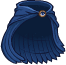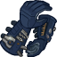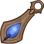
        
        
            Clothing
        
    
    
        
            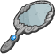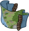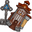
        
        
            Fallbacks Gear
        
    
    
        
            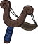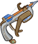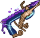
        
        
            Hand Crossbow
        
    
    
        
            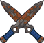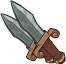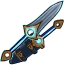
        
        
            Magic Daggers
        
    
    
        
            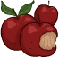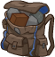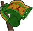
        
        
            Rogue Training Tools
        
    

# Feats

Unknown.

# Legendaries

Unknown.

# Adventures and Variants

**Unlock Adventure: Let Sleeping Dragons Lie (???)** (Complete Area 50)
> Attempt to calm down a very angry bronze dragon.

**Variant 1: TBD** (Complete Area 75)
> 

**Variant 2: TBD** (Complete Area 125)
> 

**Variant 3: TBD** (Complete Area 175)
> 

# Other Champion Images

    
        
            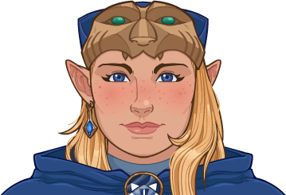Console Portrait
        
    
    
        
            Gold Chest Icon
        
        
            Silver Chest Icon
        
    

[Back to Top](#top)

*Last Modified: {{ site.time }}*