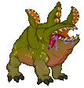
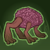
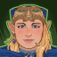

[Back to Main](index.md)

    
        
            
        
        
        Portrait
        
    
    
        
            
        
        
        Base Model
        
    
    
        
            
        
        
        Uggie Model
        
    

# Tess

Tessalynde is an ambitious young rogue who dreams of leading Faerûn's foremost adventuring party. While the crew she’s gathered isn't the stuff of legend yet, she's confident her guidance can get them there.

[The Fallbacks: Bound for Ruin - Fandom Wiki](https://forgottenrealms.fandom.com/wiki/The_Fallbacks:_Bound_for_Ruin)

# Basic Information

Tess will be a new champion in the Founders' Day event on 2 July 2025.

    
        
            **Seat**:
        
        
            Unknown
        
    
    
        
            **Species**:
        
        
            Unknown
        
    
    
        
            **Class**:
        
        
            Rogue (Guess)
        
    
    
        
            **Roles**:
        
        
            Support (Guess)
        
    
    
        
            **Age**:
        
        
            Unknown
        
    
    
        
            **Gender**:
        
        
            Female (Guess)
        
    
    
        
            **Alignment**:
        
        
            Unknown
        
    
    
        
            **Affiliation**:
        
        
            The Fallbacks (Guess)
        
    

# Formation

    <svg xmlns="http://www.w3.org/2000/svg" id="Tess" fill="#aaa" data-formationName="Tess" data-campaignName="Dragondown" width="300" height="160"><circle cx="175" cy="105" r="15"/><circle cx="175" cy="145" r="15"/><circle cx="135" cy="85" r="15"/><circle cx="95" cy="25" r="15"/><circle cx="95" cy="65" r="15"/><circle cx="95" cy="105" r="15"/><circle cx="95" cy="145" r="15"/><circle cx="55" cy="85" r="15"/><circle cx="15" cy="105" r="15"/><circle cx="15" cy="145" r="15"/><text x="205" y="25" fill="#dcdcdc" font-size="25" font-family="Arial" font-weight="bold">Tess</text><text x="205" y="65" fill="#dcdcdc" font-size="15" font-family="Arial" font-weight="bold">Dragondown</text></svg>

# Attacks

**Base Attack: Hand Crossbow** (Ranged)
> Tess attacks the closest enemy for 1 hit.  
> Cooldown: 4s (Cap 1s)

<em>Raw Data</em>

<pre>
{
    "id": 870,
    "name": "Hand Crossbow",
    "description": "Tess attacks the closest enemy for 1 hit.",
    "long_description": "",
    "graphic_id": 0,
    "target": "front",
    "num_targets": 1,
    "aoe_radius": 0,
    "damage_modifier": 1,
    "cooldown": 4,
    "animations": [
        {
            "type": "ranged_attack",
            "projectile": "pd_generic_projectile",
            "shoot_offset_y": -60,
            "shoot_frame": 8,
            "shoot_sound": 149,
            "hit_sound": 133,
            "projectile_details": {
                "hash": "67f52f8a67393eadfdc8ef2193442a04",
                "target_offset_y": 0,
                "projectile_speed": 2250,
                "projectile_graphic_id": 26775
            }
        }
    ],
    "tags": [
        "ranged"
    ],
    "damage_types": [
        "ranged"
    ]
}
</pre>

**Base Attack: Snack Attack** (Melee)
> Unknown effect.  
> Cooldown: 0s (Cap 0s)

<em>Raw Data</em>

<pre>
{
    "id": 871,
    "name": "Snack Attack",
    "description": "",
    "long_description": "",
    "graphic_id": 0,
    "target": "random",
    "num_targets": 1,
    "aoe_radius": 0,
    "damage_modifier": 1,
    "cooldown": 0,
    "animations": [
        {
            "type": "melee_attack",
            "damage_frame": 3
        }
    ],
    "tags": [
        "melee",
        "ignore_cooldown_override"
    ],
    "damage_types": [
        "melee"
    ]
}
</pre>

**Base Attack: Disarm Trap** (Melee)
> Tess dons her cat mask and moves up to the closest trap and disarms it.  
> Cooldown: 4s (Cap 1s)

<em>Raw Data</em>

<pre>
{
    "id": 873,
    "name": "Disarm Trap",
    "description": "Tess dons her cat mask and moves up to the closest trap and disarms it.",
    "long_description": "",
    "graphic_id": 0,
    "target": "none",
    "num_targets": 0,
    "aoe_radius": 0,
    "damage_modifier": 0,
    "cooldown": 4,
    "animations": [
        {
            "type": "melee_attack",
            "no_damage_display": true
        }
    ],
    "tags": [],
    "damage_types": [
        "melee"
    ]
}
</pre>

**Base Attack: Sleeping Toxin** (Ranged)
> Tess attacks the closest enemy for 1 hit with a chance to stun.  
> Cooldown: 4s (Cap 1s)

<em>Raw Data</em>

<pre>
{
    "id": 874,
    "name": "Sleeping Toxin",
    "description": "Tess attacks the closest enemy for 1 hit with a chance to stun.",
    "long_description": "",
    "graphic_id": 0,
    "target": "front",
    "num_targets": 1,
    "aoe_radius": 0,
    "damage_modifier": 1,
    "cooldown": 4,
    "animations": [
        {
            "type": "ranged_attack",
            "projectile": "pd_generic_projectile",
            "shoot_offset_y": -60,
            "shoot_frame": 8,
            "shoot_sound": 149,
            "hit_sound": 133,
            "projectile_details": {
                "hash": "67f52f8a67393eadfdc8ef2193442a04",
                "target_offset_y": 0,
                "projectile_speed": 1850,
                "projectile_graphic_id": 26775
            },
            "stun_on_hit": 5,
            "stun_chance": 20
        }
    ],
    "tags": [
        "ranged"
    ],
    "damage_types": [
        "ranged"
    ]
}
</pre>

**Ultimate Attack: Call Uggie**
> Tess calls Uggie to her side.  
> Cooldown: 0s (Cap 0s)

ⓘ *Note: Very short ultimate cooldowns are almost always for testing purposes and are likely to be increased later.*

<em>Raw Data</em>

<pre>
{
    "id": 872,
    "name": "Call Uggie",
    "description": "Tess calls Uggie to her side.",
    "long_description": "Tess calls Uggie to her side.",
    "graphic_id": 26837,
    "target": "none",
    "num_targets": 0,
    "aoe_radius": 0,
    "damage_modifier": 0,
    "cooldown": 0,
    "animations": [
        {
            "type": "call_uggie_ultimate",
            "no_damage_display": true
        }
    ],
    "tags": [
        "ultimate",
        "ignore_cooldown_override"
    ],
    "damage_types": []
}
</pre>

**Ultimate Attack: Deadly Dance**
> Tess throws her dagger at the enemy with the most health for 1 ultimate hit, then teleports and deals another ultimate hit to all nearby foes.  
> Cooldown: 360s (Cap 90s)

<em>Raw Data</em>

<pre>
{
    "id": 875,
    "name": "Deadly Dance",
    "description": "Tess attacks the enemy with the most health, then teleports and attacks all nearby foes.",
    "long_description": "Tess throws her dagger at the enemy with the most health for 1 ultimate hit, then teleports and deals another ultimate hit to all nearby foes. ",
    "graphic_id": 26838,
    "target": "highest_health",
    "num_targets": 1,
    "aoe_radius": 150,
    "damage_modifier": 0.03,
    "cooldown": 360,
    "animations": [
        {
            "type": "ultimate_attack",
            "ultimate": "tess",
            "aoe_radius": 150,
            "shoot_offset_y": -35,
            "projectile_details": {
                "hash": "cfefe0019c9bad171d8e039c8b7e80aa",
                "target_offset_y": -10,
                "projectile_speed": 1500,
                "projectile_graphic_id": 26776,
                "rotation_speed": 720,
                "percent_height_offset": 2
            },
            "damage_frame": 8
        }
    ],
    "tags": [
        "ranged",
        "melee",
        "ultimate"
    ],
    "damage_types": []
}
</pre>

**Ultimate Attack: United Strike (Deadly Dance)**
> Tess directs all the Fallbacks to attack with their ultimate attack, including her own Deadly Dance.  
> Cooldown: 360s (Cap 90s)

<em>Raw Data</em>

<pre>
{
    "id": 877,
    "name": "United Strike (Deadly Dance)",
    "description": "Tess directs all the Fallbacks to make their ultimate attack.",
    "long_description": "Tess directs all the Fallbacks to attack with their ultimate attack, including her own Deadly Dance.",
    "graphic_id": 26839,
    "target": "none",
    "num_targets": 0,
    "aoe_radius": 0,
    "damage_modifier": 0.03,
    "cooldown": 360,
    "animations": [
        {
            "type": "united_strike_ultimate"
        }
    ],
    "tags": [
        "ranged",
        "melee",
        "ultimate"
    ],
    "damage_types": [
        "ranged",
        "melee"
    ]
}
</pre>

# Abilities

**Unknown** (Guess)
> Uggie joins the party, starting next to Tess unless they're already in the formation next to another Fallbacks Champion. Uggie increases the damage of all non-adjacent Champions by 100%.

<em>Raw Data</em>

<pre>
{
    "id": 2346,
    "flavour_text": "",
    "description": {
        "desc": "Uggie joins the party, starting next to Tess unless they're already in the formation next to another Fallbacks Champion. Uggie increases the damage of all non-adjacent Champions by $(amount)%."
    },
    "effect_keys": [
        {
            "effect_string": "uggie_handler,100",
            "off_when_benched": true,
            "uggie_roaming_disable_index": 1,
            "uggie_priority": 5,
            "use_computed_amount_for_description": true
        },
        {
            "effect_string": "disallow_roaming_familiar_ult_trigger",
            "apply_manually": true
        }
    ],
    "requirements": "",
    "graphic_id": 26837,
    "large_graphic_id": 26837,
    "properties": {
        "is_formation_ability": true,
        "show_incoming": false,
        "owner_use_outgoing_description": true,
        "indexed_effect_properties": true,
        "per_effect_index_bonuses": true,
        "default_bonus_index": 0,
        "retain_on_slot_changed": true
    }
}
</pre>

**Lead The Way** (Guess)
> Tess increases the damage of all Champions in the columns behind her by 100%.

<em>Raw Data</em>

<pre>
{
    "id": 2347,
    "flavour_text": "",
    "description": {
        "desc": "Tess increases the damage of all Champions in the columns behind her by $amount%."
    },
    "effect_keys": [
        {
            "effect_string": "hero_dps_multiplier_mult,100",
            "off_when_benched": true,
            "targets": [
                "behind"
            ]
        }
    ],
    "requirements": "",
    "graphic_id": 26824,
    "large_graphic_id": 26815,
    "properties": {
        "is_formation_ability": true,
        "owner_use_outgoing_description": true,
        "indexed_effect_properties": true,
        "per_effect_index_bonuses": true,
        "default_bonus_index": 0
    }
}
</pre>

**Unleash Uggie** (Guess)
> Uggie's buff is increased by 400% when Tess is in the formation.

<em>Raw Data</em>

<pre>
{
    "id": 2348,
    "flavour_text": "",
    "description": {
        "desc": "Uggie's buff is increased by $amount% when Tess is in the formation"
    },
    "effect_keys": [
        {
            "effect_string": "unleash_uggie_contribution,400",
            "off_when_benched": true
        }
    ],
    "requirements": "",
    "graphic_id": 26827,
    "large_graphic_id": 26820,
    "properties": {
        "is_formation_ability": true,
        "indexed_effect_properties": true,
        "per_effect_index_bonuses": true,
        "default_bonus_index": 0
    }
}
</pre>

**Sneak Attack** (Guess)
> When Uggie is with Tess, Uggie attacks a random target whenever Tess attacks or disarms a trap. Uggie's attack deals 5 seconds of BUD-based damage.

<em>Raw Data</em>

<pre>
{
    "id": 2349,
    "flavour_text": "",
    "description": {
        "desc": "When Uggie is with Tess, Uggie attacks a random target whenever Tess attacks or disarms a trap. Uggie's attack deals $amount seconds of BUD-based damage."
    },
    "effect_keys": [
        {
            "effect_string": "tess_snack_attack_handler,5",
            "off_when_benched": true
        }
    ],
    "requirements": "",
    "graphic_id": 26825,
    "large_graphic_id": 26816,
    "properties": {
        "is_formation_ability": true,
        "show_incoming": false,
        "use_outgoing_description": true,
        "indexed_effect_properties": true,
        "per_effect_index_bonuses": true,
        "default_bonus_index": 0
    }
}
</pre>

**A Plan For Everything** (Guess)
> Tess increases the effect of Lead The Way by 100% for each different role in the formation, stacking multiplicatively.

<em>Raw Data</em>

<pre>
{
    "id": 2350,
    "flavour_text": "",
    "description": {
        "desc": "Tess increases the effect of Lead The Way by $(not_buffed amount)% for each different role in the formation, stacking multiplicatively.",
        "post": {
            "conditions": [
                {
                    "condition": "not static_desc",
                    "desc": "^^Roles In Formation: $(roles)"
                }
            ]
        }
    },
    "effect_keys": [
        {
            "effect_string": "buff_upgrade,100,17316",
            "off_when_benched": true,
            "amount_func": "mult",
            "stack_func": "per_unique_role",
            "stack_title": "Unique Roles",
            "show_bonus": true,
            "amount_updated_listeners": [
                "slot_changed",
                "hero_tags_changed"
            ]
        }
    ],
    "requirements": "",
    "graphic_id": 26823,
    "large_graphic_id": 26814,
    "properties": {
        "is_formation_ability": true,
        "owner_use_outgoing_description": true,
        "indexed_effect_properties": true,
        "per_effect_index_bonuses": true,
        "default_bonus_index": 0
    }
}
</pre>

**Trap Expert** (Guess)
> There's a 5% chance when an enemy dies that they drop a Trap that Tess immediately spots. During Tess's next attack, rather than attacking, she leaps out and disarms the Trap before it can harm any of her friends. For each Trap disarmed in this way, Lead The Way is increased by 10%, stacking additively. Stacks persist through resets.

<em>Raw Data</em>

<pre>
{
    "id": 2351,
    "flavour_text": "",
    "description": {
        "desc": "There's a $chance% chance when an enemy dies that they drop a Trap that Tess immediately spots. During Tess's next attack, rather than attacking, she leaps out and disarms the Trap before it can harm any of her friends. For each Trap disarmed in this way, Lead The Way is increased by $(not_buffed amount___2)%, stacking additively. Stacks persist through resets."
    },
    "effect_keys": [
        {
            "effect_string": "tess_trap_expert_handler",
            "off_when_benched": true,
            "chance": 5
        },
        {
            "effect_string": "buff_upgrade,10,17316",
            "off_when_benched": true,
            "stacks_multiply": false,
            "stacks_on_trigger": "will_manually_stack",
            "stack_title": "Traps Disarmed",
            "show_bonus": true
        },
        {
            "effect_string": "change_base_attack,873",
            "apply_manually": true
        }
    ],
    "requirements": "",
    "graphic_id": 26826,
    "large_graphic_id": 26817,
    "properties": {
        "is_formation_ability": true,
        "owner_use_outgoing_description": true,
        "indexed_effect_properties": true,
        "per_effect_index_bonuses": true,
        "default_bonus_index": 1,
        "retain_on_slot_changed": true
    }
}
</pre>

**Deadly Dance** (Guess)
> Tess throws one of her teleportation daggers at the enemy with the most health, dealing 1 ultimate hit. She then teleports behind that enemy, and stabs a bunch of times, dealing 1 ultimate hit to all targets within melee range, including the original target. She then returns to her place in the formation.

<em>Raw Data</em>

<pre>
{
    "id": 2362,
    "flavour_text": "",
    "description": {
        "desc": "Tess throws one of her teleportation daggers at the enemy with the most health, dealing 1 ultimate hit. She then teleports behind that enemy, and stabs a bunch of times, dealing 1 ultimate hit to all targets within melee range, including the original target. She then returns to her place in the formation."
    },
    "effect_keys": [
        {
            "effect_string": "set_ultimate_attack,875"
        }
    ],
    "requirements": "",
    "graphic_id": 26838,
    "large_graphic_id": 26838,
    "properties": {
        "is_formation_ability": true,
        "owner_use_outgoing_description": true,
        "formation_circle_icon": false,
        "show_outgoing_desc_when_benched": false
    }
}
</pre>

# Specialisations

**The Fallback Plan** (Guess)
> Tess increases the effect of Lead The Way by 100% for each unaffiliated Champion or Fallbacks Champion in the formation, stacking multiplicatively.

ⓘ *Note: This ability is prestack.*

<em>Raw Data</em>

<pre>
{
    "id": 2352,
    "flavour_text": "",
    "description": {
        "desc": "Tess increases the effect of Lead The Way by $amount% for each unaffiliated Champion or Fallbacks Champion in the formation, stacking multiplicatively."
    },
    "effect_keys": [
        {
            "effect_string": "pre_stack,100",
            "skip_effect_key_desc": true
        },
        {
            "effect_string": "buff_upgrade,0,17316",
            "off_when_benched": true,
            "amount_expr": "upgrade_amount(17321,0)",
            "amount_func": "mult",
            "stack_func": "per_crusader",
            "stack_func_data": {
                "target_filters": [
                    {
                        "type": "tags",
                        "tags": "fallbacks|unaffiliated"
                    }
                ]
            },
            "amount_updated_listeners": [
                "slot_changed"
            ],
            "stacks_multiply": true,
            "show_bonus": true
        }
    ],
    "requirements": "",
    "graphic_id": 26832,
    "large_graphic_id": 26832,
    "properties": {
        "is_formation_ability": true,
        "spec_option_post_apply_info": "Qualified Champions: $num_stacks___2",
        "owner_use_outgoing_description": true,
        "indexed_effect_properties": true,
        "per_effect_index_bonuses": true,
        "default_bonus_index": 0
    }
}
</pre>

**Eyes On The Horizon** (Guess)
> Tess increases the effect of Lead The Way by 150% for each Champion in the formation with a ranged attack, stacking multiplicatively.

ⓘ *Note: This ability is prestack.*

<em>Raw Data</em>

<pre>
{
    "id": 2353,
    "flavour_text": "",
    "description": {
        "desc": "Tess increases the effect of Lead The Way by $amount% for each Champion in the formation with a ranged attack, stacking multiplicatively."
    },
    "effect_keys": [
        {
            "effect_string": "pre_stack,150",
            "skip_effect_key_desc": true
        },
        {
            "effect_string": "buff_upgrade,0,17316",
            "off_when_benched": true,
            "amount_expr": "upgrade_amount(17322,0)",
            "amount_func": "mult",
            "stack_func": "per_crusader",
            "stack_func_data": {
                "target_filters": [
                    {
                        "type": "attack_type",
                        "attack": "ranged"
                    }
                ]
            },
            "amount_updated_listeners": [
                "slot_changed",
                "attack_changed"
            ],
            "stacks_multiply": true,
            "show_bonus": true
        }
    ],
    "requirements": "",
    "graphic_id": 26830,
    "large_graphic_id": 26830,
    "properties": {
        "is_formation_ability": true,
        "spec_option_post_apply_info": "Qualified Champions: $num_stacks___2",
        "owner_use_outgoing_description": true,
        "indexed_effect_properties": true,
        "per_effect_index_bonuses": true,
        "default_bonus_index": 0
    }
}
</pre>

**Rogues Gallery** (Guess)
> Tess increases the effect of Lead The Way by 175% for each Rogue Champion in the formation, stacking multiplicatively.

ⓘ *Note: This ability is prestack.*

<em>Raw Data</em>

<pre>
{
    "id": 2354,
    "flavour_text": "",
    "description": {
        "desc": "Tess increases the effect of Lead The Way by $amount% for each Rogue Champion in the formation, stacking multiplicatively."
    },
    "effect_keys": [
        {
            "effect_string": "pre_stack,175",
            "skip_effect_key_desc": true
        },
        {
            "effect_string": "buff_upgrade,0,17316",
            "off_when_benched": true,
            "amount_expr": "upgrade_amount(17323,0)",
            "amount_func": "mult",
            "stack_func": "per_crusader",
            "stack_func_data": {
                "target_filters": [
                    {
                        "type": "tags",
                        "tags": "rogue"
                    }
                ]
            },
            "amount_updated_listeners": [
                "slot_changed"
            ],
            "stacks_multiply": true,
            "show_bonus": true
        }
    ],
    "requirements": "",
    "graphic_id": 26831,
    "large_graphic_id": 26831,
    "properties": {
        "is_formation_ability": true,
        "spec_option_post_apply_info": "Qualified Champions: $num_stacks___2",
        "owner_use_outgoing_description": true,
        "indexed_effect_properties": true,
        "per_effect_index_bonuses": true,
        "default_bonus_index": 0
    }
}
</pre>

# Items

    
        
            **Icons**
        
        
            **Name**
        
    
    
        
            
        
        
            Cat Mask
        
    
    
        
            
        
        
            Clothing
        
    
    
        
            
        
        
            Fallbacks Gear
        
    
    
        
            
        
        
            Hand Crossbow
        
    
    
        
            
        
        
            Magic Daggers
        
    
    
        
            
        
        
            Rogue Training Tools
        
    

# Feats

Unknown.

# Legendaries

Unknown.

# Adventures and Variants

**Unlock Adventure: Party Crashers (Tess)** (Complete Area 50)
> Save Waterdeep from the chaos of a Founders' Day gone awry.

 **Variant 1: The Deck of Many Intellect Devourers** (Complete Area 75)
> Tess starts in the formation. She can't be moved or removed.  
> Only Tess and Champions buffed by both her and Uggie can deal damage.  
> 1-2 Intellect Devourers spawn with each wave. They don't drop gold nor count towards quest progress.  
> Getting to Know Tess and Uggie: Tess increases the damage of Champions in the columns behind her, while Uggie increases the damage of Champions not next to Uggie. Place your damage dealers to take advantage of both buffs!  
> 

 **Variant 2: Tess's Treasure Seekers** (Complete Area 125)
> Tess starts in the formation. She can be moved but not removed.  
> After area 10, Gold Find is reduced by 50% for each Champion role NOT present in the formation, stacking multiplicatively. At area 400, this increases to 99% for each missing role.  
> Getting to Know Tess: Tess has a plan for every contingency, and she prefers to work with a well-rounded team that features different roles, such as Support, Healing, and Gold Find. Build a formation with the most diverse roles for the best results!

 **Variant 3: The Leader They Deserve** (Complete Area 175)
> Tess starts in the formation. She can be moved, but not removed.  
> You may only use Champions that are Rogues, have ranged attacks, are Unaffiliated, or belong to The Fallbacks affiliation.  
> The Zhentarim and Purple Wormlings are fighting each other! One of each spawn with each wave, their speed is increased by 200%, and they don't drop gold nor count towards quest progress.  
> Whenever you kill Zhentarim or Purple Wormlings, that side gets weaker while the other side gets stronger.  
> Getting to know Tess: Build a formation that makes the best use of your specialization choice for Tess!

# Other Champion Images

    
        
            Console Portrait
        
    
    
        
            Gold Chest Icon
        
        
            Silver Chest Icon
        
    

[Back to Top](#top)

*Last Modified: {{ site.time }}*