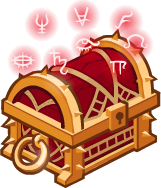

[Back to Main](index.md)

# Thayan Enclave

This is a new feature that we currently know bits of pieces about.

From the text it seems that Corrupted Gems will be collectible during `Emergence` events. The first one being the `Red Wizard Emergence Event`. The Corrupted gems will be earned by killing Red Wizards found in various adventures during emergence events as well as from daily quests and from variants released during the event. The gems will then be used purchase items from the `Thayan Enclave` shop.

This system seems designed to be essentially patron 5 without being patron 5. It's got all the trappings of a patron - chores and an exclusive currency/shop that has limited items.

The main point of the Thayan Enclave system seems to be the Marvellous Pigments - which will provide buffs when placed onto items - much the same as Legendaries. The pigments will be Role restricted though - so Support pigments will only be able to put on Support champions' items.

The expected date for release of the Thayan Enclave and first Emergence Event is 29 March 2023.

## Corrupted Gem Shop Items

* Golden Epic: `Miria` (Slot Unknown)
* Feat: `Wisened Friends` (Fen - 80% I've Got You, Friends)
* Feat: `Unknown` (Hew Maan - Unknown)
* Feat: `Stable Targets` (Hitch - 80% Ricochet)
* Skin: `Red Wizard Calliope`
* Skin: `Red Wizard Widdle`
* Chest x1: `Modron Component Chest` (Limited)
* Chest x1: `Gold Supply Chest` (Limited)
* Chest x1: `Gold Red Wizard Emergence Chest`
* Buff x1: `Marvellous Support Pigment`

The `Gold Red Wizard Emergence Chest` contains gear for Calliope Fen Hew Maan Hitch Miria and Widdle.

The costs for the items above are currently unknown.

### Corrupted Gem Icons

| General | Pile | Inventory |
|---|---|---|
|  |  |  |

### Red Wizard Emergence Chest Icons

| General | Inventory |
|---|---|
|  |  |

## Real Money Corrupted Gems

| Amount | Cost |
|--:|--:|
| 10,000 | $4.99 |
| 21,000 | $9.99 |
| 44,000 | $19.99 |
| 120,000 | $49.99 |

## Pigments

Pigments can be applied to epic / legendary items and currently have 4 different effects and different colours.

| Name | Effect |
|---|---|
| Marvelous Support Pigment | +200% All Champion Damage |
| Marvelous DPS Pigment | +400% Self DPS |
| Marvelous Healing Pigment | +100% Healing |
| Marvelous Tanking Pigment | +100% Health |

The current list of colours include Blue Green Red or White.

| Icon Type | Blue | Green | Red | White |
|---|---|---|---|---|
| General |  |  |  |  |
| Inventory |  |  |  |  |

## FAQ

Welcome to the first Idle Champions Emergence Event! Red Wizards of Thay have emerged throughout the Sword Coast, and it's up to you to stop them!

#### What is an Emergence Event?

Emergence Events are limited-time events where specific monsters begin to appear in all Free Play adventures. These additional monsters (and any previous use of them) will drop Corrupted Gems during the Emergence Event.

#### What are Corrupted Gems?

Corrupted Gems are a new currency collected only during Emergence Events. You can spend them in the new Thayan Enclave gem shop.

#### How do I collect Corrupted Gems?

During Emergence Events, Corrupted Gems can be collected from the designated monsters (Red Wizards for the Red Wizard Emergence) and by completing a daily quest visible in the Emergence Event dialog. Additionally, some variants can reward Corrupted Gems. The 10 variants releasing on both March 29 and April 5 each reward an additional 1,250 Corrupted Gems upon completion.

#### How many Corrupted Gems can I collect through the Emergence Event?

The number of Corrupted Gems available in each Emergence Event varies. During the inaugural Red Wizard Emergence Event you can collect up to 18,000 Corrupted Gems by killing Red Wizards in adventures and an additional 18,000 by completing all of the daily quests. Finally, by completing the variants being released on March 29th and April 5th, you can collect another 25,000 Corrupted Gems.

#### Where can I find Red Wizards?

Extra Red Wizards can be found by playing any Free Play adventures. You can also find Red Wizards in multiple adventures and variants within the Tomb of Annihilation campaign.

#### What can I purchase with Corrupted Gems?

The new Thayan Enclave gem shop has a variety of items that are newly available with this emergence event! Notably: a GE for Miria, Feats for Fen, Hew Maan, and Hitch, and Red Wizard Skins for Widdle and Calliope. There is also a limited supply of Modron Chests and Supply Chests, and a new chest that provides gear for Calliope, Fen, Hew Maan, Hitch, Miria, and Widdle. Finally, the Thayan Enclave is currently the exclusive home of Marvelous Pigments.

#### What are Marvelous Pigments?

Marvelous Pigments are specialized items you can use to upgrade certain equipment items. The Thayan Enclave is currently featuring the Marvelous Support Pigment, which can be used to upgrade any epic or better equipment items on a support Champion to provide a +200% Global Damage buff in addition to their normal effects!

#### What happens when the Emergence Event ends?

When the Red Wizard Emergence Event ends on April 7th you will no longer be able to collect Corrupted Gems from Red Wizards and the daily quest. However, the Corrupted Gems available as variant rewards will remain available for anyone who has yet to complete them. Items in the Thayan Enclave gem shop will remain available through the next Emergence Event.

#### When is the next Emergence Event?

The next Emergence Event will begin on May 31.

#### How long will the items remain in the Thayan Enclave gem shop?

Items added to the Thayan Enclave gem shop for an Emergence Event will remain available in that shop through the end of the following Emergence Event. So the items we've just added will remain in the shop until the next Emergence Event (scheduled to start May 31st) ends.

## Text Defines

**Message 1**
> Welcome to the Thayan Enclave! I hear you're having some problems with Red Wizards? I might be able to help you with that. If you collect the Corrupted Gems they're carrying, I can offer you some exclusive items in exchange!

<em>Raw Data</em>

<pre>
{
    "contents": "Welcome to the Thayan Enclave! I hear you're having some problems with Red Wizards? I might be able to help you with that. If you collect the Corrupted Gems they're carrying, I can offer you some exclusive items in exchange!",
    "id": 4958,
    "key": "thayan_enclave_message_1"
}
</pre>

 

**Message 2**
> To collect Corrupted Gems, find Red Wizards in free play adventures and send them back to where they belong! If you finish off 100 Red Wizards, you can even earn a nice collection of Corrupted Gems every day as a bounty! Finally, there are also some adventure variants that reward Corrupted Gems which will be highlighted on your campaign map if they are available.

<em>Raw Data</em>

<pre>
{
    "contents": "To collect Corrupted Gems, find Red Wizards in free play adventures and send them back to where they belong! If you finish off 100 Red Wizards, you can even earn a nice collection of Corrupted Gems every day as a bounty! Finally, there are also some adventure variants that reward Corrupted Gems which will be highlighted on your campaign map if they are available.",
    "id": 4959,
    "key": "thayan_enclave_message_2"
}
</pre>

 

**Message 3**
> Interested in the Nolzur's Marvelous Pigments? They are specialized paints you can use to upgrade your equipment. We are currently featuring the Marvelous Support Pigment which can upgrade an Epic equipment item to offer your companions +200% damage!

<em>Raw Data</em>

<pre>
{
    "contents": "Interested in the Nolzur's Marvelous Pigments? They are specialized paints you can use to upgrade your equipment. We are currently featuring the Marvelous Support Pigment which can upgrade an Epic equipment item to offer your companions +200% damage!",
    "id": 4960,
    "key": "thayan_enclave_message_3"
}
</pre>

 

**Message 4**
> You'd think this far from Thay, I'd be able to get away from these Red Wizards... Alas, it seems they have set their sights on conquest and we're in the way. I'll tell you what, if you can clear 100 Red Wizards out, I'll offer you 2000 Corrupted Gems. Quite a deal, eh?

<em>Raw Data</em>

<pre>
{
    "contents": "You'd think this far from Thay, I'd be able to get away from these Red Wizards\u2026 Alas, it seems they have set their sights on conquest and we're in the way. I'll tell you what, if you can clear 100 Red Wizards out, I'll offer you 2000 Corrupted Gems. Quite a deal, eh?",
    "id": 4961,
    "key": "thayan_enclave_message_4"
}
</pre>

 

**Message 5**
> Welcome to the Thayan Enclave! Things have died down since the latest Red Wizard emergence. When the next emergence event happens, you'll be able to collect a boatload of Corrupted Gems, and I'll have more daily quests where you can collect a bounty of Corrupted Gems each day!

<em>Raw Data</em>

<pre>
{
    "contents": "Welcome to the Thayan Enclave! Things have died down since the latest Red Wizard emergence. When the next emergence event happens, you'll be able to collect a boatload of Corrupted Gems, and I'll have more daily quests where you can collect a bounty of Corrupted Gems each day!",
    "id": 4962,
    "key": "thayan_enclave_message_5"
}
</pre>

 

**Message 6**
> You can still collect Corrupted Gems through some adventure variants, or you can purchase some if you'd like. I've heard rumors that another emergence is coming in about $daysUntilNextEvent days.

<em>Raw Data</em>

<pre>
{
    "contents": "You can still collect Corrupted Gems through some adventure variants, or you can purchase some if you'd like. I've heard rumors that another emergence is coming in about $daysUntilNextEvent days.",
    "id": 4963,
    "key": "thayan_enclave_message_6"
}
</pre>

 

**Message 7**
> I've heard rumors that another emergence is coming in about `$daysUntilNextEvent` days.

<em>Raw Data</em>

<pre>
{
    "contents": "I've heard rumors that another emergence is coming in about $daysUntilNextEvent days.",
    "id": 4964,
    "key": "thayan_enclave_message_7"
}
</pre>

 

**Pigment Select Champion Description**
> Choose a Champion with a piece of Epic or Legendary equipment to apply $pigment_name to. Only Champions with the $tag tag may be chosen.

<em>Raw Data</em>

<pre>
{
    "contents": "Choose a Champion with a piece of Epic or Legendary equipment to apply $pigment_name to. Only Champions with the $tag tag may be chosen.",
    "id": 4981,
    "key": "pigment_select_champion_description"
}
{
    "contents": "DPS",
    "id": 4982,
    "key": "tag_dps"
}
{
    "contents": "Tanking",
    "id": 4983,
    "key": "tag_tanking"
}
{
    "contents": "You have no eligible equipment to apply this Marvelous Pigment to!",
    "id": 4985,
    "key": "no_legendary_for_pigment"
}
</pre>

 

**Emergence Event**
> EMERGENCE EVENT ENDS  
> NEXT EMERGENCE EVENT

<em>Raw Data</em>

<pre>
{
    "contents": "EMERGENCE EVENT ENDS",
    "id": 4965,
    "key": "emergence_event_ends"
},
{
    "contents": "NEXT EMERGENCE EVENT",
    "id": 4966,
    "key": "next_emergence_event"
}
</pre>

 

**Emergence Event Dialogue Description**
> The Red Wizards are invading the Sword Coast! During this emergence, you'll find Red Wizards popping up on Free Play adventures. For the duration of the emergence, you can collect a new in-game currency: Corrupted Gems! You can spend your Corrupted Gems in the new Thayan Enclave Gem Shop. Good luck adventurers!

<em>Raw Data</em>

<pre>
{
    "contents": "The Red Wizards are invading the Sword Coast! During this emergence, you'll find Red Wizards popping up on Free Play adventures. For the duration of the emergence, you can collect a new in-game currency: Corrupted Gems! You can spend your Corrupted Gems in the new Thayan Enclave Gem Shop. Good luck adventurers!",
    "id": 4979,
    "key": "emergence_event_dialog_description"
}
</pre>

 

# Corrupted Gem Shopkeeper Portrait

[Back to Top](#top)

*Last Modified: {{ site.time }}*