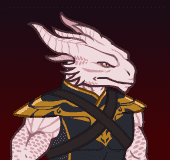
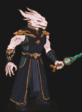
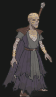
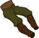
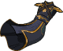
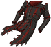
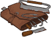
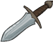
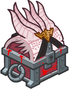

[Back to Main](index.md)

    
        Portait
    
    
        Base Model
    
    
        Withers Model
    
    
        Sceleritas Fel Model
    

# The Dark Urge

The Dark Urge is a special origin in Baldur's Gate 3 that can be played using any race, class, and gender, and will not be part of player's party if they are playing any other origin character.

[The Dark Urge - Baldur's Gate Wiki](https://bg3.wiki/wiki/The_Dark_Urge_(origin))

# Basic Information

The Dark Urge will be the new champion in the Festival of Fools event on 6 March 2024.

    
        
            **Seat**:
        
        
            Unknown
        
    
    
        
            **Race**:
        
        
            Dragonborn (Guess)
        
    
    
        
            **Class**:
        
        
            Sorcerer (Guess)
        
    
    
        
            **Roles**:
        
        
            DPS / Support (Guess)
        
    
    
        
            **Age**:
        
        
            Unknown
        
    
    
        
            **Gender**:
        
        
            Male (Guess)
        
    
    
        
            **Alignment**:
        
        
            Unknown
        
    
    
        
            **Affiliation**:
        
        
            Unknown
        
    

# Formation

Unknown.


    



# Abilities

**Base Attack: Murderous Slash** (Melee)
> The Dark Urge strikes nearby enemies with a slash of his dagger.  
> Cooldown: 5s (Cap 1.25s)

<em>Raw Data</em>

<pre>
{
    "id": 735,
    "name": "Murderous Slash",
    "description": "The Dark Urge strikes nearby enemies with a slash of his dagger.",
    "long_description": "",
    "graphic_id": 0,
    "target": "front",
    "num_targets": 1,
    "aoe_radius": 100,
    "damage_modifier": 1,
    "cooldown": 5,
    "animations": [
        {
            "type": "melee_attack",
            "target_offset_x": -34,
            "damage_frame": 9,
            "jump_sound": 30,
            "sound_frames": {
                "2": 154
            }
        }
    ],
    "tags": [
        "melee",
        "aoe"
    ],
    "damage_types": [
        "melee"
    ]
}
</pre>

**Base Attack: Slay** (Melee)
> The Dark Urge strikes nearby enemies, dealing 1 hit of ultimate damage.  
> Cooldown: 3s (Cap 0.75s)

<em>Raw Data</em>

<pre>
{
    "id": 736,
    "name": "Slay",
    "description": "The Dark Urge strikes nearby enemies, dealing 1 hit of ultimate damage.",
    "long_description": "",
    "graphic_id": 0,
    "target": "front",
    "num_targets": 1,
    "aoe_radius": 150,
    "damage_modifier": 1,
    "cooldown": 3,
    "animations": [
        {
            "character": "companion",
            "type": "melee_attack",
            "special_melee": "dark_urge_slay",
            "force_count_for_bud": false,
            "target_offset": [
                -200,
                0
            ],
            "attack_sounds": {
                "melee": 179
            }
        }
    ],
    "tags": [
        "melee",
        "aoe"
    ],
    "damage_types": [
        "melee"
    ]
}
</pre>

**Base Attack: Murderous Slash (Storm Sorcery)** (Melee and Magic)
> The Dark Urge strikes nearby enemies with a slash of his dagger.  
> Cooldown: 5s (Cap 1.25s)

<em>Raw Data</em>

<pre>
{
    "id": 739,
    "name": "Murderous Slash (Storm Sorcery)",
    "description": "The Dark Urge strikes nearby enemies with a slash of his dagger.",
    "long_description": "",
    "graphic_id": 0,
    "target": "front",
    "num_targets": 1,
    "aoe_radius": 100,
    "damage_modifier": 1,
    "cooldown": 5,
    "animations": [
        {
            "type": "melee_attack",
            "target_offset_x": -34,
            "damage_frame": 9,
            "jump_sound": 30,
            "sound_frames": {
                "2": 154
            }
        }
    ],
    "tags": [
        "melee",
        "aoe"
    ],
    "damage_types": [
        "melee",
        "magic"
    ]
}
</pre>

**Ultimate Attack: Form of the Slayer**
> The Dark Urge transforms into the Slayer form for 15 seconds, dealing massive damage for the duration. Sceleritas Fel, immune to damage, takes his place in the formation for the duration.  
> Cooldown: 15s (Cap 3.75s)

ⓘ *Note: Very short ultimate cooldowns are almost always for testing purposes and are likely to be increased later.*

<em>Raw Data</em>

<pre>
{
    "id": 737,
    "name": "Form of the Slayer",
    "description": "The Dark Urge transforms into the Slayer form for 15 seconds, dealing massive damage for the duration.",
    "long_description": "The Dark Urge transforms into the Slayer form for 15 seconds, dealing massive damage for the duration. Sceleritas Fel, immune to damage, takes his place in the formation for the duration.",
    "graphic_id": 22537,
    "target": "none",
    "num_targets": 0,
    "aoe_radius": 0,
    "damage_modifier": 1,
    "cooldown": 15,
    "animations": [
        {
            "type": "ultimate_attack",
            "ultimate": "dark_urge_slayer",
            "no_damage_display": false
        }
    ],
    "tags": [
        "ultimate"
    ],
    "damage_types": []
}
</pre>

**Ultimate Attack: Withers Resurrection**
> Withers appears, pushing back all monsters, resurrects all heroes, and makes them all immune for 15 seconds. If possible, this triggers when the Dark Urge is knocked out.  
> Cooldown: 15s (Cap 3.75s)

ⓘ *Note: Very short ultimate cooldowns are almost always for testing purposes and are likely to be increased later.*

<em>Raw Data</em>

<pre>
{
    "id": 738,
    "name": "Withers' Resurrection",
    "description": "Withers appears, pushing back all monsters, resurrects all heroes, and makes them all immune for 15 seconds",
    "long_description": "Withers appears, pushing back all monsters, resurrects all heroes, and makes them all immune for 15 seconds. If possible, this triggers when the Dark Urge is knocked out.",
    "graphic_id": 22538,
    "target": "none",
    "num_targets": 0,
    "aoe_radius": 0,
    "damage_modifier": 1,
    "cooldown": 15,
    "animations": [
        {
            "type": "ultimate_attack",
            "ultimate": "dark_urge_withers",
            "no_damage_display": false
        }
    ],
    "tags": [
        "ultimate"
    ],
    "damage_types": []
}
</pre>

**Unknown** (Guess)
> The Dark Urge is eligible to start in all adventures, even if the Patron, Variant, or other restrictions would say otherwise. He also does not interact with any Champion abilities or variant effects that are based on age.

<em>Raw Data</em>

<pre>
{
    "id": 1869,
    "flavour_text": "",
    "description": {
        "desc": "The Dark Urge is eligible to start in all adventures, even if the Patron, Variant, or other restrictions would say otherwise. He also does not interact with any Champion abilities or variant effects that are based on age."
    },
    "effect_keys": [
        {
            "effect_string": "do_nothing"
        }
    ],
    "requirements": "",
    "graphic_id": 0,
    "large_graphic_id": 0,
    "properties": {
        "is_formation_ability": true,
        "formation_circle_icon": false
    }
}
</pre>

**The Urge** (Guess)
> Each time the Dark Urge defeats an enemy, he gains a Murder stack. The Dark Urge increases his damage by 0.1% for each Murder stack he has. Stacks persist between adventures.

<em>Raw Data</em>

<pre>
{
    "id": 1870,
    "flavour_text": "",
    "description": {
        "desc": "Each time the Dark Urge defeats an enemy, he gains a Murder stack. The Dark Urge increases his damage by $(not_buffed amount)% for each Murder stack he has. Stacks persist between adventures."
    },
    "effect_keys": [
        {
            "effect_string": "hero_dps_multiplier_mult,0.1",
            "stack_title": "Total Murder Stacks",
            "max_stacks": 4000000000,
            "stacks_multiply": false,
            "desc_forced_order": 1,
            "show_bonus": true,
            "stacks_on_trigger": "owner_kill"
        },
        {
            "effect_string": "stacks_data_binder_safe,0,the_dark_urge_murder_stacks",
            "is_instanced_stat": false,
            "use_stat_defs": true
        }
    ],
    "requirements": "",
    "graphic_id": 22531,
    "large_graphic_id": 22528,
    "properties": {
        "is_formation_ability": true,
        "owner_use_outgoing_description": true,
        "per_effect_index_bonuses": true,
        "default_bonus_index": 0
    }
}
</pre>

**Ceremorphosis** (Guess)
> Your formation gains one Ceremorphosis stack due to the mind flayer tadpole in the Dark Urge's brain. The Dark Urge increases his damage by 100% for each Ceremorphosis stack, stacking multiplicatively.

ⓘ *Note: This ability might be prestack.*

<em>Raw Data</em>

<pre>
{
    "id": 1871,
    "flavour_text": "",
    "description": {
        "desc": "Your formation gains one Ceremorphosis stack due to the mind flayer tadpole in the Dark Urge's brain. The Dark Urge increases his damage by $(amount)% for each Ceremorphosis stack, stacking multiplicatively."
    },
    "effect_keys": [
        {
            "effect_string": "pre_stack_amount,100"
        },
        {
            "off_when_benched": true,
            "effect_string": "hero_dps_multiplier_mult,0",
            "amount_expr": "upgrade_amount(14380,0)",
            "stack_func": "per_ceremorphosis_stacks",
            "amount_func": "mult",
            "stacks_multiply": true,
            "show_bonus": true,
            "stack_title": "Total Ceremorphosis Stacks",
            "total_title": "Total Bonus",
            "desc_forced_order": 2,
            "amount_updated_listeners": [
                "upgrade_unlocked",
                "slot_changed",
                "feat_changed"
            ]
        },
        {
            "off_when_benched": true,
            "outgoing_buffs": false,
            "effect_string": "dark_urge_ceremorphosis_stacks,1",
            "manual_stacking": true,
            "stacks_multiply": false,
            "show_stacks": true,
            "stack_title": "The Dark Urge's Ceremorphosis Stacks",
            "desc_forced_order": 1
        }
    ],
    "requirements": "",
    "graphic_id": 22529,
    "large_graphic_id": 22526,
    "properties": {
        "is_formation_ability": true,
        "owner_use_outgoing_description": true,
        "indexed_effect_properties": true,
        "per_effect_index_bonuses": true,
        "default_bonus_index": 0,
        "retain_on_slot_changed": true
    }
}
</pre>

**Living on the Edge** (Guess)
> The Dark Urge has 6 Outcast stacks, minus 1 stack for each adjacent champion that does not have the DPS role.  The Dark Urge increases his damage by 100% for each Outcast stack, stacking multiplicatively.

ⓘ *Note: This ability might be prestack.*

<em>Raw Data</em>

<pre>
{
    "id": 1872,
    "flavour_text": "",
    "description": {
        "desc": "The Dark Urge has $(max_stacks___2) Outcast stacks, minus $(stack_reduction_per_champ_mult___2) stack for each adjacent champion that does not have the DPS role.  The Dark Urge increases his damage by $(amount)% for each Outcast stack, stacking multiplicatively."
    },
    "effect_keys": [
        {
            "effect_string": "pre_stack_amount,100"
        },
        {
            "effect_string": "hero_dps_multiplier_mult,0",
            "amount_expr": "upgrade_amount(14381,0)",
            "amount_func": "mult",
            "stack_func": "per_hero_attribute",
            "per_hero_targets": [
                "adj"
            ],
            "max_stacks": 6,
            "stack_reduction_per_champ_mult": 1,
            "per_hero_expr": "as_int(!HasTag(`dps`))",
            "post_process_expr": "clamp(max_stacks - (input * stack_reduction_per_champ_mult), 0, max_stacks)",
            "show_bonus": true,
            "stack_title": "Outcast Stacks",
            "amount_updated_listeners": [
                "upgrade_unlocked",
                "slot_changed",
                "feat_changed"
            ]
        }
    ],
    "requirements": "",
    "graphic_id": 22530,
    "large_graphic_id": 22527,
    "properties": {
        "is_formation_ability": true,
        "owner_use_outgoing_description": true,
        "indexed_effect_properties": true,
        "per_effect_index_bonuses": true,
        "default_bonus_index": 0,
        "retain_on_slot_changed": true
    }
}
</pre>

**Unknown** (Guess)
> Unknown effect.

<em>Raw Data</em>

<pre>
{
    "id": 1878,
    "flavour_text": "",
    "description": {
        "desc": ""
    },
    "effect_keys": [
        {
            "effect_string": "dark_urge_slayer_form_unused",
            "buff_indicies": [
                1,
                2
            ],
            "companion_index": 0
        },
        {
            "apply_manually": true,
            "effect_string": "change_base_attack,736"
        },
        {
            "apply_manually": true,
            "effect_string": "block_monster_damage"
        }
    ],
    "requirements": "",
    "graphic_id": 0,
    "large_graphic_id": 0,
    "properties": {
        "indexed_effect_properties": true,
        "per_effect_index_bonuses": true
    }
}
</pre>

# Specialisations

**Specialisation: Storm Sorcery** (Guess)
> The Dark Urge's Murderous Slash attack is empowered by lightning. This increases the range by 200% and deals up to 800% more damage to enemies based on how close they are to him.

<em>Raw Data</em>

<pre>
{
    "id": 1873,
    "flavour_text": "",
    "description": {
        "desc": "The Dark Urge's Murderous Slash attack is empowered by lightning. This increases the range by $(amount___2)% and deals up to $(amount___3)% more damage to enemies based on how close they are to him."
    },
    "effect_keys": [
        {
            "effect_string": "change_base_attack,739"
        },
        {
            "effect_string": "increase_aoe_radius,200,739"
        },
        {
            "effect_string": "increase_damage_by_distance,800,739"
        }
    ],
    "requirements": "",
    "graphic_id": 0,
    "large_graphic_id": 0,
    "properties": {
        "is_formation_ability": true,
        "type": "upgrade",
        "formation_circle_icon": false,
        "owner_use_outgoing_description": true,
        "indexed_effect_properties": true,
        "per_effect_index_bonuses": true,
        "default_bonus_index": 2,
        "retain_on_slot_changed": true
    }
}
</pre>

**Specialisation: Draconic Bloodline** (Guess)
> The Dark Urge's damage is increased by 200% for each Dragonborn Champion in the formation, stacking multiplicatively.

<em>Raw Data</em>

<pre>
{
    "id": 1874,
    "flavour_text": "",
    "description": {
        "desc": "The Dark Urge's damage is increased by $(amount)% for each Dragonborn Champion in the formation, stacking multiplicatively."
    },
    "effect_keys": [
        {
            "effect_string": "hero_dps_mult_per_tagged_crusader_mult,200,dragonborn"
        }
    ],
    "requirements": "",
    "graphic_id": 0,
    "large_graphic_id": 0,
    "properties": {
        "is_formation_ability": true,
        "type": "upgrade",
        "formation_circle_icon": false,
        "spec_option_post_apply_info": "Dragonborn Champions: $num_stacks"
    }
}
</pre>

**Divine Soul** (Guess)
> The Dark Urge increases the number of The Urge's Murder stacks he gains each time he defeats an enemy by 200%.

<em>Raw Data</em>

<pre>
{
    "id": 1875,
    "flavour_text": "",
    "description": {
        "desc": "The Dark Urge increases the number of The Urge's Murder stacks he gains each time he defeats an enemy by $(amount)%."
    },
    "effect_keys": [
        {
            "effect_string": "buff_upgrade_effect_stacks_trigger_mult,200,14379,0"
        }
    ],
    "requirements": "",
    "graphic_id": 0,
    "large_graphic_id": 0,
    "properties": {
        "is_formation_ability": true,
        "type": "upgrade",
        "formation_circle_icon": false
    }
}
</pre>

**Embrace the Urge** (Guess)
> The Dark Urge unlocks the Form of the Slayer ultimate, and deals 100% more damage for each Evil Champion in the formation, stacking multiplicatively.

<em>Raw Data</em>

<pre>
{
    "id": 1876,
    "flavour_text": "",
    "description": {
        "desc": "The Dark Urge unlocks the Form of the Slayer ultimate, and deals $(not_buffed amount___2)% more damage for each Evil Champion in the formation, stacking multiplicatively."
    },
    "effect_keys": [
        {
            "effect_string": "set_ultimate_attack,737"
        },
        {
            "effect_string": "hero_dps_mult_per_tagged_crusader_mult,100,evil"
        },
        {
            "effect_string": "dark_urge_slayer_form",
            "buff_indicies": [
                3,
                4
            ],
            "companion_index": 0
        },
        {
            "apply_manually": true,
            "effect_string": "change_base_attack,736"
        },
        {
            "apply_manually": true,
            "effect_string": "block_monster_damage"
        }
    ],
    "requirements": "",
    "graphic_id": 0,
    "large_graphic_id": 0,
    "properties": {
        "is_formation_ability": true,
        "type": "upgrade",
        "formation_circle_icon": false,
        "owner_use_outgoing_description": true,
        "indexed_effect_properties": true,
        "per_effect_index_bonuses": true,
        "default_bonus_index": 1,
        "retain_on_slot_changed": true,
        "spec_option_post_apply_info": "Evil Champions: $num_stacks___2"
    }
}
</pre>

**Resist the Urge** (Guess)
> The Dark Urge's alignment becomes Lawful Good, he unlocks the Wither's Resurrection ultimate, and deals 100% more damage for each Good Champion in the formation, stacking multiplicatively.

<em>Raw Data</em>

<pre>
{
    "id": 1877,
    "flavour_text": "",
    "description": {
        "desc": "The Dark Urge's alignment becomes Lawful Good, he unlocks the Wither's Resurrection ultimate, and deals $(not_buffed amount___2)% more damage for each Good Champion in the formation, stacking multiplicatively."
    },
    "effect_keys": [
        {
            "effect_string": "set_ultimate_attack,738"
        },
        {
            "effect_string": "hero_dps_mult_per_tagged_crusader_mult,100,good"
        },
        {
            "effect_string": "dark_urge_withers_resurrection",
            "buff_indicies": [
                3
            ],
            "companion_index": 1
        },
        {
            "apply_manually": true,
            "effect_string": "block_monster_damage",
            "targets": [
                "all_slots"
            ]
        }
    ],
    "requirements": "",
    "graphic_id": 0,
    "large_graphic_id": 0,
    "properties": {
        "is_formation_ability": true,
        "type": "upgrade",
        "formation_circle_icon": false,
        "owner_use_outgoing_description": true,
        "indexed_effect_properties": true,
        "per_effect_index_bonuses": true,
        "default_bonus_index": 1,
        "retain_on_slot_changed": true,
        "spec_option_post_apply_info": "Good Champions: $num_stacks___2"
    }
}
</pre>

# Items

    
        
            **Icons**
        
        
            **Name**
        
    
    
        
            
        
        
            Accessories
        
    
    
        
            
        
        
            Armor
        
    
    
        
            
        
        
            Brain Surgery Stuff
        
    
    
        
            
        
        
            Dagger
        
    
    
        
            
        
        
            Memories
        
    
    
        
            
        
        
            Trophies
        
    

# Feats

Unknown.

# Legendaries

Unknown.

# Other Champion Images

    
        
            Gold Chest Icon
        
        
            Silver Chest Icon
        
    

[Back to Top](#top)

*Last Modified: {{ site.time }}*