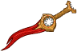
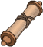

[Back to Main](index.md)

    
        Portait
    
    
        Base Model
    
    
        Withers Model
    
    
        Sceleritas Fel Model
    

# The Dark Urge

The Dark Urge remembers nothing but a path paved with blood. Unimaginable cruelty whispers from within. Can he escape it? Would he even want to?

# Basic Information

The Dark Urge will be the new champion in the Festival of Fools event on 6 March 2024.

    
        
            **Seat**:
        
        
            11
        
        
            **Stat**
        
        
            **Value**
        
        
            **Day 1 Trials**
        
        
            **Patrons**
        
    
    
        
            **Race**:
        
        
            Dragonborn
        
        
            **Strength**:
        
        
            8
        
        
            Yes (Forced)
        
        
            Mirt
        
    
    
        
            **Class**:
        
        
            Sorcerer
        
        
            **Dexterity**:
        
        
            13
        
        
            Yes
        
        
            Vajra
        
    
    
        
            **Roles**:
        
        
            DPS
        
        
            **Constitution**:
        
        
            15
        
        
            Yes
        
        
            Strahd (Forced)
        
    
    
        
            **Age**:
        
        
            Unknown
        
        
            **Intelligence**:
        
        
            12
        
        
            Yes
        
        
            Zariel (Forced)
        
    
    
        
            **Gender**:
        
        
            Male
        
        
            **Wisdom**:
        
        
            10
        
        
            Yes
        
        
            &nbsp;
        
    
    
        
            **Alignment**:
        
        
            Chaotic Evil
        
        
            **Charisma**:
        
        
            17
        
        
            Yes
        
        
            &nbsp;
        
    
    
        
            **Affiliation**:
        
        
            Absolute Adversaries
        
        
            **Total**:
        
        
            75
        
        
            Champion ID:
        
        
            146
        
    

# Formation

    

# Abilities

 **Base Attack: Murderous Slash** (Melee)
> The Dark Urge strikes nearby enemies with a slash of his dagger.  
> Cooldown: 5s (Cap 1.25s)

<em>Raw Data</em>

<pre>
{
    "id": 735,
    "name": "Murderous Slash",
    "description": "The Dark Urge strikes nearby enemies with a slash of his dagger.",
    "long_description": "",
    "graphic_id": 0,
    "target": "front",
    "num_targets": 1,
    "aoe_radius": 100,
    "damage_modifier": 1,
    "cooldown": 5,
    "animations": [
        {
            "type": "melee_attack",
            "target_offset_x": -34,
            "damage_frame": 9,
            "jump_sound": 30,
            "sound_frames": {
                "2": 154
            }
        }
    ],
    "tags": [
        "melee",
        "aoe"
    ],
    "damage_types": [
        "melee"
    ]
}
</pre>

  **Base Attack: Murderous Slash (Storm Sorcery)** (Melee / Magic)
> The Dark Urge strikes nearby enemies with a slash of his dagger.  
> Cooldown: 5s (Cap 1.25s)

<em>Raw Data</em>

<pre>
{
    "id": 739,
    "name": "Murderous Slash (Storm Sorcery)",
    "description": "The Dark Urge strikes nearby enemies with a slash of his dagger.",
    "long_description": "",
    "graphic_id": 0,
    "target": "front",
    "num_targets": 1,
    "aoe_radius": 100,
    "damage_modifier": 1,
    "cooldown": 5,
    "animations": [
        {
            "type": "melee_attack",
            "target_offset_x": -34,
            "damage_frame": 9,
            "jump_sound": 30,
            "sound_frames": {
                "2": 154
            },
            "visual_effect_frames": {
                "hit": {
                    "effect": "animated_clip",
                    "graphic_id": 10618,
                    "sort_offset": -9999,
                    "offset_x": 70,
                    "scale": 3,
                    "tint": "#A6CCFFFF"
                }
            }
        }
    ],
    "tags": [
        "melee",
        "aoe"
    ],
    "damage_types": [
        "melee",
        "magic"
    ]
}
</pre>

 **Base Attack: Slay** (Melee)
> The Dark Urge strikes nearby enemies, dealing 1 hit of ultimate damage.  
> Cooldown: 3s (Cap 0.75s)

<em>Raw Data</em>

<pre>
{
    "id": 736,
    "name": "Slay",
    "description": "The Dark Urge strikes nearby enemies, dealing 1 hit of ultimate damage.",
    "long_description": "",
    "graphic_id": 0,
    "target": "front",
    "num_targets": 1,
    "aoe_radius": 150,
    "damage_modifier": 1,
    "cooldown": 3,
    "animations": [
        {
            "character": "companion",
            "type": "melee_attack",
            "special_melee": "dark_urge_slay",
            "force_count_for_bud": false,
            "target_offset": [
                -200,
                0
            ],
            "attack_sounds": {
                "melee": 179
            }
        }
    ],
    "tags": [
        "melee",
        "aoe"
    ],
    "damage_types": [
        "melee"
    ]
}
</pre>

 **Ultimate Attack: Form of the Slayer** (Level: 0)
> The Dark Urge transforms into the Slayer form for 15 seconds, dealing massive damage for the duration. Sceleritas Fel, immune to damage, takes his place in the formation for the duration.  
> Cooldown: 320s (Cap 80s)

<em>Raw Data</em>

<pre>
{
    "id": 737,
    "name": "Form of the Slayer",
    "description": "The Dark Urge transforms into the Slayer form for 15 seconds, dealing massive damage for the duration.",
    "long_description": "The Dark Urge transforms into the Slayer form for 15 seconds, dealing massive damage for the duration. Sceleritas Fel, immune to damage, takes his place in the formation for the duration.",
    "graphic_id": 22537,
    "target": "none",
    "num_targets": 0,
    "aoe_radius": 0,
    "damage_modifier": 1,
    "cooldown": 320,
    "animations": [
        {
            "type": "ultimate_attack",
            "ultimate": "dark_urge_slayer",
            "no_damage_display": false
        }
    ],
    "tags": [
        "ultimate"
    ],
    "damage_types": []
}
</pre>

 **Dark Inheritance** (Level: 0)
> The Dark Urge is eligible to start in all adventures, even if the Patron, Variant, or other restrictions would say otherwise. He also does not interact with any Champion abilities or variant effects that are based on age.

<em>Raw Data</em>

<pre>
{
    "id": 14378,
    "hero_id": 146,
    "required_level": 0,
    "required_upgrade_id": 0,
    "upgrade_type": "unlock_ability",
    "effect": "effect_def,1869",
    "static_dps_mult": null,
    "default_enabled": 1,
    "name": "Dark Inheritance"
}
{
    "id": 1869,
    "flavour_text": "",
    "description": {
        "desc": "The Dark Urge is eligible to start in all adventures, even if the Patron, Variant, or other restrictions would say otherwise. He also does not interact with any Champion abilities or variant effects that are based on age."
    },
    "effect_keys": [
        {
            "effect_string": "do_nothing"
        }
    ],
    "requirements": "",
    "graphic_id": 22874,
    "large_graphic_id": 22874,
    "properties": {
        "is_formation_ability": true,
        "formation_circle_icon": false
    }
}
</pre>

 **The Urge** (Level: 30)
> Each time the Dark Urge defeats an enemy, he gains a Murder stack. The Dark Urge increases his damage by 0.1% for each Murder stack he has. Stacks persist between adventures.

<em>Upgrade Data</em>

<pre>
Upgrades:
      230: 100%
      530: 100%
      830: 100%
    1,130: 100%
    1,430: 100%
    1,730: 100%

    Total Upgrade Bonus: 6,300%
</pre>

<em>Raw Data</em>

<pre>
{
    "id": 14379,
    "hero_id": 146,
    "required_level": 30,
    "required_upgrade_id": 0,
    "upgrade_type": "unlock_ability",
    "effect": "effect_def,1870",
    "static_dps_mult": null,
    "default_enabled": 1,
    "name": "The Urge",
    "tip_text": "The Dark Urge increases his damage each time he defeats an enemy, with a count that persists between adventures."
}
{
    "id": 1870,
    "flavour_text": "",
    "description": {
        "desc": "Each time the Dark Urge defeats an enemy, he gains a Murder stack. The Dark Urge increases his damage by $(not_buffed amount)% for each Murder stack he has. Stacks persist between adventures."
    },
    "effect_keys": [
        {
            "effect_string": "hero_dps_multiplier_mult,0.1",
            "stack_title": "Total Murder Stacks",
            "max_stacks": 4000000000,
            "stacks_multiply": false,
            "desc_forced_order": 1,
            "show_bonus": true,
            "stacks_on_trigger": "on_broadcast_stacks,dark_urge_murder_trigger"
        },
        {
            "effect_string": "stacks_data_binder_safe,0,the_dark_urge_murder_stacks",
            "is_instanced_stat": false,
            "use_stat_defs": true
        },
        {
            "effect_string": "expression_on_trigger,on_broadcast_stacks",
            "trigger_params": [
                "dark_urge_murder_trigger"
            ],
            "per_trigger_expr": "AppendToSaveStat(`the_dark_urge_a_wonderful_day_for_murder`, false, trigger_count * as_int(GetUpgradeStacks(14381, 1) == 6 && is_formation_full))"
        },
        {
            "effect_string": "broadcast_on_trigger,dark_urge_murder_trigger",
            "trigger_name": "on_broadcast_stacks",
            "trigger_params": [
                "dark_urge_kill"
            ]
        },
        {
            "effect_string": "broadcast_on_trigger,dark_urge_kill,owner_hit_would_kill"
        },
        {
            "effect_string": "broadcast_on_trigger,dark_urge_kill,offline_monsters_killed_by_owner"
        }
    ],
    "requirements": "",
    "graphic_id": 22531,
    "large_graphic_id": 22528,
    "properties": {
        "is_formation_ability": true,
        "owner_use_outgoing_description": true,
        "per_effect_index_bonuses": true,
        "indexed_effect_properties": true,
        "default_bonus_index": 0
    }
}
</pre>

 **Ceremorphosis** (Level: 70)
> Your formation gains one Ceremorphosis stack due to the mind flayer tadpole in the Dark Urge's brain. The Dark Urge increases his damage by 100% for each Ceremorphosis stack, stacking multiplicatively.

ⓘ *Note: This ability is prestack.*

<em>Raw Data</em>

<pre>
{
    "id": 14380,
    "hero_id": 146,
    "required_level": 70,
    "required_upgrade_id": 0,
    "upgrade_type": "unlock_ability",
    "effect": "effect_def,1871",
    "static_dps_mult": null,
    "default_enabled": 1,
    "name": "Ceremorphosis"
}
{
    "id": 1871,
    "flavour_text": "",
    "description": {
        "desc": "Your formation gains one Ceremorphosis stack due to the mind flayer tadpole in the Dark Urge's brain. The Dark Urge increases his damage by $(amount)% for each Ceremorphosis stack, stacking multiplicatively."
    },
    "effect_keys": [
        {
            "effect_string": "pre_stack_amount,100"
        },
        {
            "off_when_benched": true,
            "effect_string": "hero_dps_multiplier_mult,0",
            "amount_expr": "upgrade_amount(14380,0)",
            "stack_func": "per_ceremorphosis_stacks",
            "amount_func": "mult",
            "stacks_multiply": true,
            "show_bonus": true,
            "stack_title": "Total Ceremorphosis Stacks",
            "total_title": "Total Bonus",
            "desc_forced_order": 2,
            "amount_updated_listeners": [
                "upgrade_unlocked",
                "slot_changed",
                "feat_changed"
            ]
        },
        {
            "off_when_benched": true,
            "outgoing_buffs": false,
            "effect_string": "dark_urge_ceremorphosis_stacks,1",
            "manual_stacking": true,
            "stacks_multiply": false,
            "show_stacks": true,
            "stack_title": "The Dark Urge's Ceremorphosis Stacks",
            "desc_forced_order": 1
        }
    ],
    "requirements": "",
    "graphic_id": 22529,
    "large_graphic_id": 22526,
    "properties": {
        "is_formation_ability": true,
        "owner_use_outgoing_description": true,
        "indexed_effect_properties": true,
        "per_effect_index_bonuses": true,
        "default_bonus_index": 0,
        "retain_on_slot_changed": true
    }
}
</pre>

 **Living on the Edge** (Level: 100)
> The Dark Urge has 6 Outcast stacks, minus 1 stack for each adjacent Champion that does not have the DPS role. The Dark Urge increases his damage by 100% for each Outcast stack, stacking multiplicatively.

ⓘ *Note: This ability is prestack.*

<em>Raw Data</em>

<pre>
{
    "id": 14381,
    "hero_id": 146,
    "required_level": 100,
    "required_upgrade_id": 0,
    "upgrade_type": "unlock_ability",
    "effect": "effect_def,1872",
    "static_dps_mult": null,
    "default_enabled": 1,
    "name": "Living on the Edge",
    "tip_text": "The Dark Urge deals more damage when on the formation's edge or when next to Champions with the DPS role."
}
{
    "id": 1872,
    "flavour_text": "",
    "description": {
        "desc": "The Dark Urge has $(max_stacks___2) Outcast stacks, minus $(stack_reduction_per_champ_mult___2) stack for each adjacent Champion that does not have the DPS role. The Dark Urge increases his damage by $(amount)% for each Outcast stack, stacking multiplicatively."
    },
    "effect_keys": [
        {
            "effect_string": "pre_stack_amount,100"
        },
        {
            "effect_string": "hero_dps_multiplier_mult,0",
            "amount_expr": "upgrade_amount(14381,0)",
            "amount_func": "mult",
            "stack_func": "per_hero_attribute",
            "per_hero_targets": [
                "adj"
            ],
            "max_stacks": 6,
            "stack_reduction_per_champ_mult": 1,
            "per_hero_expr": "as_int(!HasTag(`dps`))",
            "post_process_expr": "clamp(max_stacks - (input * stack_reduction_per_champ_mult), 0, max_stacks)",
            "show_bonus": true,
            "stack_title": "Outcast Stacks",
            "amount_updated_listeners": [
                "upgrade_unlocked",
                "slot_changed",
                "feat_changed"
            ]
        }
    ],
    "requirements": "",
    "graphic_id": 22530,
    "large_graphic_id": 22527,
    "properties": {
        "is_formation_ability": true,
        "owner_use_outgoing_description": true,
        "indexed_effect_properties": true,
        "per_effect_index_bonuses": true,
        "default_bonus_index": 0,
        "retain_on_slot_changed": true
    }
}
</pre>

# Specialisations

 **Divine Soul** (Level: 130)
> The Dark Urge increases the number of The Urge's Murder stacks he gains each time he defeats an enemy by 200%.

<em>Raw Data</em>

<pre>
{
    "id": 14384,
    "hero_id": 146,
    "required_level": 130,
    "required_upgrade_id": 0,
    "upgrade_type": "unlock_ability",
    "effect": "effect_def,1875",
    "static_dps_mult": null,
    "default_enabled": 1,
    "name": "Divine Soul",
    "specialization_name": "Divine Soul",
    "specialization_description": "The Dark Urge's path of destruction draws the attention of divine powers invested in his murderous ways.",
    "specialization_graphic_id": 22532
}
{
    "id": 1875,
    "flavour_text": "",
    "description": {
        "desc": "The Dark Urge increases the number of The Urge's Murder stacks he gains each time he defeats an enemy by $(amount)%."
    },
    "effect_keys": [
        {
            "effect_string": "buff_upgrade_effect_stacks_trigger_mult,200,14379,3"
        }
    ],
    "requirements": "",
    "graphic_id": 0,
    "large_graphic_id": 0,
    "properties": {
        "is_formation_ability": true,
        "type": "upgrade",
        "formation_circle_icon": false
    }
}
</pre>

 **Draconic Bloodline** (Level: 130)
> The Dark Urge's damage is increased by 200% for each Dragonborn Champion in the formation, stacking multiplicatively.

<em>Raw Data</em>

<pre>
{
    "id": 14383,
    "hero_id": 146,
    "required_level": 130,
    "required_upgrade_id": 0,
    "upgrade_type": "unlock_ability",
    "effect": "effect_def,1874",
    "static_dps_mult": null,
    "default_enabled": 1,
    "name": "Draconic Bloodline",
    "specialization_name": "Draconic Bloodline",
    "specialization_description": "The Dark Urge embraces his draconic heritage and deals more damage when other Dragonborn are in the formation.",
    "specialization_graphic_id": 22533
}
{
    "id": 1874,
    "flavour_text": "",
    "description": {
        "desc": "The Dark Urge's damage is increased by $(amount)% for each Dragonborn Champion in the formation, stacking multiplicatively."
    },
    "effect_keys": [
        {
            "effect_string": "hero_dps_mult_per_tagged_crusader_mult,200,dragonborn"
        }
    ],
    "requirements": "",
    "graphic_id": 0,
    "large_graphic_id": 0,
    "properties": {
        "is_formation_ability": true,
        "type": "upgrade",
        "formation_circle_icon": false,
        "spec_option_post_apply_info": "Dragonborn Champions: $num_stacks"
    }
}
</pre>

 **Storm Sorcery** (Level: 130)
> The Dark Urge's Murderous Slash attack is empowered by lightning. This increases the range by 200% and deals up to 800% more damage to enemies based on how close they are to him.

<em>Raw Data</em>

<pre>
{
    "id": 14382,
    "hero_id": 146,
    "required_level": 130,
    "required_upgrade_id": 0,
    "upgrade_type": "unlock_ability",
    "effect": "effect_def,1873",
    "static_dps_mult": null,
    "default_enabled": 1,
    "name": "Storm Sorcery",
    "specialization_name": "Storm Sorcery",
    "specialization_description": "The Dark Urge's Storm Sorcery origin causes his normal attacks to deal more damage with a larger area of effect.",
    "specialization_graphic_id": 22536
}
{
    "id": 1873,
    "flavour_text": "",
    "description": {
        "desc": "The Dark Urge's Murderous Slash attack is empowered by lightning. This increases the range by $(amount___2)% and deals up to $(amount___3)% more damage to enemies based on how close they are to him."
    },
    "effect_keys": [
        {
            "effect_string": "change_base_attack,739"
        },
        {
            "effect_string": "increase_aoe_radius,200,739"
        },
        {
            "effect_string": "increase_damage_by_distance,800,739"
        }
    ],
    "requirements": "",
    "graphic_id": 0,
    "large_graphic_id": 0,
    "properties": {
        "is_formation_ability": true,
        "type": "upgrade",
        "formation_circle_icon": false,
        "owner_use_outgoing_description": true,
        "indexed_effect_properties": true,
        "per_effect_index_bonuses": true,
        "default_bonus_index": 2,
        "retain_on_slot_changed": true
    }
}
</pre>

 **Embrace the Urge** (Level: 180)
> The Dark Urge unlocks the Form of the Slayer ultimate, and deals 100% more damage for each Evil Champion in the formation, stacking multiplicatively.

<em>Raw Data</em>

<pre>
{
    "id": 14385,
    "hero_id": 146,
    "required_level": 180,
    "required_upgrade_id": 0,
    "upgrade_type": "unlock_ultimate",
    "effect": "effect_def,1876",
    "static_dps_mult": null,
    "default_enabled": 1,
    "name": "Embrace the Urge",
    "specialization_name": "Embrace the Urge",
    "specialization_description": "The Dark Urge succumbs to his murderous impulses, delighting evil Champions and unlocking an ultimate transformation.",
    "specialization_graphic_id": 22534
}
{
    "id": 1876,
    "flavour_text": "",
    "description": {
        "desc": "The Dark Urge unlocks the Form of the Slayer ultimate, and deals $(not_buffed amount___2)% more damage for each Evil Champion in the formation, stacking multiplicatively."
    },
    "effect_keys": [
        {
            "effect_string": "set_ultimate_attack,737"
        },
        {
            "effect_string": "hero_dps_mult_per_tagged_crusader_mult,100,evil"
        },
        {
            "effect_string": "dark_urge_slayer_form",
            "buff_indicies": [
                3,
                4
            ],
            "companion_index": 0
        },
        {
            "apply_manually": true,
            "effect_string": "change_base_attack,736"
        },
        {
            "apply_manually": true,
            "effect_string": "damage_reduction,100"
        }
    ],
    "requirements": "",
    "graphic_id": 0,
    "large_graphic_id": 0,
    "properties": {
        "is_formation_ability": true,
        "type": "upgrade",
        "formation_circle_icon": false,
        "owner_use_outgoing_description": true,
        "indexed_effect_properties": true,
        "per_effect_index_bonuses": true,
        "default_bonus_index": 1,
        "retain_on_slot_changed": true,
        "spec_option_post_apply_info": "Evil Champions: $num_stacks___2"
    }
}
</pre>

 **Resist the Urge** (Level: 180)
> The Dark Urge's alignment becomes Lawful Good, he unlocks the Withers' Resurrection ultimate, and deals 100% more damage for each Good Champion in the formation, stacking multiplicatively.

<em>Raw Data</em>

<pre>
{
    "id": 14386,
    "hero_id": 146,
    "required_level": 180,
    "required_upgrade_id": 0,
    "upgrade_type": "unlock_ultimate",
    "effect": "effect_def,1877",
    "static_dps_mult": null,
    "default_enabled": 1,
    "name": "Resist the Urge",
    "specialization_name": "Resist the Urge",
    "specialization_description": "The Dark Urge suppresses his violent instincts, winning the approval of good Champions and gaining assistance from an unusual ally.",
    "specialization_graphic_id": 22535
}
{
    "id": 1877,
    "flavour_text": "",
    "description": {
        "desc": "The Dark Urge's alignment becomes Lawful Good, he unlocks the Withers' Resurrection ultimate, and deals $(not_buffed amount___2)% more damage for each Good Champion in the formation, stacking multiplicatively."
    },
    "effect_keys": [
        {
            "effect_string": "set_ultimate_attack,738"
        },
        {
            "effect_string": "hero_dps_mult_per_tagged_crusader_mult,100,good"
        },
        {
            "effect_string": "dark_urge_withers_resurrection",
            "buff_indicies": [
                3
            ],
            "companion_index": 1
        },
        {
            "apply_manually": true,
            "effect_string": "damage_reduction,100",
            "targets": [
                "all_slots"
            ]
        },
        {
            "effect_string": "change_hero_alignment_tag,lawful,good"
        }
    ],
    "requirements": "",
    "graphic_id": 0,
    "large_graphic_id": 0,
    "properties": {
        "is_formation_ability": true,
        "type": "upgrade",
        "formation_circle_icon": false,
        "owner_use_outgoing_description": true,
        "indexed_effect_properties": true,
        "per_effect_index_bonuses": true,
        "default_bonus_index": 1,
        "retain_on_slot_changed": true,
        "spec_option_post_apply_info": "Good Champions: $num_stacks___2"
    }
}
</pre>

# Items

    
        
            **Icons**
        
        
            **Slot**
        
        
            **Epic Name**
        
        
            **Effect**
        
    
    
        
            **They Won't Need It**There are only a few knife holes in these.**Traveler's Trousers**These are very... plain, milord...**Storm Robes**Very stylish, milord. Could use some gore.**Armor of Murder**These really hold onto the blood, milord.&nbsp;
        
        
            1
        
        
            Armor of Murder
        
        
            Self DPS
        
    
    
        
            **Forty Stabs**You were always skilled at avoiding the internals you liked playing with.**Instrument of Murder**Oh, if this metal could talk. The horrors it could tell!**Stillmaker**After you make them still - then the fun can really begin.**Bloodthirst**This belongs in your sanguine hands!
        
        
            2
        
        
            Bloodthirst
        
        
            The Urge
        
    
    
        
            **Growing Curiosity**Curious creatures these are...**Tadpoles**Use their power, sire. They can't possibly control you.**Playthings**Every artist needs their brushes, eh, milord?**Illithid Connection**What do you have planned for this, my demiurge?
        
        
            3
        
        
            Illithid Connection
        
        
            Ceremorphosis (Prestack)
        
    
    
        
            **Insidious Garb**Please, sire, do not lower yourself to my pathetic level.**Servant's Gibus**It is unworthy of you to be wearing the raiment of a mere Butler!**Unholy Symbol**Take great care of this wicked artifact. It will please the one it belongs to...**Deathstalker Mantle**A gift for murderous escapades!
        
        
            4
        
        
            Deathstalker Mantle
        
        
            Living on the Edge (Prestack)
        
    
    
        
            **A Familiar Chord**The bard broke those strings as your knife sliced his throat.**Broken Souvenir**A fond reminder of bloodshed and gore.**Hand Bag**Very funny, milord. Your depravity brings such jocularity.**Netherstone**One down, Master. Two to go...
        
        
            5
        
        
            Netherstone
        
        
            All Second Specialisations
        
    
    
        
            **A Terrible Mistake**I was not allowed to read what you had written here, milord.**Prayer of Forgiveness**I don't know what you see in that Enver Gortash, Milord.**Noblestalk Mushroom**Oh, such fond, twisted memories of our dissection days.**Scroll of Heal**Very wise, milord - now you can heal them and hurt them again!&nbsp;
        
        
            6
        
        
            Scroll of Heal
        
        
            Ultimate Cooldown Reduction Cap: 501 dull / 251 shiny / 126 golden.
        
    

<em>Item Names and Descriptions</em>

<pre>
Slot 1:
   They Won't Need It: There are only a few knife holes in these.
  Traveler's Trousers: These are very... plain, milord...
          Storm Robes: Very stylish, milord. Could use some gore.
      Armor of Murder: These really hold onto the blood, milord.

Slot 2:
          Forty Stabs: You were always skilled at avoiding the internals you liked playing
                       with.
 Instrument of Murder: Oh, if this metal could talk. The horrors it could tell!
           Stillmaker: After you make them still - then the fun can really begin.
          Bloodthirst: This belongs in your sanguine hands!

Slot 3:
    Growing Curiosity: Curious creatures these are...
             Tadpoles: Use their power, sire. They can't possibly control you.
           Playthings: Every artist needs their brushes, eh, milord?
  Illithid Connection: What do you have planned for this, my demiurge?

Slot 4:
       Insidious Garb: Please, sire, do not lower yourself to my pathetic level.
      Servant's Gibus: It is unworthy of you to be wearing the raiment of a mere Butler!
        Unholy Symbol: Take great care of this wicked artifact. It will please the one it
                       belongs to...
  Deathstalker Mantle: A gift for murderous escapades!

Slot 5:
     A Familiar Chord: The bard broke those strings as your knife sliced his throat.
      Broken Souvenir: A fond reminder of bloodshed and gore.
             Hand Bag: Very funny, milord. Your depravity brings such jocularity.
          Netherstone: One down, Master. Two to go...

Slot 6:
   A Terrible Mistake: I was not allowed to read what you had written here, milord.
Prayer of Forgiveness: I don't know what you see in that Enver Gortash, Milord.
  Noblestalk Mushroom: Oh, such fond, twisted memories of our dissection days.
       Scroll of Heal: Very wise, milord - now you can heal them and hurt them again!
</pre>

# Feats

This list will only show feats that are going to be available on the release of this champion. The separate [Feats](feats.md) page may show others that could be available later if they exist.

    
        
            **Feat**
        
        
            **Effect**
        
        
            **Source**
        
    
    
        
            **Tavern Brawler (The Dark Urge)**Go ahead, my sanguineous master - use your claws!Tavern Brawler
        
        
            30% Self DPS
        
        
            Free
        
    
    
        
            **Grappler (The Dark Urge)**Now that they're unconscious, take off their head!Grappler
        
        
            60% Self DPS
        
        
            12,500 Gems
        
    
    
        
            **Selflessness (The Dark Urge)**You gave coins to a beggar once. Gave me nightmares for weeks!Selflessness
        
        
            10% All Champion Damage
        
        
            Free
        
    
    
        
            **Inspiring Leader (The Dark Urge)**It is an honor to follow your trail of gore, milord.Inspiring Leader
        
        
            25% All Champion Damage
        
        
            Gold Chest
        
    
    
        
            **I Am The Dark Urge (The Dark Urge)**Such a unique way of introducing  yourself.I Am The Dark Urge
        
        
            20% The Urge
        
        
            Free
        
    
    
        
            **Murderous Intent (The Dark Urge)**We have some free time if you want to get your hands dirty, master.Murderous Intent
        
        
            40% The Urge
        
        
            Gold Chest
        
    
    
        
            **Growing Infection (The Dark Urge)**These tadpoles are deliciously vicious.Growing Infection
        
        
            20% Ceremorphosis
        
        
            Free
        
    
    
        
            **True Souls (The Dark Urge)**Making more True Souls for your own purposes, eh, milord?True Souls
        
        
            40% Ceremorphosis
        
        
            12,500 Gems
        
    
    
        
            **Murder Gang (The Dark Urge)**I like the company you keep, sire. Always soaked in blood.Murder Gang
        
        
            20% Living on the Edge
        
        
            Free
        
    
    
        
            **Vicious Syndicate (The Dark Urge)**They'll never delight in gore as much as you do.Vicious Syndicate
        
        
            40% Living on the Edge
        
        
            Gold Chest
        
    
    
        
            **Cult of Blood (The Dark Urge)**Your followers crave the sight of your sanguine deeds, milord!Cult of Blood
        
        
            80% Living on the Edge
        
        
            50,000 Gems
        
    

# Legendaries

* Increases the damage of all Champions by 10% for each Champion in the formation.
* Increases the damage of all Champions by 20% for each Male Champion in the formation.
* Increases the damage of all Champions by 85% for each Dragonborn Champion in the formation.
* Increases the damage of all Champions with a DEX score of 13 or higher by 150%.
* Increases the damage of all Champions by 40% for each Champion with a CON score of 15 or higher in the formation.
* Increases the damage of all Evil Champions by 150%.

<em>DPS Applicable</em>

<pre>
       Arkhan: 6 / 6
      Artemis: 6 / 6
      Asharra: 4 / 6
        Azaka: 5 / 6
       Binwin: 4 / 6
     Birdsong: 5 / 6
  Black Viper: 5 / 6
   Catti-brie: 5 / 6
       D'hani: 5 / 6
       Delina: 5 / 6
      Dhadius: 4 / 6
       Drizzt: 5 / 6
      Farideh: 5 / 6
          Fen: 6 / 6
        Grimm: 4 / 6
       Gromma: 4 / 6
         Ishi: 5 / 6
      Jaheira: 5 / 6
     Jarlaxle: 6 / 6
          Jim: 5 / 6
      Karlach: 5 / 6
         Kent: 5 / 6
        Krond: 5 / 6
         Krux: 5 / 6
      Lae'zel: 6 / 6
       Lucius: 5 / 6
        Makos: 5 / 6
        Minsc: 4 / 6
        NERDS: 4 / 6
       Nahara: 5 / 6
        Nixie: 5 / 6
     Prudence: 5 / 6
        Rosie: 5 / 6
The Dark Urge: 6 / 6
      Torogar: 6 / 6
      Warduke: 5 / 6
       Yorven: 5 / 6
        Zorbu: 5 / 6
</pre>

<em>Non-DPS Applicable</em>

<pre>
          Aila: 5 / 6
       Alyndra: 5 / 6
       Antrius: 5 / 6
      Astarion: 6 / 6
          BBEG: 6 / 6
       Baeloth: 6 / 6
      Barrowin: 4 / 6
        Beadle: 5 / 6
       Blooshi: 6 / 6
          Brig: 5 / 6
          Briv: 5 / 6
       Bruenor: 4 / 6
      Calliope: 5 / 6
       Celeste: 4 / 6
     Certainty: 4 / 6
       Corazón: 5 / 6
        Deekin: 5 / 6
       Desmond: 5 / 6
           Dob: 5 / 6
        Donaar: 4 / 6
Dungeon Master: 5 / 6
      Dynaheir: 5 / 6
        Egbert: 5 / 6
      Ellywick: 5 / 6
       Evandra: 4 / 6
        Evelyn: 5 / 6
     Ezmerelda: 5 / 6
        Freely: 5 / 6
       Gazrick: 4 / 6
       Havilar: 5 / 6
      Hew Maan: 5 / 6
         Hitch: 5 / 6
      Jang Sao: 5 / 6
      K'thriss: 5 / 6
         Korth: 6 / 6
         Krull: 6 / 6
        Krydle: 5 / 6
       Lazaapz: 6 / 6
         Mehen: 4 / 6
          Melf: 5 / 6
      Merilwen: 5 / 6
         Miria: 6 / 6
        Môrgæn: 5 / 6
        Nayeli: 4 / 6
         Nerys: 5 / 6
        Nordom: 5 / 6
         Nrakk: 5 / 6
          Omin: 4 / 6
        Orkira: 5 / 6
       Paultin: 5 / 6
      Penelope: 5 / 6
        Presto: 4 / 6
         Pwent: 5 / 6
        Qillek: 5 / 6
         Regis: 5 / 6
          Reya: 4 / 6
        Selise: 4 / 6
        Sentry: 4 / 6
     Sgt. Knox: 4 / 6
   Shadowheart: 5 / 6
         Shaka: 5 / 6
       Shandie: 5 / 6
      Sisaspia: 6 / 6
        Solaak: 5 / 6
         Spurt: 6 / 6
         Stoki: 5 / 6
         Talin: 5 / 6
       Tatyana: 5 / 6
      Thellora: 4 / 6
        Turiel: 4 / 6
         Tyril: 5 / 6
       Ulkoria: 5 / 6
         Uriah: 4 / 6
     Valentine: 5 / 6
            Vi: 4 / 6
       Viconia: 6 / 6
      Vin Ursa: 6 / 6
        Virgil: 5 / 6
       Vlahnya: 5 / 6
      Voronika: 6 / 6
        Walnut: 5 / 6
        Widdle: 5 / 6
       Wulfgar: 5 / 6
          Wyll: 5 / 6
        Xander: 5 / 6
      Xerophon: 5 / 6
</pre>

 

# Other Champion Images

    
        
            Console Portait
        
    
    
        
            Gold Chest Icon
        
        
            Silver Chest Icon
        
    

[Back to Top](#top)

*Last Modified: {{ site.time }}*