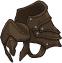

[Back to Main](index.md)

    
        Portait
    
    
        Model
    

# Thellora

Thellora, a centaur paladin, belongs to an all-female regiment known as the Luma. These fifty-three centaurs are diverse, but unified in that each possess a distinctive golden right eye. The centaurs believe these individuals are chosen by their god, Callessa, to be devoted guardians and trained warriors. With their divine connection and martial prowess, they protect their land, embracing their unique gifts with unwavering dedication.

# Basic Information

Thellora will be the new champion in the Liars' Night event on 18 October 2023.

    
        
            **Seat**:
        
        
            1
        
        
            **Stat**
        
        
            **Value**
        
        
            **Day 1 Trials**
        
        
            **Patrons**
        
    
    
        
            **Race**:
        
        
            Centaur
        
        
            **Strength**:
        
        
            16
        
        
            Yes
        
        
            -
        
    
    
        
            **Class**:
        
        
            Paladin
        
        
            **Dexterity**:
        
        
            12
        
        
            Yes
        
        
            Vajra (with Feat)
        
    
    
        
            **Roles**:
        
        
            Support / Tanking / Speed
        
        
            **Constitution**:
        
        
            13
        
        
            Yes
        
        
            -
        
    
    
        
            **Age**:
        
        
            27
        
        
            **Intelligence**:
        
        
            11
        
        
            Yes
        
        
            Zariel
        
    
    
        
            **Gender**:
        
        
            Female
        
        
            **Wisdom**:
        
        
            8
        
        
            -
        
        
            &nbsp;
        
    
    
        
            **Alignment**:
        
        
            Lawful Neutral
        
        
            **Charisma**:
        
        
            17
        
        
            Yes
        
        
            &nbsp;
        
    
    
        
            **Affiliation**:
        
        
            &nbsp;
        
        
            **Total**:
        
        
            77
        
        
            &nbsp;
        
        
            &nbsp;
        
    

# Formation

    

# Abilities

 **Base Attack: Windsong's Strike** (Melee)
> Thellora strikes an enemy with her hooves, and another with her blade.  
> Cooldown: 8s (Cap 2s)

<em>Raw Data</em>

<pre>
{
    "description": "Thellora strikes an enemy with her hooves, and another with her blade.",
    "long_description": "",
    "damage_modifier": 1,
    "damage_types": ["melee"],
    "graphic_id": 0,
    "target": "front",
    "aoe_radius": 0,
    "tags": ["melee"],
    "num_targets": 1,
    "animations": [{
        "target_offset": [
            -75,
            0
        ],
        "special_melee": "thellora",
        "type": "melee_attack"
    }],
    "name": "Windsong's Strike",
    "cooldown": 8,
    "id": 687
}
</pre>

 **Ultimate Attack: The Light of Mount Tura** (Level: 120)
> Thellora charges through the enemies, dealing 1 massive hit to them in a wide path. She then increases the damage of all champions by 400% for 15 seconds.  
> Cooldown: 350s (Cap 87.5s)

<em>Raw Data</em>

<pre>
{
    "description": "Thellora charges through the enemies, and then increases the damage of all champions for a short while.",
    "long_description": "Thellora charges through the enemies, dealing 1 massive hit to them in a wide path. She then increases the damage of all champions by 400% for 15 seconds.",
    "damage_modifier": 0.03,
    "damage_types": ["melee"],
    "graphic_id": 20868,
    "target": "all",
    "aoe_radius": 0,
    "tags": [
        "melee",
        "ultimate"
    ],
    "num_targets": 0,
    "animations": [{
        "target_offset": [
            -75,
            0
        ],
        "ultimate": "thellora",
        "type": "ultimate_attack"
    }],
    "name": "The Light of Mount Tura",
    "cooldown": 350,
    "id": 688
}
</pre>

**Plateaus of Unicorn Run** (Level: 0)
> Thellora gains a Rush stack for every 10 areas she completes in an adventure, and these stacks persist through resets. Thellora's Rush Target is equal to her number of Rush stacks or the current campaign's favor exponent, whichever is smaller. When Thellora kills her first enemy in an adventure, she spends all her Rush stacks and skips to the first area past her Rush Target. Thellora gathers all the rewards (including gold) from bosses skipped in this fashion, but nothing from normal monsters.

<em>Raw Data</em>

<pre>
{
    "static_dps_mult": null,
    "required_level": 0,
    "effect": "effect_def,1685",
    "tip_text": "Thellora skips the first few areas of adventures, depending on the campaign's favor and the number of rush stacks she acquired in a previous adventure.",
    "name": "Plateaus of Unicorn Run",
    "id": 12977,
    "hero_id": 139,
    "upgrade_type": "unlock_ability",
    "default_enabled": 1,
    "required_upgrade_id": 0
}
{
    "effect_keys": [
        {"effect_string": "thellora_plateaus_of_unicorn_run,10"},
        {"effect_string": "max_exponent_mult,100"}
    ],
    "requirements": "",
    "description": {
        "pre": "Thellora gains a Rush stack for every $(amount) areas she completes in an adventure, and these stacks persist through resets. Thellora's Rush Target is equal to her number of Rush stacks or the current campaign's favor exponent, whichever is smaller. When Thellora kills her first enemy in an adventure, she spends all her Rush stacks and skips to the first area past her Rush Target. Thellora gathers all the rewards (including gold) from bosses skipped in this fashion, but nothing from normal monsters.",
        "conditions": [{
            "condition": "not static_desc",
            "desc": "^^$thellora_plateaus_of_unicorn_run_desc"
        }]
    },
    "id": 1685,
    "flavour_text": "",
    "graphic_id": 0,
    "properties": {
        "indexed_effect_properties": true,
        "is_formation_ability": true,
        "default_bonus_index": 0,
        "owner_use_outgoing_description": true,
        "formation_circle_icon": false,
        "per_effect_index_bonuses": true
    }
}
</pre>

 **Strength of the Luma** (Level: 20)
> Thellora increases the damage of Champions in the column behind her by 100%.

<em>Upgrade Data</em>

<pre>
Upgrades:
       80: 100%
      200: 100%
      450: 100%
      640: 100%
      800: 100%
      970: 100%
    1,100: 100%
    1,300: 100%
    1,450: 100%
    1,600: 100%
    1,770: 100%
    1,930: 100%
    2,090: 100%
    2,250: 100%
    2,390: 100%
    2,560: 100%
    2,720: 100%
    2,880: 100%
    3,030: 100%
    3,150: 100%
    3,280: 100%

    Total Upgrade Bonus: 2.10e08%
</pre>

<em>Raw Data</em>

<pre>
{
    "static_dps_mult": null,
    "required_level": 20,
    "effect": "effect_def,1686",
    "tip_text": "Thellora increases the damage of Champions in the column behind her.",
    "name": "Strength of the Luma",
    "id": 12978,
    "hero_id": 139,
    "upgrade_type": "unlock_ability",
    "default_enabled": 1,
    "required_upgrade_id": 0
}
{
    "effect_keys": [{
        "effect_string": "hero_dps_multiplier_mult,100",
        "targets": ["prev_col"]
    }],
    "requirements": "",
    "description": {"desc": "Thellora increases the damage of Champions in the column behind her by $(amount)%."},
    "id": 1686,
    "flavour_text": "",
    "graphic_id": 20864,
    "properties": {
        "is_formation_ability": true,
        "owner_use_outgoing_description": true
    }
}
</pre>

 **Paladin's Resolve** (Level: 90)
> Each time Thellora attacks and doesn't kill an enemy, she increases the effect of Strength of the Luma by 20% until the area changes, stacking multiplicatively and capped at 100 stacks.

<em>Upgrade Data</em>

<pre>
Upgrades:
      600: 100%
    1,200: 100%
    1,800: 100%
    2,420: 100%
    3,000: 100%

    Total Upgrade Bonus: 3,100%
</pre>

<em>Raw Data</em>

<pre>
{
    "static_dps_mult": null,
    "required_level": 90,
    "effect": "effect_def,1688",
    "name": "Paladin's Resolve",
    "id": 12980,
    "hero_id": 139,
    "upgrade_type": "unlock_ability",
    "default_enabled": 1,
    "required_upgrade_id": 0
}
{
    "effect_keys": [{
        "stack_title": "Stacks",
        "stacks_multiply": true,
        "total_title": "Stack Bonus",
        "off_when_benched": true,
        "show_bonus": true,
        "effect_string": "buff_upgrade,20,12978",
        "more_triggers": [{
            "action": {"type": "reset_stacks"},
            "trigger": "area_changed"
        }],
        "max_stacks": 100,
        "stacks_on_trigger": "hero_attack_ended_no_kill"
    }],
    "requirements": "",
    "description": {"desc": "Each time Thellora attacks and doesn't kill an enemy, she increases the effect of Strength of the Luma by $(not_buffed amount)% until the area changes, stacking multiplicatively and capped at $(max_stacks) stacks."},
    "id": 1688,
    "flavour_text": "",
    "graphic_id": 20862,
    "properties": {
        "is_formation_ability": true,
        "owner_use_outgoing_description": true
    }
}
</pre>

 **Radiance of the Sky Cents** (Level: 400)
> Thellora increases the health of all other Champions by 25% of her max health and any healing effect on those Champions is increased by 25%.

<em>Raw Data</em>

<pre>
{
    "static_dps_mult": null,
    "required_level": 400,
    "effect": "effect_def,1687",
    "name": "Radiance of the Sky Cents",
    "id": 12979,
    "hero_id": 139,
    "upgrade_type": "unlock_ability",
    "default_enabled": 1,
    "required_upgrade_id": 0
}
{
    "effect_keys": [
        {
            "off_when_benched": true,
            "effect_string": "increase_health_by_source_percent,25",
            "targets": ["other"]
        },
        {
            "off_when_benched": true,
            "effect_string": "healing_add_mult,25",
            "targets": ["all"]
        }
    ],
    "requirements": "",
    "description": {"desc": "Thellora increases the health of all other Champions by $(amount)% of her max health and any healing effect on those Champions is increased by $(amount___2)%."},
    "id": 1687,
    "flavour_text": "",
    "graphic_id": 20863,
    "properties": {
        "indexed_effect_properties": true,
        "is_formation_ability": true,
        "default_bonus_index": 0,
        "owner_use_outgoing_description": true,
        "per_effect_index_bonuses": true
    }
}
</pre>

 **Feats to Spare** (Level: 500)
> The effects of feats assigned to Thellora also apply to all adjacent Champions. Note that feats that buff her formation abilities have no effect when applied to other Champions.

<em>Raw Data</em>

<pre>
{
    "static_dps_mult": null,
    "required_level": 500,
    "effect": "effect_def,1689",
    "name": "Feats to Spare",
    "id": 12981,
    "hero_id": 139,
    "upgrade_type": "unlock_ability",
    "default_enabled": 1,
    "required_upgrade_id": 0
}
{
    "effect_keys": [{
        "off_when_benched": true,
        "effect_string": "apply_feats_positionally",
        "targets": ["adj"]
    }],
    "requirements": "",
    "description": {
        "pre": "The effects of feats assigned to Thellora also apply to all adjacent Champions. Note that feats that buff her formation abilities have no effect when applied to other Champions.",
        "conditions": [{
            "condition": "not static_desc",
            "desc": "^^$apply_feats_positionally"
        }]
    },
    "id": 1689,
    "flavour_text": "",
    "graphic_id": 20861,
    "properties": {
        "is_formation_ability": true,
        "owner_use_outgoing_description": true
    }
}
</pre>

# Specialisations

 **Callessa's Blessed** (Level: 150)
> Thellora increases the damage of Female and Non-Binary Champions by 50% for each such Champion in the formation, stacking multiplicatively. Buffs apply to the pre-stack value.

ⓘ *Note: This ability might be prestack.*

<em>Raw Data</em>

<pre>
{
    "static_dps_mult": null,
    "specialization_name": "Callessa's Blessed",
    "required_level": 150,
    "effect": "effect_def,1692",
    "name": "Callessa's Blessed",
    "specialization_graphic_id": 20865,
    "id": 12984,
    "hero_id": 139,
    "upgrade_type": "unlock_ability",
    "default_enabled": 1,
    "required_upgrade_id": 0,
    "specialization_description": "Thellora allies with those that have been blessed by her deity."
}
{
    "effect_keys": [
        {
            "off_when_benched": true,
            "effect_string": "pre_stack_amount,50",
            "skip_effect_key_desc": true
        },
        {
            "amount_updated_listeners": [
                "slot_changed",
                "feat_changed"
            ],
            "stacks_multiply": true,
            "formation_arrows_for_effected_only": true,
            "amount_func": "mult",
            "stack_func": "per_hero_attribute",
            "use_computed_amount_for_description": true,
            "effect_string": "hero_dps_multiplier_mult,0",
            "targets": ["all_slots"],
            "amount_expr": "upgrade_amount(12984,0)",
            "off_when_benched": true,
            "show_bonus": true,
            "per_hero_expr": "has_tag_female||(!has_tag_female&&!has_tag_male)",
            "filter_targets": [{
                "type": "by_tags",
                "tags": "female|(!female^!male)"
            }]
        }
    ],
    "requirements": "",
    "description": {"desc": "Thellora increases the damage of Female and Non-Binary Champions by $(amount)% for each such Champion in the formation, stacking multiplicatively. Buffs apply to the pre-stack value."},
    "id": 1692,
    "flavour_text": "",
    "graphic_id": 21001,
    "properties": {
        "indexed_effect_properties": true,
        "is_formation_ability": true,
        "spec_option_post_apply_info": "Qualified Champions: $num_targets___2",
        "default_bonus_index": 0,
        "owner_use_outgoing_description": true,
        "per_effect_index_bonuses": true
    }
}
</pre>

 **Defender of the Meek** (Level: 150)
> Thellora increases the damage of Champions with a STR of 12 or less by 60% for each such Champion in the formation, stacking multiplicatively. Buffs apply to the pre-stack value.

ⓘ *Note: This ability might be prestack.*

<em>Raw Data</em>

<pre>
{
    "static_dps_mult": null,
    "specialization_name": "Defender of the Meek",
    "required_level": 150,
    "effect": "effect_def,1690",
    "name": "Defender of the Meek",
    "specialization_graphic_id": 20866,
    "id": 12982,
    "hero_id": 139,
    "upgrade_type": "unlock_ability",
    "default_enabled": 1,
    "required_upgrade_id": 0,
    "specialization_description": "Thellora focuses on improving the weakest Champions."
}
{
    "effect_keys": [
        {
            "off_when_benched": true,
            "effect_string": "pre_stack_amount,60",
            "skip_effect_key_desc": true
        },
        {
            "amount_updated_listeners": [
                "slot_changed",
                "feat_changed"
            ],
            "stacks_multiply": true,
            "formation_arrows_for_effected_only": true,
            "amount_func": "mult",
            "stack_func": "per_hero_attribute",
            "use_computed_amount_for_description": true,
            "effect_string": "hero_dps_multiplier_mult,0",
            "targets": ["all_slots"],
            "amount_expr": "upgrade_amount(12982,0)",
            "off_when_benched": true,
            "show_bonus": true,
            "min_stat_amount": 12,
            "per_hero_expr": "clamp(min_stat_amount+1-str,0,1)",
            "filter_targets": [{
                "expr": "STR<=12",
                "type": "stat_score"
            }]
        }
    ],
    "requirements": "",
    "description": {"desc": "Thellora increases the damage of Champions with a STR of $(min_stat_amount___2) or less by $(amount)% for each such Champion in the formation, stacking multiplicatively. Buffs apply to the pre-stack value."},
    "id": 1690,
    "flavour_text": "",
    "graphic_id": 21002,
    "properties": {
        "indexed_effect_properties": true,
        "is_formation_ability": true,
        "spec_option_post_apply_info": "Qualified Champions: $num_targets___2",
        "default_bonus_index": 0,
        "owner_use_outgoing_description": true,
        "per_effect_index_bonuses": true
    }
}
</pre>

 **Vanguard of the Quick** (Level: 150)
> Thellora increases the damage of Speed Champions by 50% for each such Champion in the formation, stacking multiplicatively. Buffs apply to the pre-stack value.

ⓘ *Note: This ability might be prestack.*

<em>Raw Data</em>

<pre>
{
    "static_dps_mult": null,
    "specialization_name": "Vanguard of the Quick",
    "required_level": 150,
    "effect": "effect_def,1691",
    "name": "Vanguard of the Quick",
    "specialization_graphic_id": 20867,
    "id": 12983,
    "hero_id": 139,
    "upgrade_type": "unlock_ability",
    "default_enabled": 1,
    "required_upgrade_id": 0,
    "specialization_description": "Thellora runs with the fastest Champions."
}
{
    "effect_keys": [
        {
            "off_when_benched": true,
            "effect_string": "pre_stack_amount,50",
            "skip_effect_key_desc": true
        },
        {
            "amount_updated_listeners": [
                "slot_changed",
                "feat_changed"
            ],
            "stacks_multiply": true,
            "formation_arrows_for_effected_only": true,
            "amount_func": "mult",
            "stack_func": "per_hero_attribute",
            "use_computed_amount_for_description": true,
            "effect_string": "hero_dps_multiplier_mult,0",
            "targets": ["all_slots"],
            "amount_expr": "upgrade_amount(12983,0)",
            "off_when_benched": true,
            "show_bonus": true,
            "per_hero_expr": "has_tag_speed",
            "filter_targets": [{
                "type": "by_tags",
                "tags": "speed"
            }]
        }
    ],
    "requirements": "",
    "description": {"desc": "Thellora increases the damage of Speed Champions by $(amount)% for each such Champion in the formation, stacking multiplicatively. Buffs apply to the pre-stack value."},
    "id": 1691,
    "flavour_text": "",
    "graphic_id": 21003,
    "properties": {
        "indexed_effect_properties": true,
        "is_formation_ability": true,
        "spec_option_post_apply_info": "Qualified Champions: $num_targets___2",
        "default_bonus_index": 0,
        "owner_use_outgoing_description": true,
        "per_effect_index_bonuses": true
    }
}
</pre>

# Items

    
        
            **Icons**
        
        
            **Slot**
        
        
            **Epic Name**
        
        
            **Effect**
        
    
    
        
            &nbsp;
        
        
            1
        
        
            Spear of the Gods
        
        
            All Champion Damage
        
    
    
        
            
        
        
            2
        
        
            Callessa's Chosen
        
        
            Health
        
    
    
        
            
        
        
            3
        
        
            Sword of Honor & Justice
        
        
            Strength of the Luma
        
    
    
        
            
        
        
            4
        
        
            Pyroclastic Phalanx Shield
        
        
            Paladin's Resolve
        
    
    
        
            
        
        
            5
        
        
            Basalt Dagger
        
        
            All First Specialisations
        
    
    
        
            
        
        
            6
        
        
            Mantle of Callessa
        
        
            Ultimate Cooldown Reduction
        
    

<em>Item Names and Descriptions</em>

<pre>
Slot 1:
         Makeshift Halberd: I fashioned this in a time of need. It became my most trusted
                            weapon.
           Deadly Keepsake: When I meet Callessa, this will be the item I ask to be blessed.
          Lance of Justice: Created at my request when I became a Luma at last.
         Spear of the Gods: Forged in Mount Celestia with the power to defeat the gods
                            themselves.

Slot 2:
            Training Armor: As a child, I could barely move in this, let alone gallop, in this.
           Studded Leather: After a few years of training, this armor felt like a second skin.
           Frontline Armor: I dreamt of wearing this armor for many years before I finally
                            donned it.
         Callessa's Chosen: I led the Luma to face the shadows. Callessa and her people shall
                            never fall!

Slot 3:
               Steel Sword: The weight of steel always felt natural in my hand.
         Battle Worn Blade: I kept this blade for longer than I should have. But never once did
                            it fail me.
     Blade of Divine Wings: A prayer to Callessa is etched on the blade to keep her with me at
                            all times.
  Sword of Honor & Justice: Legends say this comes from another world. It burns with magic we
                            do not know.

Slot 4:
            Wooden Buckler: 'Strong as the herd' is etched on the back.
             Trusty Shield: An item that has saved my life more times than I can count.
              Luma's Aegis: I led the charge in the battle of Sophress. They called me the
                            Aegis of Luma.
Pyroclastic Phalanx Shield: Blood of Callessa be with me.

Slot 5:
           Shining Trinket: Given to me on the day of my first training.
            Heart's Dagger: I will always think of the person that gave me this and what they
                            meant to me.
             Equine Treats: I need energy on the battlefield to crush my enemies!
             Basalt Dagger: Made from part of Callessa herself. One of my most cherished gifts.

Slot 6:
             Ruby Headband: The ruby was harvested from a vein close to the peak of Mount
                            Callessa.
       Reminder of Loyalty: This represents an oath I failed to uphold. That will not happen
                            again.
             Amber Circlet: The final adornment that truly marks you as one of the Luma.
        Mantle of Callessa: Summoned by the Amber Circlet and a direct connection to Callessa.
</pre>

# Feats

This list will only show feats that are going to be available on the release of this champion. The separate [Feats](feats.md) page may show others that could be available later if they exist.

    
        
            **Feat**
        
        
            **Effect**
        
        
            **Source**
        
    
    
        
            Selflessness
        
        
            10% All Champion Damage
        
        
            Free
        
    
    
        
            Inspiring Leader
        
        
            25% All Champion Damage
        
        
            Gold Chest
        
    
    
        
            Tough
        
        
            15% Health
        
        
            Free
        
    
    
        
            Resilient
        
        
            30% Health
        
        
            Gold Chest
        
    
    
        
            Defensive Duelist
        
        
            +5 Overwhelm
        
        
            Free
        
    
    
        
            Calm Under Pressure
        
        
            +10 Overwhelm
        
        
            Gold Chest
        
    
    
        
            Darting Weapon
        
        
            -0.5s Base Attack Cooldown
        
        
            Gold Chest
        
    
    
        
            Flanking Positions
        
        
            20% Strength of the Luma
        
        
            Free
        
    
    
        
            Phalanx
        
        
            40% Strength of the Luma
        
        
            12,500 Gems
        
    
    
        
            Callessa's Will
        
        
            40% Paladin's Resolve
        
        
            Gold Chest
        
    
    
        
            Best of the Luma
        
        
            40% All First Specialisations
        
        
            12,500 Gems
        
    
    
        
            Thin Their Ranks
        
        
            -50% Req Rush Stacks from Plateaus of Unicorn Run
        
        
            50,000 Gems
        
    
    
        
            Durable
        
        
            Stat: +1 Constitution
        
        
            12,500 Gems
        
    

# Legendaries

* Increases the damage of all Champions by 10% for each Champion in the formation.
* Increases the damage of all Male Champions by 125%.
* Increases the damage of all Champions by 10% for each Champion in the formation.
* Increases the damage of all Champions with a CON score of 11 or higher by 100%.
* Increases the damage of all Champions with a INT score of 11 or higher by 100%.
* Increases the damage of all Melee Champions by 150%.

<em>DPS Applicable</em>

<pre>
     Arkhan: 5 / 6
    Artemis: 6 / 6
    Asharra: 3 / 6
      Azaka: 5 / 6
     Binwin: 5 / 6
   Birdsong: 5 / 6
Black Viper: 5 / 6
 Catti-brie: 4 / 6
     Delina: 4 / 6
    Dhadius: 4 / 6
     Drizzt: 6 / 6
    Farideh: 4 / 6
        Fen: 5 / 6
      Grimm: 6 / 6
     Gromma: 5 / 6
       Ishi: 5 / 6
    Jaheira: 4 / 6
    Jamilah: 4 / 6
   Jarlaxle: 6 / 6
        Jim: 4 / 6
       Kent: 6 / 6
      Krond: 6 / 6
       Krux: 5 / 6
    Lae'zel: 5 / 6
     Lucius: 5 / 6
      Makos: 5 / 6
      Minsc: 5 / 6
     Nahara: 3 / 6
      Nrakk: 6 / 6
     Orisha: 3 / 6
   Prudence: 4 / 6
      Rosie: 5 / 6
      Strix: 4 / 6
    Torogar: 5 / 6
     Warden: 4 / 6
    Warduke: 5 / 6
     Yorven: 5 / 6
      Zorbu: 5 / 6
</pre>

<em>Non-DPS Applicable</em>

<pre>
          Aila: 4 / 6
       Alyndra: 4 / 6
       Antrius: 4 / 6
      Astarion: 5 / 6
         Avren: 5 / 6
          BBEG: 4 / 6
       Baeloth: 5 / 6
      Barrowin: 5 / 6
        Beadle: 6 / 6
       Blooshi: 4 / 6
          Brig: 6 / 6
          Briv: 5 / 6
      Calliope: 4 / 6
       Celeste: 4 / 6
     Certainty: 4 / 6
       Corazón: 6 / 6
       Desmond: 6 / 6
           Dob: 5 / 6
        Donaar: 4 / 6
    Dragonbait: 6 / 6
Dungeon Master: 5 / 6
        Egbert: 4 / 6
      Ellywick: 4 / 6
       Evandra: 5 / 6
        Evelyn: 5 / 6
        Freely: 3 / 6
       Gazrick: 5 / 6
       Havilar: 4 / 6
      Hew Maan: 5 / 6
         Hitch: 6 / 6
         Imoen: 4 / 6
         Korth: 5 / 6
         Krull: 6 / 6
        Krydle: 6 / 6
       Lazaapz: 5 / 6
         Mehen: 6 / 6
          Melf: 6 / 6
      Merilwen: 4 / 6
         Miria: 4 / 6
        Môrgæn: 4 / 6
        Nayeli: 4 / 6
         Nerys: 5 / 6
        Nordom: 4 / 6
          Nova: 5 / 6
          Omin: 6 / 6
       Paultin: 5 / 6
      Penelope: 4 / 6
         Pwent: 5 / 6
        Qillek: 5 / 6
         Regis: 6 / 6
          Reya: 5 / 6
          Rust: 6 / 6
        Selise: 5 / 6
        Sentry: 4 / 6
     Sgt. Knox: 6 / 6
         Shaka: 5 / 6
       Shandie: 4 / 6
        Solaak: 5 / 6
         Spurt: 4 / 6
         Stoki: 5 / 6
   Strongheart: 6 / 6
         Talin: 6 / 6
       Tatyana: 4 / 6
      Thellora: 5 / 6
         Tyril: 6 / 6
       Ulkoria: 4 / 6
         Uriah: 5 / 6
     Valentine: 4 / 6
            Vi: 4 / 6
       Viconia: 3 / 6
      Vin Ursa: 4 / 6
        Virgil: 5 / 6
       Vlahnya: 3 / 6
        Walnut: 4 / 6
        Widdle: 4 / 6
       Wulfgar: 6 / 6
        Xander: 5 / 6
      Xerophon: 5 / 6
</pre>

 

# Other Champion Images

    
        
            Console Portait
        
    
    
        
            Gold Chest Icon
        
        
            Silver Chest Icon
        
    

[Back to Top](#top)

*Last Modified: {{ site.time }}*