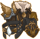
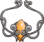
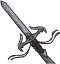
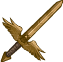

[Back to Main](index.md)





# Thellora

We currently know very little about this champion. We believe they will be part of the next (and sixth) Idle Champions Presents: `Fatebreaker`.

# Basic Information

Thellora will be the new champion in the Liars' Night event on 18 October 2023.

    
        
            **Seat**:
        
        
            Unknown
        
    
    
        
            **Race**:
        
        
            Unknown
        
    
    
        
            **Class**:
        
        
            Paladin (Guess)
        
    
    
        
            **Roles**:
        
        
            Unknown
        
    
    
        
            **Age**:
        
        
            Unknown
        
    
    
        
            **Gender**:
        
        
            Unknown
        
    
    
        
            **Alignment**:
        
        
            Unknown
        
    
    
        
            **Affiliation**:
        
        
            Unknown
        
    

# Formation

Unknown.


    



# Abilities

**Base Attack: Unknown**
> Unknown effect.

<em>Raw Data</em>

<pre>
</pre>

**Ultimate Attack: Unknown**
> Unknown effect.

<em>Raw Data</em>

<pre>
</pre>

**Feats to Spare**
> Unknown effect.

<em>Raw Data</em>

<pre>
{
    "p": 0,
    "v": 2,
    "id": 20861,
    "export_params": {
        "quantize": true,
        "uses": ["icon"]
    },
    "type": 1,
    "graphic": "Icons/Events/2017LiarsNight/Liars Night Y7/Icon_Formation_ThelloraFeatstoSpare",
    "fs": 0
}
</pre>

**Paladin's Resolve**
> Unknown effect.

<em>Raw Data</em>

<pre>
{
    "p": 0,
    "v": 2,
    "id": 20862,
    "export_params": {
        "quantize": true,
        "uses": ["icon"]
    },
    "type": 1,
    "graphic": "Icons/Events/2017LiarsNight/Liars Night Y7/Icon_Formation_ThelloraPaladinsResolve",
    "fs": 0
}
</pre>

**Radiance of the Sky Cents**
> Unknown effect.

<em>Raw Data</em>

<pre>
{
    "p": 0,
    "v": 2,
    "id": 20863,
    "export_params": {
        "quantize": true,
        "uses": ["icon"]
    },
    "type": 1,
    "graphic": "Icons/Events/2017LiarsNight/Liars Night Y7/Icon_Formation_ThelloraRadianceoftheSkyCents",
    "fs": 0
}
</pre>

**Strength of the Luma**
> Unknown effect.

<em>Raw Data</em>

<pre>
{
    "p": 0,
    "v": 2,
    "id": 20864,
    "export_params": {
        "quantize": true,
        "uses": ["icon"]
    },
    "type": 1,
    "graphic": "Icons/Events/2017LiarsNight/Liars Night Y7/Icon_Formation_ThelloraStrengthoftheLuma",
    "fs": 0
}
</pre>

# Specialisations

**Specialisation: Callessas Blessed** (Guess)
> Unknown effect.

<em>Raw Data</em>

<pre>
{
    "p": 0,
    "v": 2,
    "id": 20865,
    "export_params": {
        "quantize": true,
        "uses": ["icon"]
    },
    "type": 1,
    "graphic": "Icons/Events/2017LiarsNight/Liars Night Y7/Icon_Specialization_ThelloraCallessasBlessed",
    "fs": 0
}
</pre>

**Specialisation: Defender of the Meek** (Guess)
> Unknown effect.

<em>Raw Data</em>

<pre>
{
    "p": 0,
    "v": 2,
    "id": 20866,
    "export_params": {
        "quantize": true,
        "uses": ["icon"]
    },
    "type": 1,
    "graphic": "Icons/Events/2017LiarsNight/Liars Night Y7/Icon_Specialization_ThelloraDefenderoftheMeek",
    "fs": 0
}
</pre>

**Specialisation: Vanguard of the Quick** (Guess)
> Unknown effect.

<em>Raw Data</em>

<pre>
{
    "p": 0,
    "v": 2,
    "id": 20867,
    "export_params": {
        "quantize": true,
        "uses": ["icon"]
    },
    "type": 1,
    "graphic": "Icons/Events/2017LiarsNight/Liars Night Y7/Icon_Specialization_ThelloraVanguardoftheQuick",
    "fs": 0
}
</pre>

# Items

    
        
            **Icons**
        
        
            **Name**
        
    
    
        
            
        
        
            Armor
        
    
    
        
            
        
        
            Helmet
        
    
    
        
            
        
        
            Shield
        
    
    
        
            
        
        
            Spear
        
    
    
        
            
        
        
            Sword
        
    
    
        
            
        
        
            Trinket
        
    

# Feats

Unknown.

# Legendaries

Unknown.

# Champion Images

    
        
            Console Portait
        
    
    
        
            Gold Chest Icon
        
        
            Silver Chest Icon
        
    

[Back to Top](#top)

*Last Modified: {{ site.time }}*