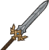

[Back to Main](index.md)

# Thellora

We currently know very little about this champion. We believe they will be part of the next (and sixth) Idle Champions Presents: `Fatebreaker`.

# Basic Information

Thellora will be the new champion in the Liars' Night event on 18 October 2023.

    
        
            **Seat**:
        
        
            Unknown
        
    
    
        
            **Race**:
        
        
            Centaur (Guess)
        
    
    
        
            **Class**:
        
        
            Paladin (Guess)
        
    
    
        
            **Roles**:
        
        
            Unknown
        
    
    
        
            **Age**:
        
        
            Unknown
        
    
    
        
            **Gender**:
        
        
            Unknown
        
    
    
        
            **Alignment**:
        
        
            Unknown
        
    
    
        
            **Affiliation**:
        
        
            Unknown
        
    

# Formation

Unknown.


    



# Abilities

**Base Attack: Windsong's Strike** (Melee)
> Thellora strikes an enemy with her hooves, and another with her blade.

<em>Raw Data</em>

<pre>
{
    "description": "Thellora strikes an enemy with her hooves, and another with her blade.",
    "long_description": "",
    "damage_modifier": 1,
    "damage_types": ["melee"],
    "graphic_id": 0,
    "target": "front",
    "aoe_radius": 0,
    "tags": ["melee"],
    "num_targets": 1,
    "animations": [{
        "damage_frame": 2,
        "jump_sound": 30,
        "sound_frames": {"2": 154},
        "target_offset_x": -34,
        "type": "melee_attack"
    }],
    "name": "Windsong's Strike",
    "cooldown": 8,
    "id": 687
}
</pre>

**Ultimate Attack: The Light of Mount Tura**
> Thellora charges through the enemies dealing 1 massive hit to enemies in a wide path, and then increases the damage of all champions for a short while.

<em>Raw Data</em>

<pre>
{
    "description": "Thellora charges through the enemies, and then increases the damage of all champions for a short while.",
    "long_description": "Thellora charges through the enemies dealing 1 massive hit to enemies in a wide path, and then increases the damage of all champions for a short while.",
    "damage_modifier": 1,
    "damage_types": ["melee"],
    "graphic_id": 20868,
    "target": "all",
    "aoe_radius": 0,
    "tags": [
        "melee",
        "ultimate"
    ],
    "num_targets": 0,
    "animations": [{
        "damage_frame": 2,
        "jump_sound": 30,
        "sound_frames": {"2": 154},
        "target_offset_x": -34,
        "type": "melee_attack"
    }],
    "name": "The Light of Mount Tura",
    "cooldown": 10,
    "id": 688
}
</pre>

**Plateaus of Unicorn** (Guess)
> Unknown effect.

<em>Raw Data</em>

<pre>
{
    "effect_keys": [{"effect_string": "thellora_plateaus_of_unicorn_run"}],
    "requirements": "",
    "description": {"desc": ""},
    "id": 1685,
    "flavour_text": "",
    "graphic_id": 0,
    "properties": {
        "indexed_effect_properties": true,
        "is_formation_ability": true,
        "default_bonus_index": 0,
        "owner_use_outgoing_description": true,
        "per_effect_index_bonuses": true
    }
}
</pre>

**Strength of the Luma**
> Thellora increases the damage of Champions in the column behind her by `$(amount)%`.

<em>Raw Data</em>

<pre>
{
    "effect_keys": [{
        "effect_string": "hero_dps_multiplier_mult,100",
        "targets": ["prev_col"]
    }],
    "requirements": "",
    "description": {"desc": "Thellora increases the damage of Champions in the column behind her by $(amount)%."},
    "id": 1686,
    "flavour_text": "",
    "graphic_id": 20864,
    "properties": {
        "is_formation_ability": true,
        "owner_use_outgoing_description": true
    }
}
</pre>

**Radiance of the Sky Cents**
> Thellora increases the health of all other Champions by `$(amount)%` of her max health and any healing effect on those Champions is increased by `$(amount___2)%`.

<em>Raw Data</em>

<pre>
{
    "effect_keys": [
        {
            "off_when_benched": true,
            "effect_string": "increase_health_by_source_percent,25",
            "targets": ["other"]
        },
        {
            "off_when_benched": true,
            "effect_string": "healing_add_mult,25",
            "targets": ["all"]
        }
    ],
    "requirements": "",
    "description": {"desc": "Thellora increases the health of all other Champions by $(amount)% of her max health and any healing effect on those Champions is increased by $(amount___2)%."},
    "id": 1687,
    "flavour_text": "",
    "graphic_id": 20863,
    "properties": {
        "indexed_effect_properties": true,
        "is_formation_ability": true,
        "default_bonus_index": 0,
        "owner_use_outgoing_description": true,
        "per_effect_index_bonuses": true
    }
}
</pre>

**Paladin's Resolve**
> Each time Thellora attacks and doesn't kill an enemy, she increases the effect of Strength of the Luma by `$(not_buffed amount)%` until the area changes, stacking multiplicatively and capped at `$(max_stacks)` stacks.

<em>Raw Data</em>

<pre>
{
    "effect_keys": [{
        "stack_title": "Stacks",
        "stacks_multiply": true,
        "total_title": "Stack Bonus",
        "off_when_benched": true,
        "show_bonus": true,
        "effect_string": "buff_upgrade,20,12978",
        "more_triggers": [{
            "action": {"type": "reset_stacks"},
            "trigger": "area_changed"
        }],
        "max_stacks": 100,
        "stacks_on_trigger": "hero_attack_ended_no_kill"
    }],
    "requirements": "",
    "description": {"desc": "Each time Thellora attacks and doesn't kill an enemy, she increases the effect of Strength of the Luma by $(not_buffed amount)% until the area changes, stacking multiplicatively and capped at $(max_stacks) stacks."},
    "id": 1688,
    "flavour_text": "",
    "graphic_id": 20862,
    "properties": {
        "is_formation_ability": true,
        "owner_use_outgoing_description": true
    }
}
</pre>

**Feats to Spare**
> The effects of feats assigned to Thellora also apply to all adjacent Champions. Note that feats that buff her formation abilities have no effect when applied to other Champions.

<em>Raw Data</em>

<pre>
{
    "effect_keys": [{
        "effect_string": "apply_feats_positionally",
        "targets": ["adj"]
    }],
    "requirements": "",
    "description": {
        "pre": "The effects of feats assigned to Thellora also apply to all adjacent Champions. Note that feats that buff her formation abilities have no effect when applied to other Champions.",
        "conditions": [{
            "condition": "not static_desc",
            "desc": "^^$apply_feats_positionally"
        }]
    },
    "id": 1689,
    "flavour_text": "",
    "graphic_id": 20861,
    "properties": {
        "is_formation_ability": true,
        "owner_use_outgoing_description": true
    }
}
</pre>

# Specialisations

**Specialisation: Defender of the Meek** (Guess)
> Thellora increases the damage of Champions with a STR of `$(min_stat_amount___2)` or less by `$(amount)%` for each Champion in the formation with a STR of `$(min_stat_amount___2)` or less, stacking multiplicatively. Buffs apply to the pre-stack value.

ⓘ *Note: This ability might be prestack.*

<em>Raw Data</em>

<pre>
{
    "effect_keys": [
        {
            "off_when_benched": true,
            "effect_string": "pre_stack_amount,60",
            "skip_effect_key_desc": true
        },
        {
            "amount_updated_listeners": [
                "slot_changed",
                "feat_changed"
            ],
            "stacks_multiply": true,
            "formation_arrows_for_effected_only": true,
            "amount_func": "mult",
            "stack_func": "per_hero_attribute",
            "use_computed_amount_for_description": true,
            "effect_string": "hero_dps_multiplier_mult,0",
            "targets": ["all_slots"],
            "amount_expr": "upgrade_amount(12982,0)",
            "off_when_benched": true,
            "show_bonus": true,
            "min_stat_amount": 12,
            "per_hero_expr": "clamp(min_stat_amount-str,0,1)",
            "filter_targets": [{
                "expr": "STR<=12",
                "type": "stat_score"
            }]
        }
    ],
    "requirements": "",
    "description": {"desc": "Thellora increases the damage of Champions with a STR of $(min_stat_amount___2) or less by $(amount)% for each Champion in the formation with a STR of $(min_stat_amount___2) or less, stacking multiplicatively. Buffs apply to the pre-stack value."},
    "id": 1690,
    "flavour_text": "",
    "graphic_id": 0,
    "properties": {
        "indexed_effect_properties": true,
        "is_formation_ability": true,
        "default_bonus_index": 0,
        "per_effect_index_bonuses": true
    }
}
</pre>

**Specialisation: Vanguard of the Quick** (Guess)
> Thellora increases the damage of Speed Champions by `$(amount)%` for each Speed Champion in the formation, stacking multiplicatively. Buffs apply to the pre-stack value.

ⓘ *Note: This ability might be prestack.*

<em>Raw Data</em>

<pre>
{
    "effect_keys": [
        {
            "off_when_benched": true,
            "effect_string": "pre_stack_amount,50",
            "skip_effect_key_desc": true
        },
        {
            "amount_updated_listeners": [
                "slot_changed",
                "feat_changed"
            ],
            "stacks_multiply": true,
            "formation_arrows_for_effected_only": true,
            "amount_func": "mult",
            "stack_func": "per_hero_attribute",
            "use_computed_amount_for_description": true,
            "effect_string": "hero_dps_multiplier_mult,0",
            "targets": ["all_slots"],
            "amount_expr": "upgrade_amount(12983,0)",
            "off_when_benched": true,
            "show_bonus": true,
            "per_hero_expr": "has_tag_speed",
            "filter_targets": [{
                "type": "by_tags",
                "tags": "speed"
            }]
        }
    ],
    "requirements": "",
    "description": {"desc": "Thellora increases the damage of Speed Champions by $(amount)% for each Speed Champion in the formation, stacking multiplicatively. Buffs apply to the pre-stack value."},
    "id": 1691,
    "flavour_text": "",
    "graphic_id": 0,
    "properties": {
        "indexed_effect_properties": true,
        "is_formation_ability": true,
        "default_bonus_index": 0,
        "per_effect_index_bonuses": true
    }
}
</pre>

**Specialisation: Callessas Blessed** (Guess)
> Thellora increases the damage of Female and Non-Binary Champions by `$(amount)%` for each Female and Non-Binary Champion in the formation, stacking multiplicatively. Buffs apply to the pre-stack value.

ⓘ *Note: This ability might be prestack.*

<em>Raw Data</em>

<pre>
{
    "effect_keys": [
        {
            "off_when_benched": true,
            "effect_string": "pre_stack_amount,50",
            "skip_effect_key_desc": true
        },
        {
            "amount_updated_listeners": [
                "slot_changed",
                "feat_changed"
            ],
            "stacks_multiply": true,
            "formation_arrows_for_effected_only": true,
            "amount_func": "mult",
            "stack_func": "per_hero_attribute",
            "use_computed_amount_for_description": true,
            "effect_string": "hero_dps_multiplier_mult,0",
            "targets": ["all_slots"],
            "amount_expr": "upgrade_amount(12984,0)",
            "off_when_benched": true,
            "show_bonus": true,
            "per_hero_expr": "has_tag_female||(!has_tag_female&&!has_tag_male)",
            "filter_targets": [{
                "type": "by_tags",
                "tags": "female|(!female^!male)"
            }]
        }
    ],
    "requirements": "",
    "description": {"desc": "Thellora increases the damage of Female and Non-Binary Champions by $(amount)% for each Female and Non-Binary Champion in the formation, stacking multiplicatively. Buffs apply to the pre-stack value."},
    "id": 1692,
    "flavour_text": "",
    "graphic_id": 0,
    "properties": {
        "indexed_effect_properties": true,
        "is_formation_ability": true,
        "default_bonus_index": 0,
        "per_effect_index_bonuses": true
    }
}
</pre>

# Items

    
        
            **Icons**
        
        
            **Name**
        
    
    
        
            
        
        
            Armor
        
    
    
        
            
        
        
            Helmet
        
    
    
        
            
        
        
            Shield
        
    
    
        
            
        
        
            Spear
        
    
    
        
            
        
        
            Sword
        
    
    
        
            
        
        
            Trinket
        
    

# Feats

Unknown.

# Legendaries

Unknown.

# Champion Images

    
        
            Console Portait
        
    
    
        
            Gold Chest Icon
        
        
            Silver Chest Icon
        
    

[Back to Top](#top)

*Last Modified: {{ site.time }}*