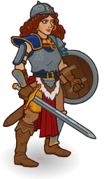
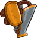
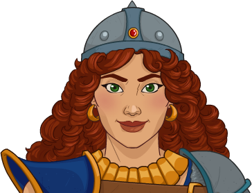

[Back to Main](index.md)

    
        
            
        
        
            Portrait
        
    
    
        
            
        
        
            Model
        
    

# Tika Waylan

[Tika Waylan - Dragonlace Fandom Wiki](https://dragonlance.fandom.com/wiki/Tika_Waylan){:target="_blank"}

# Basic Information

Tika Waylan will be a new champion in the Wintershield event on 6 January 2027.

  **Seat**:
  Unknown
  **Species**:
  Human (Guess)
  **Class**:
  Unknown
  **Roles**:
  Support / Gold / Debuff / Hunter / Control (Guess)
  **Age**:
  Unknown
  **Gender**:
  Female (Guess)
  **Alignment**:
  Unknown
  **Affiliation**:
  Heroes of the Lance (Guess)

# Formation

    <svg xmlns="http://www.w3.org/2000/svg" id="Tika" fill="#aaa" data-formationName="Tika" data-campaignName="Wintershield" width="339" height="140"><circle cx="215" cy="65" r="15"/><circle cx="215" cy="105" r="15"/><circle cx="175" cy="85" r="15"/><circle cx="175" cy="125" r="15"/><circle cx="135" cy="65" r="15"/><circle cx="135" cy="105" r="15"/><circle cx="95" cy="45" r="15"/><circle cx="55" cy="25" r="15"/><circle cx="15" cy="45" r="15"/><circle cx="15" cy="85" r="15"/><text x="245" y="25" fill="#dcdcdc" font-size="25" font-family="Arial" font-weight="bold">Tika</text><text x="245" y="65" fill="#dcdcdc" font-size="15" font-family="Arial" font-weight="bold">Wintershield</text></svg>

# Attacks

**Base Attack: Improvised Attack** (Melee)
> Tika takes a swing at the nearest enemy with whatever implement she happens to have on hand.  
> Cooldown: 4s (Cap 1s)

<em>Raw Data</em>

<pre>
{
    "id": 1017,
    "name": "Improvised Attack",
    "description": "Tika takes a swing at the nearest enemy with whatever implement she happens to have on hand. ",
    "long_description": "",
    "graphic_id": 0,
    "target": "front",
    "num_targets": 1,
    "aoe_radius": 0,
    "damage_modifier": 1,
    "cooldown": 4,
    "animations": [
        {
            "type": "melee_attack",
            "target_offset_x": -34,
            "damage_frame": 2
        }
    ],
    "tags": [
        "melee"
    ],
    "damage_types": [
        "melee"
    ]
}
</pre>

**Base Attack: Relentless Ghould** (Melee)
> Unknown effect.  
> Cooldown: 5s (Cap 1.25s)

<em>Raw Data</em>

<pre>
{
    "id": 1019,
    "name": "Relentless Ghould",
    "description": "",
    "long_description": "",
    "graphic_id": 0,
    "target": "front",
    "num_targets": 1,
    "aoe_radius": 0,
    "damage_modifier": 0,
    "cooldown": 5,
    "animations": [
        {
            "type": "melee_attack",
            "effect_frames": {
                "hit": {
                    "effect_string": "damage_hero_percent,10"
                }
            }
        }
    ],
    "tags": [
        "melee"
    ],
    "damage_types": [
        "melee"
    ]
}
</pre>

**Ultimate Attack: Bar Fight** (Guess)
> Tika and Champions adjacent to her dogpile the enemies in a tavern brawl for a short time based on the number of Champions involved, and dealing increasing damage for every second it lasts.  
> Cooldown: 600s (Cap 150s)

<em>Raw Data</em>

<pre>
{
    "id": 1018,
    "name": "Bar Fight",
    "description": "Tika and Champions adjacent to her dogpile the enemies in a tavern brawl for a short time.",
    "long_description": "Tika and Champions adjacent to her dogpile the enemies in a tavern brawl for a short time based on the number of Champions involved, and dealing increasing damage for every second it lasts.",
    "graphic_id": 31714,
    "target": "all",
    "num_targets": 1,
    "aoe_radius": 150,
    "damage_modifier": 0.075,
    "cooldown": 600,
    "animations": [
        {
            "type": "tika_ultimate",
            "graphic_id": 31763
        }
    ],
    "tags": [
        "melee",
        "ultimate"
    ],
    "damage_types": [
        "melee"
    ]
}
</pre>

# Abilities

**Unknown** (Guess)
> Tika may be used in any adventure or variant if Caramon is already in the formation, even if the Patron or variant restrictions would forbid it. Likewise, if Tika is in the formation, then Caramon may be used as well.

<em>Raw Data</em>

<pre>
{
    "id": 3120,
    "flavour_text": "",
    "description": {
        "desc": "Tika may be used in any adventure or variant if Caramon is already in the formation, even if the Patron or variant restrictions would forbid it. Likewise, if Tika is in the formation, then Caramon may be used as well. "
    },
    "effect_keys": [
        {
            "effect_string": "force_allow_hero",
            "paired_hero_id": 179,
            "off_when_benched": true,
            "ignore_hero_source_check": true,
            "hero_ids": [
                179
            ]
        }
    ],
    "requirements": "",
    "graphic_id": 0,
    "large_graphic_id": 0,
    "properties": {
        "is_formation_ability": true,
        "owner_use_outgoing_description": true,
        "indexed_effect_properties": true,
        "per_effect_index_bonuses": true,
        "default_bonus_index": 0
    }
}
</pre>

**Order Up!** (Guess)
> Tika increases the damage of all Champions in the formation by 100%. On each affected Champion this effect is increased by 100% for each positional buff that is affecting that Champion, stacking multiplicatively.

<em>Raw Data</em>

<pre>
{
    "id": 3121,
    "flavour_text": "",
    "description": {
        "desc": "Tika increases the damage of all Champions in the formation by $(not_buffed amount)%. On each affected Champion this effect is increased by $(not_buffed amount)% for each positional buff that is affecting that Champion, stacking multiplicatively."
    },
    "effect_keys": [
        {
            "effect_string": "hero_dps_multiplier_mult,100",
            "off_when_benched": true,
            "amount_func": "mult",
            "stack_func": "per_hero_attribute",
            "per_hero_expr": "hero_positional_formation_abilities",
            "targets": [
                "all"
            ],
            "override_key_desc": "Increases the damage of $target by $(not_buffed amount)% for each positional buff affecting them",
            "per_hero_targets": [
                "effect_key_slot"
            ],
            "amount_updated_listeners": [
                "slot_changed",
                "feat_changed",
                "upgrade_unlocked"
            ],
            "show_bonus": true,
            "show_stacks": false,
            "show_stats_on_owner": true,
            "show_stats_on_receiver": true,
            "show_bonus_on_receiver_only": true
        },
        {
            "effect_string": "do_nothing",
            "off_when_benched": true,
            "amount_func": "mult",
            "stack_func": "per_hero_attribute",
            "per_hero_expr": "hero_positional_formation_abilities",
            "targets": [
                "all"
            ],
            "stack title": "Positional Buffs",
            "show_stacks": true,
            "show_bonus": false
        }
    ],
    "requirements": "",
    "graphic_id": 31704,
    "large_graphic_id": 31701,
    "properties": {
        "is_formation_ability": true,
        "owner_use_outgoing_description": true,
        "indexed_effect_properties": true,
        "per_effect_index_bonuses": true,
        "default_bonus_index": 0
    }
}
</pre>

**Spirited Defiance** (Guess)
> When Tika attacks an enemy that has attacked a Champion in the formation or been on screen for at least 15 seconds, that enemy gains a Defiance stack. Each Defiance stack causes that enemy to take 100% additional damage from all Champions' attacks, stacking multiplicatively to a maximum of 10 stacks.

ⓘ *Note: This ability is prestack.*

<em>Raw Data</em>

<pre>
{
    "id": 3122,
    "flavour_text": "",
    "description": {
        "desc": "When Tika attacks an enemy that has attacked a Champion in the formation or been on screen for at least $time___2 seconds, that enemy gains a Defiance stack. Each Defiance stack causes that enemy to take $amount% additional damage from all Champions' attacks, stacking multiplicatively to a maximum of $max_stacks___2 stacks. "
    },
    "effect_keys": [
        {
            "off_when_benched": true,
            "effect_string": "pre_stack,100"
        },
        {
            "effect_string": "tika_spirited_defiance,100",
            "amount_expr": "upgrade_amount(21951,0)",
            "off_when_benched": true,
            "max_stacks": 10,
            "time": 15,
            "debuffing_attack_ids": [
                1017
            ],
            "debuff_effects": [
                {
                    "effect_string": "increase_monster_damage,0",
                    "amount_expr": "upgrade_amount(21951,0)",
                    "active_graphic_id": 31866,
                    "active_graphic_y": -125,
                    "use_stack_as_frame": true,
                    "max_stacks": "$max_stacks",
                    "stacks_on_reapply": true,
                    "manual_stacking": true,
                    "stacks_multiply": true,
                    "use_collection_source": false,
                    "stack_across_effects": false
                }
            ],
            "debuff_before_damage": true,
            "show_bonus": true
        }
    ],
    "requirements": "",
    "graphic_id": 31705,
    "large_graphic_id": 31702,
    "properties": {
        "is_formation_ability": true,
        "owner_use_outgoing_description": true,
        "indexed_effect_properties": true,
        "per_effect_index_bonuses": true,
        "default_bonus_index": 0
    }
}
</pre>

**Adaptive Training** (Guess)
> Tika watches and learns from her more experienced adventuring allies, augmenting her own abilities based on the most populous non-Support, non-Tanking role in the formation, or all relevant roles in case of a tie.

<em>Raw Data</em>

<pre>
{
    "id": 3123,
    "flavour_text": "",
    "description": {
        "desc": "Tika watches and learns from her more experienced adventuring allies, augmenting her own abilities based on the most populous non-Support, non-Tanking role in the formation, or all relevant roles in case of a tie.",
        "post": {
            "conditions": [
                {
                    "condition": "not static_desc",
                    "desc": "$tika_adaptive_training_description"
                }
            ]
        }
    },
    "effect_keys": [
        {
            "effect_string": "tika_adaptive_training",
            "off_when_benched": true,
            "ignore_tags": [
                "tanking",
                "support"
            ],
            "effects": {
                "breaking": {
                    "effect_string": "effect_def,3134"
                },
                "control": {
                    "effect_string": "effect_def,3135"
                },
                "debuff": {
                    "effect_string": "effect_def,3136"
                },
                "dps": {
                    "effect_string": "effect_def,3137"
                },
                "gold": {
                    "effect_string": "effect_def,3138"
                },
                "healing": {
                    "effect_string": "effect_def,3139"
                },
                "hunter": {
                    "effect_string": "effect_def,3140"
                },
                "speed": {
                    "effect_string": "effect_def,3141"
                }
            }
        }
    ],
    "requirements": "",
    "graphic_id": 31703,
    "large_graphic_id": 31700,
    "properties": {
        "is_formation_ability": true,
        "owner_use_outgoing_description": true,
        "indexed_effect_properties": true,
        "per_effect_index_bonuses": true,
        "default_bonus_index": 0
    }
}
</pre>

**Adaptive Training: Breaker** (Guess)
> When Tika attacks an enemy with segmented health, the cooldown of her ultimate ability is reduced by 10 seconds.

<em>Raw Data</em>

<pre>
{
    "id": 3134,
    "flavour_text": "",
    "description": {
        "desc": "When Tika attacks an enemy with segmented health, the cooldown of her ultimate ability is reduced by 10 seconds. "
    },
    "effect_keys": [
        {
            "effect_string": "tika_adaptive_attack",
            "mode": "breaking"
        }
    ],
    "requirements": "",
    "graphic_id": 0,
    "large_graphic_id": 0,
    "properties": {
        "effect_name": "Breaker",
        "is_formation_ability": true,
        "owner_use_outgoing_description": true,
        "indexed_effect_properties": true,
        "per_effect_index_bonuses": true,
        "default_bonus_index": 0
    }
}
</pre>

**Adaptive Training: Control** (Guess)
> When Tika attacks an enemy that is stunned, the duration of the stun is extended by 2 seconds.

<em>Raw Data</em>

<pre>
{
    "id": 3135,
    "flavour_text": "",
    "description": {
        "desc": "When Tika attacks an enemy that is stunned, the duration of the stun is extended by 2 seconds."
    },
    "effect_keys": [
        {
            "effect_string": "tika_adaptive_attack",
            "mode": "control"
        }
    ],
    "requirements": "",
    "graphic_id": 0,
    "large_graphic_id": 0,
    "properties": {
        "effect_name": "Control",
        "is_formation_ability": true,
        "owner_use_outgoing_description": true,
        "indexed_effect_properties": true,
        "per_effect_index_bonuses": true,
        "default_bonus_index": 0
    }
}
</pre>

**Adaptive Training: Debuff** (Guess)
> When Tika attacks an enemy that is affected by a Debuff effect she decreases the current attack cooldown of all Debuff Champions by 1 second.

<em>Raw Data</em>

<pre>
{
    "id": 3136,
    "flavour_text": "",
    "description": {
        "desc": "When Tika attacks an enemy that is affected by a Debuff effect she decreases the current attack cooldown of all Debuff Champions by 1 second. "
    },
    "effect_keys": [
        {
            "effect_string": "tika_adaptive_attack",
            "mode": "debuff"
        }
    ],
    "requirements": "",
    "graphic_id": 0,
    "large_graphic_id": 0,
    "properties": {
        "effect_name": "Debuff",
        "is_formation_ability": true,
        "owner_use_outgoing_description": true,
        "indexed_effect_properties": true,
        "per_effect_index_bonuses": true,
        "default_bonus_index": 0
    }
}
</pre>

**Adaptive Training: DPS** (Guess)
> Tika's base attack cooldown is quickened to match that of the fastest attacking Champion in the formation.

<em>Raw Data</em>

<pre>
{
    "id": 3137,
    "flavour_text": "",
    "description": {
        "desc": "Tika's base attack cooldown is quickened to match that of the fastest attacking Champion in the formation. "
    },
    "effect_keys": [
        {
            "effect_string": "base_attack_cooldown_override,0.05",
            "amount_func": "add",
            "stack_func": "per_hero_attribute",
            "per_hero_expr": "as_int(hero_id == 183) * min(base_attack_cooldown, AggregateHeroExpressionsByTarget(`all`, `base_attack_cooldown`, `min`)) / 0.05)",
            "amount_updated_listeners": [
                "slot_changed",
                "base_attack_cooldown_changed"
            ]
        }
    ],
    "requirements": "",
    "graphic_id": 0,
    "large_graphic_id": 0,
    "properties": {
        "effect_name": "DPS",
        "is_formation_ability": true,
        "owner_use_outgoing_description": true,
        "indexed_effect_properties": true,
        "per_effect_index_bonuses": true,
        "default_bonus_index": 0
    }
}
</pre>

**Adaptive Training: Gold** (Guess)
> When Tika attacks an enemy, that enemy immediately drops 5% of the gold it would reward when defeated.

<em>Raw Data</em>

<pre>
{
    "id": 3138,
    "flavour_text": "",
    "description": {
        "desc": "When Tika attacks an enemy, that enemy immediately drops 5% of the gold it would reward when defeated. "
    },
    "effect_keys": [
        {
            "effect_string": "tika_adaptive_attack",
            "mode": "gold"
        }
    ],
    "requirements": "",
    "graphic_id": 0,
    "large_graphic_id": 0,
    "properties": {
        "effect_name": "Gold",
        "is_formation_ability": true,
        "owner_use_outgoing_description": true,
        "indexed_effect_properties": true,
        "per_effect_index_bonuses": true,
        "default_bonus_index": 0
    }
}
</pre>

**Adaptive Training: Healing** (Guess)
> Once per area, when Tika's health is reduced to zero, her health is instead restored to 50%.

<em>Raw Data</em>

<pre>
{
    "id": 3139,
    "flavour_text": "",
    "description": {
        "desc": "Once per area, when Tika's health is reduced to zero, her health is instead restored to 50%."
    },
    "effect_keys": [
        {
            "effect_string": "tika_adaptive_healing,50"
        }
    ],
    "requirements": "",
    "graphic_id": 0,
    "large_graphic_id": 0,
    "properties": {
        "effect_name": "Healing",
        "is_formation_ability": true,
        "owner_use_outgoing_description": true,
        "indexed_effect_properties": true,
        "per_effect_index_bonuses": true,
        "default_bonus_index": 0
    }
}
</pre>

**Adaptive Training: Hunter** (Guess)
> Tika prefers to attack enemies that are the Favored Foe of any Champion in the formation. She will attack the closest such enemy.

<em>Raw Data</em>

<pre>
{
    "id": 3140,
    "flavour_text": "",
    "description": {
        "desc": "Tika prefers to attack enemies that are the Favored Foe of any Champion in the formation. She will attack the closest such enemy."
    },
    "effect_keys": [
        {
            "effect_string": "change_base_attack,1020"
        }
    ],
    "requirements": "",
    "graphic_id": 0,
    "large_graphic_id": 0,
    "properties": {
        "effect_name": "Hunter",
        "is_formation_ability": true,
        "owner_use_outgoing_description": true,
        "indexed_effect_properties": true,
        "per_effect_index_bonuses": true,
        "default_bonus_index": 0
    }
}
</pre>

**Adaptive Training: Speed** (Guess)
> Bosses drop 1 additional gem upon being defeated.

<em>Raw Data</em>

<pre>
{
    "id": 3141,
    "flavour_text": "",
    "description": {
        "desc": "Bosses drop 1 additional gem upon being defeated. "
    },
    "effect_keys": [
        {
            "effect_string": "increase_boss_gems,1"
        }
    ],
    "requirements": "",
    "graphic_id": 0,
    "large_graphic_id": 0,
    "properties": {
        "effect_name": "Speed",
        "is_formation_ability": true,
        "owner_use_outgoing_description": true,
        "indexed_effect_properties": true,
        "per_effect_index_bonuses": true,
        "default_bonus_index": 0
    }
}
</pre>

# Specialisations

**Excellent Service** (Guess)
> Tika gains the Gold role. Tika increases your Gold Find bonus by 50% for each positional buff being counted by her Order Up! ability, stacking multiplicatively.

<em>Raw Data</em>

<pre>
{
    "id": 3124,
    "flavour_text": "",
    "description": {
        "desc": "Tika gains the Gold role. Tika increases your Gold Find bonus by 50% for each positional buff being counted by her Order Up! ability, stacking multiplicatively. "
    },
    "effect_keys": [
        {
            "effect_string": "add_hero_tags,0,gold"
        },
        {
            "off_when_benched": true,
            "effect_string": "gold_multiplier_mult,50",
            "amount_func": "mult",
            "stack_func": "per_hero_attribute",
            "per_hero_expr": "hero_positional_formation_abilities",
            "post_process_expr": "input + as_int(GetFeatEquipped(2973)) * 5 + as_int(GetFeatEquipped(2974)) * 10 + as_int(GetFeatEquipped(2975)) * 20",
            "show_bonus": true,
            "amount_updated_listeners": [
                "slot_changed",
                "feat_changed",
                "hero_tags_changed"
            ]
        }
    ],
    "requirements": "",
    "graphic_id": 31708,
    "large_graphic_id": 31708,
    "properties": {
        "is_formation_ability": true,
        "owner_use_outgoing_description": true,
        "indexed_effect_properties": true,
        "per_effect_index_bonuses": true,
        "default_bonus_index": 2
    }
}
</pre>

**Home Cooking** (Guess)
> Tika gains the Healing role. Tika grants temporary hit points equal to 10% of her max health to all Champions in the formation at the start of each area, increased by 5% for each positional buff being counted by her Order Up! ability, stacking multiplicatively.

<em>Raw Data</em>

<pre>
{
    "id": 3125,
    "flavour_text": "",
    "description": {
        "desc": "Tika gains the Healing role. Tika grants temporary hit points equal to 10% of her max health to all Champions in the formation at the start of each area, increased by 5% for each positional buff being counted by her Order Up! ability, stacking multiplicatively."
    },
    "effect_keys": [
        {
            "effect_string": "add_hero_tags,10,healing"
        },
        {
            "effect_string": "grant_all_instant_temporary_hp,10",
            "off_when_benched": true,
            "use_percent_of_owner": true,
            "targets": [
                "all"
            ],
            "on_trigger": "area_changed"
        },
        {
            "effect_string": "buff_upgrade,5,21954,1",
            "off_when_benched": true,
            "amount_func": "mult",
            "stack_func": "per_hero_attribute",
            "per_hero_expr": "hero_positional_formation_abilities",
            "post_process_expr": "input + as_int(GetFeatEquipped(2973)) * 5 + as_int(GetFeatEquipped(2974)) * 10 + as_int(GetFeatEquipped(2975)) * 20",
            "show_bonus": true,
            "amount_updated_listeners": [
                "slot_changed",
                "feat_changed",
                "hero_tags_changed"
            ]
        }
    ],
    "requirements": "",
    "graphic_id": 31711,
    "large_graphic_id": 31711,
    "properties": {
        "is_formation_ability": true,
        "owner_use_outgoing_description": true,
        "indexed_effect_properties": true,
        "per_effect_index_bonuses": true,
        "default_bonus_index": 2
    }
}
</pre>

**Fast Food** (Guess)
> Tika gains the Speed role. In non-boss areas, enemies that Tika attacks have a 50% chance to drop Otik's Spiced Potatoes upon being defeated. When this item is collected, it counts as 1 progress toward the area's quest. The progress amount is increased by 1 for every 15 positional buffs being counted by her Order Up! ability.

<em>Raw Data</em>

<pre>
{
    "id": 3126,
    "flavour_text": "",
    "description": {
        "desc": "Tika gains the Speed role. In non-boss areas, enemies that Tika attacks have a 50% chance to drop Otik's Spiced Potatoes upon being defeated. When this item is collected, it counts as 1 progress toward the area's quest. The progress amount is increased by 1 for every 15 positional buffs being counted by her Order Up! ability."
    },
    "effect_keys": [
        {
            "effect_string": "add_hero_tags,0,speed"
        },
        {
            "effect_string": "tika_fast_food,1",
            "total_title": "Bonus Progress Per Dropped Potatos",
            "override_total_bonus_sentence": "$bonus",
            "show_bonus": true
        },
        {
            "effect_string": "buff_upgrade,100,21955,1",
            "off_when_benched": true,
            "amount_func": "add",
            "stack_func": "per_hero_attribute",
            "per_hero_expr": "hero_positional_formation_abilities",
            "post_process_expr": "(input + as_int(GetFeatEquipped(2973)) * 5 + as_int(GetFeatEquipped(2974)) * 10 + as_int(GetFeatEquipped(2975)) * 20) / 15",
            "show_bonus": false,
            "amount_updated_listeners": [
                "slot_changed",
                "feat_changed",
                "hero_tags_changed"
            ]
        }
    ],
    "requirements": "",
    "graphic_id": 31709,
    "large_graphic_id": 31709,
    "properties": {
        "is_formation_ability": true,
        "owner_use_outgoing_description": true,
        "indexed_effect_properties": true,
        "per_effect_index_bonuses": true,
        "default_bonus_index": 2
    }
}
</pre>

**Humble Heroes** (Guess)
> Tika increases the effect of her Order Up! and Spirited Defiance abilities by 100% for each Champion in the formation with a total ability score of 78 or less, stacking multiplicatively.

ⓘ *Note: This ability is prestack.*

<em>Raw Data</em>

<pre>
{
    "id": 3127,
    "flavour_text": "",
    "description": {
        "desc": "Tika increases the effect of her Order Up! and Spirited Defiance abilities by 100% for each Champion in the formation with a total ability score of 78 or less, stacking multiplicatively. "
    },
    "effect_keys": [
        {
            "off_when_benched": true,
            "effect_string": "pre_stack,100"
        },
        {
            "off_when_benched": true,
            "effect_string": "buff_upgrades,100,21950,21951",
            "amount_expr": "upgrade_amount(21956,0)",
            "amount_func": "mult",
            "stack_func": "per_hero_attribute",
            "show_bonus": true,
            "per_hero_expr": "GetStat(`total_ability_score`) <= 78",
            "amount_updated_listeners": [
                "slot_changed",
                "hero_tags_changed"
            ]
        }
    ],
    "requirements": "",
    "graphic_id": 31713,
    "large_graphic_id": 31713,
    "properties": {
        "is_formation_ability": true,
        "owner_use_outgoing_description": true,
        "indexed_effect_properties": true,
        "per_effect_index_bonuses": true,
        "default_bonus_index": 0,
        "spec_option_post_apply_info": "Low Stat Champions: $num_stacks___2"
    }
}
</pre>

**Hearty Heroes** (Guess)
> Tika increases the effect of her Order Up! and Spirited Defiance abilities by 100% for each Champion in the formation with a Constitution score of 13 or higher, stacking multiplicatively.

ⓘ *Note: This ability is prestack.*

<em>Raw Data</em>

<pre>
{
    "id": 3128,
    "flavour_text": "",
    "description": {
        "desc": "Tika increases the effect of her Order Up! and Spirited Defiance abilities by 100% for each Champion in the formation with a Constitution score of 13 or higher, stacking multiplicatively. "
    },
    "effect_keys": [
        {
            "off_when_benched": true,
            "effect_string": "pre_stack,100"
        },
        {
            "off_when_benched": true,
            "effect_string": "buff_upgrades,100,21950,21951",
            "amount_expr": "upgrade_amount(21957,0)",
            "amount_func": "mult",
            "stack_func": "per_hero_attribute",
            "show_bonus": true,
            "per_hero_expr": "GetStat(`con`) >= 13",
            "amount_updated_listeners": [
                "slot_changed",
                "hero_tags_changed"
            ]
        }
    ],
    "requirements": "",
    "graphic_id": 31710,
    "large_graphic_id": 31710,
    "properties": {
        "is_formation_ability": true,
        "owner_use_outgoing_description": true,
        "indexed_effect_properties": true,
        "per_effect_index_bonuses": true,
        "default_bonus_index": 0,
        "spec_option_post_apply_info": "Hearty Champions: $num_stacks___2"
    }
}
</pre>

**Hometown Heroes** (Guess)
> Tika increases the effect of her Order Up! and Spirited Defiance abilities by 100% for each Champion in the formation who belongs to the Heroes of the Lance affiliation, stacking multiplicatively.

ⓘ *Note: This ability is prestack.*

<em>Raw Data</em>

<pre>
{
    "id": 3129,
    "flavour_text": "",
    "description": {
        "desc": "Tika increases the effect of her Order Up! and Spirited Defiance abilities by 100% for each Champion in the formation who belongs to the Heroes of the Lance affiliation, stacking multiplicatively. "
    },
    "effect_keys": [
        {
            "off_when_benched": true,
            "effect_string": "pre_stack,100"
        },
        {
            "off_when_benched": true,
            "effect_string": "buff_upgrades,100,21950,21951",
            "amount_expr": "upgrade_amount(21958,0)",
            "amount_func": "mult",
            "stack_func": "per_hero_attribute",
            "show_bonus": true,
            "per_hero_expr": "HasTag(`heroeslance`)",
            "amount_updated_listeners": [
                "slot_changed",
                "hero_tags_changed"
            ]
        }
    ],
    "requirements": "",
    "graphic_id": 31711,
    "large_graphic_id": 31711,
    "properties": {
        "is_formation_ability": true,
        "owner_use_outgoing_description": true,
        "indexed_effect_properties": true,
        "per_effect_index_bonuses": true,
        "default_bonus_index": 0,
        "spec_option_post_apply_info": "Heroes of the Lance Champions: $num_stacks___2"
    }
}
</pre>

# Items

    
        
            **Icons**
        
        
            **Name**
        
    
    
        
            
        
        
            Memories
        
    
    
        
            
        
        
            Mismatched Armor
        
    
    
        
            
        
        
            Other Armor
        
    
    
        
            
        
        
            Story Connection
        
    
    
        
            
        
        
            Things
        
    
    
        
            
        
        
            Weapon
        
    

# Feats

Unknown.

# Legendaries

Unknown.

# Adventures and Variants

 **Unlock Adventure: The Merry Map Misadventure (Tika)** (Complete Area 50)
> Help a poor map find its way home for the holidays.

**Variant 1: Variant 1** (Complete Area 75)
> 

**Variant 2: Variant 2** (Complete Area 125)
> 

**Variant 3: Variant 3** (Complete Area 175)
> 

# Other Champion Images

    
        
            Console Portrait
        
    
    
        
            Gold Chest Icon
        
        
            Silver Chest Icon
        
    

[Back to Top](#top)

*Last Modified: {{ site.time }}*