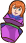
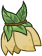
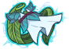
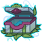
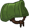
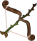
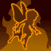
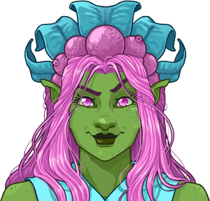

[Back to Main](index.md)

    
        
            
        
        
            Portrait
        
    
    
        
            
        
        
            Model
        
    

# Trixie

Assumedly a CNE original.

# Basic Information

Trixie will be a new champion in the Dragondown event on 3 June 2026.

    
        
            **Seat**:
        
        
            Unknown
        
    
    
        
            **Species**:
        
        
            Fairy (Guess)
        
    
    
        
            **Class**:
        
        
            Unknown
        
    
    
        
            **Roles**:
        
        
            Support / Debuff / Control (Guess)
        
    
    
        
            **Age**:
        
        
            Unknown
        
    
    
        
            **Gender**:
        
        
            Female (Guess)
        
    
    
        
            **Alignment**:
        
        
            Unknown
        
    
    
        
            **Affiliation**:
        
        
            Unknown
        
    

# Formation

    <svg xmlns="http://www.w3.org/2000/svg" id="Trixie" fill="#aaa" data-formationName="Trixie" data-campaignName="Dragondown" width="300" height="120"><circle cx="175" cy="25" r="15"/><circle cx="175" cy="105" r="15"/><circle cx="135" cy="45" r="15"/><circle cx="135" cy="85" r="15"/><circle cx="95" cy="65" r="15"/><circle cx="95" cy="105" r="15"/><circle cx="55" cy="45" r="15"/><circle cx="55" cy="85" r="15"/><circle cx="15" cy="25" r="15"/><circle cx="15" cy="105" r="15"/><text x="205" y="25" fill="#dcdcdc" font-size="25" font-family="Arial" font-weight="bold">Trixie</text><text x="205" y="65" fill="#dcdcdc" font-size="15" font-family="Arial" font-weight="bold">Dragondown</text></svg>

# Attacks

**Base Attack: Pixie Charge** (Melee)
> A pixie subordinate dives in and stabs a random enemy for one hit.  
> Cooldown: 6s (Cap 1.5s)

<em>Raw Data</em>

<pre>
{
    "id": 968,
    "name": "Pixie Charge",
    "description": "One of Trixie's Pixie Subordinates stabs a random enemy for one hit.",
    "long_description": "A pixie subordinate dives in and stabs a random enemy for one hit.",
    "graphic_id": 0,
    "target": "random",
    "num_targets": 1,
    "aoe_radius": 0,
    "damage_modifier": 1,
    "cooldown": 6,
    "animations": [
        {
            "type": "ranged_attack",
            "projectile": "pd_generic_projectile",
            "shoot_frame": 10,
            "override_start_position": true,
            "override_start_pos_x": -100,
            "override_start_pos_y": 300,
            "projectile_delay": 0.1,
            "projectile_count": 1,
            "shoot_sound": 149,
            "hit_sound": 133,
            "projectile_details": {
                "hash": "trixie_pixie",
                "percent_height_offset": -12,
                "percent_height_offset_variance": 30,
                "tween_func": "quad_out",
                "projectile_speed": 1400,
                "projectile_graphic_id": 29061,
                "impact_graphic_id": 10923,
                "impact_offset_y": -50,
                "fly_from_top_left": true
            },
            "hold_shoot_frame": true
        }
    ],
    "tags": [
        "melee"
    ],
    "damage_types": [
        "melee"
    ]
}
</pre>

**Base Attack: Pixie Swarm** (Melee)
> A pixie subordinate dives in and stabs a random enemy for one hit. An additional pixie appears for every 5 Trick stacks she expends when attacking.  
> Cooldown: 6s (Cap 1.5s)

<em>Raw Data</em>

<pre>
{
    "id": 969,
    "name": "Pixie Swarm",
    "description": "Several of Trixie's Pixie Subordinates stab random enemies for one hit each.",
    "long_description": "A pixie subordinate dives in and stabs a random enemy for one hit. An additional pixie appears for every 5 Trick stacks she expends when attacking.",
    "graphic_id": 0,
    "target": "random",
    "num_targets": 1,
    "aoe_radius": 0,
    "damage_modifier": 1,
    "cooldown": 6,
    "animations": [
        {
            "type": "ranged_attack",
            "projectile": "pd_generic_projectile",
            "shoot_frame": 10,
            "override_start_position": true,
            "override_start_pos_x": -100,
            "override_start_pos_y": 300,
            "projectile_delay": 0.1,
            "projectile_count": 1,
            "shoot_sound": 149,
            "hit_sound": 133,
            "projectile_details": {
                "hash": "trixie_pixie",
                "percent_height_offset": -12,
                "percent_height_offset_variance": 30,
                "tween_func": "quad_out",
                "projectile_speed": 1400,
                "projectile_graphic_id": 29061,
                "impact_graphic_id": 10923,
                "impact_offset_y": -50,
                "fly_from_top_left": true
            },
            "hold_shoot_frame": true
        }
    ],
    "tags": [
        "melee"
    ],
    "damage_types": [
        "melee"
    ]
}
</pre>

**Base Attack: Pixie Swarm** (Melee)
> A pixie subordinate dives in and stabs a random enemy for one hit. An additional pixie appears for every 5 Trick stacks she expends when attacking.  
> Cooldown: 6s (Cap 1.5s)

<em>Raw Data</em>

<pre>
{
    "id": 970,
    "name": "Pixie Swarm",
    "description": "Several of Trixie's Pixie Subordinates stab random enemies for one hit each.",
    "long_description": "A pixie subordinate dives in and stabs a random enemy for one hit. An additional pixie appears for every 5 Trick stacks she expends when attacking.",
    "graphic_id": 0,
    "target": "random",
    "num_targets": 2,
    "aoe_radius": 0,
    "damage_modifier": 1,
    "cooldown": 6,
    "animations": [
        {
            "type": "ranged_attack",
            "projectile": "pd_generic_projectile",
            "shoot_frame": 10,
            "override_start_position": true,
            "override_start_pos_x": -100,
            "override_start_pos_y": 300,
            "projectile_delay": 0.1,
            "projectile_count": 2,
            "shoot_sound": 149,
            "hit_sound": 133,
            "projectile_details": {
                "hash": "trixie_pixie",
                "percent_height_offset": -12,
                "percent_height_offset_variance": 30,
                "tween_func": "quad_out",
                "projectile_speed": 1400,
                "projectile_graphic_id": 29061,
                "impact_graphic_id": 10923,
                "impact_offset_y": -50,
                "fly_from_top_left": true
            },
            "hold_shoot_frame": true
        }
    ],
    "tags": [
        "melee"
    ],
    "damage_types": [
        "melee"
    ]
}
</pre>

**Base Attack: Pixie Swarm** (Melee)
> A pixie subordinate dives in and stabs a random enemy for one hit. An additional pixie appears for every 5 Trick stacks she expends when attacking.  
> Cooldown: 6s (Cap 1.5s)

<em>Raw Data</em>

<pre>
{
    "id": 971,
    "name": "Pixie Swarm",
    "description": "Several of Trixie's Pixie Subordinates stab random enemies for one hit each.",
    "long_description": "A pixie subordinate dives in and stabs a random enemy for one hit. An additional pixie appears for every 5 Trick stacks she expends when attacking.",
    "graphic_id": 0,
    "target": "random",
    "num_targets": 3,
    "aoe_radius": 0,
    "damage_modifier": 1,
    "cooldown": 6,
    "animations": [
        {
            "type": "ranged_attack",
            "projectile": "pd_generic_projectile",
            "shoot_frame": 10,
            "override_start_position": true,
            "override_start_pos_x": -100,
            "override_start_pos_y": 300,
            "projectile_delay": 0.1,
            "projectile_count": 3,
            "shoot_sound": 149,
            "hit_sound": 133,
            "projectile_details": {
                "hash": "trixie_pixie",
                "percent_height_offset": -12,
                "percent_height_offset_variance": 30,
                "tween_func": "quad_out",
                "projectile_speed": 1400,
                "projectile_graphic_id": 29061,
                "impact_graphic_id": 10923,
                "impact_offset_y": -50,
                "fly_from_top_left": true
            },
            "hold_shoot_frame": true
        }
    ],
    "tags": [
        "melee"
    ],
    "damage_types": [
        "melee"
    ]
}
</pre>

**Base Attack: Pixie Swarm** (Melee)
> A pixie subordinate dives in and stabs a random enemy for one hit. An additional pixie appears for every 5 Trick stacks she expends when attacking.  
> Cooldown: 6s (Cap 1.5s)

<em>Raw Data</em>

<pre>
{
    "id": 972,
    "name": "Pixie Swarm",
    "description": "Several of Trixie's Pixie Subordinates stab random enemies for one hit each.",
    "long_description": "A pixie subordinate dives in and stabs a random enemy for one hit. An additional pixie appears for every 5 Trick stacks she expends when attacking.",
    "graphic_id": 0,
    "target": "random",
    "num_targets": 4,
    "aoe_radius": 0,
    "damage_modifier": 1,
    "cooldown": 6,
    "animations": [
        {
            "type": "ranged_attack",
            "projectile": "pd_generic_projectile",
            "shoot_frame": 10,
            "override_start_position": true,
            "override_start_pos_x": -100,
            "override_start_pos_y": 300,
            "projectile_delay": 0.1,
            "projectile_count": 4,
            "shoot_sound": 149,
            "hit_sound": 133,
            "projectile_details": {
                "hash": "trixie_pixie",
                "percent_height_offset": -12,
                "percent_height_offset_variance": 30,
                "tween_func": "quad_out",
                "projectile_speed": 1400,
                "projectile_graphic_id": 29061,
                "impact_graphic_id": 10923,
                "impact_offset_y": -50,
                "fly_from_top_left": true
            },
            "hold_shoot_frame": true
        }
    ],
    "tags": [
        "melee"
    ],
    "damage_types": [
        "melee"
    ]
}
</pre>

**Base Attack: Pixie Swarm** (Melee)
> A pixie subordinate dives in and stabs a random enemy for one hit. An additional pixie appears for every 5 Trick stacks she expends when attacking.  
> Cooldown: 6s (Cap 1.5s)

<em>Raw Data</em>

<pre>
{
    "id": 973,
    "name": "Pixie Swarm",
    "description": "Several of Trixie's Pixie Subordinates stab random enemies for one hit each.",
    "long_description": "A pixie subordinate dives in and stabs a random enemy for one hit. An additional pixie appears for every 5 Trick stacks she expends when attacking.",
    "graphic_id": 0,
    "target": "random",
    "num_targets": 5,
    "aoe_radius": 0,
    "damage_modifier": 1,
    "cooldown": 6,
    "animations": [
        {
            "type": "ranged_attack",
            "projectile": "pd_generic_projectile",
            "shoot_frame": 10,
            "override_start_position": true,
            "override_start_pos_x": -100,
            "override_start_pos_y": 300,
            "projectile_delay": 0.1,
            "projectile_count": 5,
            "shoot_sound": 149,
            "hit_sound": 133,
            "projectile_details": {
                "hash": "trixie_pixie",
                "percent_height_offset": -12,
                "percent_height_offset_variance": 30,
                "tween_func": "quad_out",
                "projectile_speed": 1400,
                "projectile_graphic_id": 29061,
                "impact_graphic_id": 10923,
                "impact_offset_y": -50,
                "fly_from_top_left": true
            },
            "hold_shoot_frame": true
        }
    ],
    "tags": [
        "melee"
    ],
    "damage_types": [
        "melee"
    ]
}
</pre>

**Base Attack: Pixie Swarm** (Melee)
> A pixie subordinate dives in and stabs a random enemy for one hit. An additional pixie appears for every 5 Trick stacks she expends when attacking.  
> Cooldown: 6s (Cap 1.5s)

<em>Raw Data</em>

<pre>
{
    "id": 974,
    "name": "Pixie Swarm",
    "description": "Several of Trixie's Pixie Subordinates stab random enemies for one hit each.",
    "long_description": "A pixie subordinate dives in and stabs a random enemy for one hit. An additional pixie appears for every 5 Trick stacks she expends when attacking.",
    "graphic_id": 0,
    "target": "random",
    "num_targets": 6,
    "aoe_radius": 0,
    "damage_modifier": 1,
    "cooldown": 6,
    "animations": [
        {
            "type": "ranged_attack",
            "projectile": "pd_generic_projectile",
            "shoot_frame": 10,
            "override_start_position": true,
            "override_start_pos_x": -100,
            "override_start_pos_y": 300,
            "projectile_delay": 0.1,
            "projectile_count": 6,
            "shoot_sound": 149,
            "hit_sound": 133,
            "projectile_details": {
                "hash": "trixie_pixie",
                "percent_height_offset": -12,
                "percent_height_offset_variance": 30,
                "tween_func": "quad_out",
                "projectile_speed": 1400,
                "projectile_graphic_id": 29061,
                "impact_graphic_id": 10923,
                "impact_offset_y": -50,
                "fly_from_top_left": true
            },
            "hold_shoot_frame": true
        }
    ],
    "tags": [
        "melee"
    ],
    "damage_types": [
        "melee"
    ]
}
</pre>

**Base Attack: Pixie Swarm** (Melee)
> A pixie subordinate dives in and stabs a random enemy for one hit. An additional pixie appears for every 5 Trick stacks she expends when attacking.  
> Cooldown: 6s (Cap 1.5s)

<em>Raw Data</em>

<pre>
{
    "id": 975,
    "name": "Pixie Swarm",
    "description": "Several of Trixie's Pixie Subordinates stab random enemies for one hit each.",
    "long_description": "A pixie subordinate dives in and stabs a random enemy for one hit. An additional pixie appears for every 5 Trick stacks she expends when attacking.",
    "graphic_id": 0,
    "target": "random",
    "num_targets": 7,
    "aoe_radius": 0,
    "damage_modifier": 1,
    "cooldown": 6,
    "animations": [
        {
            "type": "ranged_attack",
            "projectile": "pd_generic_projectile",
            "shoot_frame": 10,
            "override_start_position": true,
            "override_start_pos_x": -100,
            "override_start_pos_y": 300,
            "projectile_delay": 0.1,
            "projectile_count": 7,
            "shoot_sound": 149,
            "hit_sound": 133,
            "projectile_details": {
                "hash": "trixie_pixie",
                "percent_height_offset": -12,
                "percent_height_offset_variance": 30,
                "tween_func": "quad_out",
                "projectile_speed": 1400,
                "projectile_graphic_id": 29061,
                "impact_graphic_id": 10923,
                "impact_offset_y": -50,
                "fly_from_top_left": true
            },
            "hold_shoot_frame": true
        }
    ],
    "tags": [
        "melee"
    ],
    "damage_types": [
        "melee"
    ]
}
</pre>

**Base Attack: Pixie Swarm** (Melee)
> A pixie subordinate dives in and stabs a random enemy for one hit. An additional pixie appears for every 5 Trick stacks she expends when attacking.  
> Cooldown: 6s (Cap 1.5s)

<em>Raw Data</em>

<pre>
{
    "id": 976,
    "name": "Pixie Swarm",
    "description": "Several of Trixie's Pixie Subordinates stab random enemies for one hit each.",
    "long_description": "A pixie subordinate dives in and stabs a random enemy for one hit. An additional pixie appears for every 5 Trick stacks she expends when attacking.",
    "graphic_id": 0,
    "target": "random",
    "num_targets": 8,
    "aoe_radius": 0,
    "damage_modifier": 1,
    "cooldown": 6,
    "animations": [
        {
            "type": "ranged_attack",
            "projectile": "pd_generic_projectile",
            "shoot_frame": 10,
            "override_start_position": true,
            "override_start_pos_x": -100,
            "override_start_pos_y": 300,
            "projectile_delay": 0.1,
            "projectile_count": 8,
            "shoot_sound": 149,
            "hit_sound": 133,
            "projectile_details": {
                "hash": "trixie_pixie",
                "percent_height_offset": -12,
                "percent_height_offset_variance": 30,
                "tween_func": "quad_out",
                "projectile_speed": 1400,
                "projectile_graphic_id": 29061,
                "impact_graphic_id": 10923,
                "impact_offset_y": -50,
                "fly_from_top_left": true
            },
            "hold_shoot_frame": true
        }
    ],
    "tags": [
        "melee"
    ],
    "damage_types": [
        "melee"
    ]
}
</pre>

**Base Attack: Pixie Swarm** (Melee)
> A pixie subordinate dives in and stabs a random enemy for one hit. An additional pixie appears for every 5 Trick stacks she expends when attacking.  
> Cooldown: 6s (Cap 1.5s)

<em>Raw Data</em>

<pre>
{
    "id": 977,
    "name": "Pixie Swarm",
    "description": "Several of Trixie's Pixie Subordinates stab random enemies for one hit each.",
    "long_description": "A pixie subordinate dives in and stabs a random enemy for one hit. An additional pixie appears for every 5 Trick stacks she expends when attacking.",
    "graphic_id": 0,
    "target": "random",
    "num_targets": 9,
    "aoe_radius": 0,
    "damage_modifier": 1,
    "cooldown": 6,
    "animations": [
        {
            "type": "ranged_attack",
            "projectile": "pd_generic_projectile",
            "shoot_frame": 10,
            "override_start_position": true,
            "override_start_pos_x": -100,
            "override_start_pos_y": 300,
            "projectile_delay": 0.1,
            "projectile_count": 9,
            "shoot_sound": 149,
            "hit_sound": 133,
            "projectile_details": {
                "hash": "trixie_pixie",
                "percent_height_offset": -12,
                "percent_height_offset_variance": 30,
                "tween_func": "quad_out",
                "projectile_speed": 1400,
                "projectile_graphic_id": 29061,
                "impact_graphic_id": 10923,
                "impact_offset_y": -50,
                "fly_from_top_left": true
            },
            "hold_shoot_frame": true
        }
    ],
    "tags": [
        "melee"
    ],
    "damage_types": [
        "melee"
    ]
}
</pre>

**Base Attack: Pixie Swarm** (Melee)
> A pixie subordinate dives in and stabs a random enemy for one hit. An additional pixie appears for every 5 Trick stacks she expends when attacking.  
> Cooldown: 6s (Cap 1.5s)

<em>Raw Data</em>

<pre>
{
    "id": 978,
    "name": "Pixie Swarm",
    "description": "Several of Trixie's Pixie Subordinates stab random enemies for one hit each.",
    "long_description": "A pixie subordinate dives in and stabs a random enemy for one hit. An additional pixie appears for every 5 Trick stacks she expends when attacking.",
    "graphic_id": 0,
    "target": "random",
    "num_targets": 10,
    "aoe_radius": 0,
    "damage_modifier": 1,
    "cooldown": 6,
    "animations": [
        {
            "type": "ranged_attack",
            "projectile": "pd_generic_projectile",
            "shoot_frame": 10,
            "override_start_position": true,
            "override_start_pos_x": -100,
            "override_start_pos_y": 300,
            "projectile_delay": 0.1,
            "projectile_count": 10,
            "shoot_sound": 149,
            "hit_sound": 133,
            "projectile_details": {
                "hash": "trixie_pixie",
                "percent_height_offset": -12,
                "percent_height_offset_variance": 30,
                "tween_func": "quad_out",
                "projectile_speed": 1400,
                "projectile_graphic_id": 29061,
                "impact_graphic_id": 10923,
                "impact_offset_y": -50,
                "fly_from_top_left": true
            },
            "hold_shoot_frame": true
        }
    ],
    "tags": [
        "melee"
    ],
    "damage_types": [
        "melee"
    ]
}
</pre>

**Base Attack: Pixie Swarm** (Melee)
> A pixie subordinate dives in and stabs a random enemy for one hit. An additional pixie appears for every 5 Trick stacks she expends when attacking.  
> Cooldown: 6s (Cap 1.5s)

<em>Raw Data</em>

<pre>
{
    "id": 980,
    "name": "Pixie Swarm",
    "description": "Several of Trixie's Pixie Subordinates stab random enemies for one hit each.",
    "long_description": "A pixie subordinate dives in and stabs a random enemy for one hit. An additional pixie appears for every 5 Trick stacks she expends when attacking.",
    "graphic_id": 0,
    "target": "random",
    "num_targets": 11,
    "aoe_radius": 0,
    "damage_modifier": 1,
    "cooldown": 6,
    "animations": [
        {
            "type": "ranged_attack",
            "projectile": "pd_generic_projectile",
            "shoot_frame": 10,
            "override_start_position": true,
            "override_start_pos_x": -100,
            "override_start_pos_y": 300,
            "projectile_delay": 0.1,
            "projectile_count": 11,
            "shoot_sound": 149,
            "hit_sound": 133,
            "projectile_details": {
                "hash": "trixie_pixie",
                "percent_height_offset": -12,
                "percent_height_offset_variance": 30,
                "tween_func": "quad_out",
                "projectile_speed": 1400,
                "projectile_graphic_id": 29061,
                "impact_graphic_id": 10923,
                "impact_offset_y": -50,
                "fly_from_top_left": true
            },
            "hold_shoot_frame": true
        }
    ],
    "tags": [
        "melee"
    ],
    "damage_types": [
        "melee"
    ]
}
</pre>

**Ultimate Attack: Call For Dev** (Guess)
> Trixie flies off to get Dev the Devourer to consume the healthiest non-boss enemy, or otherwise deal an ultimate hit to a boss.  
> Cooldown: 140s (Cap 35s)

<em>Raw Data</em>

<pre>
{
    "id": 979,
    "name": "Call For Dev",
    "description": "Trixie calls for Dev the Devourer to consume the healthiest non-boss enemy.",
    "long_description": "Trixie flies off to get Dev the Devourer to consume the healthiest non-boss enemy, or otherwise deal an ultimate hit to a boss.",
    "graphic_id": 29135,
    "target": "highest_health_deprio_bosses_exclude_blockers",
    "num_targets": 1,
    "aoe_radius": 0,
    "damage_modifier": 0.03,
    "cooldown": 140,
    "animations": [
        {
            "type": "trixie_ultimate",
            "devourers": 1,
            "devourer_speed": 6
        }
    ],
    "tags": [
        "melee",
        "ultimate"
    ],
    "damage_types": [
        "melee"
    ]
}
</pre>

# Abilities

**Dancing Lights** (Guess)
> Trixie increases the damage of adjacent Champions by 100%.

<em>Raw Data</em>

<pre>
{
    "id": 2726,
    "flavour_text": "",
    "description": {
        "desc": "Trixie increases the damage of adjacent Champions by $amount%."
    },
    "effect_keys": [
        {
            "effect_string": "hero_dps_multiplier_mult,100",
            "targets": [
                "adj"
            ]
        }
    ],
    "requirements": "",
    "graphic_id": 29127,
    "large_graphic_id": 29119,
    "properties": {
        "is_formation_ability": true,
        "owner_use_outgoing_description": true,
        "formation_circle_icon": false
    }
}
</pre>

**Debilitating Dust** (Guess)
> Trixie increases the effect of Dancing Lights by 100% for each Small Champion in the formation, stacking multiplicatively. Small Champions are fairy, gnome, goblin, halfling, kender, kobold, and plasmoid Champions.

ⓘ *Note: This ability is prestack.*

<em>Raw Data</em>

<pre>
{
    "id": 2727,
    "flavour_text": "",
    "description": {
        "desc": "Trixie increases the effect of Dancing Lights by $amount% for each Small Champion in the formation, stacking multiplicatively. Small Champions are fairy, gnome, goblin, halfling, kender, kobold, and plasmoid Champions."
    },
    "effect_keys": [
        {
            "effect_string": "pre_stack,100",
            "skip_effect_key_desc": true
        },
        {
            "effect_string": "buff_upgrade,0,19686",
            "stack_func": "per_hero_attribute",
            "amount_func": "mult",
            "amount_expr": "upgrade_amount(19687,0)",
            "amount_updated_listeners": [
                "slot_changed",
                "upgrade_unlocked",
                "feat_changed"
            ],
            "per_hero_expr": "HasTag(`small`)",
            "off_when_benched": true,
            "show_bonus": true
        }
    ],
    "requirements": "",
    "graphic_id": 29130,
    "large_graphic_id": 29122,
    "properties": {
        "is_formation_ability": true,
        "owner_use_outgoing_description": true,
        "indexed_effect_properties": true,
        "per_effect_index_bonuses": true,
        "default_bonus_index": 0
    }
}
</pre>

**Shrinking Dust** (Guess)
> Every time a Champion other than Trixie attacks, Trixie gains a Trick stack. When Trixie attacks, she expends all her Trick stacks to slow up to that number of random enemies by 50% for 10 seconds. If she has more Trick stacks than there are enemies, then she can use the extra stacks to stun that number of random enemies for 3 seconds. Additionally, one extra Pixie Subordinate attacks for every 5 Trick stacks expended. Trixie can not have more than 50 Trick stacks at once.

<em>Raw Data</em>

<pre>
{
    "id": 2728,
    "flavour_text": "",
    "description": {
        "desc": "Every time a Champion other than Trixie attacks, Trixie gains a Trick stack. When Trixie attacks, she expends all her Trick stacks to slow up to that number of random enemies by $(slow_amount)% for $(slow_duration) seconds. If she has more Trick stacks than there are enemies, then she can use the extra stacks to stun that number of random enemies for $(stun_duration) seconds. Additionally, one extra Pixie Subordinate attacks for every 5 Trick stacks expended. Trixie can not have more than $(max_stacks) Trick stacks at once."
    },
    "effect_keys": [
        {
            "effect_string": "trixie_tricksy_pixie",
            "off_when_benched": true,
            "slow_duration": 10,
            "stun_duration": 3,
            "slow_amount": 50,
            "max_stacks": 50,
            "stacks_on_trigger": "other_champion_attack",
            "show_stacks": true,
            "stack_title": "Trick Stacks",
            "slow_effect": {
                "effect_string": "monster_speed_reduce,0",
                "active_graphic_id": 29059,
                "active_graphic_y": 20,
                "use_collection_source": false,
                "for_time": 10
            },
            "debuff_effects": {
                "effect_string": "increase_monster_damage,0",
                "amount_expr": "upgrade_amount(19689,0)",
                "stacks_on_reapply": true,
                "manual_stacking": true,
                "stacks_multiply": true,
                "use_collection_source": true,
                "stack_across_effects": true,
                "for_time": 5
            },
            "attack_ids": [
                969,
                970,
                971,
                972,
                973,
                974,
                975,
                976,
                977,
                978,
                980
            ]
        }
    ],
    "requirements": "",
    "graphic_id": 29131,
    "large_graphic_id": 29123,
    "properties": {
        "is_formation_ability": true,
        "owner_use_outgoing_description": true,
        "formation_circle_icon": false,
        "per_effect_index_bonuses": true
    }
}
</pre>

**Small Pranks** (Guess)
> If Trixie still has Trick stacks left after stunning all enemies on the screen, she uses the extra stacks to increase the damage a random enemy takes by 100% for 5 seconds. These debuffs can apply to the same enemy multiple times and stack multiplicatively.

<em>Raw Data</em>

<pre>
{
    "id": 2729,
    "flavour_text": "",
    "description": {
        "desc": "If Trixie still has Trick stacks left after stunning all enemies on the screen, she uses the extra stacks to increase the damage a random enemy takes by $amount% for $(debilitate_time) seconds. These debuffs can apply to the same enemy multiple times and stack multiplicatively."
    },
    "effect_keys": [
        {
            "effect_string": "trixie_debilitating_dust,100",
            "off_when_benched": true,
            "debilitate_time": 5
        }
    ],
    "requirements": "",
    "graphic_id": 29128,
    "large_graphic_id": 29120,
    "properties": {
        "is_formation_ability": true,
        "owner_use_outgoing_description": true,
        "formation_circle_icon": false
    }
}
</pre>

**Tricksy Pixie** (Guess)
> Every time a Champion other than Trixie uses their ultimate ability, Trixie gains a Scheming stack, up to a maximum of 20 stacks. When Trixie uses her ultimate ability, she expends her Scheming stacks to increase the effect of Dancing Lights by 100% per stack, stacking multiplicatively. This buff lasts until the area is changed or until Trixie uses her ultimate again, whichever comes first.

ⓘ *Note: This ability is prestack.*

<em>Raw Data</em>

<pre>
{
    "id": 2730,
    "flavour_text": "",
    "description": {
        "desc": "Every time a Champion other than Trixie uses their ultimate ability, Trixie gains a Scheming stack, up to a maximum of $(max_stacks___2) stacks. When Trixie uses her ultimate ability, she expends her Scheming stacks to increase the effect of Dancing Lights by $amount% per stack, stacking multiplicatively. This buff lasts until the area is changed or until Trixie uses her ultimate again, whichever comes first."
    },
    "effect_keys": [
        {
            "effect_string": "pre_stack,100"
        },
        {
            "effect_string": "buff_upgrade,0,19686",
            "amount_expr": "upgrade_amount(19690,0)",
            "max_stacks": 20,
            "stacks_on_trigger": "will_stack_manually",
            "off_when_benched": true,
            "show_bonus": true,
            "apply_manually": true,
            "stack_title": "Current Stacks",
            "stacks_multiply": true
        },
        {
            "effect_string": "trixie_ultimate_undoing",
            "max_stacks": 20,
            "stacks_on_trigger": "will_stack_manually",
            "off_when_benched": true,
            "show_stacks": true,
            "stack_title": "Scheming Stacks",
            "buff_indicies": [
                1
            ]
        }
    ],
    "requirements": "",
    "graphic_id": 29132,
    "large_graphic_id": 29124,
    "properties": {
        "is_formation_ability": true,
        "owner_use_outgoing_description": true,
        "indexed_effect_properties": true,
        "per_effect_index_bonuses": true,
        "default_bonus_index": 0,
        "retain_on_slot_changed": true
    }
}
</pre>

**Ultimate Undoing** (Guess)
> Champions in the formation slots directly behind Trixie are sprinkled with Shrinking Dust, which reduces them in size by 50% and makes them count as Small for abilities and variant restrictions that care about size. Additionally, all Champions that share a species with any Champion affected by Shrinking Dust are also sprinkled with Shrinking Dust.

<em>Raw Data</em>

<pre>
{
    "id": 2731,
    "flavour_text": "",
    "description": {
        "desc": "Champions in the formation slots directly behind Trixie are sprinkled with Shrinking Dust, which reduces them in size by 50% and makes them count as Small for abilities and variant restrictions that care about size. Additionally, all Champions that share a species with any Champion affected by Shrinking Dust are also sprinkled with Shrinking Dust."
    },
    "effect_keys": [
        {
            "effect_string": "trixie_shrinking_dust",
            "off_when_benched": true,
            "overlay_graphic_id": 29058,
            "underlay_graphic_id": 29059,
            "targets": [
                "adj_behind_propagate_species"
            ],
            "retarget_when_any_hero_slot_changed": true,
            "retarget_when_any_hero_tags_changed": true
        },
        {
            "off_when_benched": true,
            "effect_string": "reduce_hero_scale,50",
            "targets": [
                "adj_behind_propagate_species"
            ],
            "skip_effect_key_desc": true,
            "retarget_when_any_hero_slot_changed": true,
            "retarget_when_any_hero_tags_changed": true,
            "retarget_when_any_feat_changed": true
        },
        {
            "off_when_benched": true,
            "effect_string": "add_hero_tags,0,small",
            "targets": [
                "adj_behind_propagate_species"
            ],
            "skip_effect_key_desc": true,
            "retarget_when_any_hero_slot_changed": true,
            "retarget_when_any_hero_tags_changed": true,
            "retarget_when_any_feat_changed": true
        },
        {
            "effect_string": "do_nothing",
            "off_when_benched": true,
            "stack_func": "per_hero_attribute",
            "per_hero_expr": "HasEffect(`trixie_shrinking_dust`)",
            "show_stacks": true,
            "stack_title": "Affected Champions",
            "retarget_when_any_hero_slot_changed": true,
            "retarget_when_any_hero_tags_changed": true
        }
    ],
    "requirements": "",
    "graphic_id": 29129,
    "large_graphic_id": 29121,
    "properties": {
        "is_formation_ability": true,
        "formation_circle_icon": false
    }
}
</pre>

# Specialisations

**Faster Friends** (Guess)
> The damage of all Champions is increased by 100%. When a Familiar clicks on an enemy, it also reduces the Base Attack Cooldown of a random Champion other than Trixie by 100 seconds.

<em>Raw Data</em>

<pre>
{
    "id": 2732,
    "flavour_text": "",
    "description": {
        "desc": "The damage of all Champions is increased by $amount%. When a Familiar clicks on an enemy, it also reduces the Base Attack Cooldown of a random Champion other than Trixie by $cooldown_reduction seconds."
    },
    "effect_keys": [
        {
            "off_when_benched": true,
            "effect_string": "hero_dps_multiplier_mult,100",
            "targets": [
                "all"
            ]
        },
        {
            "off_when_benched": true,
            "effect_string": "trixie_faster_friends",
            "cooldown_reduction": 0.2
        }
    ],
    "requirements": "",
    "graphic_id": 29133,
    "large_graphic_id": 29133,
    "properties": {
        "is_formation_ability": true,
        "owner_use_outgoing_description": true,
        "formation_circle_icon": false
    }
}
</pre>

**Ultimate Friends** (Guess)
> The ultimate damage of all Champions is increased by 400%. When a Familiar clicks on a boss enemy, it also reduces the current Ultimate Attack Cooldown of a random Champion other than Trixie whose ultimate is on cooldown by 400 seconds.

<em>Raw Data</em>

<pre>
{
    "id": 2733,
    "flavour_text": "",
    "description": {
        "desc": "The ultimate damage of all Champions is increased by $amount%. When a Familiar clicks on a boss enemy, it also reduces the current Ultimate Attack Cooldown of a random Champion other than Trixie whose ultimate is on cooldown by $ult_reduction seconds."
    },
    "effect_keys": [
        {
            "off_when_benched": true,
            "effect_string": "buff_ultimate,400",
            "targets": [
                "all"
            ]
        },
        {
            "off_when_benched": true,
            "effect_string": "trixie_ultimate_friends",
            "ult_reduction": 0.2
        }
    ],
    "requirements": "",
    "graphic_id": 29134,
    "large_graphic_id": 29134,
    "properties": {
        "is_formation_ability": true,
        "owner_use_outgoing_description": true,
        "formation_circle_icon": false
    }
}
</pre>

# Items

    
        
            **Icons**
        
        
            **Name**
        
    
    
        
            
        
        
            Carnival
        
    
    
        
            
        
        
            Outfit
        
    
    
        
            
        
        
            Pixie Dust
        
    
    
        
            
        
        
            Saddle
        
    
    
        
            
        
        
            Weapon
        
    
    
        
            
        
        
            Wig
        
    

# Feats

Unknown.

# Legendaries

Unknown.

# Adventures and Variants

**Unlock Adventure: Let Sleeping Dragons Lie (Trixie)** (Complete Area 50)
> Attempt to calm down a very angry bronze dragon.

 **Variant 1: If You Can't Beat Them, Join Them** (Complete Area 75)
> Trixie the Pixie starts in the formation. She can be moved, but not removed.  
> Only Trixie and Champions next to her can deal damage.  
> 1-2 beasts attack with each wave. They don't drop gold nor count towards quest progress.  
> <b>Getting to Know Trixie the Pixie:</b> Trixie increases the damage of Champions next to her. Place your main damage dealer next to her to get the most of her buff!

 **Variant 2: Size Matters Not** (Complete Area 125)
> Trixie the Pixie starts in the formation. She can be moved, but not removed.  
> After area 50, you may only use Small Champions and all Champions that aren't Small are removed from the formation. Small Champions are fairy, gnome, goblin, halfling, kender, kobold, and plasmoid Champions.  
> Non-boss enemies deal 100% additional damage and are increased in size by 50%.  
> <b>Getting to Know Trixie the Pixie:</b> Trixie can reduce the size of two Champions in the slots directly behind her so they count as small. All Champions that share a species with one of those Champions are also reduced in size!

 **Variant 3: Little Force of Nature** (Complete Area 175)
> Trixie the Pixie starts in the formation. She can be moved, but not removed.  
> After area 50, enemies that aren't slowed, stunned, or rooted only take 1 damage from normal attacks.  
> Click damage only deals damage (including fire breath effects) for the first 25 areas.  
> Fire breath potions can't be used during the adventure.  
> <b>Getting to Know Trixie the Pixie:</b> Some variants turn off click damage, so familiars don't deal damage. You can still use familiars with Trixie's specialization choices to increase the attack rate of your other Champions!

# Other Champion Images

    
        
            Console Portrait
        
    
    
        
            Gold Chest Icon
        
        
            Silver Chest Icon
        
    

[Back to Top](#top)

*Last Modified: {{ site.time }}*