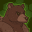
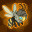

[Back to Main](index.md)

    
        Portrait
    
    
        Base Model
    
    
        Bear Form Model
    

# Umberto Thornheart

Umberto Thornheart is the orphaned child of two infamous thieves, and saw his parents executed for their crimes. Rather than live on the streets, he was taken in by the very detective who arrested his parents, and eventually became a detective himself, hoping to protect the innocent and (perhaps) reform the guilty.

# Basic Information

Umberto Thornheart will be a new champion in the Founders' Day event on 3 July 2024.

    
        
            **Seat**:
        
        
            7
        
        
            **Stat**
        
        
            **Value**
        
        
            **Day 1 Trials**
        
        
            **Patrons**
        
    
    
        
            **Race**:
        
        
            Human
        
        
            **Strength**:
        
        
            15
        
        
            Yes
        
        
            Mirt
        
    
    
        
            **Class**:
        
        
            Druid
        
        
            **Dexterity**:
        
        
            9
        
        
            -
        
        
            Vajra
        
    
    
        
            **Roles**:
        
        
            Tanking / Support / Debuff
        
        
            **Constitution**:
        
        
            16
        
        
            Yes
        
        
            Strahd (with Feat)
        
    
    
        
            **Age**:
        
        
            42
        
        
            **Intelligence**:
        
        
            11
        
        
            Yes
        
        
            Zariel
        
    
    
        
            **Gender**:
        
        
            Male
        
        
            **Wisdom**:
        
        
            17
        
        
            Yes
        
        
            Elminster
        
    
    
        
            **Alignment**:
        
        
            Lawful Good
        
        
            **Charisma**:
        
        
            14
        
        
            Yes
        
        
            &nbsp;
        
    
    
        
            **Affiliation**:
        
        
            -
        
        
            **Total**:
        
        
            82
        
        
            Champion ID:
        
        
            151
        
    

# Formation

    <svg xmlns="http://www.w3.org/2000/svg" id="Umberto" fill="#aaa" data-formationName="Umberto" data-campaignName="Founders' Day" width="312" height="160"><circle cx="175" cy="65" r="15"/><circle cx="175" cy="145" r="15"/><circle cx="135" cy="85" r="15"/><circle cx="135" cy="125" r="15"/><circle cx="95" cy="65" r="15"/><circle cx="55" cy="45" r="15"/><circle cx="55" cy="85" r="15"/><circle cx="15" cy="25" r="15"/><circle cx="15" cy="65" r="15"/><circle cx="15" cy="105" r="15"/><text x="205" y="25" fill="#dcdcdc" font-size="25" font-family="Arial" font-weight="bold">Umberto</text><text x="205" y="65" fill="#dcdcdc" font-size="15" font-family="Arial" font-weight="bold">Founders' Day</text></svg>

# Abilities

 **Base Attack: Swarmstaff** (Ranged)
> Umberto unleashes a bee swarm at the nearest foe, dealing 1 hit.  
> Cooldown: 5.5s (Cap 1.375s)

<em>Raw Data</em>

<pre>
{
    "id": 763,
    "name": "Swarmstaff",
    "description": "Umberto unleashes a bee swarm at the nearest foe, dealing 1 hit.",
    "long_description": "",
    "graphic_id": 0,
    "target": "front",
    "num_targets": 1,
    "aoe_radius": 0,
    "damage_modifier": 1,
    "cooldown": 5.5,
    "animations": [
        {
            "type": "ranged_attack",
            "projectile": "umberto_bee_swarm",
            "shoot_frame": 8,
            "shoot_offset_x": 100,
            "shoot_offset_y": -30
        }
    ],
    "tags": [
        "ranged"
    ],
    "damage_types": [
        "ranged"
    ]
}
</pre>

 **Base Attack: Swarmstaff** (Ranged)
> Umberto unleashes a bee swarm at the nearest foe, dealing 1 hit and adding a swarming bee stack.  
> Cooldown: 5.5s (Cap 1.375s)

<em>Raw Data</em>

<pre>
{
    "id": 767,
    "name": "Swarmstaff",
    "description": "Umberto unleashes a bee swarm at the nearest foe, dealing 1 hit and adding a swarming bee stack.",
    "long_description": "",
    "graphic_id": 0,
    "target": "front",
    "num_targets": 1,
    "aoe_radius": 0,
    "damage_modifier": 1,
    "cooldown": 5.5,
    "animations": [
        {
            "type": "ranged_attack",
            "projectile": "umberto_bee_swarm",
            "shoot_frame": 8,
            "shoot_offset_x": 100,
            "shoot_offset_y": -30
        }
    ],
    "tags": [
        "ranged"
    ],
    "damage_types": [
        "ranged"
    ]
}
</pre>

 **Ultimate Attack: Brown Bear Bash** (Level: 160)
> Umberto transforms into a bear for 15 seconds, encouraging allies to immediately attack and attack more often.  
> Cooldown: 220s (Cap 55s)

<em>Raw Data</em>

<pre>
{
    "id": 764,
    "name": "Brown Bear Bash",
    "description": "Umberto transforms into a bear for 15 seconds, encouraging allies to attack more often.",
    "long_description": "Umberto transforms into a bear for 15 seconds, encouraging allies to immediately attack and attack more often.",
    "graphic_id": 23773,
    "target": "none",
    "num_targets": 0,
    "aoe_radius": 0,
    "damage_modifier": 0,
    "cooldown": 220,
    "animations": [
        {
            "type": "ultimate_attack",
            "ultimate": "umberto"
        }
    ],
    "tags": [
        "ultimate"
    ],
    "damage_types": []
}
</pre>

 **Beehive Barrage** (Level: 30)
> Every second, Umberto's staff spawns 1 swarming bees, which buzz around the staff, up to a maximum of 10 swarming bees. When an enemy attacks Umberto, he unleashes a swarming bee from the staff onto that enemy. When an enemy with one or more swarming bees is hit by any Champion, all their bees sting them, dealing 1s of BUD-based damage for each bee. A maximum of 5 swarming bees can swarm a single enemy. Bees persist until the enemy is defeated, or until Umberto is removed from the formation.

<em>Raw Data</em>

<pre>
{
    "id": 15049,
    "hero_id": 151,
    "required_level": 30,
    "required_upgrade_id": 0,
    "upgrade_type": "unlock_ability",
    "effect": "effect_def,1992",
    "static_dps_mult": null,
    "default_enabled": 1,
    "name": "Beehive Barrage"
}
{
    "id": 1992,
    "flavour_text": "",
    "description": {
        "conditions": [
            {
                "condition": "compare amount___3 == 1",
                "desc": "Every second, Umberto's staff spawns a swarming bee, which buzzes around the staff, up to a maximum of $max_bees___3 swarming bees. When an enemy attacks Umberto, he unleashes a swarming bee from the staff onto that enemy. When an enemy with one or more swarming bees is hit by any Champion, all their bees sting them, dealing $(seconds_plural amount) of BUD-based damage for each bee. A maximum of $amount___2 swarming bees can swarm a single enemy. Bees persist until the enemy is defeated, or until Umberto is removed from the formation."
            },
            {
                "desc": "Every second, Umberto's staff spawns $amount___3 swarming bees, which buzz around the staff, up to a maximum of $max_bees___3 swarming bees. When an enemy attacks Umberto, he unleashes a swarming bee from the staff onto that enemy. When an enemy with one or more swarming bees is hit by any Champion, all their bees sting them, dealing $(seconds_plural amount) of BUD-based damage for each bee. A maximum of $amount___2 swarming bees can swarm a single enemy. Bees persist until the enemy is defeated, or until Umberto is removed from the formation."
            }
        ]
    },
    "effect_keys": [
        {
            "off_when_benched": true,
            "effect_string": "umberto_bud_seconds_per_bee,1"
        },
        {
            "off_when_benched": true,
            "effect_string": "umberto_max_bees_per_enemy,5"
        },
        {
            "off_when_benched": true,
            "effect_string": "umberto_beehive_barrage,1",
            "max_bees": 10,
            "bee_graphic": 22718,
            "bee_offset_x": 64,
            "bee_offset_y": -98,
            "bee_offset_bear_x": 84,
            "bee_offset_bear_y": -102
        },
        {
            "off_when_benched": true,
            "effect_string": "change_base_attack,767"
        }
    ],
    "requirements": "",
    "graphic_id": 23763,
    "large_graphic_id": 23759,
    "properties": {
        "is_formation_ability": true,
        "owner_use_outgoing_description": true,
        "retain_on_slot_changed": true,
        "indexed_effect_properties": true,
        "per_effect_index_bonuses": true,
        "default_bonus_index": 2
    }
}
</pre>

 **Detective's Entourage** (Level: 80)
> Umberto increases the damage of all Champions in the two columns behind him by 400%.

<em>Upgrade Data</em>

<pre>
Upgrades:
      140: 100%
      220: 100%
      350: 100%
      520: 100%
      680: 100%
      840: 100%
    1,000: 100%
    1,160: 100%
    1,320: 100%
    1,480: 100%
    1,640: 100%
    1,790: 100%
    1,950: 100%
    2,110: 100%
    2,270: 100%
    2,430: 100%
    2,580: 100%
    2,740: 100%
    2,900: 100%

    Total Upgrade Bonus: 5.24e07%
</pre>

<em>Raw Data</em>

<pre>
{
    "id": 15048,
    "hero_id": 151,
    "required_level": 80,
    "required_upgrade_id": 0,
    "upgrade_type": "unlock_ability",
    "effect": "effect_def,1991",
    "static_dps_mult": null,
    "default_enabled": 1,
    "name": "Detective's Entourage",
    "tip_text": "Umberto increases the damage of Champions in the two columns behind him."
}
{
    "id": 1991,
    "flavour_text": "",
    "description": {
        "desc": "Umberto increases the damage of all Champions in the two columns behind him by $amount%"
    },
    "effect_keys": [
        {
            "off_when_benched": true,
            "effect_string": "hero_dps_multiplier_mult,400",
            "targets": [
                "prev_two_col"
            ]
        }
    ],
    "requirements": "",
    "graphic_id": 23764,
    "large_graphic_id": 23760,
    "properties": {
        "is_formation_ability": true,
        "owner_use_outgoing_description": true
    }
}
{
    "id": 15059,
    "hero_id": 151,
    "required_level": 140,
    "required_upgrade_id": 0,
    "upgrade_type": "upgrade_ability",
    "effect": "buff_upgrade,100,15048",
    "static_dps_mult": null,
    "default_enabled": 1,
    "name": ""
}
{
    "id": 15237,
    "hero_id": 151,
    "required_level": 220,
    "required_upgrade_id": 0,
    "upgrade_type": "upgrade_ability",
    "effect": "buff_upgrade,100,15048",
    "static_dps_mult": null,
    "default_enabled": 1,
    "name": ""
}
{
    "id": 15238,
    "hero_id": 151,
    "required_level": 350,
    "required_upgrade_id": 0,
    "upgrade_type": "upgrade_ability",
    "effect": "buff_upgrade,100,15048",
    "static_dps_mult": null,
    "default_enabled": 1,
    "name": ""
}
{
    "id": 15239,
    "hero_id": 151,
    "required_level": 520,
    "required_upgrade_id": 0,
    "upgrade_type": "upgrade_ability",
    "effect": "buff_upgrade,100,15048",
    "static_dps_mult": null,
    "default_enabled": 1,
    "name": ""
}
{
    "id": 15240,
    "hero_id": 151,
    "required_level": 680,
    "required_upgrade_id": 0,
    "upgrade_type": "upgrade_ability",
    "effect": "buff_upgrade,100,15048",
    "static_dps_mult": null,
    "default_enabled": 1,
    "name": ""
}
{
    "id": 15241,
    "hero_id": 151,
    "required_level": 840,
    "required_upgrade_id": 0,
    "upgrade_type": "upgrade_ability",
    "effect": "buff_upgrade,100,15048",
    "static_dps_mult": null,
    "default_enabled": 1,
    "name": ""
}
{
    "id": 15242,
    "hero_id": 151,
    "required_level": 1000,
    "required_upgrade_id": 0,
    "upgrade_type": "upgrade_ability",
    "effect": "buff_upgrade,100,15048",
    "static_dps_mult": null,
    "default_enabled": 1,
    "name": ""
}
{
    "id": 15243,
    "hero_id": 151,
    "required_level": 1160,
    "required_upgrade_id": 0,
    "upgrade_type": "upgrade_ability",
    "effect": "buff_upgrade,100,15048",
    "static_dps_mult": null,
    "default_enabled": 1,
    "name": ""
}
{
    "id": 15244,
    "hero_id": 151,
    "required_level": 1320,
    "required_upgrade_id": 0,
    "upgrade_type": "upgrade_ability",
    "effect": "buff_upgrade,100,15048",
    "static_dps_mult": null,
    "default_enabled": 1,
    "name": ""
}
{
    "id": 15245,
    "hero_id": 151,
    "required_level": 1480,
    "required_upgrade_id": 0,
    "upgrade_type": "upgrade_ability",
    "effect": "buff_upgrade,100,15048",
    "static_dps_mult": null,
    "default_enabled": 1,
    "name": ""
}
{
    "id": 15246,
    "hero_id": 151,
    "required_level": 1640,
    "required_upgrade_id": 0,
    "upgrade_type": "upgrade_ability",
    "effect": "buff_upgrade,100,15048",
    "static_dps_mult": null,
    "default_enabled": 1,
    "name": ""
}
{
    "id": 15247,
    "hero_id": 151,
    "required_level": 1790,
    "required_upgrade_id": 0,
    "upgrade_type": "upgrade_ability",
    "effect": "buff_upgrade,100,15048",
    "static_dps_mult": null,
    "default_enabled": 1,
    "name": ""
}
{
    "id": 15248,
    "hero_id": 151,
    "required_level": 1950,
    "required_upgrade_id": 0,
    "upgrade_type": "upgrade_ability",
    "effect": "buff_upgrade,100,15048",
    "static_dps_mult": null,
    "default_enabled": 1,
    "name": ""
}
{
    "id": 15249,
    "hero_id": 151,
    "required_level": 2110,
    "required_upgrade_id": 0,
    "upgrade_type": "upgrade_ability",
    "effect": "buff_upgrade,100,15048",
    "static_dps_mult": null,
    "default_enabled": 1,
    "name": ""
}
{
    "id": 15250,
    "hero_id": 151,
    "required_level": 2270,
    "required_upgrade_id": 0,
    "upgrade_type": "upgrade_ability",
    "effect": "buff_upgrade,100,15048",
    "static_dps_mult": null,
    "default_enabled": 1,
    "name": ""
}
{
    "id": 15251,
    "hero_id": 151,
    "required_level": 2430,
    "required_upgrade_id": 0,
    "upgrade_type": "upgrade_ability",
    "effect": "buff_upgrade,100,15048",
    "static_dps_mult": null,
    "default_enabled": 1,
    "name": ""
}
{
    "id": 15252,
    "hero_id": 151,
    "required_level": 2580,
    "required_upgrade_id": 0,
    "upgrade_type": "upgrade_ability",
    "effect": "buff_upgrade,100,15048",
    "static_dps_mult": null,
    "default_enabled": 1,
    "name": ""
}
{
    "id": 15253,
    "hero_id": 151,
    "required_level": 2740,
    "required_upgrade_id": 0,
    "upgrade_type": "upgrade_ability",
    "effect": "buff_upgrade,100,15048",
    "static_dps_mult": null,
    "default_enabled": 1,
    "name": ""
}
{
    "id": 15254,
    "hero_id": 151,
    "required_level": 2900,
    "required_upgrade_id": 0,
    "upgrade_type": "upgrade_ability",
    "effect": "buff_upgrade,100,15048",
    "static_dps_mult": null,
    "default_enabled": 1,
    "name": ""
}
</pre>

 **Protective Presence** (Level: 120)
> Umberto increases the health of all other Champions by 25% of his max health, and healing effects on all Champions is increased by 25%.

<em>Raw Data</em>

<pre>
{
    "id": 15051,
    "hero_id": 151,
    "required_level": 120,
    "required_upgrade_id": 0,
    "upgrade_type": "unlock_ability",
    "effect": "effect_def,1994",
    "static_dps_mult": null,
    "default_enabled": 1,
    "name": "Protective Presence"
}
{
    "id": 1994,
    "flavour_text": "",
    "description": {
        "desc": "Umberto increases the health of all other Champions by $amount% of his max health, and healing effects on all Champions is increased by $amount%."
    },
    "effect_keys": [
        {
            "off_when_benched": true,
            "effect_string": "buff_me,25"
        },
        {
            "off_when_benched": true,
            "effect_string": "increase_health_by_source_percent,0",
            "amount_expr": "upgrade_amount(15051,0)",
            "targets": [
                "other"
            ],
            "override_key_desc": "Increases the health of $target by $amount% of Umberto's max health and the effect of healing on $target by $amount%"
        },
        {
            "off_when_benched": true,
            "effect_string": "healing_mult,0",
            "amount_expr": "upgrade_amount(15051,0)",
            "targets": [
                "all"
            ],
            "skip_effect_key_desc": true
        }
    ],
    "requirements": "",
    "graphic_id": 23766,
    "large_graphic_id": 23762,
    "properties": {
        "is_formation_ability": true,
        "owner_use_outgoing_description": true,
        "indexed_effect_properties": true,
        "per_effect_index_bonuses": true,
        "default_bonus_index": 0
    }
}
</pre>

 **Ongoing Investigation** (Level: 250)
> Pick an Investigation to pursue. Umberto gains stacks of Clue, and can start another Investigation after the Investigation concludes. Each Clue stack increases Detective's Entourage by 50%, stacking multiplicatively. Caps at 100 stacks. Once you are capped, additional Investigations are not offered. Clue stacks persist between areas and reset when the adventure ends.

<em>Raw Data</em>

<pre>
{
    "id": 15050,
    "hero_id": 151,
    "required_level": 250,
    "required_upgrade_id": 0,
    "upgrade_type": "unlock_ability",
    "effect": "effect_def,1993",
    "static_dps_mult": null,
    "default_enabled": 1,
    "name": "Ongoing Investigation",
    "tip_text": "Umberto embarks on an ongoing investigation, periodically increasing his buffs to his allies."
}
{
    "id": 1993,
    "flavour_text": "",
    "description": {
        "desc": "Pick an Investigation to pursue. Umberto gains stacks of Clue, and can start another Investigation after the Investigation concludes. Each Clue stack increases Detective's Entourage by $(not_buffed amount)%, stacking multiplicatively. Caps at $max_stacks stacks. Once you are capped, additional Investigations are not offered. Clue stacks persist between areas and reset when the adventure ends.",
        "post": {
            "conditions": [
                {
                    "condition": "not static_desc",
                    "desc": "^^$umberto_current_investigation"
                }
            ]
        }
    },
    "effect_keys": [
        {
            "effect_string": "buff_upgrade,50,15048",
            "manual_stacking": true,
            "stacks_multiply": true,
            "max_stacks": 100,
            "stack_title": "Clue Stacks",
            "show_bonus": true
        },
        {
            "effect_string": "umberto_ongoing_investigation",
            "investigations": [
                {
                    "name_key": "umberto_investigation_1_name",
                    "desc_key": "umberto_investigation_1_desc",
                    "completion_time": 7200,
                    "stacks_gained_immediately": 10,
                    "stacks_lost_at_end": 9
                },
                {
                    "name_key": "umberto_investigation_2_name",
                    "desc_key": "umberto_investigation_2_desc",
                    "completion_time": 28800,
                    "stacks_gained_periodically": 1,
                    "stack_gain_time_interval": 7200,
                    "stacks_gained_at_end": 3
                },
                {
                    "name_key": "umberto_investigation_3_name",
                    "desc_key": "umberto_investigation_3_desc",
                    "completion_time": 86400,
                    "stacks_gained_periodically": 1,
                    "stack_gain_time_interval": 10800,
                    "stacks_gained_at_end": 17
                }
            ],
            "variant_investigations": [
                {
                    "name_key": "umberto_investigation_1_name",
                    "desc_key": "umberto_investigation_1_desc_variant",
                    "completion_time": 1800,
                    "stacks_gained_immediately": 10,
                    "stacks_lost_at_end": 9
                },
                {
                    "name_key": "umberto_investigation_2_name",
                    "desc_key": "umberto_investigation_2_desc_variant",
                    "completion_time": 7200,
                    "stacks_gained_periodically": 1,
                    "stack_gain_time_interval": 1800,
                    "stacks_gained_at_end": 3
                },
                {
                    "name_key": "umberto_investigation_3_name",
                    "desc_key": "umberto_investigation_3_desc_variant",
                    "completion_time": 21600,
                    "stacks_gained_periodically": 1,
                    "stack_gain_time_interval": 2700,
                    "stacks_gained_at_end": 17
                }
            ],
            "variant_adventure_id": 1512
        }
    ],
    "requirements": "",
    "graphic_id": 23765,
    "large_graphic_id": 23761,
    "properties": {
        "is_formation_ability": true,
        "owner_use_outgoing_description": true,
        "indexed_effect_properties": true,
        "per_effect_index_bonuses": true,
        "default_bonus_index": 0,
        "retain_on_slot_changed": true,
        "desc_button": {
            "text_key": "umberto_view_investigations",
            "click_action": "umberto_view_investigations"
        }
    }
}
</pre>

# Specialisations

 **Call of the Wardens** (Level: 200)
> Umberto increases the effect of Detective's Entourage by 300% for each Ranger or Druid Champion in the formation, stacking multiplicatively.

ⓘ *Note: This ability is prestack.*

<em>Raw Data</em>

<pre>
{
    "id": 15054,
    "hero_id": 151,
    "required_level": 200,
    "required_upgrade_id": 0,
    "upgrade_type": null,
    "effect": "effect_def,1997",
    "static_dps_mult": null,
    "default_enabled": 1,
    "name": "Call of the Wardens",
    "specialization_name": "Call of the Wardens",
    "specialization_description": "Umberto follows the call of the wild.",
    "specialization_graphic_id": 23767
}
{
    "id": 1997,
    "flavour_text": "",
    "description": {
        "desc": "Umberto increases the effect of Detective's Entourage by $amount% for each Ranger or Druid Champion in the formation, stacking multiplicatively."
    },
    "effect_keys": [
        {
            "off_when_benched": true,
            "effect_string": "pre_stack_amount,300"
        },
        {
            "off_when_benched": true,
            "effect_string": "buff_upgrade,0,15048",
            "amount_expr": "upgrade_amount(15054,0)",
            "show_bonus": true,
            "stack_func": "per_hero_attribute",
            "per_hero_expr": "HasTag(`ranger`) || HasTag(`druid`)",
            "amount_func": "mult",
            "amount_updated_listeners": [
                "slot_changed",
                "hero_tags_changed"
            ]
        }
    ],
    "requirements": "",
    "graphic_id": 23767,
    "large_graphic_id": 0,
    "properties": {
        "is_formation_ability": true,
        "owner_use_outgoing_description": true,
        "indexed_effect_properties": true,
        "per_effect_index_bonuses": true,
        "default_bonus_index": 0,
        "spec_option_post_apply_info": "Qualified Champions: $num_stacks___2"
    }
}
</pre>

 **Family of Orphans** (Level: 200)
> Umberto increases the effect of Detective's Entourage by 100% for each unaffiliated Champion in the formation, stacking multiplicatively.

ⓘ *Note: This ability is prestack.*

<em>Raw Data</em>

<pre>
{
    "id": 15053,
    "hero_id": 151,
    "required_level": 200,
    "required_upgrade_id": 0,
    "upgrade_type": null,
    "effect": "effect_def,1996",
    "static_dps_mult": null,
    "default_enabled": 1,
    "name": "Family of Orphans",
    "specialization_name": "Family of Orphans",
    "specialization_description": "Umberto's empathy extends to those without ties.",
    "specialization_graphic_id": 23768
}
{
    "id": 1996,
    "flavour_text": "",
    "description": {
        "desc": "Umberto increases the effect of Detective's Entourage by $amount% for each unaffiliated Champion in the formation, stacking multiplicatively."
    },
    "effect_keys": [
        {
            "off_when_benched": true,
            "effect_string": "pre_stack_amount,100"
        },
        {
            "off_when_benched": true,
            "effect_string": "buff_upgrade,0,15048",
            "amount_expr": "upgrade_amount(15053,0)",
            "show_bonus": true,
            "stack_func": "per_hero_attribute",
            "per_hero_expr": "HasTag(`unaffiliated`)",
            "amount_func": "mult",
            "amount_updated_listeners": [
                "slot_changed",
                "hero_tags_changed"
            ]
        }
    ],
    "requirements": "",
    "graphic_id": 23768,
    "large_graphic_id": 0,
    "properties": {
        "is_formation_ability": true,
        "owner_use_outgoing_description": true,
        "indexed_effect_properties": true,
        "per_effect_index_bonuses": true,
        "default_bonus_index": 0,
        "spec_option_post_apply_info": "Unaffiliated Champions: $num_stacks___2"
    }
}
</pre>

 **Law's Alliance** (Level: 200)
> Umberto increases the effect of Detective's Entourage by 125% for each Lawful Champion in the formation, stacking multiplicatively.

ⓘ *Note: This ability is prestack.*

<em>Raw Data</em>

<pre>
{
    "id": 15052,
    "hero_id": 151,
    "required_level": 200,
    "required_upgrade_id": 0,
    "upgrade_type": null,
    "effect": "effect_def,1995",
    "static_dps_mult": null,
    "default_enabled": 1,
    "name": "Law's Alliance",
    "specialization_name": "Law's Alliance",
    "specialization_description": "Umberto's sense of duty resonates with the lawfully aligned.",
    "specialization_graphic_id": 23769
}
{
    "id": 1995,
    "flavour_text": "",
    "description": {
        "desc": "Umberto increases the effect of Detective's Entourage by $amount% for each Lawful Champion in the formation, stacking multiplicatively."
    },
    "effect_keys": [
        {
            "off_when_benched": true,
            "effect_string": "pre_stack_amount,125"
        },
        {
            "off_when_benched": true,
            "effect_string": "buff_upgrade,0,15048",
            "amount_expr": "upgrade_amount(15052,0)",
            "show_bonus": true,
            "stack_func": "per_hero_attribute",
            "per_hero_expr": "HasTag(`lawful`)",
            "amount_func": "mult",
            "amount_updated_listeners": [
                "slot_changed",
                "hero_tags_changed"
            ]
        }
    ],
    "requirements": "",
    "graphic_id": 23769,
    "large_graphic_id": 0,
    "properties": {
        "is_formation_ability": true,
        "owner_use_outgoing_description": true,
        "indexed_effect_properties": true,
        "per_effect_index_bonuses": true,
        "default_bonus_index": 0,
        "spec_option_post_apply_info": "Lawful Champions: $num_stacks___2"
    }
}
</pre>

 **More Bees** (Level: 400)
> Umberto's Beehive Barrage increases the number of swarming bees spawned each second by 400%, and when an enemy hits Umberto the maximum number of bees are unleashed. Finally, the damage per bee is increased by 100%.

<em>Raw Data</em>

<pre>
{
    "id": 15055,
    "hero_id": 151,
    "required_level": 400,
    "required_upgrade_id": 0,
    "upgrade_type": null,
    "effect": "effect_def,1998",
    "static_dps_mult": null,
    "default_enabled": 1,
    "name": "More Bees",
    "specialization_name": "More Bees",
    "specialization_description": "Umberto's command over his swarm intensifies, increasing the rate he can send bees towards his enemies.",
    "specialization_graphic_id": 23770
}
{
    "id": 1998,
    "flavour_text": "",
    "description": {
        "desc": "Umberto's Beehive Barrage increases the number of swarming bees spawned each second by $amount%, and when an enemy hits Umberto the maximum number of bees are unleashed. Finally, the damage per bee is increased by $(amount___2)%."
    },
    "effect_keys": [
        {
            "off_when_benched": true,
            "effect_string": "buff_upgrade,400,15049"
        },
        {
            "off_when_benched": true,
            "effect_string": "buff_upgrade,100,15049,0"
        }
    ],
    "requirements": "",
    "graphic_id": 23770,
    "large_graphic_id": 0,
    "properties": {
        "is_formation_ability": true,
        "owner_use_outgoing_description": true,
        "indexed_effect_properties": true
    }
}
</pre>

 **More Clues** (Level: 400)
> Increases the maximum number of Ongoing Investigation's Clue stacks by 50%.

<em>Raw Data</em>

<pre>
{
    "id": 15056,
    "hero_id": 151,
    "required_level": 400,
    "required_upgrade_id": 0,
    "upgrade_type": null,
    "effect": "effect_def,1999",
    "static_dps_mult": null,
    "default_enabled": 1,
    "name": "More Clues",
    "specialization_name": "More Clues",
    "specialization_description": "Umberto delves deeper into his investigations, empowering his allies during extended endeavors.",
    "specialization_graphic_id": 23771
}
{
    "id": 1999,
    "flavour_text": "",
    "description": {
        "desc": "Increases the maximum number of Ongoing Investigation's Clue stacks by $amount%."
    },
    "effect_keys": [
        {
            "off_when_benched": true,
            "effect_string": "buff_upgrade_effect_stacks_max_mult,50,15050"
        }
    ],
    "requirements": "",
    "graphic_id": 23771,
    "large_graphic_id": 0,
    "properties": {
        "is_formation_ability": true,
        "owner_use_outgoing_description": true
    }
}
</pre>

 **More Damage** (Level: 400)
> Increases the effect of Detective's Entourage by 200%.

<em>Raw Data</em>

<pre>
{
    "id": 15057,
    "hero_id": 151,
    "required_level": 400,
    "required_upgrade_id": 0,
    "upgrade_type": null,
    "effect": "effect_def,2000",
    "static_dps_mult": null,
    "default_enabled": 1,
    "name": "More Damage",
    "specialization_name": "More Damage",
    "specialization_description": "Umberto just focuses on supporting his fellow Champions, ignoring his loyal bees and his important investigations.",
    "specialization_graphic_id": 23772
}
{
    "id": 2000,
    "flavour_text": "",
    "description": {
        "desc": "Increases the effect of Detective's Entourage by $amount%."
    },
    "effect_keys": [
        {
            "off_when_benched": true,
            "effect_string": "buff_upgrade,200,15048"
        }
    ],
    "requirements": "",
    "graphic_id": 23772,
    "large_graphic_id": 0,
    "properties": {
        "is_formation_ability": true,
        "owner_use_outgoing_description": true
    }
}
</pre>

# Items

    
        
            **Icons**
        
        
            **Slot**
        
        
            **Epic Name**
        
        
            **Effect**
        
    
    
        
            **A Lifeline**When I could not see my potential...<code>global_dps_multiplier_mult,10</code>**Druidic Stave**...Brenton Lonefire showed me who I could become.<code>global_dps_multiplier_mult,65</code>**Staff of the Hive**Apologies for the bees. Errr, they keep me company.<code>global_dps_multiplier_mult,120</code>**Honeycomb's Heart**The magic of this staff seems to keep the bees happier.<code>global_dps_multiplier_mult,230</code>&nbsp;
        
        
            1
        
        
            Honeycomb's Heart
        
        
            All Champion Damage
        
    
    
        
            **What It Takes**Part of learning survival is understanding what little you need to live.<code>health_mult,10</code>**Foraging Spoils**This was a feast on some of Brenton's expeditions.<code>health_mult,30</code>**Harrowdale Pie**They may be known for their fishing, but their bakers are marvelously skilled.<code>health_mult,50</code>**King Salmon**It's bulky, yes, but the inconvenience will be worth it once it's cooked up.<code>health_mult,100</code>
        
        
            2
        
        
            King Salmon
        
        
            Health
        
    
    
        
            **Natural Understanding**Death is a part of nature...<code>buff_upgrade,25,15048</code>**Skinning Knife**...and nothing should go to waste.<code>buff_upgrade,87.5,15048</code>**Obsidian Blade**A finer tool makes a cleaner job.<code>buff_upgrade,150,15048</code>**Dragontooth Dagger**I am not a slayer of dragons, but an old friend was. I cherish this gift.<code>buff_upgrade,275,15048</code>
        
        
            3
        
        
            Dragontooth Dagger
        
        
            Detective's Entourage
        
    
    
        
            **Constant Reminder**Err, I only need them when reading...<code>buff_upgrade,25,15050</code>**Spectacles**...and sometimes writing - but besides those, I am fine!<code>buff_upgrade,87.5,15050</code>**Journal & Emerald Pen**Not everything needs to be kept floating around in my grey matter.<code>buff_upgrade,150,15050</code>**Disguise Kit**Sometimes, you need more than guile and deception to solve a case.<code>buff_upgrade,275,15050</code>
        
        
            4
        
        
            Disguise Kit
        
        
            Ongoing Investigation
        
    
    
        
            **Her Favorite Set**Incredible that she kept these after all these years.<code>buff_upgrades,25,15052,15053,15054</code>**Thieves' Tools**We found these in her hideout after she... Well, you know what happened.<code>buff_upgrades,87.5,15052,15053,15054</code>**Dagger of Venom**Cruel for my tastes, but for Sliver, this was just another tool.<code>buff_upgrades,150,15052,15053,15054</code>**Zhentarim Medallion**Errr, there was plenty of other evidence. I needed to hold onto this.<code>buff_upgrades,250,15052,15053,15054</code>
        
        
            5
        
        
            Zhentarim Medallion
        
        
            All First Specialisations (Prestack)
        
    
    
        
            **Favorite Scent**The bear may be full of rage, but a whiff of these will always calm me.<code>reduce_ultimate_cooldown,6</code>**Cormyrean Flowers**I learned these calmed me down on... Errr, a date. That is all I will say.<code>reduce_ultimate_cooldown,11</code>**Enchanted Honeycomb**The bees of my staff make the bear's most favorite of treats.<code>reduce_ultimate_cooldown,22</code>**Jar of Endless Honey**The case was difficult, but the reward was beyond my wildest dreams!<code>reduce_ultimate_cooldown,55</code>
        
        
            6
        
        
            Jar of Endless Honey
        
        
            Ultimate Cooldown Reduction Cap: 501 dull / 251 shiny / 126 golden.
        
    

<em>Item Names and Descriptions</em>

<pre>
Slot 1:
           A Lifeline: When I could not see my potential...
        Druidic Stave: ...Brenton Lonefire showed me who I could become.
    Staff of the Hive: Apologies for the bees. Errr, they keep me company.
    Honeycomb's Heart: The magic of this staff seems to keep the bees happier.

Slot 2:
        What It Takes: Part of learning survival is understanding what little you need to live.
      Foraging Spoils: This was a feast on some of Brenton's expeditions.
       Harrowdale Pie: They may be known for their fishing, but their bakers are marvelously
                       skilled.
          King Salmon: It's bulky, yes, but the inconvenience will be worth it once it's cooked
                       up.

Slot 3:
Natural Understanding: Death is a part of nature...
       Skinning Knife: ...and nothing should go to waste.
       Obsidian Blade: A finer tool makes a cleaner job.
   Dragontooth Dagger: I am not a slayer of dragons, but an old friend was. I cherish this
                       gift.

Slot 4:
    Constant Reminder: Err, I only need them when reading...
           Spectacles: ...and sometimes writing - but besides those, I am fine!
Journal & Emerald Pen: Not everything needs to be kept floating around in my grey matter.
         Disguise Kit: Sometimes, you need more than guile and deception to solve a case.

Slot 5:
     Her Favorite Set: Incredible that she kept these after all these years.
       Thieves' Tools: We found these in her hideout after she... Well, you know what happened.
      Dagger of Venom: Cruel for my tastes, but for Sliver, this was just another tool.
  Zhentarim Medallion: Errr, there was plenty of other evidence. I needed to hold onto this.

Slot 6:
       Favorite Scent: The bear may be full of rage, but a whiff of these will always calm me.
    Cormyrean Flowers: I learned these calmed me down on... Errr, a date. That is all I will
                       say.
  Enchanted Honeycomb: The bees of my staff make the bear's most favorite of treats.
 Jar of Endless Honey: The case was difficult, but the reward was beyond my wildest dreams!
</pre>

 

# Feats

This list will only show feats that are going to be available on the release of this champion. The separate [Feats](feats.md) page may show others that could be available later if they exist.

    
        
            **Feat**
        
        
            **Effect**
        
        
            **Source**
        
    
    
        
            **Selflessness (Umberto)**I will not rest until the killer is found.<code>global_dps_multiplier_mult,10</code>Selflessness
        
        
            10% All Champion Damage
        
        
            Free
        
    
    
        
            **Inspiring Leader (Umberto)**We will put them behind bars like so many villains before them.<code>global_dps_multiplier_mult,25</code>Inspiring Leader
        
        
            25% All Champion Damage
        
        
            Gold Chest
        
    
    
        
            **Tough (Umberto)**The bear is NOT happy.<code>health_mult,15</code>Tough
        
        
            15% Health
        
        
            Free
        
    
    
        
            **Resilient (Umberto)**I can take more hits than you, I can assure you.<code>health_mult,30</code>Resilient
        
        
            30% Health
        
        
            12,500 Gems
        
    
    
        
            **Defensive Duelist (Umberto)**Errr, is this all you brought?<code>overwhelm_start_increase,5</code>Defensive Duelist
        
        
            +5 Overwhelm
        
        
            Free
        
    
    
        
            **Calm Under Pressure (Umberto)**Do not boil your grey matter - it is not a soup.<code>overwhelm_start_increase,10</code>Calm Under Pressure
        
        
            +10 Overwhelm
        
        
            Gold Chest
        
    
    
        
            **By the Book (Umberto)**You all are catching on fast!<code>buff_upgrade,20,15048</code>By the Book
        
        
            20% Detective's Entourage
        
        
            Free
        
    
    
        
            **Make Haste (Umberto)**Don't let your grey matter go to waste. That's what Brenton always told me.<code>buff_upgrade,40,15048</code>Make Haste
        
        
            40% Detective's Entourage
        
        
            Gold Chest
        
    
    
        
            **Not a Game (Umberto)**I am sure you are all wondering why I gathered you here...<code>buff_upgrade,40,15050</code>Not a Game
        
        
            40% Ongoing Investigation
        
        
            Gold Chest
        
    
    
        
            **Unlikely Companions (Umberto)**Your differences do not matter - we have a killer to find!<code>buff_upgrades,40,15052,15053,15054</code>Unlikely Companions
        
        
            40% All First Specialisations (Prestack)
        
        
            12,500 Gems
        
    
    
        
            **Taunt (Umberto)**Now you have angered the bear.<code>hero_dps_multiplier_mult,400 taunt,50</code>Taunt
        
        
            400% Self DPS & 50% Taunt
        
        
            50,000 Gems
        
    
    
        
            **Scholar (Umberto)**I only remember the things I need.<code>increase_ability_score,int,2</code>Scholar
        
        
            Stat: +2 Intelligence
        
        
            Event Bonus
        
    
    
        
            **Mounting Evidence (Umberto)**If you search their bags, you will find plenty of evidence to put them away.<code>add_base_umberto_clue_stacks,40</code>Mounting Evidence
        
        
            +40 Clue Stacks to Ongoing Investigation
        
        
            Event Bonus
        
    

# Legendaries

* Increases the damage of all Champions by 100%.
* Increases the damage of all Champions by 20% for each Female Champion in the formation.
* Increases the damage of all Human Champions by 150%.
* Increases the damage of all Champions by 40% for each Champion with a CON score of 15 or higher in the formation.
* Increases the damage of all Champions with a WIS score of 15 or higher by 200%.
* Increases the damage of all Champions by 30% for each Champion in the formation with a LAWFUL alignment.

<em>DPS Applicable</em>

<pre>
   Arkhan: 3 / 6 (Potentially 4 / 6)
  Artemis: 5 / 6 (Potentially 6 / 6)
  Asharra: 5 / 6
    Azaka: 5 / 6
   Binwin: 3 / 6 (Potentially 4 / 6)
 Birdsong: 4 / 6
   D'hani: 5 / 6
Dark Urge: 3 / 6 (Potentially 4 / 6)
   Delina: 4 / 6
  Dhadius: 4 / 6 (Potentially 5 / 6)
   Drizzt: 3 / 6 (Potentially 4 / 6)
      Fen: 4 / 6
    Grimm: 4 / 6 (Potentially 5 / 6)
   Gromma: 5 / 6
     Ishi: 4 / 6
  Jaheira: 4 / 6
  Jamilah: 6 / 6
 Jarlaxle: 3 / 6 (Potentially 4 / 6)
  Karlach: 4 / 6
     Kent: 3 / 6 (Potentially 4 / 6)
    Krond: 3 / 6 (Potentially 4 / 6)
     Krux: 3 / 6 (Potentially 4 / 6)
  Lae'zel: 4 / 6
    Makos: 3 / 6 (Potentially 4 / 6)
    NERDS: 3 / 6 (Potentially 4 / 6)
   Nahara: 4 / 6
    Nixie: 4 / 6
   Orisha: 5 / 6
 Prudence: 4 / 6
    Rosie: 4 / 6
    Strix: 4 / 6
  Torogar: 3 / 6 (Potentially 4 / 6)
   Warden: 3 / 6 (Potentially 4 / 6)
  Warduke: 4 / 6 (Potentially 5 / 6)
   Yorven: 3 / 6 (Potentially 4 / 6)
    Zorbu: 4 / 6 (Potentially 5 / 6)
</pre>

<em>Non-DPS Applicable</em>

<pre>
          Aeon: 4 / 6
          Aila: 4 / 6
       Alyndra: 4 / 6
       Antrius: 4 / 6 (Potentially 5 / 6)
      Astarion: 3 / 6 (Potentially 4 / 6)
         Avren: 3 / 6 (Potentially 4 / 6)
          BBEG: 4 / 6 (Potentially 5 / 6)
       Baeloth: 3 / 6 (Potentially 4 / 6)
      Barrowin: 5 / 6
        Beadle: 3 / 6 (Potentially 4 / 6)
       Blooshi: 4 / 6
          Brig: 4 / 6 (Potentially 5 / 6)
          Briv: 3 / 6 (Potentially 4 / 6)
       Bruenor: 3 / 6 (Potentially 4 / 6)
      Calliope: 4 / 6
       Celeste: 6 / 6
     Certainty: 4 / 6
       Corazón: 5 / 6 (Potentially 6 / 6)
        Deekin: 3 / 6 (Potentially 4 / 6)
       Desmond: 4 / 6 (Potentially 5 / 6)
         Diana: 5 / 6
           Dob: 3 / 6 (Potentially 4 / 6)
        Donaar: 3 / 6 (Potentially 4 / 6)
    Dragonbait: 4 / 6 (Potentially 5 / 6)
Dungeon Master: 5 / 6 (Potentially 6 / 6)
      Dynaheir: 6 / 6
      Ellywick: 4 / 6
       Evandra: 4 / 6
        Evelyn: 5 / 6
     Ezmerelda: 5 / 6
          Gale: 4 / 6 (Potentially 5 / 6)
       Havilar: 4 / 6
      Hew Maan: 5 / 6
         Hitch: 5 / 6 (Potentially 6 / 6)
         Imoen: 5 / 6
      Jang Sao: 5 / 6
      K'thriss: 3 / 6 (Potentially 4 / 6)
         Korth: 3 / 6 (Potentially 4 / 6)
         Krull: 4 / 6 (Potentially 5 / 6)
        Krydle: 3 / 6 (Potentially 4 / 6)
       Lazaapz: 4 / 6
         Mehen: 3 / 6 (Potentially 4 / 6)
          Melf: 3 / 6 (Potentially 4 / 6)
      Merilwen: 5 / 6
         Miria: 4 / 6
        Môrgæn: 5 / 6
        Nayeli: 5 / 6
         Nerys: 6 / 6
        Nordom: 3 / 6 (Potentially 4 / 6)
          Nova: 4 / 6
         Nrakk: 4 / 6 (Potentially 5 / 6)
          Omin: 4 / 6 (Potentially 5 / 6)
        Orkira: 5 / 6
       Paultin: 4 / 6 (Potentially 5 / 6)
      Penelope: 5 / 6
        Presto: 4 / 6 (Potentially 5 / 6)
         Pwent: 3 / 6 (Potentially 4 / 6)
        Qillek: 4 / 6 (Potentially 5 / 6)
     Ravengard: 4 / 6 (Potentially 5 / 6)
         Regis: 3 / 6 (Potentially 4 / 6)
          Reya: 5 / 6
          Rust: 3 / 6 (Potentially 4 / 6)
        Selise: 5 / 6
        Sentry: 4 / 6
     Sgt. Knox: 4 / 6 (Potentially 5 / 6)
   Shadowheart: 5 / 6
         Shaka: 3 / 6 (Potentially 4 / 6)
       Shandie: 4 / 6
      Sisaspia: 5 / 6
        Solaak: 4 / 6 (Potentially 5 / 6)
         Spurt: 3 / 6 (Potentially 4 / 6)
         Stoki: 5 / 6
   Strongheart: 4 / 6 (Potentially 5 / 6)
         Talin: 3 / 6 (Potentially 4 / 6)
       Tatyana: 4 / 6
      Thellora: 4 / 6
        Turiel: 4 / 6 (Potentially 5 / 6)
         Tyril: 4 / 6 (Potentially 5 / 6)
       Ulkoria: 5 / 6
       Umberto: 5 / 6
         Uriah: 5 / 6 (Potentially 6 / 6)
     Valentine: 4 / 6
            Vi: 4 / 6
       Viconia: 5 / 6
        Virgil: 3 / 6 (Potentially 4 / 6)
       Vlahnya: 4 / 6
      Voronika: 5 / 6
        Walnut: 5 / 6
        Widdle: 4 / 6
       Wulfgar: 4 / 6 (Potentially 5 / 6)
          Wyll: 4 / 6 (Potentially 5 / 6)
        Xander: 5 / 6 (Potentially 6 / 6)
</pre>

 

# Adventures and Variants

 **Unlock Adventure: Party Crashers (Umberto)** (Complete Area 50)
> Save Waterdeep from the chaos of a Founders' Day gone awry.

 **Variant 1: Guardian of the Wilds** (Complete Area 75)
> Umberto starts in the formation. He can't be moved or removed.  
> Only Umberto and Champions in the two columns behind him can deal damage.  
> Getting to Know Umberto: Umberto buffs the two columns behind him. Build your formation to make the most of this!

 **Variant 2: Investigation Time** (Complete Area 125)
> Umberto starts in the formation. He can't be moved or removed.  
> His assistant bees, Sherlock Combs and Dr. Buzz Watson, take up two slots in the formation, and assist Umberto with his investigations.  
> Once unlocked, Umberto's Ongoing Investigation durations are decreased by 75%.  
> Getting to Know Umberto: The choice you make on Umberto's Ongoing Investigation dialog determines how fast he'll find clues and how long it will be until you choose again.

 **Variant 3: Umberto's Friends** (Complete Area 175)
> Umberto starts in the formation. He can't be moved or removed.  
> You may only use Lawful, Unaffiliated, Druid, and/or Ranger Champions.  
> Getting to know Umberto: Umberto's first specialization choice determines which sort of Champions he is best with. Choose the best option for your formation!

# Other Champion Images

    
        
            Console Portrait
        
    
    
        
            Gold Chest Icon
        
        
            Silver Chest Icon
        
    

[Back to Top](#top)

*Last Modified: {{ site.time }}*