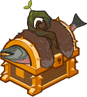

[Back to Main](index.md)

    
        Base Model
    
    
        Bear Form Model
    

# Umberto

Umberto looks like they'll be a CNE original tied to an upcoming Idle Champions Presents stream. Given their ability and item names - it's possible they'll be some kind of Swarms Druid.

# Basic Information

Umberto will be a new champion - potentially in the Founders' Day event on 3 July 2024. (It's possible they could be in a different event - we don't know yet.)

    
        
            **Seat**:
        
        
            Unknown
        
    
    
        
            **Race**:
        
        
            Human (Guess)
        
    
    
        
            **Class**:
        
        
            Druid (Guess)
        
    
    
        
            **Roles**:
        
        
            Unknown
        
    
    
        
            **Age**:
        
        
            Unknown
        
    
    
        
            **Gender**:
        
        
            Male (Guess)
        
    
    
        
            **Alignment**:
        
        
            Unknown
        
    
    
        
            **Affiliation**:
        
        
            Unknown
        
    

# Formation

Unknown.


    



# Abilities

**Base Attack: Unknown**
> Unknown effect.

<em>Raw Data</em>

<pre>
</pre>

**Ultimate Attack: Unknown**
> Unknown effect.

<em>Raw Data</em>

<pre>
</pre>

**Beehive Barrage** (Guess)
> Unknown effect.

<em>Raw Data</em>

<pre>
{
    "id": 23763,
    "graphic": "Icons/Events/2018FoundersDay/Y7 Umberto/Icon_Formation_UmbertoBeehiveBarrage",
    "v": 2,
    "fs": 0,
    "p": 0,
    "type": 1,
    "export_params": {
        "uses": [
            "icon"
        ],
        "quantize": true
    }
}
</pre>

**Detective's Entourage** (Guess)
> Unknown effect.

<em>Raw Data</em>

<pre>
{
    "id": 23764,
    "graphic": "Icons/Events/2018FoundersDay/Y7 Umberto/Icon_Formation_UmbertoDetectivesEntourage",
    "v": 2,
    "fs": 0,
    "p": 0,
    "type": 1,
    "export_params": {
        "uses": [
            "icon"
        ],
        "quantize": true
    }
}
</pre>

**Ongoing Investigation** (Guess)
> Unknown effect.

<em>Raw Data</em>

<pre>
{
    "id": 23765,
    "graphic": "Icons/Events/2018FoundersDay/Y7 Umberto/Icon_Formation_UmbertoOngoingInvestigation",
    "v": 2,
    "fs": 0,
    "p": 0,
    "type": 1,
    "export_params": {
        "uses": [
            "icon"
        ],
        "quantize": true
    }
}
</pre>

**Protective Presence** (Guess)
> Unknown effect.

<em>Raw Data</em>

<pre>
{
    "id": 23766,
    "graphic": "Icons/Events/2018FoundersDay/Y7 Umberto/Icon_Formation_UmbertoProtectivePresence",
    "v": 2,
    "fs": 0,
    "p": 0,
    "type": 1,
    "export_params": {
        "uses": [
            "icon"
        ],
        "quantize": true
    }
}
</pre>

# Specialisations

**Call of the Wardens** (Guess)
> Unknown effect.

<em>Raw Data</em>

<pre>
{
    "id": 23767,
    "graphic": "Icons/Events/2018FoundersDay/Y7 Umberto/Icon_Specialization_UmbertoCalloftheWardens",
    "v": 2,
    "fs": 0,
    "p": 0,
    "type": 1,
    "export_params": {
        "uses": [
            "icon"
        ],
        "quantize": true
    }
}
</pre>

**Family of Orphans** (Guess)
> Unknown effect.

<em>Raw Data</em>

<pre>
{
    "id": 23768,
    "graphic": "Icons/Events/2018FoundersDay/Y7 Umberto/Icon_Specialization_UmbertoFamilyofOrphans",
    "v": 2,
    "fs": 0,
    "p": 0,
    "type": 1,
    "export_params": {
        "uses": [
            "icon"
        ],
        "quantize": true
    }
}
</pre>

**Laws Alliance** (Guess)
> Unknown effect.

<em>Raw Data</em>

<pre>
{
    "id": 23769,
    "graphic": "Icons/Events/2018FoundersDay/Y7 Umberto/Icon_Specialization_UmbertoLawsAlliance",
    "v": 2,
    "fs": 0,
    "p": 0,
    "type": 1,
    "export_params": {
        "uses": [
            "icon"
        ],
        "quantize": true
    }
}
</pre>

**More Bees** (Guess)
> Unknown effect.

<em>Raw Data</em>

<pre>
{
    "id": 23770,
    "graphic": "Icons/Events/2018FoundersDay/Y7 Umberto/Icon_Specialization_UmbertoMoreBees",
    "v": 2,
    "fs": 0,
    "p": 0,
    "type": 1,
    "export_params": {
        "uses": [
            "icon"
        ],
        "quantize": true
    }
}
</pre>

**More Clues** (Guess)
> Unknown effect.

<em>Raw Data</em>

<pre>
{
    "id": 23771,
    "graphic": "Icons/Events/2018FoundersDay/Y7 Umberto/Icon_Specialization_UmbertoMoreClues",
    "v": 2,
    "fs": 0,
    "p": 0,
    "type": 1,
    "export_params": {
        "uses": [
            "icon"
        ],
        "quantize": true
    }
}
</pre>

**More Damage** (Guess)
> Unknown effect.

<em>Raw Data</em>

<pre>
{
    "id": 23772,
    "graphic": "Icons/Events/2018FoundersDay/Y7 Umberto/Icon_Specialization_UmbertoMoreDamage",
    "v": 2,
    "fs": 0,
    "p": 0,
    "type": 1,
    "export_params": {
        "uses": [
            "icon"
        ],
        "quantize": true
    }
}
</pre>

# Items

    
        
            **Icons**
        
        
            **Name**
        
    
    
        
            
        
        
            Bear Connections
        
    
    
        
            
        
        
            Connectionto Sliver
        
    
    
        
            
        
        
            Detective Tools
        
    
    
        
            
        
        
            Foraged Foods
        
    
    
        
            
        
        
            Skinningknife
        
    
    
        
            
        
        
            Swarmstaff
        
    

# Feats

Unknown.

# Legendaries

Unknown.

# Adventures and Variants

Unknown.

# Other Champion Images

    
        
            Gold Chest Icon
        
        
            Silver Chest Icon
        
    

[Back to Top](#top)

*Last Modified: {{ site.time }}*