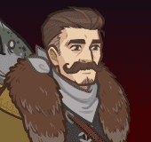
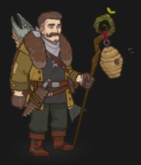

[Back to Main](index.md)

    
        Portait
    
    
        Base Model
    
    
        Bear Form Model
    

# Umberto

Umberto looks like they'll be a CNE original tied to an upcoming Idle Champions Presents stream. Given their ability and item names - it's possible they'll be some kind of Swarms Druid.

# Basic Information

Umberto will be a new champion in the Founders' Day event on 3 July 2024.

    
        
            **Seat**:
        
        
            Unknown
        
    
    
        
            **Race**:
        
        
            Human (Guess)
        
    
    
        
            **Class**:
        
        
            Druid (Guess)
        
    
    
        
            **Roles**:
        
        
            Tanking / Support (Guess)
        
    
    
        
            **Age**:
        
        
            Unknown
        
    
    
        
            **Gender**:
        
        
            Male (Guess)
        
    
    
        
            **Alignment**:
        
        
            Unknown
        
    
    
        
            **Affiliation**:
        
        
            Unknown
        
    

# Formation

Unknown.


    



# Abilities

**Base Attack: Swarmstaff** (Ranged)
> Umberto unleashes a bee swarm at the nearest foe, dealing 1 hit.  
> Cooldown: 5.5s (Cap 1.375s)

<em>Raw Data</em>

<pre>
{
    "id": 763,
    "name": "Swarmstaff",
    "description": "Umberto unleashes a bee swarm at the nearest foe, dealing 1 hit.",
    "long_description": "",
    "graphic_id": 0,
    "target": "front",
    "num_targets": 1,
    "aoe_radius": 0,
    "damage_modifier": 1,
    "cooldown": 5.5,
    "animations": [
        {
            "type": "ranged_attack",
            "projectile": "umberto_bee_swarm",
            "shoot_frame": 8,
            "shoot_offset_x": 100,
            "shoot_offset_y": -30
        }
    ],
    "tags": [
        "ranged"
    ],
    "damage_types": [
        "ranged"
    ]
}
</pre>

**Base Attack: Swarmstaff** (Ranged)
> Umberto unleashes a bee swarm at the nearest foe, dealing 1 hit and adds a swarming bee stack.  
> Cooldown: 5.5s (Cap 1.375s)

<em>Raw Data</em>

<pre>
{
    "id": 767,
    "name": "Swarmstaff",
    "description": "Umberto unleashes a bee swarm at the nearest foe, dealing 1 hit and adds a swarming bee stack.",
    "long_description": "",
    "graphic_id": 0,
    "target": "front",
    "num_targets": 1,
    "aoe_radius": 0,
    "damage_modifier": 1,
    "cooldown": 5.5,
    "animations": [
        {
            "type": "ranged_attack",
            "projectile": "umberto_bee_swarm",
            "shoot_frame": 8,
            "shoot_offset_x": 100,
            "shoot_offset_y": -30
        }
    ],
    "tags": [
        "ranged"
    ],
    "damage_types": [
        "ranged"
    ]
}
</pre>

**Base Attack: Bear Claw** (Melee)
> Umberto moves up to the nearest foe and slashes them, dealing 1 ultimate hit.  
> Cooldown: 5.5s (Cap 1.375s)

<em>Raw Data</em>

<pre>
{
    "id": 765,
    "name": "Bear Claw",
    "description": "Umberto moves up to the nearest foe and slashes them, dealing 1 ultimate hit.",
    "long_description": "",
    "graphic_id": 0,
    "target": "front",
    "num_targets": 1,
    "aoe_radius": 0,
    "damage_modifier": 1,
    "cooldown": 5.5,
    "animations": [
        {
            "type": "melee_attack",
            "target_offset_x": -50,
            "start_frame": 5,
            "damage_frame": 14,
            "jump_sound": 30,
            "sound_frames": {
                "2": 194
            },
            "force_count_for_bud": false
        }
    ],
    "tags": [
        "melee"
    ],
    "damage_types": [
        "melee"
    ]
}
</pre>

**Ultimate Attack: Brown Bear Bash**
> Umberto transforms into a bear for 15 seconds, encouraging allies to immediately attack and attack more often.  
> Cooldown: 220s (Cap 55s)

<em>Raw Data</em>

<pre>
{
    "id": 764,
    "name": "Brown Bear Bash",
    "description": "Umberto transforms into a bear for 15 seconds, encouraging allies to attack more often.",
    "long_description": "Umberto transforms into a bear for 15 seconds, encouraging allies to immediately attack and attack more often.",
    "graphic_id": 23773,
    "target": "none",
    "num_targets": 0,
    "aoe_radius": 0,
    "damage_modifier": 1,
    "cooldown": 220,
    "animations": [
        {
            "type": "ultimate_attack",
            "ultimate": "umberto"
        }
    ],
    "tags": [
        "ultimate"
    ],
    "damage_types": []
}
</pre>

**Detective's Entourage** (Guess)
> Umberto increases the damage of all Champions in the two columns behind him by 100%.

<em>Raw Data</em>

<pre>
{
    "id": 1991,
    "flavour_text": "",
    "description": {
        "desc": "Umberto increases the damage of all Champions in the two columns behind him by $amount%"
    },
    "effect_keys": [
        {
            "off_when_benched": true,
            "effect_string": "hero_dps_multiplier_mult,100",
            "targets": [
                "prev_two_col"
            ]
        }
    ],
    "requirements": "",
    "graphic_id": 23764,
    "large_graphic_id": 23760,
    "properties": {
        "is_formation_ability": true,
        "owner_use_outgoing_description": true
    }
}
</pre>

**Beehive Barrage** (Guess)
> Every second, Umberto's staff spawns 1 swarming bees, which buzz around the staff, up to a maximum of 10 swarming bees. When an enemy attacks Umberto, he unleashes a swarming bee from the staff onto that enemy. When an enemy with one or more swarming bees is hit by any Champion, all their bees stings them, dealing 1s of BUD-based damage for each bee. A maximum of 5 swarming bees can swarm a single enemy. Bees persist until the enemy is defeated, or until Umberto is removed from the formation.

<em>Raw Data</em>

<pre>
{
    "id": 1992,
    "flavour_text": "",
    "description": {
        "conditions": [
            {
                "condition": "compare amount___2 == 1",
                "desc": "Every second, Umberto's staff spawns a swarming bee, which buzzes around the staff, up to a maximum of $max_bees___2 swarming bees. When an enemy attacks Umberto, he unleashes a swarming bee from the staff onto that enemy. When an enemy with one or more swarming bees is hit by any Champion, all their bees stings them, dealing $(seconds_plural amount) of BUD-based damage for each bee. A maximum of $max_bees_per_enemy___2 swarming bees can swarm a single enemy. Bees persist until the enemy is defeated, or until Umberto is removed from the formation."
            },
            {
                "desc": "Every second, Umberto's staff spawns $amount___2 swarming bees, which buzz around the staff, up to a maximum of $max_bees___2 swarming bees. When an enemy attacks Umberto, he unleashes a swarming bee from the staff onto that enemy. When an enemy with one or more swarming bees is hit by any Champion, all their bees stings them, dealing $(seconds_plural amount) of BUD-based damage for each bee. A maximum of $max_bees_per_enemy___2 swarming bees can swarm a single enemy. Bees persist until the enemy is defeated, or until Umberto is removed from the formation."
            }
        ]
    },
    "effect_keys": [
        {
            "off_when_benched": true,
            "effect_string": "umberto_bud_seconds_per_bee,1"
        },
        {
            "off_when_benched": true,
            "effect_string": "umberto_beehive_barrage,1",
            "max_bees": 10,
            "max_bees_per_enemy": 5,
            "bee_graphic": 22718,
            "bee_offset_x": 64,
            "bee_offset_y": -98,
            "bee_offset_bear_x": 84,
            "bee_offset_bear_y": -102
        },
        {
            "off_when_benched": true,
            "effect_string": "change_base_attack,767"
        }
    ],
    "requirements": "",
    "graphic_id": 23763,
    "large_graphic_id": 23759,
    "properties": {
        "is_formation_ability": true,
        "owner_use_outgoing_description": true,
        "retain_on_slot_changed": true,
        "indexed_effect_properties": true,
        "per_effect_index_bonuses": true,
        "default_bonus_index": 1
    }
}
</pre>

**Ongoing Investigation** (Guess)
> Pick an Investigation to pursue. Umberto gains stacks of Clue, and can start another Investigation after the Investigation concludes. Each Clue stack increases Detective's Entourage by 50%, stacking multiplicatively. Caps at 100 stacks. Once you are capped, additional Investigations are not offered. Clue stacks persist between areas and reset when the adventure ends.

> **Investigation 1: Rapid Reconnaissance**  
> Umberto immediately gains 10 Clue stacks, but will lose all but 1 when he concludes his investigation in 2 hours.

> **Investigation 2: Steadfast Search**  
> Umberto gains 1 Clue stack after every 2 hours, plus 3 Clue stacks when the investigation concludes in 8 hours.

> **Investigation 3: Thorough Inquiry**  
> Umberto gains 1 Clue stack after every 3 hours, plus 17 Clue stacks when the investigation concludes in 24 hours.

<em>Raw Data</em>

<pre>
{
    "id": 1993,
    "flavour_text": "",
    "description": {
        "desc": "Pick an Investigation to pursue. Umberto gains stacks of Clue, and can start another Investigation after the Investigation concludes. Each Clue stack increases Detective's Entourage by $amount%, stacking multiplicatively. Caps at $max_stacks stacks. Once you are capped, additional Investigations are not offered. Clue stacks persist between areas and reset when the adventure ends.",
        "post": {
            "conditions": [
                {
                    "condition": "not static_desc",
                    "desc": "^^$umberto_current_investigation"
                }
            ]
        }
    },
    "effect_keys": [
        {
            "effect_string": "buff_upgrade,50,15048",
            "manual_stacking": true,
            "stacks_multiply": true,
            "max_stacks": 100,
            "stack_title": "Clue Stacks",
            "show_bonus": true
        },
        {
            "off_when_benched": true,
            "effect_string": "stacks_data_binder_safe,0,umberto_clue_stacks",
            "is_instanced_stat": true,
            "use_stat_defs": true
        },
        {
            "off_when_benched": true,
            "effect_string": "umberto_ongoing_investigation",
            "investigations": [
                {
                    "name_key": "umberto_investigation_1_name",
                    "desc_key": "umberto_investigation_1_desc",
                    "completion_time": 7200,
                    "stacks_gained_immediately": 10,
                    "stacks_lost_at_end": 9
                },
                {
                    "name_key": "umberto_investigation_2_name",
                    "desc_key": "umberto_investigation_2_desc",
                    "completion_time": 28800,
                    "stacks_gained_periodically": 1,
                    "stack_gain_time_interval": 7200,
                    "stacks_gained_at_end": 3
                },
                {
                    "name_key": "umberto_investigation_3_name",
                    "desc_key": "umberto_investigation_3_desc",
                    "completion_time": 86400,
                    "stacks_gained_periodically": 1,
                    "stack_gain_time_interval": 10800,
                    "stacks_gained_at_end": 17
                }
            ]
        }
    ],
    "requirements": "",
    "graphic_id": 23765,
    "large_graphic_id": 23761,
    "properties": {
        "is_formation_ability": true,
        "owner_use_outgoing_description": true,
        "indexed_effect_properties": true,
        "per_effect_index_bonuses": true,
        "default_bonus_index": 0,
        "retain_on_slot_changed": true
    }
}
</pre>

**Protective Presence** (Guess)
> Umberto increases the health of all other Champions by 25% of his max health, and any healing effect on those Champions is increased by 25%.

<em>Raw Data</em>

<pre>
{
    "id": 1994,
    "flavour_text": "",
    "description": {
        "desc": "Umberto increases the health of all other Champions by $amount% of his max health, and any healing effect on those Champions is increased by $amount%."
    },
    "effect_keys": [
        {
            "off_when_benched": true,
            "effect_string": "buff_me,25"
        },
        {
            "off_when_benched": true,
            "effect_string": "increase_health_by_source_percent,0",
            "amount_expr": "upgrade_amount(15051,0)",
            "targets": [
                "other"
            ],
            "override_key_desc": "Increases the health of $target by $amount% of Umberto's max health and the effect of healing on $target by $amount%"
        },
        {
            "off_when_benched": true,
            "effect_string": "healing_mult,0",
            "amount_expr": "upgrade_amount(15051,0)",
            "targets": [
                "other"
            ],
            "skip_effect_key_desc": true
        }
    ],
    "requirements": "",
    "graphic_id": 23766,
    "large_graphic_id": 23762,
    "properties": {
        "is_formation_ability": true,
        "owner_use_outgoing_description": true,
        "indexed_effect_properties": true,
        "per_effect_index_bonuses": true,
        "default_bonus_index": 0
    }
}
</pre>

# Specialisations

**Laws Alliance** (Guess)
> Umberto increases the effect of Detective's Entourage by 125% for each Lawful Champion in the formation, stacking multiplicatively.

ⓘ *Note: This ability is prestack.*

<em>Raw Data</em>

<pre>
{
    "id": 1995,
    "flavour_text": "",
    "description": {
        "desc": "Umberto increases the effect of Detective's Entourage by $amount% for each Lawful Champion in the formation, stacking multiplicatively."
    },
    "effect_keys": [
        {
            "off_when_benched": true,
            "effect_string": "pre_stack_amount,125"
        },
        {
            "off_when_benched": true,
            "effect_string": "buff_upgrade,0,15048",
            "amount_expr": "upgrade_amount(15052,0)",
            "show_bonus": true,
            "stack_func": "per_hero_attribute",
            "per_hero_expr": "HasTag(`lawful`)",
            "amount_func": "mult"
        }
    ],
    "requirements": "",
    "graphic_id": 0,
    "large_graphic_id": 0,
    "properties": {
        "is_formation_ability": true,
        "owner_use_outgoing_description": true,
        "indexed_effect_properties": true,
        "per_effect_index_bonuses": true,
        "default_bonus_index": 0,
        "spec_option_post_apply_info": "Lawful Champions: $num_stacks___2"
    }
}
</pre>

**Family of Orphans** (Guess)
> Umberto increases the effect of Detective's Entourage by 100% for each unaffiliated Champion in the formation, stacking multiplicatively.

ⓘ *Note: This ability is prestack.*

<em>Raw Data</em>

<pre>
{
    "id": 1996,
    "flavour_text": "",
    "description": {
        "desc": "Umberto increases the effect of Detective's Entourage by $amount% for each unaffiliated Champion in the formation, stacking multiplicatively."
    },
    "effect_keys": [
        {
            "off_when_benched": true,
            "effect_string": "pre_stack_amount,100"
        },
        {
            "off_when_benched": true,
            "effect_string": "buff_upgrade,0,15048",
            "amount_expr": "upgrade_amount(15053,0)",
            "show_bonus": true,
            "stack_func": "per_hero_attribute",
            "per_hero_expr": "HasTag(`unaffiliated`)",
            "amount_func": "mult"
        }
    ],
    "requirements": "",
    "graphic_id": 0,
    "large_graphic_id": 0,
    "properties": {
        "is_formation_ability": true,
        "owner_use_outgoing_description": true,
        "indexed_effect_properties": true,
        "per_effect_index_bonuses": true,
        "default_bonus_index": 0,
        "spec_option_post_apply_info": "Unaffiliated Champions: $num_stacks___2"
    }
}
</pre>

**Call of the Wardens** (Guess)
> Umberto increases the effect of Detective's Entourage by 300% for each Ranger or Druid Champion in the formation, stacking multiplicatively.

ⓘ *Note: This ability is prestack.*

<em>Raw Data</em>

<pre>
{
    "id": 1997,
    "flavour_text": "",
    "description": {
        "desc": "Umberto increases the effect of Detective's Entourage by $amount% for each Ranger or Druid Champion in the formation, stacking multiplicatively."
    },
    "effect_keys": [
        {
            "off_when_benched": true,
            "effect_string": "pre_stack_amount,300"
        },
        {
            "off_when_benched": true,
            "effect_string": "buff_upgrade,0,15048",
            "amount_expr": "upgrade_amount(15054,0)",
            "show_bonus": true,
            "stack_func": "per_hero_attribute",
            "per_hero_expr": "HasTag(`ranger`) || HasTag(`druid`)",
            "amount_func": "mult"
        }
    ],
    "requirements": "",
    "graphic_id": 0,
    "large_graphic_id": 0,
    "properties": {
        "is_formation_ability": true,
        "owner_use_outgoing_description": true,
        "indexed_effect_properties": true,
        "per_effect_index_bonuses": true,
        "default_bonus_index": 0,
        "spec_option_post_apply_info": "Qualified Champions: $num_stacks___2"
    }
}
</pre>

**More Bees** (Guess)
> Umberto's Beehive Barrage increases the number of swarming bees spawned each second by 400%, and when an enemy hits Umberto the maximum number of bees are unleashed. Finally, the damage per bee is increased by 100%.

<em>Raw Data</em>

<pre>
{
    "id": 1998,
    "flavour_text": "",
    "description": {
        "desc": "Umberto's Beehive Barrage increases the number of swarming bees spawned each second by $amount%, and when an enemy hits Umberto the maximum number of bees are unleashed. Finally, the damage per bee is increased by $(amount___2)%."
    },
    "effect_keys": [
        {
            "off_when_benched": true,
            "effect_string": "buff_upgrade,400,15049,1"
        },
        {
            "off_when_benched": true,
            "effect_string": "buff_upgrade,100,15049,0"
        }
    ],
    "requirements": "",
    "graphic_id": 0,
    "large_graphic_id": 0,
    "properties": {
        "is_formation_ability": true,
        "owner_use_outgoing_description": true,
        "indexed_effect_properties": true
    }
}
</pre>

**More Clues** (Guess)
> Increases the maximum number of Ongoing Investigation's Clue stacks by 50%.

<em>Raw Data</em>

<pre>
{
    "id": 1999,
    "flavour_text": "",
    "description": {
        "desc": "Increases the maximum number of Ongoing Investigation's Clue stacks by $amount%."
    },
    "effect_keys": [
        {
            "off_when_benched": true,
            "effect_string": "buff_upgrade_effect_stacks_max_mult,50,15050"
        }
    ],
    "requirements": "",
    "graphic_id": 0,
    "large_graphic_id": 0,
    "properties": {
        "is_formation_ability": true,
        "owner_use_outgoing_description": true
    }
}
</pre>

**More Damage** (Guess)
> Increases the effect of Detective's Entourage by 200%.

<em>Raw Data</em>

<pre>
{
    "id": 2000,
    "flavour_text": "",
    "description": {
        "desc": "Increases the effect of Detective's Entourage by $amount%."
    },
    "effect_keys": [
        {
            "off_when_benched": true,
            "effect_string": "buff_upgrade,200,15048"
        }
    ],
    "requirements": "",
    "graphic_id": 0,
    "large_graphic_id": 0,
    "properties": {
        "is_formation_ability": true,
        "owner_use_outgoing_description": true
    }
}
</pre>

# Items

    
        
            **Icons**
        
        
            **Name**
        
    
    
        
            
        
        
            Bear Connections
        
    
    
        
            
        
        
            Connectionto Sliver
        
    
    
        
            
        
        
            Detective Tools
        
    
    
        
            
        
        
            Foraged Foods
        
    
    
        
            
        
        
            Skinningknife
        
    
    
        
            
        
        
            Swarmstaff
        
    

# Feats

Unknown.

# Legendaries

Unknown.

# Adventures and Variants

Unknown.

# Other Champion Images

    
        
            Console Portait
        
    
    
        
            Gold Chest Icon
        
        
            Silver Chest Icon
        
    

[Back to Top](#top)

*Last Modified: {{ site.time }}*