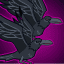

[Back to Main](index.md)

    
        
            
        
        
            Portrait
        
    

# Uriah

Brother Uriah Macawber is a native of Ravenloft, born in the dread domain of Darkon under the iron rule of Azalin Rex. After a horrifying childhood encounter at the Carnival with the demonic entity known as The Caller, Uriah would embrace the worship of the goddess Ezra, Lady of the Mists, offering protection from the forces of darkness to all those in need. Upon joining with the other future members of The Black Dice Society at the infamous House of Lament, Uriah would go on to find true love with his teammate, the undead Aasimar, Nahara... and would eventually discover the dark truth of both the nature of his deity and his mysterious connection to his former liege, the lich-king Azalin Rex.

# Changes

Uriah will be a reworked champion in the Dragondown event and delayed until 10 June 2026.

Only abilities that have seen some changes will be displayed here - and be aware that there's a lot of guesswork involved. Some abilities may not have names - some may have the *wrong* names - or specialisations might not be marked as such - etc.. Focus on the effect data itself.

Please do me a favour and don't get all melodramatic about what you find here. I - and CNE - don't appreciate it. These are spoilers and will almost certainly change before release - likely multiple times. That and we don't have access to any upgrade data prior to release. Making assumptions on how the champions will turn out based on this information would be premature.

# Abilities

**Doomed in Darkon** (Guess)
> Uriah increases the damage of all Champions in his column and the column behind him by 400%.

<em>Raw Data</em>

<pre>
{
    "id": 2719,
    "flavour_text": "",
    "description": {
        "desc": "Uriah increases the damage of all Champions in his column and the column behind him by $amount%."
    },
    "effect_keys": [
        {
            "effect_string": "hero_dps_multiplier_mult,400",
            "targets": [
                "col_and_prev_col"
            ],
            "off_when_benched": true
        }
    ],
    "requirements": "",
    "graphic_id": 17756,
    "large_graphic_id": 17753,
    "properties": {
        "is_formation_ability": true,
        "owner_use_outgoing_description": true
    }
}
</pre>

**Ezra's Embrace** (Guess)
> Brother Uriah heals all Champions within two slots for 10 health per second. This effect is increased by 25% for each formation slot containing a dead or undead Champion or an escort, stacking additively and applying multiplicatively.

<em>Raw Data</em>

<pre>
{
    "id": 2720,
    "flavour_text": "",
    "description": {
        "desc": "Brother Uriah heals all Champions within two slots for $(not_buffed amount) health per second. This effect is increased by $amount___2% for each formation slot containing a dead or undead Champion or an escort, stacking additively and applying multiplicatively."
    },
    "effect_keys": [
        {
            "effect_string": "heal,10",
            "targets": [
                {
                    "type": "distance",
                    "distance": 2,
                    "comparison": "<="
                }
            ],
            "off_when_benched": true
        },
        {
            "effect_string": "buff_upgrade,25,19676",
            "stack_title": "Escorts and Dead Champions",
            "amount_func": "add",
            "stack_func": "per_hero_attribute",
            "per_hero_expr": "!is_alive || is_undead || HasTag(`undead`)",
            "post_process_expr": "input + num_escorts_in_formation",
            "show_bonus": true,
            "show_stats_on_receiver": false,
            "use_computed_amount_for_description": true,
            "amount_updated_listeners": [
                "slot_changed",
                "hero_appears_dead",
                "hero_killed",
                "area_changed",
                "hero_tags_changed"
            ],
            "off_when_benched": true
        }
    ],
    "requirements": "",
    "graphic_id": 17757,
    "large_graphic_id": 17754,
    "properties": {
        "is_formation_ability": true,
        "owner_use_outgoing_description": true,
        "indexed_effect_properties": true,
        "per_effect_index_bonuses": true,
        "default_bonus_index": 0
    }
}
</pre>

**Raven's Pact** (Guess)
> Brother Uriah's Flock are Black Dice Society affiliation members. Brother Uriah increases the effect of Doomed in Darkon by 100% for each Flock in the formation, stacking multiplicatively.

ⓘ *Note: This ability is prestack.*

<em>Raw Data</em>

<pre>
{
    "id": 2721,
    "flavour_text": "",
    "description": {
        "desc": "Brother Uriah's Flock are Black Dice Society affiliation members. Brother Uriah increases the effect of Doomed in Darkon by $(not_buffed amount)% for each Flock in the formation, stacking multiplicatively."
    },
    "effect_keys": [
        {
            "effect_string": "pre_stack,100",
            "off_when_benched": true
        },
        {
            "effect_string": "buff_upgrade,0,19675",
            "amount_expr": "upgrade_amount(19677,0)",
            "off_when_benched": true,
            "amount_func": "mult",
            "stack_func": "per_hero_attribute",
            "per_hero_expr": "HasTag(`blackdicesociety`) || (GetUpgradePurchased(19680) && HasTag(`good`)) || (GetUpgradePurchased(19681) && HasTag(`evil`))",
            "stack_title": "Flock Members",
            "show_bonus": true,
            "amount_updated_listeners": [
                "hero_tags_changed",
                "slot_changed"
            ]
        }
    ],
    "requirements": "",
    "graphic_id": 29125,
    "large_graphic_id": 29117,
    "properties": {
        "is_formation_ability": true,
        "owner_use_outgoing_description": true,
        "formation_circle_icon": false,
        "indexed_effect_properties": true,
        "per_effect_index_bonuses": true,
        "default_bonus_index": 0
    }
}
</pre>

**In the Grip of Azalin Rex** (Guess)
> After 100 normal attacks by Champions in the formation, Azalin Rex takes over Brother Uriah for 20 seconds. While controlled by Azalin Rex, Brother Uriah increases the damage dealt by Champions who are part of his Flock by 1000%. Additionally, Brother Uriah turns evil while under the control of Azalin Rex.

<em>Raw Data</em>

<pre>
{
    "id": 2722,
    "flavour_text": "",
    "description": {
        "pre": "After $attack_count normal attacks by Champions in the formation, Azalin Rex takes over Brother Uriah for $amount seconds. While controlled by Azalin Rex, Brother Uriah increases the damage dealt by Champions who are part of his Flock by $amount___2%. Additionally, Brother Uriah turns evil while under the control of Azalin Rex.",
        "conditions": [
            {
                "condition": "(not static_desc)^(uriah_azalin_rex_active)",
                "desc": "^^Time Remaining: $(uriah_azalin_duration) second(s)"
            },
            {
                "condition": "(not static_desc)",
                "desc": "^^Attack Count: $(uriah_current_attack_count) / $(attack_count)"
            }
        ]
    },
    "effect_keys": [
        {
            "effect_string": "in_the_grip_of_azalin_rex,20,100",
            "azalin_effect_key_indexes": [
                1,
                2
            ],
            "off_when_benched": true
        },
        {
            "effect_string": "hero_dps_multiplier_mult,1000",
            "apply_manually": true,
            "off_when_benched": true,
            "targets": [
                "all"
            ],
            "filter_targets": [
                {
                    "type": "hero_expr",
                    "hero_expr": "HasTag(`blackdicesociety`) || (GetUpgradePurchased(19680) && HasTag(`good`)) || (GetUpgradePurchased(19681) && HasTag(`evil`))"
                }
            ],
            "formation_arrows_for_effected_only": true
        },
        {
            "effect_string": "add_hero_tags,0,evil",
            "off_when_benched": true,
            "apply_manually": true
        }
    ],
    "requirements": "",
    "graphic_id": 17758,
    "large_graphic_id": 17755,
    "properties": {
        "is_formation_ability": true,
        "owner_use_outgoing_description": true,
        "formation_circle_icon": false,
        "indexed_effect_properties": true,
        "per_effect_index_bonuses": true,
        "default_bonus_index": 1,
        "retain_on_slot_changed": true
    }
}
</pre>

**The Clutch of Evil** (Guess)
> Every second that Brother Uriah is In The Grip of Azalin Rex, the effect of Doomed in Darkon is increased by 10%, stacking additively. These stacks persist between adventures.

<em>Raw Data</em>

<pre>
{
    "id": 2723,
    "flavour_text": "",
    "description": {
        "desc": "Every second that Brother Uriah is In The Grip of Azalin Rex, the effect of Doomed in Darkon is increased by $amount%, stacking additively. These stacks persist between adventures."
    },
    "effect_keys": [
        {
            "effect_string": "buff_upgrade,10,19675",
            "off_when_benched": true,
            "amount_func": "add",
            "stack_func": "get_stat",
            "stat": "uriah_clutch_of_evil",
            "amount_updated_listeners": [
                "stat_changed,uriah_clutch_of_evil"
            ],
            "show_bonus": true
        }
    ],
    "requirements": "",
    "graphic_id": 29126,
    "large_graphic_id": 29118,
    "properties": {
        "is_formation_ability": true,
        "owner_use_outgoing_description": true,
        "formation_circle_icon": false
    }
}
</pre>

# Specialisations

**Specialisation: Book of Exalted Deeds** (Guess)
> Uriah reads from the Book of Exalted Deeds and gains the Hunter role, making Undead and Fiends his Favored Foes and all Champions deal 200% more damage to them. Additionally, Good Champions also count as members of Brother Uriah's Flock.

<em>Raw Data</em>

<pre>
{
    "id": 2724,
    "flavour_text": "",
    "description": {
        "desc": "Uriah reads from the Book of Exalted Deeds and gains the Hunter role, making Undead and Fiends his Favored Foes and all Champions deal $amount% more damage to them. Additionally, Good Champions also count as members of Brother Uriah's Flock."
    },
    "effect_keys": [
        {
            "effect_string": "increase_monster_with_tags_damage,200,undead|fiend",
            "off_when_benched": true
        },
        {
            "off_when_benched": true,
            "effect_string": "favored_foe,undead"
        },
        {
            "off_when_benched": true,
            "effect_string": "favored_foe,fiend"
        },
        {
            "effect_string": "animation_synced_overlay,17719",
            "skin_property_prefix": "spec_1_overlay",
            "sort_bottom": true,
            "off_when_benched": true
        },
        {
            "effect_string": "add_hero_tags,0,hunter",
            "off_when_benched": true
        },
        {
            "effect_string": "do_nothing",
            "stack_func": "per_hero_attribute",
            "per_hero_expr": "HasTag(`good`) && !HasTag(`blackdicesociety`)",
            "off_when_benched": true
        }
    ],
    "requirements": "",
    "graphic_id": 0,
    "large_graphic_id": 17759,
    "properties": {
        "is_formation_ability": true,
        "owner_use_outgoing_description": true,
        "formation_circle_icon": false,
        "indexed_effect_properties": true,
        "per_effect_index_bonuses": true,
        "default_bonus_index": 0,
        "spec_option_post_apply_info": "New Flock Members: $num_stacks___6"
    }
}
</pre>

**Specialisation: Book of Vile Darkness** (Guess)
> 

<em>Raw Data</em>

<pre>
{
    "id": 2725,
    "flavour_text": "",
    "description": {
        "desc": ""
    },
    "effect_keys": [],
    "requirements": "",
    "graphic_id": 0,
    "large_graphic_id": 17760,
    "properties": {
        "is_formation_ability": true,
        "owner_use_outgoing_description": true,
        "formation_circle_icon": false
    }
}
</pre>

# Adventures and Variants

**Unlock Adventure: The Missing Merchants (Brother Uriah)** (Complete Area 50)
> Discover the fate of some merchants in the jungles of Chult.

 **Variant 1: Perhaps I'd Be Safer in the Middle?** (Complete Area 75)
> Brother Uriah joins the formation. He can't be moved or removed.  
> Only Champions in the middle two columns can deal damage.  
> Getting to Know Brother Uriah: Uriah increases the damage of Champions in his column and the column behind him. Place your damage dealing Champions to take advantage of this!

 **Variant 2: Perhaps an Escort is in Order?** (Complete Area 125)
> Brother Uriah joins the formation. He can be moved, but not removed. Uriah's Ezra's Embrace ability starts unlocked.  
> Two Ravens join the formation.  
> Every 10 seconds, a boulder falls on a random Champion dealing 25% of their total health in damage.  
> Getting to Know Brother Uriah: Uriah can heal Champions within two slots of him. Place him to make the most of this!

 **Variant 3: Perhaps We Should Make Haste?** (Complete Area 175)
> Brother Uriah joins the formation. He can be moved, but not removed.  
> You may only use Champions from the Black Dice Society affiliation or Champions with a normal attack cooldown of 5 seconds or less.  
> Getting to Know Azalin Rex: Azalin Rex has a mysterious tie to Brother Uriah. Increase the attack speed of your champions to spend more time with the darklord of Darkon!

# Formation

    <svg xmlns="http://www.w3.org/2000/svg" id="Brother Uriah" fill="#aaa" data-formationName="Brother Uriah" data-campaignName="Grand Revel" width="331" height="160"><circle cx="135" cy="25" r="15"/><circle cx="135" cy="105" r="15"/><circle cx="95" cy="45" r="15"/><circle cx="95" cy="85" r="15"/><circle cx="95" cy="125" r="15"/><circle cx="55" cy="25" r="15"/><circle cx="55" cy="65" r="15"/><circle cx="55" cy="105" r="15"/><circle cx="55" cy="145" r="15"/><circle cx="15" cy="85" r="15"/><text x="165" y="25" fill="#dcdcdc" font-size="25" font-family="Arial" font-weight="bold">Brother Uriah</text><text x="165" y="65" fill="#dcdcdc" font-size="15" font-family="Arial" font-weight="bold">Grand Revel</text></svg>

[Back to Top](#top)

*Last Modified: {{ site.time }}*