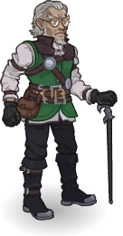
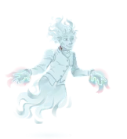
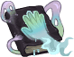
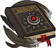
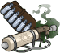
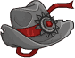
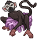
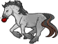
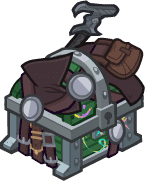

[Back to Main](index.md)

    
        
            
        
        
            Portrait
        
    
    
        
            
        
        
            Base Model
        
    
    
        
            
        
        
            Erasmus Model
        
    

# Van Richten

He was born in Rivalis in Darkon in 671 BC. He took medicine at the University of Il Aluk, completing his four or five year program of study in 693 BC. This humble man was spurred into a life of monster hunting when his son Erasmus van Richten was kidnapped by the Radanavich clan and sold to Baron Metus. Metus turned Erasmus into a vampire groom and Van Richten was forced to slay his son. In revenge, Metus killed Rudolph's wife, Ingrid van Richten. Van Richten eventually slew Metus, and then, with the help of Azalin, the entire Radanavich tribe.

[Dr. Rudolph van Richten - Mistipedia Wiki](https://fraternityofshadows.com/wiki/Dr._Rudolph_van_Richten_(NPC)){:target="_blank"}

# Basic Information

Van Richten will be a new champion in the Founders' Day event on 1 July 2026.

    
        
            **Seat**:
        
        
            Unknown
        
    
    
        
            **Species**:
        
        
            Human (Guess)
        
    
    
        
            **Class**:
        
        
            Unknown
        
    
    
        
            **Roles**:
        
        
            Support / Healing / Speed / Debuff / Hunter / Control (Guess)
        
    
    
        
            **Age**:
        
        
            Unknown
        
    
    
        
            **Gender**:
        
        
            Male (Guess)
        
    
    
        
            **Alignment**:
        
        
            Unknown
        
    
    
        
            **Affiliation**:
        
        
            Unknown
        
    

# Formation

    <svg xmlns="http://www.w3.org/2000/svg" id="Van Richten" fill="#aaa" data-formationName="Van Richten" data-campaignName="Founders' Day" width="354" height="160"><circle cx="175" cy="25" r="15"/><circle cx="175" cy="65" r="15"/><circle cx="175" cy="105" r="15"/><circle cx="135" cy="45" r="15"/><circle cx="135" cy="85" r="15"/><circle cx="135" cy="125" r="15"/><circle cx="95" cy="105" r="15"/><circle cx="95" cy="145" r="15"/><circle cx="55" cy="125" r="15"/><circle cx="15" cy="145" r="15"/><text x="205" y="25" fill="#dcdcdc" font-size="25" font-family="Arial" font-weight="bold">Van Richten</text><text x="205" y="65" fill="#dcdcdc" font-size="15" font-family="Arial" font-weight="bold">Founders' Day</text></svg>

# Attacks

**Base Attack: Silver Sword Cane** (Melee)
> Van Richten leaps out and slashes the nearest enemy with his Silver Sword Cane, dealing one hit. Deals an additional 5 seconds of BUD-based damage to Van Richten's Favored Foes.  
> Cooldown: 5.5s (Cap 1.375s)

<em>Raw Data</em>

<pre>
{
    "id": 981,
    "name": "Silver Sword Cane",
    "description": "Van Richten slashes the nearest enemy with his Silver Sword Cane.",
    "long_description": "Van Richten leaps out and slashes the nearest enemy with his Silver Sword Cane, dealing one hit. Deals an additional 5 seconds of BUD-based damage to Van Richten's Favored Foes.",
    "graphic_id": 0,
    "target": "front",
    "num_targets": 1,
    "aoe_radius": 0,
    "damage_modifier": 1,
    "cooldown": 5.5,
    "animations": [
        {
            "type": "melee_attack",
            "damage_frame": 3,
            "effects_on_monsters": [
                {
                    "effect_string": "damage_monster_target_by_bud",
                    "hit_monsters": true,
                    "only_src_favored_foes": true,
                    "damage_mult": 5,
                    "after_damage": true
                }
            ]
        }
    ],
    "tags": [
        "melee"
    ],
    "damage_types": [
        "melee"
    ]
}
</pre>

**Base Attack: Erasmus Attack** (Melee)
> Unknown effect.  
> Cooldown: 0s (Cap 0s)

<em>Raw Data</em>

<pre>
{
    "id": 983,
    "name": "Erasmus Attack",
    "description": "",
    "long_description": "",
    "graphic_id": 0,
    "target": "front",
    "num_targets": 1,
    "aoe_radius": 0,
    "damage_modifier": 0,
    "cooldown": 0,
    "animations": [
        {
            "type": "melee_attack",
            "damage_frame": 3
        }
    ],
    "tags": [
        "melee",
        "ignore_cooldown_override"
    ],
    "damage_types": [
        "melee"
    ]
}
</pre>

**Ultimate Attack: Repel Evil** (Guess)
> Van Richten repels all foes a short distance, dealing 1 ultimate hit and slowing them. Damage is greater against his favored foes.  
> Cooldown: 260s (Cap 65s)

<em>Raw Data</em>

<pre>
{
    "id": 982,
    "name": "Repel Evil",
    "description": "Van Richten repels all foes a short distance, dealing 1 ultimate hit and slowing them.",
    "long_description": "Van Richten repels all foes a short distance, dealing 1 ultimate hit and slowing them. Damage is greater against his favored foes.",
    "graphic_id": 29205,
    "target": "all",
    "num_targets": 0,
    "aoe_radius": 0,
    "damage_modifier": 0.03,
    "cooldown": 260,
    "animations": [
        {
            "type": "ranged_attack",
            "shoot_frame": 20,
            "projectile": "empty",
            "projectile_hit_graphic_id": 29292,
            "effects_on_monsters": [
                {
                    "effect_string": "push_back_monster,5",
                    "after_damage": true
                },
                {
                    "effect_string": "monster_speed_reduce,50",
                    "for_time": 5,
                    "after_damage": true
                }
            ],
            "monster_bonus_damage": {
                "only_src_favored_foes": true,
                "amount": 4
            }
        }
    ],
    "tags": [
        "magic",
        "ultimate"
    ],
    "damage_types": [
        "magic"
    ]
}
</pre>

# Abilities

**Unknown** (Guess)
> As a sworn enemy of Strahd, Van Richten can be used in any Strahd Patron adventure or variant, even if he would not normally be available to be used due to variant or patron restrictions.

<em>Raw Data</em>

<pre>
{
    "id": 2739,
    "flavour_text": "",
    "description": {
        "desc": "As a sworn enemy of Strahd, Van Richten can be used in any Strahd Patron adventure or variant, even if he would not normally be available to be used due to variant or patron restrictions."
    },
    "effect_keys": [
        {
            "effect_string": "do_nothing"
        }
    ],
    "requirements": "",
    "graphic_id": 0,
    "large_graphic_id": 0,
    "properties": {
        "is_formation_ability": true,
        "use_outgoing_description": true,
        "formation_circle_icon": false
    }
}
</pre>

**Slayer Training** (Guess)
> Van Richten increases the damage of Champions in the column in front of him by 100%.

<em>Raw Data</em>

<pre>
{
    "id": 2738,
    "flavour_text": "",
    "description": {
        "desc": "Van Richten increases the damage of Champions in the column in front of him by $amount%."
    },
    "effect_keys": [
        {
            "off_when_benched": true,
            "effect_string": "hero_dps_multiplier_mult,100",
            "targets": [
                "next_col"
            ]
        }
    ],
    "requirements": "",
    "graphic_id": 29196,
    "large_graphic_id": 29192,
    "properties": {
        "is_formation_ability": true,
        "owner_use_outgoing_description": true,
        "formation_circle_icon": false,
        "indexed_effect_properties": true,
        "per_effect_index_bonuses": true,
        "default_bonus_index": 0
    }
}
</pre>

**Beyond the Grave** (Guess)
> When a non-Undead non-Boss enemy is killed, there is a 25% chance that Strahd will resurrect it as an Undead version of the same enemy. The enemy reappears where it died after 1 second and can drop an additional quest item or count as a second kill for quest progress when killed. Does not trigger in Boss areas.

<em>Raw Data</em>

<pre>
{
    "id": 2740,
    "flavour_text": "",
    "description": {
        "desc": "When a non-Undead non-Boss enemy is killed, there is a $amount% chance that Strahd will resurrect it as an Undead version of the same enemy. The enemy reappears where it died after $time second and can drop an additional quest item or count as a second kill for quest progress when killed. Does not trigger in Boss areas."
    },
    "effect_keys": [
        {
            "effect_string": "chance_resurrect_enemy_handler,25",
            "add_tag": true,
            "tag": "undead",
            "graphic_id": 29293,
            "resurrected_key": "richten_resurrected",
            "time": 1,
            "resurrect_effect": {
                "effect_string": "monster_undead_respawn,1"
            },
            "post_resurrect_effects": [
                {
                    "effect_string": "richten_resurrected"
                }
            ],
            "achievement_stat_name": "richten_always_among_monsters"
        }
    ],
    "requirements": "",
    "graphic_id": 29195,
    "large_graphic_id": 29191,
    "properties": {
        "is_formation_ability": true,
        "show_incoming": false,
        "formation_circle_icon": false,
        "retain_on_slot_changed": true,
        "indexed_effect_properties": true,
        "per_effect_index_bonuses": true,
        "default_bonus_index": 0
    }
}
</pre>

**Triumph** (Guess)
> Undead enemies are Van Richten's favored foe. When one of his favored foes is killed, Van Richten gains a Triumph stack. Slayer Training is increased by 20% for each Triumph stack he has, stacking multiplicatively. Triumph stacks cap at 100 and reset when a boss area is completed.

<em>Raw Data</em>

<pre>
{
    "id": 2741,
    "flavour_text": "",
    "description": {
        "desc": "Undead enemies are Van Richten's favored foe. When one of his favored foes is killed, Van Richten gains a Triumph stack. Slayer Training is increased by $amount___2% for each Triumph stack he has, stacking multiplicatively. Triumph stacks cap at $max_stacks___2 and reset when a boss area is completed."
    },
    "effect_keys": [
        {
            "off_when_benched": true,
            "effect_string": "favored_foe,undead"
        },
        {
            "off_when_benched": true,
            "effect_string": "buff_upgrade,20,19696",
            "stacks_on_trigger": "favored_foe_killed",
            "more_triggers": [
                {
                    "trigger": "boss_area_complete",
                    "action": {
                        "type": "reset"
                    }
                }
            ],
            "max_stacks": 100,
            "stacks_multiply": true,
            "show_bonus": true,
            "stack_title": "Triumph Stacks"
        }
    ],
    "requirements": "",
    "graphic_id": 29197,
    "large_graphic_id": 29193,
    "properties": {
        "is_formation_ability": true,
        "formation_circle_icon": false,
        "indexed_effect_properties": true,
        "per_effect_index_bonuses": true,
        "default_bonus_index": 1
    }
}
</pre>

**Watched by Erasmus** (Guess)
> If no enemies have been defeated for 3 seconds, Van Richten's ghost son Erasmus appears. Whenever Van Richten attacks, Erasmus quickly moves to the target he will attack and curses all enemies in a small area, causing all attacks against them to deal 100% more damage. This is increased by 20% for each Triumph stack Van Richten has, stacking multiplicatively. Erasmus disappears when changing areas.

<em>Raw Data</em>

<pre>
{
    "id": 2742,
    "flavour_text": "",
    "description": {
        "desc": "If no enemies have been defeated for $time seconds, Van Richten's ghost son Erasmus appears. Whenever Van Richten attacks, Erasmus quickly moves to the target he will attack and curses all enemies in a small area, causing all attacks against them to deal $amount% more damage. This is increased by $amount___2% for each Triumph stack Van Richten has, stacking multiplicatively. Erasmus disappears when changing areas."
    },
    "effect_keys": [
        {
            "effect_string": "richten_watched_by_erasmus,100",
            "debuff_effects": [
                {
                    "effect_string": "increase_monster_damage,100"
                }
            ],
            "erasmus_sequences": {
                "idle": 0,
                "walk": 1,
                "attack": 2,
                "koed": 1
            },
            "time": 3,
            "show_bonus": true
        },
        {
            "effect_string": "pre_stack,20"
        },
        {
            "off_when_benched": true,
            "effect_string": "buff_upgrade,0,19699",
            "amount_expr": "upgrade_amount(19699,1)",
            "amount_func": "mult",
            "stack_func": "per_hero_attribute",
            "listen_for_computed_changes": true,
            "post_process_expr": "GetUpgradeStacks(19698,1)",
            "max_stacks": 100,
            "stacks_multiply": true,
            "show_bonus": true,
            "stack_title": "Triumph Stacks",
            "amount_updated_listeners": [
                "favored_foe_killed"
            ]
        }
    ],
    "requirements": "",
    "graphic_id": 29198,
    "large_graphic_id": 29194,
    "properties": {
        "is_formation_ability": true,
        "show_incoming": false,
        "retain_on_slot_changed": true,
        "formation_circle_icon": true,
        "indexed_effect_properties": true,
        "per_effect_index_bonuses": true,
        "default_bonus_index": 0
    }
}
</pre>

**Unlock Ultimate** (Guess)
> Van Richten raises his hand, which projects radiant light towards the enemies. All enemies take an ultimate hit, are knocked back a short distance, and slowed by 50% for 5 seconds. Enemies that are his favored foe take 400% more damage from this ultimate.

<em>Raw Data</em>

<pre>
{
    "id": 2749,
    "flavour_text": "",
    "description": {
        "desc": "Van Richten raises his hand, which projects radiant light towards the enemies. All enemies take an ultimate hit, are knocked back a short distance, and slowed by 50% for 5 seconds. Enemies that are his favored foe take 400% more damage from this ultimate."
    },
    "effect_keys": [
        {
            "effect_string": "set_ultimate_attack,982"
        },
        {
            "effect_string": "richten_repel_evil",
            "graphic_id": 29295,
            "x_offset": 33,
            "y_offset": -174,
            "delay_time": 0.72
        }
    ],
    "requirements": "",
    "graphic_id": 29205,
    "large_graphic_id": 29205,
    "properties": {
        "is_formation_ability": true,
        "show_incoming": false,
        "formation_circle_icon": false,
        "indexed_effect_properties": true,
        "per_effect_index_bonuses": true,
        "default_bonus_index": 0
    }
}
</pre>

# Specialisations

**Occult Allies** (Guess)
> Van Richten increases the effect of Slayer Training by 100% for each Cleric, Wizard, Sorcerer, or Warlock in the formation, stacking multiplicatively.

ⓘ *Note: This ability is prestack.*

<em>Raw Data</em>

<pre>
{
    "id": 2743,
    "flavour_text": "",
    "description": {
        "desc": "Van Richten increases the effect of Slayer Training by $amount% for each Cleric, Wizard, Sorcerer, or Warlock in the formation, stacking multiplicatively."
    },
    "effect_keys": [
        {
            "effect_string": "pre_stack,100"
        },
        {
            "off_when_benched": true,
            "effect_string": "buff_upgrade,0,19696",
            "amount_expr": "upgrade_amount(19700,0)",
            "stack_func": "per_hero_attribute",
            "per_hero_expr": "HasTag(`cleric`) || HasTag(`wizard`) || HasTag(`sorcerer`) || HasTag(`warlock`)",
            "stacks_multiply": true,
            "show_bonus": true
        }
    ],
    "requirements": "",
    "graphic_id": 29203,
    "large_graphic_id": 29203,
    "properties": {
        "is_formation_ability": true,
        "formation_circle_icon": false,
        "owner_use_outgoing_description": true,
        "indexed_effect_properties": true,
        "per_effect_index_bonuses": true,
        "default_bonus_index": 0,
        "spec_option_post_apply_info": "Affected Champions: $num_stacks___2"
    }
}
</pre>

**Scholar of Dread** (Guess)
> Van Richten increases the effect of Slayer Training by 100% for each Champion in the formation with an Intelligence score of 14 or higher, stacking multiplicatively.

ⓘ *Note: This ability is prestack.*

<em>Raw Data</em>

<pre>
{
    "id": 2744,
    "flavour_text": "",
    "description": {
        "desc": "Van Richten increases the effect of Slayer Training by $amount% for each Champion in the formation with an Intelligence score of 14 or higher, stacking multiplicatively."
    },
    "effect_keys": [
        {
            "effect_string": "pre_stack,100"
        },
        {
            "off_when_benched": true,
            "effect_string": "buff_upgrade,100,19696",
            "amount_expr": "upgrade_amount(19700,0)",
            "stack_func": "per_hero_attribute",
            "per_hero_expr": "GetStat(`int`)>=14",
            "stacks_multiply": true,
            "show_bonus": true
        }
    ],
    "requirements": "",
    "graphic_id": 29204,
    "large_graphic_id": 29204,
    "properties": {
        "is_formation_ability": true,
        "formation_circle_icon": false,
        "owner_use_outgoing_description": true,
        "indexed_effect_properties": true,
        "per_effect_index_bonuses": true,
        "default_bonus_index": 0,
        "spec_option_post_apply_info": "Affected Champions: $num_stacks___2"
    }
}
</pre>

**Endless Hunt** (Guess)
> Van Richten increases the effect of Slayer Training by 100% for each Hunter Champion and each Debuff Champion in the formation, stacking multiplicatively. Champions with both roles count twice.

ⓘ *Note: This ability is prestack.*

<em>Raw Data</em>

<pre>
{
    "id": 2745,
    "flavour_text": "",
    "description": {
        "desc": "Van Richten increases the effect of Slayer Training by $amount% for each Hunter Champion and each Debuff Champion in the formation, stacking multiplicatively. Champions with both roles count twice."
    },
    "effect_keys": [
        {
            "effect_string": "pre_stack,100"
        },
        {
            "off_when_benched": true,
            "effect_string": "buff_upgrade,100,19696",
            "amount_expr": "upgrade_amount(19700,0)",
            "stack_func": "per_hero_attribute",
            "per_hero_expr": "as_int(HasTag(`hunter`)) + as_int(HasTag(`debuff`))",
            "stacks_multiply": true,
            "show_bonus": true
        }
    ],
    "requirements": "",
    "graphic_id": 29199,
    "large_graphic_id": 29199,
    "properties": {
        "is_formation_ability": true,
        "formation_circle_icon": false,
        "owner_use_outgoing_description": true,
        "indexed_effect_properties": true,
        "per_effect_index_bonuses": true,
        "default_bonus_index": 0,
        "spec_option_post_apply_info": "Affected Champions: $num_stacks___2"
    }
}
</pre>

**Occult Aid: Cure Wounds** (Guess)
> Van Richten gains the Healing role. Every second, Van Richten heals the most damaged Champion in the formation for 20% of his own max health.

<em>Raw Data</em>

<pre>
{
    "id": 2746,
    "flavour_text": "",
    "description": {
        "desc": "Van Richten gains the Healing role. Every second, Van Richten heals the most damaged Champion in the formation for $amount% of his own max health."
    },
    "effect_keys": [
        {
            "effect_string": "add_hero_tags,20,healing"
        },
        {
            "effect_string": "do_nothing,1",
            "off_when_benched": true,
            "amount_func": "add",
            "stack_func": "per_hero_attribute",
            "post_process_expr": "round(GetHeroHP(177))/(100/GetUpgradeAmount(19703,0))",
            "listen_for_computed_changes": true,
            "amount_updated_listeners": [
                "max_health_changed,177"
            ]
        },
        {
            "effect_string": "heal_most_damaged,1",
            "off_when_benched": true,
            "amount_expr": "upgrade_amount(19703,1)",
            "on_trigger": "on_timer,1",
            "targets": [
                "all_slots"
            ],
            "show_bonus": true
        }
    ],
    "requirements": "",
    "graphic_id": 29200,
    "large_graphic_id": 29200,
    "properties": {
        "is_formation_ability": true,
        "owner_use_outgoing_description": true,
        "indexed_effect_properties": true,
        "per_effect_index_bonuses": true,
        "default_bonus_index": 1
    }
}
</pre>

**Occult Aid: Dispel Evil** (Guess)
> In non-boss areas, when Van Richten attacks one of his favored foes and does not defeat it, he Dismisses it to its home plane and he gains 2 Triumph stacks. Enemies dismissed in this way do not drop gold nor count toward quest progress.

<em>Raw Data</em>

<pre>
{
    "id": 2747,
    "flavour_text": "",
    "description": {
        "desc": "In non-boss areas, when Van Richten attacks one of his favored foes and does not defeat it, he Dismisses it to its home plane and he gains $stack_increase Triumph stacks. Enemies dismissed in this way do not drop gold nor count toward quest progress."
    },
    "effect_keys": [
        {
            "off_when_benched": true,
            "effect_string": "richten_dispel_evil,100",
            "stack_increase": 2
        }
    ],
    "requirements": "",
    "graphic_id": 29201,
    "large_graphic_id": 29201,
    "properties": {
        "is_formation_ability": true,
        "show_incoming": false,
        "formation_circle_icon": false,
        "indexed_effect_properties": true,
        "per_effect_index_bonuses": true,
        "default_bonus_index": 0
    }
}
</pre>

**Occult Aid: Sanctuary** (Guess)
> Van Richten casts Sanctuary on all Champions in the front column of the formation that do not have the Tanking role. Monsters prefer to attack Champions that aren't under the effect of Sanctuary first when possible.

<em>Raw Data</em>

<pre>
{
    "id": 2748,
    "flavour_text": "",
    "description": {
        "desc": "Van Richten casts Sanctuary on all Champions in the front column of the formation that do not have the Tanking role. Monsters prefer to attack Champions that aren't under the effect of Sanctuary first when possible."
    },
    "effect_keys": [
        {
            "off_when_benched": true,
            "effect_string": "reverse_taunt",
            "override_key_desc": "Enemies that attempt to choose $target as a target instead choose to attack another Champion, assuming another valid target exists.",
            "targets": [
                "next_col"
            ],
            "filter_targets": [
                {
                    "type": "hero_expr",
                    "hero_expr": "!HasTag(`tanking`)"
                }
            ]
        }
    ],
    "requirements": "",
    "graphic_id": 29202,
    "large_graphic_id": 29202,
    "properties": {
        "is_formation_ability": true,
        "formation_circle_icon": false,
        "indexed_effect_properties": true,
        "per_effect_index_bonuses": true,
        "default_bonus_index": 0
    }
}
</pre>

# Items

    
        
            **Icons**
        
        
            **Name**
        
    
    
        
            
        
        
            Books
        
    
    
        
            
        
        
            Family Gear
        
    
    
        
            
        
        
            Hunting Items
        
    
    
        
            
        
        
            Magic Items
        
    
    
        
            
        
        
            Rictavio Pets
        
    
    
        
            
        
        
            Sword Cane
        
    

# Feats

Unknown.

# Legendaries

Unknown.

# Adventures and Variants

**Unlock Adventure: Party Crashers (Van Richten)** (Complete Area 50)
> Save Waterdeep from the chaos of a Founders' Day gone awry.

**Variant 1: On the Trail** (Complete Area 75)
> Rudolph Van Richten starts in the formation. He can't be moved or removed.  
> Only Van Richten and the Champions in the column in front of him can deal damage.  
> 1-2 Strahd Zombies spawn with each wave. They don't drop gold nor count towards quest progress.  
> Champions don't recover health when moving to a new area.   
> Champions resurrect at half health when changing areas instead of full health.  
> <b>Getting to Know Van Richten:</b> Van Richten increases the damage of Champions in the column in front of him. Place your damage dealer there to make the most of his buff!

**Variant 2: Pen is Mightier than a Cane Sword** (Complete Area 125)
> Rudolph Van Richten starts in the formation. He can be moved, but not removed.  
> You may only add one Tanking Champion to the formation.  
> Most quest requirements are doubled in non-boss areas.  
> Only double those areas that drop quest items or count enemy kills. Area 18 and 47 may not be doubled from a quick look in the Adventure Area Set.  
> Favored Foe enemies drop 200% more quest items and count for 200% more quest progress.  
> <b>Getting to Know Van Richten:</b> Van Richten's favored foes are Undead. Use him and other monster hunters to quickly get through this variant!

**Variant 3: Hunters and Scholars** (Complete Area 175)
> Rudolph Van Richten starts in the formation. He can be moved, but not removed.  
> You may only use Champions that count for any of Van Richten's first specialization choices.  
> 1-2 Relentless Undead spawn with each wave. When they are killed, Relentless Undead don't disappear. Instead, after 3 seconds, they get back up and start attacking again.  
> <b>Getting to Know Van Richten:</b> Van Richten's first specialization choice determines which type of Champions he works best with. Which one will you choose?

# Other Champion Images

    
        
            Console Portrait
        
    
    
        
            Gold Chest Icon
        
        
            Silver Chest Icon
        
    

[Back to Top](#top)

*Last Modified: {{ site.time }}*