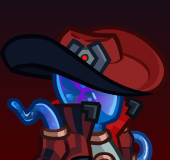
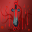
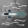
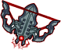
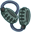
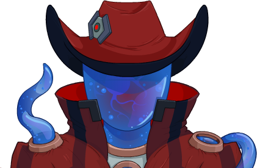
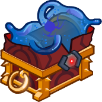

[Back to Main](index.md)

# Vin Ursa

Vin Ursa is one of the deadliest bounty hunters in Wildspace. Raised by autognome thieves and trained by a former Xaryxian assassin, Vin has all the skills she needs to get the job done. To keep those skills honed, she spends much of her off time in the Arena of Blood. If there's one thing you should hope for in Wildspace, it's to avoid ending up on the wrong side of her L.A.S.E.R. sight. She's built her renown fighting some of the most terrifying creatures this side of the Abyss and has a long list of Favored Foes to show for it.

# Basic Information

Vin Ursa will be the new champion in the Midsummer event on 26 July 2023.

* Seat: 7
* Race: Plasmoid
* Class: Fighter / Rogue
* Roles: Support / Gold
* Age: 27
* Gender: Female
* Alignment: Lawful Evil

| Stat | Value | Day 1 Trials | Patrons |
|---|---|---|---|
| Strength | 8 | - | Mirt |
| Dexterity | 20 | Yes | - |
| Constitution | 12 | Yes | Strahd |
| Intelligence | 13 | Yes | - |
| Wisdom | 17 | Yes | |
| Charisma | 10 | - | |
| Total | 80 | |

# Formation

# Abilities

 **Base Attack: L.A.S.E.R.** (Ranged)
> Vin Ursa uses her Light Accelerating Spectral Energy Relay to attack a random enemy.

<em>Raw Data</em>

<pre>
{
    "description": "Vin Ursa uses her Light Accelerating Spectral Energy Relay to attack a random enemy.",
    "long_description": "",
    "damage_modifier": 1,
    "damage_types": ["ranged"],
    "graphic_id": 0,
    "target": "random",
    "aoe_radius": 0,
    "tags": ["ranged"],
    "num_targets": 1,
    "animations": [{
        "projectile_details": {
            "projectile_hit_graphic_id": 1701,
            "trail": {
                "scale_lerp": [
                    {
                        "x": 1,
                        "y": 1
                    },
                    {
                        "x": 0,
                        "y": 0
                    }
                ],
                "lifespan": 0.15,
                "initial_velocity": {
                    "x": 0,
                    "y": 0
                },
                "alpha_lerp": [
                    1,
                    0
                ],
                "tint": "#FF0000FF",
                "particle_graphic_ids": [20030],
                "spawn_rate": 150,
                "velocity_jitter": {
                    "x": 0,
                    "y": 0
                }
            },
            "projectile_graphic_id": 20030,
            "projectile_speed": 3000,
            "hash": "ffb4e488d56e318d1834e7dbfb10fc09"
        },
        "hit_sound": 133,
        "shoot_offset_y": -15,
        "shoot_offset_x": 10,
        "shoot_sound": 149,
        "type": "ranged_attack",
        "projectile": "pd_generic_projectile",
        "shoot_frame": 8
    }],
    "name": "L.A.S.E.R.",
    "cooldown": 8,
    "id": 649
}
</pre>

 

 **Ultimate Attack: Target Acquisition** (Level: 35)
> Vin Ursa blasts an enemy. She has a +20% chance to score a critical hit and the enemy becomes a favored foe if she crits.

<em>Raw Data</em>

<pre>
{
    "description": "Vin Ursa blasts an enemy and has a chance to make that enemy a favored foe.",
    "long_description": "Vin Ursa blasts an enemy. She has a +20% chance to score a critical hit and the enemy becomes a favored foe if she crits.",
    "damage_modifier": 0.03,
    "damage_types": ["ranged"],
    "graphic_id": 20019,
    "target": "vin_ursa_random_prefer_non_favored",
    "aoe_radius": 0,
    "tags": [
        "ranged",
        "ultimate"
    ],
    "num_targets": 1,
    "animations": [{
        "ultimate": "vin_ursa",
        "hit_offset": [
            0,
            -50
        ],
        "shoot_offset": [
            50,
            -77
        ],
        "type": "ultimate_attack"
    }],
    "name": "Target Acquisition",
    "cooldown": 240,
    "id": 650
}
</pre>

 

**Wildspace Lover** (Level: 0)
> Vin Ursa can be used in any Light of Xaryxis campaign adventure or variant, even if she would not normally be available to be used due to variant or patron restrictions.

<em>Raw Data</em>

<pre>
{
    "static_dps_mult": null,
    "required_level": 0,
    "effect": "effect_def,1584",
    "name": "Wildspace Lover",
    "id": 12086,
    "hero_id": 127,
    "upgrade_type": "unlock_ability",
    "default_enabled": 1,
    "required_upgrade_id": 0
}
{
    "effect_keys": [{"effect_string": "do_nothing"}],
    "requirements": "",
    "description": {"desc": "$source can be used in any Light of Xaryxis campaign adventure or variant, even if she would not normally be available to be used due to variant or patron restrictions."},
    "id": 1584,
    "flavour_text": "",
    "graphic_id": 0,
    "properties": {
        "is_formation_ability": true,
        "formation_circle_icon": false
    }
}
</pre>

 

 **Bounty Hunter** (Level: 5)
> Vin Ursa picks a random monster type from a monster in the current adventure as her Favored Foe. Her Favored Foes drop 100% extra gold and all Champions deal 100% damage to them.

<em>Upgrade Data</em>

<pre>
Upgrades:
       40: 100%
       50: 100%

    Total Upgrade Bonus: 300%

Expected numbers with various item levels:
	(Does not include feats.)
	(Possibly highly inaccurate.)

	Dull Epic ilvl    100: 1.84e03%
	Dull Epic ilvl  1,000: 5.80e03%
	Dull Epic ilvl 10,000: 4.54e04%
</pre>

<em>Raw Data</em>

<pre>
{
    "static_dps_mult": null,
    "required_level": 5,
    "effect": "effect_def,1585",
    "tip_text": "Vin Ursa picks a random monster type as her favored foe. She can add additional Favored Foe types by using her ultimate ability.",
    "name": "Bounty Hunter",
    "id": 12087,
    "hero_id": 127,
    "upgrade_type": "unlock_ability",
    "default_enabled": 1,
    "required_upgrade_id": 0
}
{
    "effect_keys": [
        {
            "off_when_benched": true,
            "effect_string": "vin_ursa_bounty_hunter"
        },
        {
            "off_when_benched": true,
            "effect_string": "increase_monster_damage_if_favored_foe_from_hero_id,100,127"
        },
        {
            "off_when_benched": true,
            "effect_string": "increase_monster_gold_if_favored_foe_from_hero_id,100,127"
        }
    ],
    "requirements": "",
    "description": {
        "pre": "$source picks a random monster type from a monster in the current adventure as her Favored Foe. Her Favored Foes drop $(amount___2)% extra gold and all Champions deal $(amount___3)% damage to them.",
        "conditions": [{
            "condition": "not static_desc",
            "desc": "^^Favored Foes: $(vin_ursa_bounty_hunter_discovered)^Undiscovered Foes: $(vin_ursa_bounty_hunter_undiscovered)"
        }]
    },
    "id": 1585,
    "flavour_text": "",
    "graphic_id": 20011,
    "properties": {
        "indexed_effect_properties": true,
        "retain_on_slot_changed": true,
        "is_formation_ability": true,
        "owner_use_outgoing_description": true,
        "per_effect_index_bonuses": true
    }
}
</pre>

 

 **Vicious Vantage** (Level: 15)
> Vin Ursa increases the effect of your Deck specialization by 100% for each Favored Foe she has, stacking multiplicatively. Buffs apply to the pre-stack multiplier.

*Note: This ability might be prestack.*

<em>Upgrade Data</em>

<pre>
Upgrades:
       60: 100%

    Total Upgrade Bonus: 100%

Expected numbers with various item levels:
	(Does not include feats.)
	(Possibly highly inaccurate.)

	Dull Epic ilvl    100:
		  0 Stacks: 867.8%
		100 Stacks: 1,835.6%

	Dull Epic ilvl  1,000:
		  0 Stacks: 2,847.8%
		100 Stacks: 5,795.6%

	Dull Epic ilvl 10,000:
		  0 Stacks: 2.26e04%
		100 Stacks: 4.54e04%
</pre>

<em>Raw Data</em>

<pre>
{
    "static_dps_mult": null,
    "required_level": 15,
    "effect": "effect_def,1586",
    "name": "Vicious Vantage",
    "id": 12088,
    "hero_id": 127,
    "upgrade_type": "unlock_ability",
    "default_enabled": 1,
    "required_upgrade_id": 0
}
{
    "effect_keys": [
        {
            "off_when_benched": true,
            "outgoing_buffs": false,
            "effect_string": "pre_stack_amount,100"
        },
        {
            "amount_expr": "upgrade_amount(12088,0)",
            "stack_title": "Favored Foe Count",
            "amount_updated_listeners": ["vin_ursa_favored_foe_count_changed"],
            "stacks_multiply": true,
            "off_when_benched": true,
            "show_bonus": true,
            "amount_func": "mult",
            "stack_func": "per_vin_ursa_favored_foe",
            "effect_string": "buff_upgrades,0,12090,12091"
        }
    ],
    "requirements": "",
    "description": {"desc": "$source increases the effect of your Deck specialization by $(amount)% for each Favored Foe she has, stacking multiplicatively. Buffs apply to the pre-stack multiplier."},
    "id": 1586,
    "flavour_text": "",
    "graphic_id": 20013,
    "properties": {
        "indexed_effect_properties": true,
        "retain_on_slot_changed": true,
        "is_formation_ability": true,
        "default_bonus_index": 0,
        "owner_use_outgoing_description": true,
        "per_effect_index_bonuses": true
    }
}
</pre>

 

**Contract Negotiations** (Level: 20)
> Whenever you use a Bounty Contract with Vin Ursa in the formation, Vin Ursa increases the effect of your Deck specialization by 25% until the end of the current adventure, stacking multiplicatively. Caps at 100 stacks.

<em>Upgrade Data</em>

<pre>
Upgrades:
       70: 100%

    Total Upgrade Bonus: 100%

Expected numbers:
	(Does not include feats.)
	(Possibly highly inaccurate.)

	At softcap:
		  0 Stacks: -100%
		100 Stacks: -100%
</pre>

<em>Raw Data</em>

<pre>
{
    "static_dps_mult": null,
    "required_level": 20,
    "effect": "effect_def,1587",
    "tip_text": "Vin Ursa increases the effect of her buffs whenever Bounty Contracts are used with her in the formation.",
    "name": "Contract Negotiations",
    "id": 12089,
    "hero_id": 127,
    "upgrade_type": "unlock_ability",
    "default_enabled": 1,
    "required_upgrade_id": 0
}
{
    "effect_keys": [
        {
            "stack_title": "Bounty Contracts Used",
            "stacks_multiply": true,
            "off_when_benched": true,
            "show_bonus": true,
            "effect_string": "buff_upgrades,25,12090,12091",
            "max_stacks": 100,
            "stacks_on_trigger": "bounty_contract_used"
        },
        {
            "off_when_benched": true,
            "is_instanced_stat": true,
            "use_stat_defs": true,
            "effect_string": "stacks_data_binder_safe,0,vin_ursa_contract_stacks"
        }
    ],
    "requirements": "",
    "description": {"desc": "Whenever you use a Bounty Contract with $source in the formation, Vin Ursa increases the effect of your Deck specialization by $(not_buffed amount)% until the end of the current adventure, stacking multiplicatively. Caps at 100 stacks."},
    "id": 1587,
    "flavour_text": "",
    "graphic_id": 0,
    "properties": {
        "is_formation_ability": true,
        "owner_use_outgoing_description": true,
        "formation_circle_icon": false
    }
}
</pre>

 

# Specialisations

 **Front Deck** (Level: 10)
> Vin Ursa increases the damage of all champions in the front two columns by 100%.

<em>Upgrade Data</em>

<pre>
Upgrades:
       80: 100%

    Total Upgrade Bonus: 100%

Expected numbers with various item levels:
	(Does not include feats.)
	(Possibly highly inaccurate.)

	Dull Epic ilvl    100: 8.68e02%
	Dull Epic ilvl  1,000: 2.85e03%
	Dull Epic ilvl 10,000: 2.26e04%
</pre>

<em>Raw Data</em>

<pre>
{
    "static_dps_mult": null,
    "specialization_name": "Front Deck",
    "required_level": 10,
    "effect": "effect_def,1588",
    "name": "Front Deck",
    "specialization_graphic_id": 20017,
    "id": 12090,
    "hero_id": 127,
    "upgrade_type": "unlock_ability",
    "default_enabled": 1,
    "required_upgrade_id": 0,
    "specialization_description": "Vin Ursa focuses her efforts on the front-most columns of the formation."
}
{
    "effect_keys": [{
        "off_when_benched": true,
        "effect_string": "hero_dps_multiplier_mult,100",
        "targets": ["front_2_columns"]
    }],
    "requirements": "",
    "description": {"desc": "$source increases the damage of all champions in the front two columns by $(amount)%."},
    "id": 1588,
    "flavour_text": "",
    "graphic_id": 20200,
    "properties": {"is_formation_ability": true}
}
</pre>

 

 **Rear Deck** (Level: 10)
> Vin Ursa increases the damage of all champions in the rear two columns by 100%.

<em>Upgrade Data</em>

<pre>
Upgrades:
       80: 100%

    Total Upgrade Bonus: 100%

Expected numbers with various item levels:
	(Does not include feats.)
	(Possibly highly inaccurate.)

	Dull Epic ilvl    100: 8.68e02%
	Dull Epic ilvl  1,000: 2.85e03%
	Dull Epic ilvl 10,000: 2.26e04%
</pre>

<em>Raw Data</em>

<pre>
{
    "static_dps_mult": null,
    "specialization_name": "Rear Deck",
    "required_level": 10,
    "effect": "effect_def,1589",
    "name": "Rear Deck",
    "specialization_graphic_id": 20018,
    "id": 12091,
    "hero_id": 127,
    "upgrade_type": "unlock_ability",
    "default_enabled": 1,
    "required_upgrade_id": 0,
    "specialization_description": "Vin Ursa focuses her efforts on the rear-most columns of the formation."
}
{
    "effect_keys": [{
        "off_when_benched": true,
        "effect_string": "hero_dps_multiplier_mult,100",
        "targets": ["back_2_columns"]
    }],
    "requirements": "",
    "description": {"desc": "$source increases the damage of all champions in the rear two columns by $(amount)%."},
    "id": 1589,
    "flavour_text": "",
    "graphic_id": 20201,
    "properties": {"is_formation_ability": true}
}
</pre>

 

 **Friends in High Places** (Level: 30)
> Vin Ursa increases the damage of Good Champions by 100%.

<em>Upgrade Data</em>

<pre>
Upgrades:
       90: 100%

    Total Upgrade Bonus: 100%

Expected numbers with various item levels:
	(Does not include feats.)
	(Possibly highly inaccurate.)

	Dull Epic ilvl    100: 8.68e02%
	Dull Epic ilvl  1,000: 2.85e03%
	Dull Epic ilvl 10,000: 2.26e04%
</pre>

<em>Raw Data</em>

<pre>
{
    "static_dps_mult": null,
    "specialization_name": "Friends in High Places",
    "required_level": 30,
    "effect": "effect_def,1592",
    "name": "Friends in High Places",
    "specialization_graphic_id": 20014,
    "id": 12094,
    "hero_id": 127,
    "upgrade_type": "unlock_ability",
    "default_enabled": 1,
    "required_upgrade_id": 0,
    "specialization_description": "Vin Ursa reluctantly hangs out with Champions that have a moral code."
}
{
    "effect_keys": [{
        "off_when_benched": true,
        "effect_string": "hero_dps_multiplier_mult,100",
        "filter_targets": [{
            "type": "by_tags",
            "tags": "good"
        }],
        "targets": ["all"]
    }],
    "requirements": "",
    "description": {"desc": "$source increases the damage of Good Champions by $(amount)%."},
    "id": 1592,
    "flavour_text": "",
    "graphic_id": 20197,
    "properties": {
        "is_formation_ability": true,
        "spec_option_post_apply_info": "Champions in Formation Targeted: $num_targets"
    }
}
</pre>

 

 **Friends in Low Places** (Level: 30)
> Vin Ursa increases the damage of Evil Champions by 100%.

<em>Upgrade Data</em>

<pre>
Upgrades:
       90: 100%

    Total Upgrade Bonus: 100%

Expected numbers with various item levels:
	(Does not include feats.)
	(Possibly highly inaccurate.)

	Dull Epic ilvl    100: 8.68e02%
	Dull Epic ilvl  1,000: 2.85e03%
	Dull Epic ilvl 10,000: 2.26e04%
</pre>

<em>Raw Data</em>

<pre>
{
    "static_dps_mult": null,
    "specialization_name": "Friends in Low Places",
    "required_level": 30,
    "effect": "effect_def,1590",
    "name": "Friends in Low Places",
    "specialization_graphic_id": 20015,
    "id": 12092,
    "hero_id": 127,
    "upgrade_type": "unlock_ability",
    "default_enabled": 1,
    "required_upgrade_id": 0,
    "specialization_description": "Vin Ursa likes to hang with a rather sadistic crowd."
}
{
    "effect_keys": [{
        "off_when_benched": true,
        "effect_string": "hero_dps_multiplier_mult,100",
        "filter_targets": [{
            "type": "by_tags",
            "tags": "evil"
        }],
        "targets": ["all"]
    }],
    "requirements": "",
    "description": {"desc": "$source increases the damage of Evil Champions by $(amount)%."},
    "id": 1590,
    "flavour_text": "",
    "graphic_id": 20198,
    "properties": {
        "is_formation_ability": true,
        "spec_option_post_apply_info": "Champions in Formation Targeted: $num_targets"
    }
}
</pre>

 

 **Friends in Meh Places** (Level: 30)
> Vin Ursa increases the damage of Neutral (Good/Evil axis) Champions by 100%.

<em>Upgrade Data</em>

<pre>
Upgrades:
       90: 100%

    Total Upgrade Bonus: 100%

Expected numbers with various item levels:
	(Does not include feats.)
	(Possibly highly inaccurate.)

	Dull Epic ilvl    100: 8.68e02%
	Dull Epic ilvl  1,000: 2.85e03%
	Dull Epic ilvl 10,000: 2.26e04%
</pre>

<em>Raw Data</em>

<pre>
{
    "static_dps_mult": null,
    "specialization_name": "Friends in Meh Places",
    "required_level": 30,
    "effect": "effect_def,1591",
    "name": "Friends in Meh Places",
    "specialization_graphic_id": 20016,
    "id": 12093,
    "hero_id": 127,
    "upgrade_type": "unlock_ability",
    "default_enabled": 1,
    "required_upgrade_id": 0,
    "specialization_description": "Vin Ursa likes to hang with Champions who like to keep their options open."
}
{
    "effect_keys": [{
        "off_when_benched": true,
        "effect_string": "hero_dps_multiplier_mult,100",
        "filter_targets": [{
            "type": "by_tags",
            "tags": "geneutral"
        }],
        "targets": ["all"]
    }],
    "requirements": "",
    "description": {"desc": "$source increases the damage of Neutral (Good/Evil axis) Champions by $(amount)%."},
    "id": 1591,
    "flavour_text": "",
    "graphic_id": 20199,
    "properties": {
        "is_formation_ability": true,
        "spec_option_post_apply_info": "Champions in Formation Targeted: $num_targets"
    }
}
</pre>

 

# Items

| Icon | Slot | Epic Name | Type |
|:-:|---|---|---|
|  | 1 | `Hat of Disguise` | All Champion Damage |
|  | 2 | `Cloak of Stars and Darkness` | Bounty Hunter |
|  | 3 | `Starstrike Array` | Vicious Vantage |
|  | 4 | `Arena of Blood Coin` | All First Specialisations |
|  | 5 | `Infinity's Souvenir` | All Second Specialisations |
|  | 6 | `Dimensional Shackles` | Ultimate Cooldown Reduction |

<em>Item Names and Descriptions</em>

<pre>
Slot 1:
          Traveler's Fedora: Someone told me bounty hunters wear hats. This is what I could
                             afford.
                  Lucky Cap: There are a few more ray gun marks than I thought on this...
          Bounty Hunter Hat: Someone ran at the sight of my hat. It was awesome! I have a look
                             now!
            Hat of Disguise: For when you need a new face. Or a face at all.

Slot 2:
              Security Coat: Nicked this off a guard who wasn't looking. It's got armor inside!
             Well Worn Coat: I genuinely cannot believe how many hits this coat has taken.
            Plasmoid Jacket: I found a plasmoid tailor to make this for me. They knew how to
                             keep me flowing.
Cloak of Stars and Darkness: This lets me seep into the shadows and also watches my back for
                             me.

Slot 3:
          Compact Wrist Bow: I can't afford anything better -- so this will have to do.
          Dead Eye Crossbow: I'm way better with this thing than I should be.
     L.A.S.E.R. Wrist Array: This thing is so cool! Is it too cool for me? Ah! It's so cool!
           Starstrike Array: This was specially designed for me by my dad. It was the last
                             thing he made.

Slot 4:
                Heist Score: This was our last score before the team was wiped out...
            Remaining Stash: There's not much of this left. I need more contracts. Fast.
               Family Gears: Each of these comes from a member of my autognome family.
        Arena of Blood Coin: Old Vocath looked really annoyed when he had to present this to
                             me.

Slot 5:
         Happy Beholder Mug: You'd be surprised how many bounties just walk into a tavern
                             you're already in.
            Replacement Mug: I broke the last one over a giff's head. Got this one for free
                             from Large Luigi.
           Goblinpunk Stein: Have you been to Eberron? That place is WILD!
        Infinity's Souvenir: I just found this place, and I never wanted to leave. SO MANY
                             TAVERNS!

Slot 6:
              Active Bounty: Until I'm in a guild, these will have to do for contracts.
        First Bounty Poster: I still hang onto this all these years later.
    Wildspace Scrying Stone: Wildspace is REALLY big. This helps me find a bounty anywhere.
       Dimensional Shackles: Some bounties require assurance that they stay on this plane.
</pre>

 

# Feats

This list will only show feats that are going to be available on the release of this champion. The separate [Feats](feats.md) page may show others that could be available later if they exist.

| Icon | Feat | Effect | Source |
|---|---|---|---|
|  | `Selflessness` | 10% All Champion Damage | Free |
|  | `Inspiring Leader` | 25% All Champion Damage | Gold Chest |
|  | `Frugal` | 10% Gold | Free |
|  | `Lucky` | 25% Gold | 12,500 Gems |
|  | `Tactical Prowess` | +10% Crit Chance | Free |
|  | `Battle Expertise` | +20% Crit Chance | Gold Chest |
|  | `Have I Fought You Before?` | 20% Bounty Hunter | Free |
|  | `Old Faces, New Battles` | 40% Bounty Hunter | 12,500 Gems |
|  | `Muscle Memory` | 40% Bounty Hunter | Gold Chest |
|  | `Timing is Everything` | 40% Vicious Vantage | 12,500 Gems |
|  | `High Ground` | 80% Vicious Vantage | 50,000 Gems |
|  | `Aggressive Negotiations` | 40% Contract Negotiations | Gold Chest |

# Legendaries

* Increases the damage of all Champions by 100%.
* Increases the damage of all Nonbinary Champions by 200%.
* Increases the damage of all Champions by 10% for each Champion in the formation.
* Increases the damage of all Champions with a CON score of 11 or higher by 100%.
* Increases the damage of all Champions with a INT score of 13 or higher by 150%.
* Increases the damage of all Lawful Champions by 150%.

<em>DPS Applicable</em>

<pre>
  Arkhan: 3 / 6
 Artemis: 5 / 6
 Asharra: 4 / 6
   Azaka: 4 / 6
  Binwin: 4 / 6
Birdsong: 5 / 6
  D'hani: 3 / 6
  Delina: 4 / 6
 Dhadius: 3 / 6
  Drizzt: 4 / 6
     Fen: 4 / 6
   Grimm: 3 / 6
  Gromma: 4 / 6
    Ishi: 3 / 6
 Jaheira: 3 / 6
 Jamilah: 3 / 6
Jarlaxle: 4 / 6
    Kent: 4 / 6
   Krond: 4 / 6
   Makos: 4 / 6
   NERDS: 4 / 6
  Nahara: 3 / 6
   Nixie: 3 / 6
   Nrakk: 4 / 6
  Orisha: 3 / 6
Prudence: 4 / 6
   Rosie: 3 / 6
   Strix: 4 / 6
 Torogar: 4 / 6
  Warden: 4 / 6
 Warduke: 3 / 6
  Yorven: 3 / 6
   Zorbu: 3 / 6
</pre>

 

# Console Portrait

# Chests

| Gold | Silver |
|---|---|
|  |  |

[Back to Top](#top)

*Last Modified: {{ site.time }}*