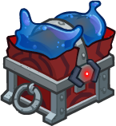

[Back to Main](index.md)

# Vin Ursa

She's been confirmed on the Server Maintenance Stream by Chris Dupuis to be a CNE Original Female Plasmoid champion. Beyond that - we know nothing.

# Basic Information

Vin Ursa will be the new champion in the Midsummer event on 26 July 2023.

* Seat: Unknown
* Race: Plasmoid
* Class: Unknown
* Roles: Unknown
* Age: Unknown
* Gender: Female
* Alignment: Unknown
* Affiliation: Unknown
* Stats: Unknown

# Formation

Unknown.




# Abilities

**Base Attack: Unknown**
> Unknown effect.

<em>Raw Data</em>

<pre>
</pre>

 

**Ultimate Attack: Unknown**
> Unknown effect.

<em>Raw Data</em>

<pre>
</pre>

 

**Bounty Hunter**
> Unknown effect.

<em>Raw Data</em>

<pre>
{
    "p": 0,
    "v": 2,
    "id": 20011,
    "export_params": {"uses": ["icon"]},
    "type": 1,
    "graphic": "Icons/Events/2018Midsummer/Midsummer_Y6/Icon_Formation_VinUrsaBountyHunter",
    "fs": 0
}
</pre>

 

**Friends in High Places**
> Unknown effect.

<em>Raw Data</em>

<pre>
{
    "p": 0,
    "v": 2,
    "id": 20012,
    "export_params": {"uses": ["icon"]},
    "type": 1,
    "graphic": "Icons/Events/2018Midsummer/Midsummer_Y6/Icon_Formation_VinUrsaFriendsinHighPlaces",
    "fs": 0
}
</pre>

 

**Vicious Vantage**
> Unknown effect.

<em>Raw Data</em>

<pre>
{
    "p": 0,
    "v": 2,
    "id": 20013,
    "export_params": {"uses": ["icon"]},
    "type": 1,
    "graphic": "Icons/Events/2018Midsummer/Midsummer_Y6/Icon_Formation_VinUrsaViciousVantage",
    "fs": 0
}
</pre>

 

# Specialisations

**Specialisation: Friend in High Places**
> Unknown effect.

<em>Raw Data</em>

<pre>
{
    "p": 0,
    "v": 2,
    "id": 20014,
    "export_params": {"uses": ["icon"]},
    "type": 1,
    "graphic": "Icons/Events/2018Midsummer/Midsummer_Y6/Icon_Specialization_VinUrsaFriendInHighPlaces",
    "fs": 0
}
</pre>

 

**Specialisation: Friend in Low Places**
> Unknown effect.

<em>Raw Data</em>

<pre>
{
    "p": 0,
    "v": 2,
    "id": 20015,
    "export_params": {"uses": ["icon"]},
    "type": 1,
    "graphic": "Icons/Events/2018Midsummer/Midsummer_Y6/Icon_Specialization_VinUrsaFriendInLowPlaces",
    "fs": 0
}
</pre>

 

**Specialisation: Friend in Meh Places**
> Unknown effect.

<em>Raw Data</em>

<pre>
{
    "p": 0,
    "v": 2,
    "id": 20016,
    "export_params": {"uses": ["icon"]},
    "type": 1,
    "graphic": "Icons/Events/2018Midsummer/Midsummer_Y6/Icon_Specialization_VinUrsaFriendInMehPlaces",
    "fs": 0
}
</pre>

 

**Specialisation: Front Deck**
> Unknown effect.

<em>Raw Data</em>

<pre>
{
    "p": 0,
    "v": 2,
    "id": 20017,
    "export_params": {"uses": ["icon"]},
    "type": 1,
    "graphic": "Icons/Events/2018Midsummer/Midsummer_Y6/Icon_Specialization_VinUrsaFrontDeck",
    "fs": 0
}
</pre>

 

**Specialisation: Rear Deck**
> Unknown effect.

<em>Raw Data</em>

<pre>
{
    "p": 0,
    "v": 2,
    "id": 20018,
    "export_params": {"uses": ["icon"]},
    "type": 1,
    "graphic": "Icons/Events/2018Midsummer/Midsummer_Y6/Icon_Specialization_VinUrsaRearDeck",
    "fs": 0
}
</pre>

 

# Items

| Slot | Name | Type |
|---|---|---|
| 1 | `Bounty Hunter Items` | Unknown |
| 2 | `Coat` | Unknown |
| 3 | `Hat` | Unknown |
| 4 | `Memento` | Unknown |
| 5 | `Tankard` | Unknown |
| 6 | `Wrist Weapon` | Unknown |

# Feats

Unknown.

# Legendaries

Unknown.

# Console Portrait


# Chests

| Gold | Silver |
|---|---|
|  |  |


[Back to Top](#top)

*Last Modified: {{ site.time }}*