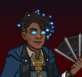

[Back to Main](index.md)

# Virgil
Tall, with dark brown skin, medium length black dreadlocks with silver colored tips (locs with an undercut) and the odd silver and blue hair cuffs sweep to the left over his head. His eyes are a pupil-less pale blue-gray. He wears a dark blue hooded coat over a gray vest and black suspender harness.

[https://rowdnd.fandom.com/wiki/Virgil](https://rowdnd.fandom.com/wiki/Virgil)

# Basic Information
Virgil will be the new champion in the Feast of the Moon event on 9 November 2022.

* Seat: Unknown
* Race: Aasimar
* Class: Sorcerer
* Roles: Unknown (+Speed?)
* Gender: Male
* Alignment: Unknown
* Affiliation: Rivals of Waterdeep
* Stats: Unknown

# Formation

# Abilities
Magic Missile (Base Attack)
> Virgil summons 3 magic missiles and fires them at random targets.

Chain Lightning (Ultimate)
> Virgil attacks a random enemy with a bolt of lightning dealing ultimate damage. Every 0.10 seconds, the lightning bolt attacks another random enemy until 20 enemies are struck or no enemies remain. In addition, the area's weather changes to thunder.

Storm Sorcerer
> Virgil increases the damage of all adjacent Champions by `$(amount)%`, and decreases their normal attack speed cooldown by `$(amount___2)` `$(seconds_plural)`.

Weather Control
> Virgil gains a Weather stack each time the weather changes when advancing to a new area or when it's changed by an ultimate attack or other ability. Virgil tracks each type of weather in a separate stack. Each stack is multiplied by `$(stack_mult_percent)%` and then all stacks are multiplied together to get a total value which increases the damage of all Champions. Each stack caps at `$(max_stacks_per_weather_type)`.

Inseparable Bond (Guess)
> If Kent qualifies for an adventure restriction based on his tags, age, ability scores, etc., Virgil may be used as well.

Unknown Name (Guessing this is Virgil's.)
> Enemies that are defeated within `$(seconds_plural optional_within_time)` of being on screen have a `$(not_buffed amount)%` chance to drop double quest items or count for double quest progress for each Rivals of Waterdeep Champion in the formation, stacking additively.

Unknown Name
> While a Champion in the formation is knocked out, Virgil's magic missile and chain lightning attacks turn red and any enemy he hits with his base attack takes an additional `$(amount)%` damage for the next `$(total_seconds)` seconds. If an enemy is hit again, the timer is reset but doesn't otherwise stack.

# Specialisations
Mood Anxious / Mood Determined / Mood Relaxed  
I don't know which is for which.
> Virgil's magic missile and chain lightning attacks turn green, and he further increases Storm Sorcerer's damage boost by 100% and increases the attack cooldown reduction by a further 1 second.

>Virgil's magic missile and chain lightning attacks turn amber, he increases the number of magic missiles he fires by one, and there is a 25% chance he stuns an enemy struck by a magic missile for 5 seconds.

> Virgil's magic missile and chain lightning attacks turn violet, and Virgil increases Weather Control's damage boost by 33% for each Rivals of Waterdeep Champion in the formation, stacking multiplicatively.

# Items

1. Bladed Fan
2. Journal
3. Kent Connection
4. Magic Bracers
5. Shirt
6. Waders

# Legendaries
Unknown.

[Back to Top](#top)

*Last Modified: {{ site.time }}*