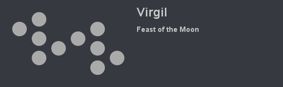

[Back to Main](index.md)

# Virgil
Tall, with dark brown skin, medium length black dreadlocks with silver colored tips (locs with an undercut) and the odd silver and blue hair cuffs sweep to the left over his head. His eyes are a pupil-less pale blue-gray. He wears a dark blue hooded coat over a gray vest and black suspender harness.

[https://rowdnd.fandom.com/wiki/Virgil](https://rowdnd.fandom.com/wiki/Virgil)

## Basic Information
Virgil will be the new champion in the Feast of the Moon event on 9 November 2022.

* Race: Aasimar
* Class: Sorcerer
* Gender: Male
* Affiliation: Rivals of Waterdeep
* Seat: Unknown
* Stats: Unknown

## Formation
Unknown.
<!-- Uncomment once formation is available. -->
<!--  -->

## Abilities
Unknown.

## Specialisations
Unknown.

## Items
Unknown.

## Legendaries
Unknown.

[Back to Top](#top)