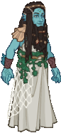

[Back to Main](index.md)

    
        
            
        
        
        Portrait
        
    
    
        
            
        
        
        Base Model
        
    
    
        
            
        
        
        Persana Model
        
    

# Vlithryn

A guest player playing a Triton Cleric of Persana, whose good intentions are largely wasted amidst a party of murderhobos.

[One For All - TV Tropes](https://tvtropes.org/pmwiki/pmwiki.php/Characters/OneForAll)

# Basic Information

Vlithryn will be a new champion in the The Great Modron March event on 7 May 2025.

    
        
            **Seat**:
        
        
            Unknown
        
    
    
        
            **Species**:
        
        
            Triton (Guess)
        
    
    
        
            **Class**:
        
        
            Cleric (Guess)
        
    
    
        
            **Roles**:
        
        
            Support / Healing / Control (Guess)
        
    
    
        
            **Age**:
        
        
            Unknown
        
    
    
        
            **Gender**:
        
        
            Female (Guess)
        
    
    
        
            **Alignment**:
        
        
            Unknown
        
    
    
        
            **Affiliation**:
        
        
            Awful Ones (Guess)
        
    

# Formation

Unknown.


    



# Attacks

**Base Attack: Blessed Mace** (Melee)
> Vlithryn attacks a random enemy, dealing 1 hit and knocking them back a short distance.  
> Cooldown: 6s (Cap 1.5s)

<em>Raw Data</em>

<pre>
{
    "id": 843,
    "name": "Blessed Mace",
    "description": "Vlithryn attacks a random enemy, dealing 1 hit and knocking them back a short distance.",
    "long_description": "",
    "graphic_id": 0,
    "target": "random",
    "num_targets": 1,
    "aoe_radius": 0,
    "damage_modifier": 1,
    "cooldown": 6,
    "animations": [
        {
            "type": "melee_attack",
            "damage_frame": 3
        }
    ],
    "tags": [
        {
            "type": "melee_attack",
            "target_offset_x": -34,
            "damage_frame": 2,
            "jump_sound": 30,
            "sound_frames": {
                "2": 154
            }
        }
    ],
    "damage_types": [
        "melee"
    ]
}
</pre>

**Base Attack: Call Lightning**
> Vlithryn zaps the enemy with the most remaining Health, and then empowers her attack with lightning for 15 seconds, increasing her attack speed and adding BUD-based damage.  
> Cooldown: 180s (Cap 45s)

<em>Raw Data</em>

<pre>
{
    "id": 844,
    "name": "Call Lightning",
    "description": "Vlithryn zaps the enemy with the most Health, then empowering her attacks for 15 seconds.",
    "long_description": "Vlithryn zaps the enemy with the most remaining Health, and then empowers her attack with lightning for 15 seconds, increasing her attack speed and adding BUD-based damage.",
    "graphic_id": 0,
    "target": "highest_health",
    "num_targets": 1,
    "aoe_radius": 0,
    "damage_modifier": 1,
    "cooldown": 180,
    "animations": "",
    "tags": "",
    "damage_types": ""
}
</pre>

# Abilities

**Justice of the Depths** (Guess)
> Vlithryn increases the damage of all Champions in the columns in front of her by 400%.

<em>Raw Data</em>

<pre>
{
    "id": 2279,
    "flavour_text": "",
    "description": {
        "desc": "Vlithryn increases the damage of all Champions in the columns in front of her by $amount%."
    },
    "effect_keys": [
        {
            "effect_string": "hero_dps_multiplier_mult,400",
            "targets": [
                "ahead"
            ]
        }
    ],
    "requirements": "",
    "graphic_id": 26240,
    "large_graphic_id": 26233,
    "properties": {
        "is_formation_ability": true,
        "indexed_effect_properties": true,
        "per_effect_index_bonuses": true,
        "default_bonus_index": 0
    }
}
</pre>

**Cleric Clinic** (Guess)
> Every second, Vlithryn heals the most damaged Champion for 20 health. This amount is increased by 25% for each Tanking Champion in the formation.

<em>Raw Data</em>

<pre>
{
    "id": 2280,
    "flavour_text": "",
    "description": {
        "desc": "Every second, Vlithryn heals the most damaged Champion for $amount health. This amount is increased by $(not_buffed amount___2)% for each Tanking Champion in the formation."
    },
    "effect_keys": [
        {
            "effect_string": "heal_most_damaged,20",
            "off_when_benched": true,
            "on_trigger": "on_timer,1",
            "targets": [
                "all_slots"
            ]
        },
        {
            "effect_string": "pre_stack,25",
            "skip_effect_key_desc": true
        },
        {
            "effect_string": "buff_upgrade,0,16896",
            "amount_expr": "upgrade_amount(16896,1)",
            "amount_func": "mult",
            "stack_func": "per_hero_attribute",
            "per_hero_expr": "HasTag(`tanking`)",
            "amount_updated_listeners": [
                "slot_changed"
            ],
            "show_bonus": true
        }
    ],
    "requirements": "",
    "graphic_id": 26238,
    "large_graphic_id": 26231,
    "properties": {
        "owner_use_outgoing_description": true,
        "indexed_effect_properties": true,
        "per_effect_index_bonuses": true,
        "default_bonus_index": 0,
        "show_bonus": true
    }
}
</pre>

**Divine Intervention** (Guess)
> Unknown effect.

<em>Raw Data</em>

<pre>
{
    "id": 26239,
    "graphic": "Icons/Events/2018 GreatModronMarch/GreatModronMarch_Y8/Icon_Formation_Vlithryn_DivineIntervention",
    "v": 2,
    "fs": 0,
    "p": 0,
    "type": 1,
    "export_params": {
        "uses": [
            "icon"
        ],
        "quantize": true
    }
}
</pre>

**Pantheon of Blessings** (Guess)
> Unknown effect.

<em>Raw Data</em>

<pre>
{
    "id": 26241,
    "graphic": "Icons/Events/2018 GreatModronMarch/GreatModronMarch_Y8/Icon_Formation_Vlithryn_PantheonofBlessings",
    "v": 2,
    "fs": 0,
    "p": 0,
    "type": 1,
    "export_params": {
        "uses": [
            "icon"
        ],
        "quantize": true
    }
}
</pre>

**Revivify** (Guess)
> Unknown effect.

<em>Raw Data</em>

<pre>
{
    "id": 26242,
    "graphic": "Icons/Events/2018 GreatModronMarch/GreatModronMarch_Y8/Icon_Formation_Vlithryn_Revivify",
    "v": 2,
    "fs": 0,
    "p": 0,
    "type": 1,
    "export_params": {
        "uses": [
            "icon"
        ],
        "quantize": true
    }
}
</pre>

# Specialisations

**Help the Unfortunate** (Guess)
> Unknown effect.

<em>Raw Data</em>

<pre>
{
    "id": 26245,
    "graphic": "Icons/Events/2018 GreatModronMarch/GreatModronMarch_Y8/Icon_Specialization_Vlithryn_HelptheUnfortunate",
    "v": 2,
    "fs": 0,
    "p": 0,
    "type": 1,
    "export_params": {
        "uses": [
            "icon"
        ],
        "quantize": true
    }
}
</pre>

**Spreading the Word** (Guess)
> Unknown effect.

<em>Raw Data</em>

<pre>
{
    "id": 26246,
    "graphic": "Icons/Events/2018 GreatModronMarch/GreatModronMarch_Y8/Icon_Specialization_Vlithryn_SpreadingtheWord",
    "v": 2,
    "fs": 0,
    "p": 0,
    "type": 1,
    "export_params": {
        "uses": [
            "icon"
        ],
        "quantize": true
    }
}
</pre>

**Who Else Would Save Them** (Guess)
> Unknown effect.

<em>Raw Data</em>

<pre>
{
    "id": 26247,
    "graphic": "Icons/Events/2018 GreatModronMarch/GreatModronMarch_Y8/Icon_Specialization_Vlithryn_WhoElseWouldSaveThem",
    "v": 2,
    "fs": 0,
    "p": 0,
    "type": 1,
    "export_params": {
        "uses": [
            "icon"
        ],
        "quantize": true
    }
}
</pre>

# Items

    
        
            **Icons**
        
        
            **Name**
        
    
    
        
            
        
        
            Armor
        
    
    
        
            
        
        
            Books
        
    
    
        
            
        
        
            Headgear
        
    
    
        
            
        
        
            Healing Payment
        
    
    
        
            
        
        
            Maces
        
    
    
        
            
        
        
            Spell Components
        
    

# Feats

Unknown.

# Legendaries

Unknown.

# Adventures and Variants

**Unlock Adventure: The Mechanical Menace (???)** (Complete Area 50)
> Stop the Modron March from crushing Waterdeep under its mechanical heel.

**Variant 1: TBD** (Complete Area 75)
> 

**Variant 2: TBD** (Complete Area 125)
> 

**Variant 3: TBD** (Complete Area 175)
> 

# Other Champion Images

    
        
            Console Portrait
        
    
    
        
            Gold Chest Icon
        
        
            Silver Chest Icon
        
    

[Back to Top](#top)

*Last Modified: {{ site.time }}*