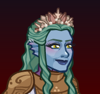

[Back to Main](index.md)

    
        
            
        
        
        Portrait
        
    
    
        
            
        
        
        Model
        
    

# Vlithryn

A guest player playing a Triton Cleric of Persana, whose good intentions are largely wasted amidst a party of murderhobos.

[One For All - TV Tropes](https://tvtropes.org/pmwiki/pmwiki.php/Characters/OneForAll)

# Basic Information

Vlithryn will be a new champion in the The Great Modron March event on 7 May 2025.

    
        
            **Seat**:
        
        
            Unknown
        
    
    
        
            **Species**:
        
        
            Triton (Guess)
        
    
    
        
            **Class**:
        
        
            Cleric (Guess)
        
    
    
        
            **Roles**:
        
        
            Unknown
        
    
    
        
            **Age**:
        
        
            Unknown
        
    
    
        
            **Gender**:
        
        
            Female (Guess)
        
    
    
        
            **Alignment**:
        
        
            Unknown
        
    
    
        
            **Affiliation**:
        
        
            Awful Ones (Guess)
        
    

# Formation

Unknown.


    



# Attacks

Unknown.

# Abilities

Unknown.

# Specialisations

Unknown.

# Items

Unknown.

# Feats

Unknown.

# Legendaries

Unknown.

# Adventures and Variants

**Unlock Adventure: The Mechanical Menace (???)** (Complete Area 50)
> Stop the Modron March from crushing Waterdeep under its mechanical heel.

**Variant 1: TBD** (Complete Area 75)
> 

**Variant 2: TBD** (Complete Area 125)
> 

**Variant 3: TBD** (Complete Area 175)
> 

# Other Champion Images

    
        
            Console Portrait
        
    
    
        
            Gold Chest Icon
        
        
            Silver Chest Icon
        
    

[Back to Top](#top)

*Last Modified: {{ site.time }}*