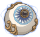

[Back to Main](index.md)

    
        
            
        
        
        Portrait
        
    
    
        
            
        
        
        Model
        
    

# Volo

Volo was a too-curious-for-his-own-good travelling scholar and minor wizard. Always on the lookout for an exposé, he all too frequently was at odds with Elminster, who preferred some things to be kept in the dark. In fact, it was his assembling his "first" guide—Volo's Guide to All Things Magical—that put him on the "path" to making his other guides. As for Elminster, it is he who edits every guide that Volo has published, as evident in the many footnotes in each, including Volo's Guide to All Things Magical, which almost got Volo killed making it.

[Wikipedia](https://en.wikipedia.org/wiki/Volothamp_Geddarm/)

# Basic Information

Volo will be a new champion in the Fleetswake event on 5 March 2025.

    
        
            **Seat**:
        
        
            Unknown
        
    
    
        
            **Species**:
        
        
            Human (Guess)
        
    
    
        
            **Class**:
        
        
            Wizard (Guess)
        
    
    
        
            **Roles**:
        
        
            Unknown
        
    
    
        
            **Age**:
        
        
            Unknown
        
    
    
        
            **Gender**:
        
        
            Male (Guess)
        
    
    
        
            **Alignment**:
        
        
            Chaotic Good (Guess)
        
    
    
        
            **Affiliation**:
        
        
            Unknown
        
    

# Formation

Unknown.


    



# Attacks

Unknown.

# Abilities

**Combat** (Guess)
> Unknown effect.

<em>Raw Data</em>

<pre>
{
    "id": 25729,
    "graphic": "Icons/Events/2018Fleetswake/Fleetswake_Y8/Icon_Formation_Volo_Combat",
    "v": 2,
    "fs": 0,
    "p": 0,
    "type": 1,
    "export_params": {
        "uses": [
            "icon"
        ],
        "quantize": true
    }
}
</pre>

**Monsters** (Guess)
> Unknown effect.

<em>Raw Data</em>

<pre>
{
    "id": 25730,
    "graphic": "Icons/Events/2018Fleetswake/Fleetswake_Y8/Icon_Formation_Volo_Monsters",
    "v": 2,
    "fs": 0,
    "p": 0,
    "type": 1,
    "export_params": {
        "uses": [
            "icon"
        ],
        "quantize": true
    }
}
</pre>

**Questing** (Guess)
> Unknown effect.

<em>Raw Data</em>

<pre>
{
    "id": 25731,
    "graphic": "Icons/Events/2018Fleetswake/Fleetswake_Y8/Icon_Formation_Volo_Questing",
    "v": 2,
    "fs": 0,
    "p": 0,
    "type": 1,
    "export_params": {
        "uses": [
            "icon"
        ],
        "quantize": true
    }
}
</pre>

**Retreats** (Guess)
> Unknown effect.

<em>Raw Data</em>

<pre>
{
    "id": 25732,
    "graphic": "Icons/Events/2018Fleetswake/Fleetswake_Y8/Icon_Formation_Volo_Retreats",
    "v": 2,
    "fs": 0,
    "p": 0,
    "type": 1,
    "export_params": {
        "uses": [
            "icon"
        ],
        "quantize": true
    }
}
</pre>

# Specialisations

**All Things Magical** (Guess)
> Unknown effect.

<em>Raw Data</em>

<pre>
{
    "id": 25739,
    "graphic": "Icons/Events/2018Fleetswake/Fleetswake_Y8/Icon_Specialization_Volo_AllThingsMagical",
    "v": 2,
    "fs": 0,
    "p": 0,
    "type": 1,
    "export_params": {
        "uses": [
            "icon"
        ],
        "quantize": true
    }
}
</pre>

**Brain Eating Tadpoles** (Guess)
> Unknown effect.

<em>Raw Data</em>

<pre>
{
    "id": 25740,
    "graphic": "Icons/Events/2018Fleetswake/Fleetswake_Y8/Icon_Specialization_Volo_BrainEatingTadpoles",
    "v": 2,
    "fs": 0,
    "p": 0,
    "type": 1,
    "export_params": {
        "uses": [
            "icon"
        ],
        "quantize": true
    }
}
</pre>

**Spirits and Specters** (Guess)
> Unknown effect.

<em>Raw Data</em>

<pre>
{
    "id": 25741,
    "graphic": "Icons/Events/2018Fleetswake/Fleetswake_Y8/Icon_Specialization_Volo_SpiritsandSpecters",
    "v": 2,
    "fs": 0,
    "p": 0,
    "type": 1,
    "export_params": {
        "uses": [
            "icon"
        ],
        "quantize": true
    }
}
</pre>

# Items

    
        
            **Icons**
        
        
            **Name**
        
    
    
        
            
        
        
            Assorted Stuff
        
    
    
        
            
        
        
            Beret
        
    
    
        
            
        
        
            Books
        
    
    
        
            
        
        
            Bottle Of Ink
        
    
    
        
            
        
        
            Manuscript
        
    
    
        
            
        
        
            Weapons
        
    

# Feats

Unknown.

# Legendaries

Unknown.

# Adventures and Variants

**Unlock Adventure: The Unfair Sea (???)** (Complete Area 50)
> Search for some missing ships during Fleetswake in Waterdeep.

**Variant 1: TBD** (Complete Area 75)
> 

**Variant 2: TBD** (Complete Area 125)
> 

**Variant 3: TBD** (Complete Area 175)
> 

# Other Champion Images

    
        
            Console Portrait
        
    
    
        
            Gold Chest Icon
        
        
            Silver Chest Icon
        
    

[Back to Top](#top)

*Last Modified: {{ site.time }}*