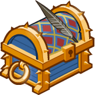

[Back to Main](index.md)

    
        
            
        
        
        Portrait
        
    
    
        
            
        
        
        Model
        
    

# Volo

Volo was a too-curious-for-his-own-good travelling scholar and minor wizard. Always on the lookout for an exposé, he all too frequently was at odds with Elminster, who preferred some things to be kept in the dark. In fact, it was his assembling his "first" guide—Volo's Guide to All Things Magical—that put him on the "path" to making his other guides. As for Elminster, it is he who edits every guide that Volo has published, as evident in the many footnotes in each, including Volo's Guide to All Things Magical, which almost got Volo killed making it.

[Wikipedia](https://en.wikipedia.org/wiki/Volothamp_Geddarm/)

# Basic Information

Volo will be a new champion in the Fleetswake event on 5 March 2025.

    
        
            **Seat**:
        
        
            Unknown
        
    
    
        
            **Species**:
        
        
            Human (Guess)
        
    
    
        
            **Class**:
        
        
            Wizard (Guess)
        
    
    
        
            **Roles**:
        
        
            Support / Hunter (Guess)
        
    
    
        
            **Age**:
        
        
            Unknown
        
    
    
        
            **Gender**:
        
        
            Male (Guess)
        
    
    
        
            **Alignment**:
        
        
            Chaotic Good (Guess)
        
    
    
        
            **Affiliation**:
        
        
            Unknown
        
    

# Formation

Unknown.


    



# Attacks

Unknown.

# Abilities

**Unknown** (Guess)
> Volo can be used in any Grand Tour of the Sword Coast campaign adventure or variant, even if he would not normally be available to be used due to variant or patron restrictions.

<em>Raw Data</em>

<pre>
{
    "id": 2230,
    "flavour_text": "",
    "description": {
        "desc": "Volo can be used in any Grand Tour of the Sword Coast campaign adventure or variant, even if he would not normally be available to be used due to variant or patron restrictions."
    },
    "effect_keys": [
        {
            "effect_string": "do_nothing"
        }
    ],
    "requirements": "",
    "graphic_id": 0,
    "large_graphic_id": 0,
    "properties": {
        "is_formation_ability": true,
        "formation_circle_icon": false,
        "owner_use_outgoing_description": true
    }
}
</pre>

**Volo's Guide to Combat** (Guess)
> Volo increases the damage of all Champions in the two columns in front of him by 100%.

<em>Raw Data</em>

<pre>
{
    "id": 2231,
    "flavour_text": "",
    "description": {
        "desc": "Volo increases the damage of all Champions in the two columns in front of him by $amount%."
    },
    "effect_keys": [
        {
            "effect_string": "hero_dps_multiplier_mult,100",
            "targets": [
                "next_two_col"
            ]
        }
    ],
    "requirements": "",
    "graphic_id": 0,
    "large_graphic_id": 0,
    "properties": {
        "is_formation_ability": true,
        "formation_circle_icon": false,
        "owner_use_outgoing_description": true,
        "indexed_effect_properties": true,
        "per_effect_index_bonuses": true,
        "default_bonus_index": 0
    }
}
</pre>

**Questing** (Guess)
> Volo increases the effect of Volo's Guide to Combat by 100% for each Guide and/or Collection Quest completed, stacking multiplicatively.

ⓘ *Note: This ability is prestack.*

<em>Raw Data</em>

<pre>
{
    "id": 2232,
    "flavour_text": "",
    "description": {
        "desc": "Volo increases the effect of Volo's Guide to Combat by $amount% for each Guide and/or Collection Quest completed, stacking multiplicatively."
    },
    "effect_keys": [
        {
            "effect_string": "pre_stack,100"
        }
    ],
    "requirements": "",
    "graphic_id": 0,
    "large_graphic_id": 0,
    "properties": {
        "is_formation_ability": true,
        "formation_circle_icon": false,
        "owner_use_outgoing_description": true,
        "indexed_effect_properties": true,
        "per_effect_index_bonuses": true,
        "default_bonus_index": 0
    }
}
</pre>

**Monsters** (Guess)
> Volo counts each type of enemy encountered in the current adventure. Volo increases the effect of Volo's Guide to Combat by 100% for each enemy type encountered, stacking multiplicatively.

ⓘ *Note: This ability is prestack.*

<em>Raw Data</em>

<pre>
{
    "id": 2233,
    "flavour_text": "",
    "description": {
        "desc": "Volo counts each type of enemy encountered in the current adventure. Volo increases the effect of Volo's Guide to Combat by $amount% for each enemy type encountered, stacking multiplicatively."
    },
    "effect_keys": [
        {
            "effect_string": "pre_stack,100"
        }
    ],
    "requirements": "",
    "graphic_id": 0,
    "large_graphic_id": 0,
    "properties": {
        "is_formation_ability": true,
        "formation_circle_icon": false,
        "owner_use_outgoing_description": true,
        "indexed_effect_properties": true,
        "per_effect_index_bonuses": true,
        "default_bonus_index": 0
    }
}
</pre>

**Retreats** (Guess)
> If a Champion in the column in front of Volo is defeated, the formation immediately retreats to the previous area. Upon returning to the area of their near defeat, the effect of Volo's Guide to Combat is increased by $amount% in that area.

<em>Raw Data</em>

<pre>
{
    "id": 2234,
    "flavour_text": "",
    "description": {
        "desc": "If a Champion in the column in front of Volo is defeated, the formation immediately retreats to the previous area. Upon returning to the area of their near defeat, the effect of Volo's Guide to Combat is increased by $amount% in that area."
    },
    "effect_keys": [
        {
            "effect_string": "do_nothing"
        }
    ],
    "requirements": "",
    "graphic_id": 0,
    "large_graphic_id": 0,
    "properties": {
        "is_formation_ability": true,
        "formation_circle_icon": false,
        "owner_use_outgoing_description": true,
        "indexed_effect_properties": true,
        "per_effect_index_bonuses": true,
        "default_bonus_index": 0
    }
}
</pre>

# Specialisations

**Spirits and Specters** (Guess)
> Volo gains the Hunter role and Undead become his Favored Foe. The effect of Volo's Guide to Combat is increased by 100% for each Champion in the formation with the Hunter role, stacking multiplicatively.

ⓘ *Note: This ability is prestack.*

<em>Raw Data</em>

<pre>
{
    "id": 2235,
    "flavour_text": "",
    "description": {
        "desc": "Volo gains the Hunter role and Undead become his Favored Foe. The effect of Volo's Guide to Combat is increased by $amount% for each Champion in the formation with the Hunter role, stacking multiplicatively."
    },
    "effect_keys": [
        {
            "effect_string": "pre_stack,100"
        }
    ],
    "requirements": "",
    "graphic_id": 0,
    "large_graphic_id": 0,
    "properties": {
        "is_formation_ability": true,
        "formation_circle_icon": false,
        "owner_use_outgoing_description": true,
        "indexed_effect_properties": true,
        "per_effect_index_bonuses": true,
        "default_bonus_index": 0
    }
}
</pre>

**Brain Eating Tadpoles** (Guess)
> The effect of Volo's Guide to Combat is increased by 100% for each Ceremorphosis stack the formation has, stacking multiplicatively.

ⓘ *Note: This ability is prestack.*

<em>Raw Data</em>

<pre>
{
    "id": 2236,
    "flavour_text": "",
    "description": {
        "desc": "The effect of Volo's Guide to Combat is increased by $amount% for each Ceremorphosis stack the formation has, stacking multiplicatively."
    },
    "effect_keys": [
        {
            "effect_string": "pre_stack,100"
        }
    ],
    "requirements": "",
    "graphic_id": 0,
    "large_graphic_id": 0,
    "properties": {
        "is_formation_ability": true,
        "formation_circle_icon": false,
        "owner_use_outgoing_description": true,
        "indexed_effect_properties": true,
        "per_effect_index_bonuses": true,
        "default_bonus_index": 0
    }
}
</pre>

**All Things Magical** (Guess)
> The effect of Volo's Guide to Combat is increased by 100% for each Champion in the formation with a Magic base attack, stacking multiplicatively.

ⓘ *Note: This ability is prestack.*

<em>Raw Data</em>

<pre>
{
    "id": 2237,
    "flavour_text": "",
    "description": {
        "desc": "The effect of Volo's Guide to Combat is increased by $amount% for each Champion in the formation with a Magic base attack, stacking multiplicatively."
    },
    "effect_keys": [
        {
            "effect_string": "pre_stack,100"
        }
    ],
    "requirements": "",
    "graphic_id": 0,
    "large_graphic_id": 0,
    "properties": {
        "is_formation_ability": true,
        "formation_circle_icon": false,
        "owner_use_outgoing_description": true,
        "indexed_effect_properties": true,
        "per_effect_index_bonuses": true,
        "default_bonus_index": 0
    }
}
</pre>

# Items

    
        
            **Icons**
        
        
            **Name**
        
    
    
        
            
        
        
            Assorted Stuff
        
    
    
        
            
        
        
            Beret
        
    
    
        
            
        
        
            Books
        
    
    
        
            
        
        
            Bottle Of Ink
        
    
    
        
            
        
        
            Manuscript
        
    
    
        
            
        
        
            Weapons
        
    

# Feats

Unknown.

# Legendaries

Unknown.

# Adventures and Variants

**Unlock Adventure: The Missing Merchants (???)** (Complete Area 50)
> Discover the fate of some merchants in the jungles of Chult.

**Variant 1: TBD** (Complete Area 75)
> 

**Variant 2: TBD** (Complete Area 125)
> 

**Variant 3: TBD** (Complete Area 175)
> 

# Other Champion Images

    
        
            Console Portrait
        
    
    
        
            Gold Chest Icon
        
        
            Silver Chest Icon
        
    

[Back to Top](#top)

*Last Modified: {{ site.time }}*