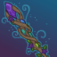
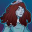

[Back to Main](index.md)

    
        Portrait
    

# Voronika

A young Eladrin woman, raised to be the Queen of Koshmarr, what was meant to be an idyllic life took a dark turn on the night of her wedding. Pulled into the machinations of greater powers, she found herself in Mordent, now one of the many wandering ghosts. A person of great interest both to Azalin Rex and Strahd, she sought to negotiate her freedom from these dread domains. Her longtime companions and their newfound friends wanted the same and imbued her soul into Desmond's sword. As they traveled in search of returning her soul to her body, Voronika took matters into her own hands and used the crown of the Raven Queen to defeat Zybilna and cause the fall of Prismeer. This action drew the mists to Voronika and soon she discovered herself a new darklord in her domain of Koshmarr.

# Changes

Voronika is potentially a reworked champion in the Liars' Night event on 2 October 2024.

Only abilities that have seen some changes will be displayed here - and be aware that there's a lot of guesswork involved. Some abilities may not have names - some may have the *wrong* names - or specialisations might not be marked as such - etc.. Focus on the effect data itself.

Please do me a favour and don't get all melodramatic about what you find here. I - and CNE - don't appreciate it. These are spoilers and will almost certainly change before release - likely multiple times. That and we don't have access to any upgrade data prior to release. Making assumptions on how the champions will turn out based on this information would be premature.

# Abilities

**Pupper Master** (Guess)
> Unknown.

<em>Raw Data</em>

<pre>
{
    "id": 24577,
    "graphic": "Icons/Events/2017LiarsNight/Liars Night Y8/Icon_Formation_Voronika_Puppermaster",
    "v": 3,
    "fs": 0,
    "p": 0,
    "type": 1,
    "export_params": {
        "uses": [
            "icon"
        ],
        "quantize": true
    }
}
</pre>

**Speed Run** (Guess)
> Unknown.

<em>Raw Data</em>

<pre>
{
    "id": 24578,
    "graphic": "Icons/Events/2017LiarsNight/Liars Night Y8/Icon_Formation_Voronika_Speedrun",
    "v": 3,
    "fs": 0,
    "p": 0,
    "type": 1,
    "export_params": {
        "uses": [
            "icon"
        ],
        "quantize": true
    }
}
</pre>

**Embrace Evil** (Guess)
> Unknown.

<em>Raw Data</em>

<pre>
{
    "id": 24582,
    "graphic": "Icons/Events/2017LiarsNight/Liars Night Y8/Icon_Specialization_Voronika_EmbraceEvil",
    "v": 3,
    "fs": 0,
    "p": 0,
    "type": 1,
    "export_params": {
        "uses": [
            "icon"
        ],
        "quantize": true
    }
}
</pre>

**Specialisation: Hunt the Favored** (Guess)
> Unknown.

<em>Raw Data</em>

<pre>
{
    "id": 24583,
    "graphic": "Icons/Events/2017LiarsNight/Liars Night Y8/Icon_Specialization_Voronika_HunttheFavored",
    "v": 3,
    "fs": 0,
    "p": 0,
    "type": 1,
    "export_params": {
        "uses": [
            "icon"
        ],
        "quantize": true
    }
}
</pre>

**Specialisation: Weaken the Fools** (Guess)
> Unknown.

<em>Raw Data</em>

<pre>
{
    "id": 24584,
    "graphic": "Icons/Events/2017LiarsNight/Liars Night Y8/Icon_Specialization_Voronika_WeakentheFools",
    "v": 3,
    "fs": 0,
    "p": 0,
    "type": 1,
    "export_params": {
        "uses": [
            "icon"
        ],
        "quantize": true
    }
}
</pre>

# Adventures and Variants

 **Unlock Adventure: Reclaiming the Past (Voronika)** (Complete Area 50)
> Help Laeral Silverhand track down a retired Open Lord.

 **Variant 1: The Fringe of Society** (Complete Area 75)
> Voronika starts in your formation and can't be moved or removed.  
> Only Black Dice Society affiliation members and Evil Champions can deal damage.  
> Getting to know Voronika: Voronika support abilities increase with each Black Dice Society or Evil champion in the formation. Place those DPS Champions in the column in front of her!

 **Variant 2: Ultimate Challenge** (Complete Area 125)
> Voronika starts in your formation and can't be removed.  
> After area 25, Champions deal no damage unless at least one Ultimate is on cooldown.  
> Getting to know Voronika: Voronika increases her damage buff for the rest of the adventure each time an ultimate is used. Use those ultimates to increase Voronika's power!

 **Variant 3: In Search of Power** (Complete Area 175)
> Voronika starts in your formation and can't be removed.  
> Her base level-up cost is reduced by 99%.  
> Two Eladrin bodyguards join the formation. Additional Orc Fighters attack with each wave. They don't drop gold nor count for quest progress.  
> Getting to know Voronika: Voronika achieves her Darklord form after you achieve her 3 goals. Use ultimates, place her inner circle champion, and level her up to get that crown!

# Formation

    <svg xmlns="http://www.w3.org/2000/svg" id="Voronika" fill="#aaa" data-formationName="Voronika" data-campaignName="Ahghairon's Day" width="364" height="160"><circle cx="215" cy="125" r="15"/><circle cx="175" cy="145" r="15"/><circle cx="135" cy="45" r="15"/><circle cx="135" cy="85" r="15"/><circle cx="135" cy="125" r="15"/><circle cx="95" cy="65" r="15"/><circle cx="95" cy="105" r="15"/><circle cx="55" cy="85" r="15"/><circle cx="15" cy="25" r="15"/><circle cx="15" cy="65" r="15"/><text x="245" y="25" fill="#dcdcdc" font-size="25" font-family="Arial" font-weight="bold">Voronika</text><text x="245" y="65" fill="#dcdcdc" font-size="15" font-family="Arial" font-weight="bold">Ahghairon's Day</text></svg>

[Back to Top](#top)

*Last Modified: {{ site.time }}*