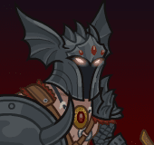

[Back to Main](index.md)

<!-- Uncomment once profile picture is available. -->
<!--  -->
# Warduke
Warduke's services as a remorseless killer-for-hire can be easily bought. The evil swordsman serves Kelek as a cohort and adventuring companion from time to time. He isn't terribly bright, which is why he leaves the plotting and scheming to others.

What does Warduke look like under his dread helm? No one knows. He never removes his helmet to reveal his face to others, but the visage beneath is that of a grim, hideously scarred gladiator.

[D&DBeyond Monster Statblock](https://www.dndbeyond.com/monsters/1979813-warduke)

# Basic Information
Warduke will be the new champion in the Simril event on 30 November 2022.

* Seat: Unknown
* Race: Human
* Class: Fighter (Guess)
* Roles: DPS (Guess)
* Gender: Male
* Alignment: Chaotic Evil
* Affiliation: League of Malevolence
* Stats: (from D&DBeyond - NOT game files)
  * Str: 16
  * Dex: 11
  * Con: 14
  * Int: 9
  * Wis: 11
  * Cha: 11

# Formation
Unknown.
<!-- Uncomment once formation is available. -->
<!--  -->

# Abilities
Unknown.

# Specialisations

League of Malevolence
> Unknown effect.

Mercenary for Hire
> Unknown effect.

# Items
Unknown.

# Legendaries
Unknown.

[Back to Top](#top)

*Last Modified: {{ site.time }}*