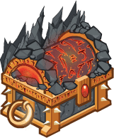
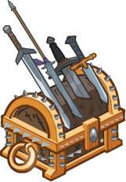
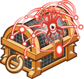
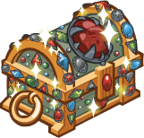

[Back to Main](index.md)

# Upcoming Weekends

Here are the upcoming weekends with their *estimated* dates - the *estimated* purchase reward - and the current expected champions.

    
        
            
            ID: 725**Gold Distinguished Chest**Loot for: Volo, Asharra, Jarlaxle, Zorbu and Gale<code>"for_crusaders":[159,6,4,22,147]</code>
        
        
            
                
                    **Renown**
                
                
                    07 March 2025
                
            
            
                
                    
                        Assumed Reward:
                    
                    
                        Golden Epic for Volo
                    
                
                
                    
                        Volo
                    
                    
                        Asharra
                    
                    
                        Jarlaxle
                    
                    
                        Zorbu
                    
                    
                        Gale
                    
                
            
        
    
    
        
            
            ID: 726**Gold Commercial Chest**Loot for: Sheila, Celeste, Calliope, Eric and Bobby<code>"for_crusaders":[160,2,5,157,152]</code>
        
        
            
                
                    **We'll Be Right Back**
                
                
                    14 March 2025
                
            
            
                
                    
                        Assumed Reward:
                    
                    
                        Golden Epic for Sheila
                    
                
                
                    
                        Sheila
                    
                    
                        Celeste
                    
                    
                        Calliope
                    
                    
                        Eric
                    
                    
                        Bobby
                    
                
            
        
    
    
        
            
            ID: 727**Gold Mist-Shrouded Chest**Loot for: Desmond, Nayeli, Tyril, Strix and Valentine<code>"for_crusaders":[96,3,10,23,103]</code>
        
        
            
                
                    **Barovian**
                
                
                    21 March 2025
                
            
            
                
                    
                        Assumed Reward:
                    
                    
                        Golden Epic for Desmond
                    
                
                
                    
                        Desmond
                    
                    
                        Nayeli
                    
                    
                        Tyril
                    
                    
                        Strix
                    
                    
                        Valentine
                    
                
            
        
    
    
        
            
            ID: 728**Gold Forbidden Lore Chest**Loot for: Makos, Arkhan, Widdle, Shandie and Astarion<code>"for_crusaders":[9,12,91,47,129]</code>
        
        
            
                
                    **Forbidden Lore**
                
                
                    28 March 2025
                
            
            
                
                    
                        Assumed Reward:
                    
                    
                        Golden Epic for Astarion
                    
                
                
                    
                        Astarion
                    
                    
                        Arkhan
                    
                    
                        Widdle
                    
                    
                        Shandie
                    
                    
                        Makos
                    
                
            
        
    
    
        
            
            ID: 730**Gold Sharp Chest**Loot for: Grimm, Bruenor, Arkhan, Birdsong and Karlach<code>"for_crusaders":[161,1,12,21,143]</code>
        
        
            
                
                    **Slice & Dice**
                
                
                    04 April 2025
                
            
            
                
                    
                        Assumed Reward:
                    
                    
                        Golden Epic for Grimm
                    
                
                
                    
                        Grimm
                    
                    
                        Bruenor
                    
                    
                        Arkhan
                    
                    
                        Birdsong
                    
                    
                        Karlach
                    
                
            
        
    
    
        
            
            ID: 731**Gold Corporate Synergy Chest**Loot for: Y4E15, Nayeli, Minsc, Kalix and Dark Urge<code>"for_crusaders":[108,3,7,158,146]</code>
        
        
            
                
                    **Corporate Synergy**
                
                
                    11 April 2025
                
            
            
                
                    
                        Assumed Reward:
                    
                    
                        Golden Epic for Y4E15
                    
                
                
                    
                        Y4E15
                    
                    
                        Nayeli
                    
                    
                        Minsc
                    
                    
                        Kalix
                    
                    
                        Dark Urge
                    
                
            
        
    
    
        
            
            ID: 732**Gold Rivals Arrival Chest**Loot for: Gazrick, Jarlaxle, Asharra, Selise and Virgil<code>"for_crusaders":[98,4,6,81,115]</code>
        
        
            
                
                    **The Rivals Arrival**
                
                
                    18 April 2025
                
            
            
                
                    
                        Assumed Reward:
                    
                    
                        Golden Epic for Gazrick
                    
                
                
                    
                        Gazrick
                    
                    
                        Jarlaxle
                    
                    
                        Asharra
                    
                    
                        Selise
                    
                    
                        Virgil
                    
                
            
        
    
    
        
            
            ID: 733**Gold Amulet Encrusted Chest**Loot for: Tatyana, Tyril, Celeste, Valentine and Nahara<code>"for_crusaders":[97,10,2,103,102]</code>
        
        
            
                
                    **Encrusted Accessories**
                
                
                    25 April 2025
                
            
            
                
                    
                        Assumed Reward:
                    
                    
                        Golden Epic for Tatyana
                    
                
                
                    
                        Tatyana
                    
                    
                        Tyril
                    
                    
                        Celeste
                    
                    
                        Valentine
                    
                    
                        Nahara
                    
                
            
        
    

[Back to Top](#top)

*Last Modified: {{ site.time }}*