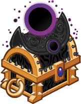
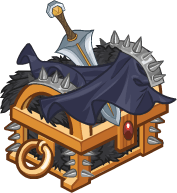
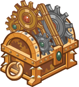

[Back to Main](index.md)

# Upcoming Weekends

Here are the upcoming weekends with their *estimated* dates - the *estimated* purchase reward - and the current expected champions.

    
        
            
            ID: 711**Gold Shar Chest**Loot for: Nayeli, Shadowheart, Makos, Warduke and Talin<code>"for_crusaders":[3,141,9,116,74]</code>
        
        
            
                
                    **Encroaching Darkness**
                
                
                    20 December 2024
                
            
            
                
                    
                        Assumed Reward:
                    
                    
                        Golden Epic for Shadowheart
                    
                
                
                    
                        Shadowheart
                    
                    
                        Nayeli
                    
                    
                        Makos
                    
                    
                        Warduke
                    
                    
                        Talin
                    
                
            
        
    
    
        
            
            ID: 712**Gold Cloaked Chest**Loot for: Nixie, Calliope, Jamilah, Kas and Astarion<code>"for_crusaders":[123,5,11,153,129]</code>
        
        
            
                
                    **Cloak & Dagger**
                
                
                    27 December 2024
                
            
            
                
                    
                        Assumed Reward:
                    
                    
                        Golden Epic for Astarion
                    
                
                
                    
                        Astarion
                    
                    
                        Calliope
                    
                    
                        Jamilah
                    
                    
                        Kas
                    
                    
                        Nixie
                    
                
            
        
    
    
        
            
            ID: 715**Gold Commercial Chest**Loot for: Delina, Eric, Tyril, Presto and Diana<code>"for_crusaders":[8,157,10,144,148]</code>
        
        
            
                
                    **We'll Be Right Back**
                
                
                    03 January 2025
                
            
            
                
                    
                        Assumed Reward:
                    
                    
                        Golden Epic for Eric
                    
                
                
                    
                        Eric
                    
                    
                        Delina
                    
                    
                        Tyril
                    
                    
                        Presto
                    
                    
                        Diana
                    
                
            
        
    
    
        
            
            ID: 716**Gold Clockwork Chest**Loot for: Mehen, Celeste, Makos, Havilar and Farideh<code>"for_crusaders":[80,2,9,56,33]</code>
        
        
            
                
                    **Clockwork Conundrum**
                
                
                    10 January 2025
                
            
            
                
                    
                        Assumed Reward:
                    
                    
                        Golden Epic for Mehen
                    
                
                
                    
                        Mehen
                    
                    
                        Celeste
                    
                    
                        Makos
                    
                    
                        Havilar
                    
                    
                        Farideh
                    
                
            
        
    
    
        
            
            ID: 717**Gold Moonwatcher Chest**Loot for: Wyll, Bruenor, Asharra, Astarion and Minthara<code>"for_crusaders":[142,1,6,129,154]</code>
        
        
            
                
                    **Neutral Alignment**
                
                
                    17 January 2025
                
            
            
                
                    
                        Assumed Reward:
                    
                    
                        Golden Epic for Wyll
                    
                
                
                    
                        Wyll
                    
                    
                        Bruenor
                    
                    
                        Asharra
                    
                    
                        Astarion
                    
                    
                        Minthara
                    
                
            
        
    
    
        
            
            ID: 718**Gold Clockwork Chest**Loot for: Nordom, Arkhan, Nayeli, Dark Urge and Hew Maan<code>"for_crusaders":[100,12,3,146,75]</code>
        
        
            
                
                    **Automation Mechanation**
                
                
                    24 January 2025
                
            
            
                
                    
                        Assumed Reward:
                    
                    
                        Golden Epic for Nordom
                    
                
                
                    
                        Nordom
                    
                    
                        Arkhan
                    
                    
                        Nayeli
                    
                    
                        Dark Urge
                    
                    
                        Hew Maan
                    
                
            
        
    

[Back to Top](#top)

*Last Modified: {{ site.time }}*