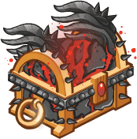
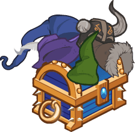
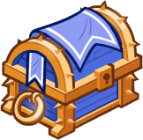
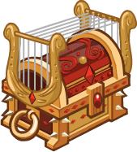
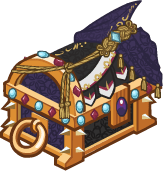

[Back to Main](index.md)

# Upcoming Weekends

Here are the upcoming weekends with their *estimated* dates - the *estimated* purchase reward - and the current expected champions.

    
        
            
            ID: 792**Gold Infernal Iron Chest**Loot for: Makos, Asharra, Briv, Dark Urge and Karlach<code>"for_crusaders":[9,6,58,146,143]</code>
        
        
            
                
                    **Heart of Iron**
                
                
                    13 February 2026
                
            
            
                
                    
                        Assumed Reward:
                    
                    
                        Golden Epic for Karlach
                    
                
                
                    
                        Makos
                    
                    
                        Asharra
                    
                    
                        Briv
                    
                    
                        Dark Urge
                    
                    
                        Karlach
                    
                
            
        
    
    
        
            
            ID: 793**Gold Hat Chest**Loot for: Tyril, Celeste, Sentry, Artemis and Hew Maan<code>"for_crusaders":[10,2,52,54,75]</code>
        
        
            
                
                    **Hat of Many Spells**
                
                
                    20 February 2026
                
            
            
                
                    
                        Assumed Reward:
                    
                    
                        Golden Epic for Hew Maan
                    
                
                
                    
                        Tyril
                    
                    
                        Celeste
                    
                    
                        Sentry
                    
                    
                        Artemis
                    
                    
                        Hew Maan
                    
                
            
        
    
    
        
            
            ID: 794**Gold Certificate Chest**Loot for: Arkhan, Bruenor, Kalix, Hank and Cazrin<code>"for_crusaders":[12,1,158,163,166]</code>
        
        
            
                
                    **Law of the Land**
                
                
                    27 February 2026
                
            
            
                
                    
                        Assumed Reward:
                    
                    
                        Golden Epic for Cazrin
                    
                
                
                    
                        Arkhan
                    
                    
                        Bruenor
                    
                    
                        Kalix
                    
                    
                        Hank
                    
                    
                        Cazrin
                    
                
            
        
    
    
        
            
            ID: 797**Gold Distinguished Chest**Loot for: Asharra, Minsc, Briv, Karlach and Raistlin<code>"for_crusaders":[6,7,58,143,173]</code>
        
        
            
                
                    **Renown**
                
                
                    06 March 2026
                
            
            
                
                    
                        Assumed Reward:
                    
                    
                        Golden Epic for Raistlin
                    
                
                
                    
                        Asharra
                    
                    
                        Minsc
                    
                    
                        Briv
                    
                    
                        Karlach
                    
                    
                        Raistlin
                    
                
            
        
    
    
        
            
            ID: 798**Gold Lyre Chest**Loot for: Celeste, Calliope, Spurt, Ellywick and Deekin<code>"for_crusaders":[2,5,43,83,28]</code>
        
        
            
                
                    **Campfire Song**
                
                
                    13 March 2026
                
            
            
                
                    
                        Assumed Reward:
                    
                    
                        Golden Epic for Deekin
                    
                
                
                    
                        Celeste
                    
                    
                        Calliope
                    
                    
                        Spurt
                    
                    
                        Ellywick
                    
                    
                        Deekin
                    
                
            
        
    
    
        
            
            ID: 799**Gold Commercial Chest**Loot for: Tyril, Arkhan, Hank, Diana and Sheila<code>"for_crusaders":[10,12,163,148,160]</code>
        
        
            
                
                    **We'll Be Right Back**
                
                
                    20 March 2026
                
            
            
                
                    
                        Assumed Reward:
                    
                    
                        Golden Epic for Sheila
                    
                
                
                    
                        Tyril
                    
                    
                        Arkhan
                    
                    
                        Hank
                    
                    
                        Diana
                    
                    
                        Sheila
                    
                
            
        
    
    
        
            
            ID: 800**Gold Glamerweave Chest**Loot for: Nayeli, Makos, Shadowheart, Widdle and Baeloth<code>"for_crusaders":[3,9,141,91,73]</code>
        
        
            
                
                    **Glamerweave**
                
                
                    27 March 2026
                
            
            
                
                    
                        Assumed Reward:
                    
                    
                        Golden Epic for Baeloth
                    
                
                
                    
                        Nayeli
                    
                    
                        Makos
                    
                    
                        Shadowheart
                    
                    
                        Widdle
                    
                    
                        Baeloth
                    
                
            
        
    

[Back to Top](#top)

*Last Modified: {{ site.time }}*