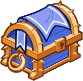
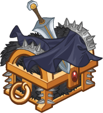
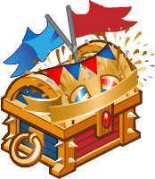
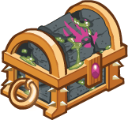
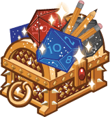

[Back to Main](index.md)

# Upcoming Weekends

Here are the upcoming weekends with their *estimated* dates - the *estimated* purchase reward - and the current expected champions.

    
        
            
            ID: 741**Gold Commercial Chest**Loot for: Eric, Minsc, Celeste, Diana and Hank<code>"for_crusaders":[157,7,2,148,163]</code>
        
        
            
                
                    **We'll Be Right Back**
                
                
                    06 June 2025
                
            
            
                
                    
                        Assumed Reward:
                    
                    
                        Golden Epic for Hank
                    
                
                
                    
                        Hank
                    
                    
                        Minsc
                    
                    
                        Celeste
                    
                    
                        Diana
                    
                    
                        Eric
                    
                
            
        
    
    
        
            
            ID: 742**Gold Distinguished Chest**Loot for: Asharra, Tyril, Artemis, Dark Urge and Merilwen<code>"for_crusaders":[6,10,54,146,101]</code>
        
        
            
                
                    **Renown**
                
                
                    13 June 2025
                
            
            
                
                    
                        Assumed Reward:
                    
                    
                        Golden Epic for Asharra
                    
                
                
                    
                        Asharra
                    
                    
                        Tyril
                    
                    
                        Artemis
                    
                    
                        Dark Urge
                    
                    
                        Merilwen
                    
                
            
        
    
    
        
            
            ID: 743**Gold Cloaked Chest**Loot for: Nayeli, Makos, Karlach, Kalix and Selise<code>"for_crusaders":[3,9,143,158,81]</code>
        
        
            
                
                    **Cloak & Dagger**
                
                
                    20 June 2025
                
            
            
                
                    
                        Assumed Reward:
                    
                    
                        Golden Epic for Nayeli
                    
                
                
                    
                        Nayeli
                    
                    
                        Makos
                    
                    
                        Karlach
                    
                    
                        Kalix
                    
                    
                        Selise
                    
                
            
        
    
    
        
            
            ID: 744**Gold Calamity Chest**Loot for: Calliope, Bruenor, Kas, Astarion and Antrius<code>"for_crusaders":[5,1,153,129,122]</code>
        
        
            
                
                    **Calamity Company**
                
                
                    27 June 2025
                
            
            
                
                    
                        Assumed Reward:
                    
                    
                        Golden Epic for Calliope
                    
                
                
                    
                        Calliope
                    
                    
                        Bruenor
                    
                    
                        Kas
                    
                    
                        Astarion
                    
                    
                        Antrius
                    
                
            
        
    
    
        
            
            ID: 745**Gold Revelry Chest**Loot for: Jamilah, Makos, Widdle, Melf and Tess<code>"for_crusaders":[11,9,91,59,164]</code>
        
        
            
                
                    **Heroes Parade**
                
                
                    04 July 2025
                
            
            
                
                    
                        Assumed Reward:
                    
                    
                        Golden Epic for Tess
                    
                
                
                    
                        Tess
                    
                    
                        Makos
                    
                    
                        Widdle
                    
                    
                        Melf
                    
                    
                        Jamilah
                    
                
            
        
    
    
        
            
            ID: 746**Gold Rising Darkness Chest**Loot for: Hitch, Calliope, Lae'zel, Bobby and K'thriss<code>"for_crusaders":[13,5,128,152,38]</code>
        
        
            
                
                    **Darkness Rises**
                
                
                    11 July 2025
                
            
            
                
                    
                        Assumed Reward:
                    
                    
                        Golden Epic for K'thriss
                    
                
                
                    
                        K'thriss
                    
                    
                        Calliope
                    
                    
                        Lae'zel
                    
                    
                        Bobby
                    
                    
                        Hitch
                    
                
            
        
    
    
        
            
            ID: 747**Gold Certificate Chest**Loot for: Bruenor, Tyril, Karlach, Beadle and Umberto<code>"for_crusaders":[1,10,143,64,151]</code>
        
        
            
                
                    **Law of the Land**
                
                
                    18 July 2025
                
            
            
                
                    
                        Assumed Reward:
                    
                    
                        Golden Epic for Bruenor
                    
                
                
                    
                        Bruenor
                    
                    
                        Tyril
                    
                    
                        Karlach
                    
                    
                        Beadle
                    
                    
                        Umberto
                    
                
            
        
    
    
        
            
            ID: 748**Gold Corrupted Chest**Loot for: Minsc, Hew Maan, Briv, Dark Urge and Celeste<code>"for_crusaders":[7,75,58,146,2]</code>
        
        
            
                
                    **Vecna's Orders**
                
                
                    25 July 2025
                
            
            
                
                    
                        Assumed Reward:
                    
                    
                        Golden Epic for Minsc
                    
                
                
                    
                        Minsc
                    
                    
                        Hew Maan
                    
                    
                        Briv
                    
                    
                        Dark Urge
                    
                    
                        Celeste
                    
                
            
        
    
    
        
            
            ID: 749**Gold Dazzling Chest**Loot for: Asharra, Nayeli, Rust, Donaar and Egbert<code>"for_crusaders":[6,3,94,34,113]</code>
        
        
            
                
                    **Dazzling**
                
                
                    01 August 2025
                
            
            
                
                    
                        Assumed Reward:
                    
                    
                        Golden Epic for Asharra
                    
                
                
                    
                        Asharra
                    
                    
                        Nayeli
                    
                    
                        Rust
                    
                    
                        Donaar
                    
                    
                        Egbert
                    
                
            
        
    

[Back to Top](#top)

*Last Modified: {{ site.time }}*