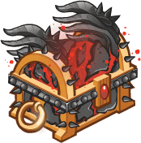
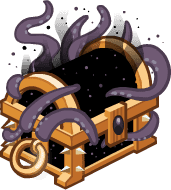

[Back to Main](index.md)

# Upcoming Weekends

Here are the upcoming weekends with their *estimated* dates - the *estimated* purchase reward - and the current expected champions.

    
        
            
            ID: 765**Gold Reckless Chest**Loot for: Arkhan, Bruenor, Krull, Hew Maan and Torogar<code>"for_crusaders":[12,1,53,75,69]</code>
        
        
            
                
                    **Young and the Reckless**
                
                
                    17 October 2025
                
            
            
                
                    
                        Assumed Reward:
                    
                    
                        Golden Epic for Torogar
                    
                
                
                    
                        Arkhan
                    
                    
                        Bruenor
                    
                    
                        Krull
                    
                    
                        Hew Maan
                    
                    
                        Torogar
                    
                
            
        
    
    
        
            
            ID: 766**Gold Wave Chest**Loot for: Minsc, Jarlaxle, Jaheira, Imoen and Dynaheir<code>"for_crusaders":[7,4,61,117,145]</code>
        
        
            
                
                    **Ocean Waves**
                
                
                    24 October 2025
                
            
            
                
                    
                        Assumed Reward:
                    
                    
                        Golden Epic for Dynaheir
                    
                
                
                    
                        Minsc
                    
                    
                        Jarlaxle
                    
                    
                        Jaheira
                    
                    
                        Imoen
                    
                    
                        Dynaheir
                    
                
            
        
    
    
        
            
            ID: 767**Gold Accessory Chest**Loot for: Celeste, Makos, Warduke, Ellywick and Strongheart<code>"for_crusaders":[2,9,116,83,126]</code>
        
        
            
                
                    **Figures of Action**
                
                
                    31 October 2025
                
            
            
                
                    
                        Assumed Reward:
                    
                    
                        Golden Epic for Strongheart
                    
                
                
                    
                        Celeste
                    
                    
                        Makos
                    
                    
                        Warduke
                    
                    
                        Ellywick
                    
                    
                        Strongheart
                    
                
            
        
    
    
        
            
            ID: 771**Gold All Star Chest**Loot for: Minsc, Asharra, Widdle, Kalix and Skylla<code>"for_crusaders":[7,6,91,158,169]</code>
        
        
            
                
                    **All Star**
                
                
                    07 November 2025
                
            
            
                
                    
                        Assumed Reward:
                    
                    
                        Golden Epic for Skylla
                    
                
                
                    
                        Minsc
                    
                    
                        Asharra
                    
                    
                        Widdle
                    
                    
                        Kalix
                    
                    
                        Skylla
                    
                
            
        
    
    
        
            
            ID: 772**Gold Infernal Iron Chest**Loot for: Bruenor, Nayeli, Sentry, Farideh and Havilar<code>"for_crusaders":[1,3,52,33,56]</code>
        
        
            
                
                    **Heart of Iron**
                
                
                    14 November 2025
                
            
            
                
                    
                        Assumed Reward:
                    
                    
                        Golden Epic for Havilar
                    
                
                
                    
                        Bruenor
                    
                    
                        Nayeli
                    
                    
                        Sentry
                    
                    
                        Farideh
                    
                    
                        Havilar
                    
                
            
        
    
    
        
            
            ID: 773**Gold Slayer's Reward Chest**Loot for: Celeste, Arkhan, Virgil, Briv and Minthara<code>"for_crusaders":[2,12,115,58,154]</code>
        
        
            
                
                    **Slay the Darkness**
                
                
                    21 November 2025
                
            
            
                
                    
                        Assumed Reward:
                    
                    
                        Golden Epic for Minthara
                    
                
                
                    
                        Celeste
                    
                    
                        Arkhan
                    
                    
                        Virgil
                    
                    
                        Briv
                    
                    
                        Minthara
                    
                
            
        
    
    
        
            
            ID: 774**Gold Commercial Chest**Loot for: Makos, Calliope, Havilar, Artemis and Hank<code>"for_crusaders":[9,5,56,54,163]</code>
        
        
            
                
                    **We'll Be Right Back**
                
                
                    28 November 2025
                
            
            
                
                    
                        Assumed Reward:
                    
                    
                        Golden Epic for Hank
                    
                
                
                    
                        Makos
                    
                    
                        Calliope
                    
                    
                        Havilar
                    
                    
                        Artemis
                    
                    
                        Hank
                    
                
            
        
    

[Back to Top](#top)

*Last Modified: {{ site.time }}*