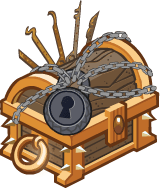
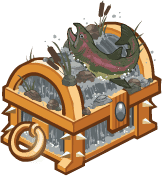
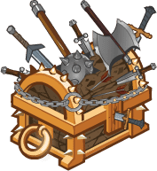
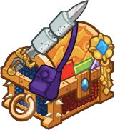

[Back to Main](index.md)

# Upcoming Weekends

Here are the upcoming weekends with their *estimated* dates - the *estimated* purchase reward - and the current expected champions.

    
        
            
            ID: 763**Gold Lockpick Chest**Loot for: Calliope, Hitch, Dark Urge, Kas and King of Shadows<code>"for_crusaders":[5,13,146,153,168]</code>
        
        
            
                
                    **Mind the Traps**
                
                
                    03 October 2025
                
            
            
                
                    
                        Assumed Reward:
                    
                    
                        Golden Epic for King of Shadows
                    
                
                
                    
                        Calliope
                    
                    
                        Hitch
                    
                    
                        Dark Urge
                    
                    
                        Kas
                    
                    
                        King of Shadows
                    
                
            
        
    
    
        
            
            ID: 764**Gold Persistence Chest**Loot for: Delina, Asharra, Havilar, Mehen and Farideh<code>"for_crusaders":[8,6,56,80,33]</code>
        
        
            
                
                    **Persistence**
                
                
                    10 October 2025
                
            
            
                
                    
                        Assumed Reward:
                    
                    
                        Golden Epic for Farideh
                    
                
                
                    
                        Delina
                    
                    
                        Asharra
                    
                    
                        Havilar
                    
                    
                        Mehen
                    
                    
                        Farideh
                    
                
            
        
    
    
        
            
            ID: 765**Gold Reckless Chest**Loot for: Arkhan, Bruenor, Krull, Hew Maan and Torogar<code>"for_crusaders":[12,1,53,75,69]</code>
        
        
            
                
                    **Young and the Reckless**
                
                
                    17 October 2025
                
            
            
                
                    
                        Assumed Reward:
                    
                    
                        Golden Epic for Torogar
                    
                
                
                    
                        Arkhan
                    
                    
                        Bruenor
                    
                    
                        Krull
                    
                    
                        Hew Maan
                    
                    
                        Torogar
                    
                
            
        
    
    
        
            
            ID: 766**Gold Wave Chest**Loot for: Minsc, Jarlaxle, Jaheira, Imoen and Dynaheir<code>"for_crusaders":[7,4,61,117,145]</code>
        
        
            
                
                    **Ocean Waves**
                
                
                    24 October 2025
                
            
            
                
                    
                        Assumed Reward:
                    
                    
                        Golden Epic for Dynaheir
                    
                
                
                    
                        Minsc
                    
                    
                        Jarlaxle
                    
                    
                        Jaheira
                    
                    
                        Imoen
                    
                    
                        Dynaheir
                    
                
            
        
    
    
        
            
            ID: 767**Gold Accessory Chest**Loot for: Celeste, Makos, Warduke, Ellywick and Strongheart<code>"for_crusaders":[2,9,116,83,126]</code>
        
        
            
                
                    **Figures of Action**
                
                
                    31 October 2025
                
            
            
                
                    
                        Assumed Reward:
                    
                    
                        Golden Epic for Strongheart
                    
                
                
                    
                        Celeste
                    
                    
                        Makos
                    
                    
                        Warduke
                    
                    
                        Ellywick
                    
                    
                        Strongheart
                    
                
            
        
    

[Back to Top](#top)

*Last Modified: {{ site.time }}*