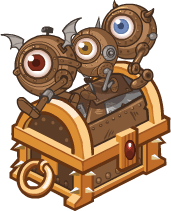
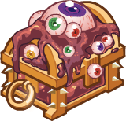
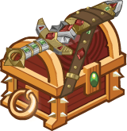
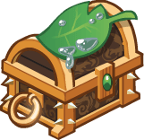

[Back to Main](index.md)

# Upcoming Weekends

Here are the upcoming weekends with their *estimated* dates - the *estimated* purchase reward - and the current expected champions.

    
        
            
            ID: 777**Gold Harmony Chest**Loot for: Jarlaxle, Celeste, Cazrin, Tess and Lark<code>"for_crusaders":[4,2,166,164,170]</code>
        
        
            
                
                    **Music Lesson**
                
                
                    05 December 2025
                
            
            
                
                    
                        Assumed Reward:
                    
                    
                        Golden Epic for Lark
                    
                
                
                    
                        Jarlaxle
                    
                    
                        Celeste
                    
                    
                        Cazrin
                    
                    
                        Tess
                    
                    
                        Lark
                    
                
            
        
    
    
        
            
            ID: 778**Gold Marching Chest**Loot for: Nayeli, Calliope, Hew Maan, Shandie and Yorven<code>"for_crusaders":[3,5,75,47,92]</code>
        
        
            
                
                    **March of the Modrons**
                
                
                    12 December 2025
                
            
            
                
                    
                        Assumed Reward:
                    
                    
                        Golden Epic for Yorven
                    
                
                
                    
                        Nayeli
                    
                    
                        Calliope
                    
                    
                        Hew Maan
                    
                    
                        Shandie
                    
                    
                        Yorven
                    
                
            
        
    
    
        
            
            ID: 779**Gold Shar Chest**Loot for: Minsc, Bruenor, Lae'zel, Karlach and Shadowheart<code>"for_crusaders":[7,1,128,143,141]</code>
        
        
            
                
                    **Encroaching Darkness**
                
                
                    19 December 2025
                
            
            
                
                    
                        Assumed Reward:
                    
                    
                        Golden Epic for Shadowheart
                    
                
                
                    
                        Minsc
                    
                    
                        Bruenor
                    
                    
                        Lae'zel
                    
                    
                        Karlach
                    
                    
                        Shadowheart
                    
                
            
        
    
    
        
            
            ID: 780**Gold Eyeball Chest**Loot for: Celeste, Arkhan, Thellora, King of Shadows and Kas<code>"for_crusaders":[2,12,139,168,153]</code>
        
        
            
                
                    **Whispers from the Far Realm**
                
                
                    26 December 2025
                
            
            
                
                    
                        Assumed Reward:
                    
                    
                        Golden Epic for Kas
                    
                
                
                    
                        Celeste
                    
                    
                        Arkhan
                    
                    
                        Thellora
                    
                    
                        KoS
                    
                    
                        Kas
                    
                
            
        
    
    
        
            
            ID: 783**Gold Fancy Blade Chest**Loot for: Asharra, Minsc, Baldric, Tess and Anson<code>"for_crusaders":[6,7,165,164,171]</code>
        
        
            
                
                    **Magical Blades**
                
                
                    02 January 2026
                
            
            
                
                    
                        Assumed Reward:
                    
                    
                        Golden Epic for Anson
                    
                
                
                    
                        Asharra
                    
                    
                        Minsc
                    
                    
                        Baldric
                    
                    
                        Tess
                    
                    
                        Anson
                    
                
            
        
    
    
        
            
            ID: 784**Gold New Leaf Chest**Loot for: Tyril, Hitch, Shadowheart, Dark Urge and Binwin<code>"for_crusaders":[10,13,141,146,27]</code>
        
        
            
                
                    **New Leaf**
                
                
                    09 January 2026
                
            
            
                
                    
                        Assumed Reward:
                    
                    
                        Golden Epic for Binwin
                    
                
                
                    
                        Tyril
                    
                    
                        Hitch
                    
                    
                        Shadowheart
                    
                    
                        Dark Urge
                    
                    
                        Binwin
                    
                
            
        
    
    
        
            
            ID: 785**Gold Commercial Chest**Loot for: Celeste, Jamilah, Diana, Bobby and Eric<code>"for_crusaders":[2,11,148,152,157]</code>
        
        
            
                
                    **We'll Be Right Back**
                
                
                    16 January 2026
                
            
            
                
                    
                        Assumed Reward:
                    
                    
                        Golden Epic for Eric
                    
                
                
                    
                        Celeste
                    
                    
                        Jamilah
                    
                    
                        Diana
                    
                    
                        Bobby
                    
                    
                        Eric
                    
                
            
        
    
    
        
            
            ID: 786**Gold Boldness Chest**Loot for: Bruenor, Minsc, Spurt, Widdle and Ravengard<code>"for_crusaders":[1,7,43,91,149]</code>
        
        
            
                
                    **Brave & Bold**
                
                
                    23 January 2026
                
            
            
                
                    
                        Assumed Reward:
                    
                    
                        Golden Epic for Ravengard
                    
                
                
                    
                        Bruenor
                    
                    
                        Minsc
                    
                    
                        Spurt
                    
                    
                        Widdle
                    
                    
                        Ravengard
                    
                
            
        
    

[Back to Top](#top)

*Last Modified: {{ site.time }}*