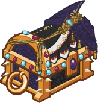
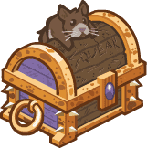
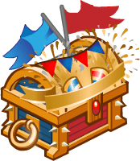
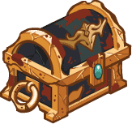
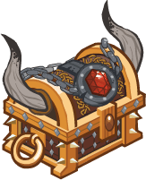

[Back to Main](index.md)

# Upcoming Weekends

Here are the upcoming weekends with their *estimated* dates - the *estimated* purchase reward - and the current expected champions.

    
        
            
            ID: 800**Gold Glamerweave Chest**Loot for: Nayeli, Makos, Shadowheart, Widdle and Baeloth<code>"for_crusaders":[3,9,141,91,73]</code>
        
        
            
                
                    **Glamerweave**
                
                
                    27 March 2026
                
            
            
                
                    
                        Assumed Reward:
                    
                    
                        Golden Epic for Baeloth
                    
                
                
                    
                        Nayeli
                    
                    
                        Makos
                    
                    
                        Shadowheart
                    
                    
                        Widdle
                    
                    
                        Baeloth
                    
                
            
        
    
    
        
            
            ID: 802**Gold Misunderstood Chest**Loot for: Nayeli, Minsc, Raistlin, Diana and Tasslehoff<code>"for_crusaders":[3,7,173,148,174]</code>
        
        
            
                
                    **Misunderstood Heroes**
                
                
                    03 April 2026
                
            
            
                
                    
                        Assumed Reward:
                    
                    
                        Golden Epic for Tasslehoff
                    
                
                
                    
                        Nayeli
                    
                    
                        Minsc
                    
                    
                        Raistlin
                    
                    
                        Diana
                    
                    
                        Tasslehoff
                    
                
            
        
    
    
        
            
            ID: 803**Gold Revelry Chest**Loot for: Bruenor, Hitch, Lae'zel, Shandie and Catti-brie<code>"for_crusaders":[1,13,128,47,25]</code>
        
        
            
                
                    **Heroes Parade**
                
                
                    10 April 2026
                
            
            
                
                    
                        Assumed Reward:
                    
                    
                        Golden Epic for Catti-brie
                    
                
                
                    
                        Bruenor
                    
                    
                        Hitch
                    
                    
                        Lae'zel
                    
                    
                        Shandie
                    
                    
                        Catti-brie
                    
                
            
        
    
    
        
            
            ID: 804**Gold Durge Chest**Loot for: Tyril, Calliope, Hew Maan, Karlach and Dark Urge<code>"for_crusaders":[10,5,75,143,146]</code>
        
        
            
                
                    **Durge Run**
                
                
                    17 April 2026
                
            
            
                
                    
                        Assumed Reward:
                    
                    
                        Golden Epic for Dark Urge
                    
                
                
                    
                        Tyril
                    
                    
                        Calliope
                    
                    
                        Hew Maan
                    
                    
                        Karlach
                    
                    
                        Dark Urge
                    
                
            
        
    
    
        
            
            ID: 805**Gold High Spy Chest**Loot for: Celeste, Makos, Sentry, Thellora and Kalix<code>"for_crusaders":[2,9,52,139,158]</code>
        
        
            
                
                    **High Spy**
                
                
                    24 April 2026
                
            
            
                
                    
                        Assumed Reward:
                    
                    
                        Golden Epic for Kalix
                    
                
                
                    
                        Celeste
                    
                    
                        Makos
                    
                    
                        Sentry
                    
                    
                        Thellora
                    
                    
                        Kalix
                    
                
            
        
    
    
        
            
            ID: 806**Gold Heirloom Chest**Loot for: Bruenor, Asharra, Artemis, Valentine and Barrowin<code>"for_crusaders":[1,6,54,103,19]</code>
        
        
            
                
                    **Ancestral**
                
                
                    01 May 2026
                
            
            
                
                    
                        Assumed Reward:
                    
                    
                        Golden Epic for Barrowin
                    
                
                
                    
                        Bruenor
                    
                    
                        Asharra
                    
                    
                        Artemis
                    
                    
                        Valentine
                    
                    
                        Barrowin
                    
                
            
        
    

[Back to Top](#top)

*Last Modified: {{ site.time }}*