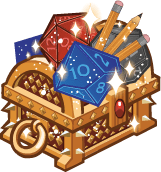
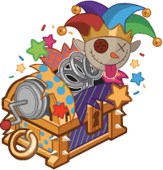
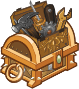
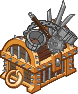
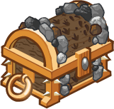

[Back to Main](index.md)

# Upcoming Weekends

Here are the upcoming weekends with their *estimated* dates - the *estimated* purchase reward - and the current expected champions.

    
        
            
            ID: 825**Gold Dazzling Chest**Loot for: Asharra, Calliope, Artemis, Hew Maan and Ezmerelda<code>"for_crusaders":[6,5,54,75,70]</code>
        
        
            
                
                    **Dazzling**
                
                
                    24 July 2026
                
            
            
                
                    
                        Assumed Reward:
                    
                    
                        Golden Epic for Ezmerelda
                    
                
                
                    
                        Asharra
                        ID: 6**Asharra**
                    
                    
                        Calliope
                        ID: 5**Calliope**
                    
                    
                        Artemis
                        ID: 54**Artemis Entreri**
                    
                    
                        Hew Maan
                        ID: 75**Hew Maan**
                    
                    
                        Ezmerelda
                        ID: 70**Ezmerelda**
                    
                
            
        
    
    
        
            
            ID: 826**Gold Pranked Chest**Loot for: Jarlaxle, Celeste, Kalix, Thellora and Fen<code>"for_crusaders":[4,2,158,139,118]</code>
        
        
            
                
                    **Mischief Makers**
                
                
                    31 July 2026
                
            
            
                
                    
                        Assumed Reward:
                    
                    
                        Golden Epic for Fen
                    
                
                
                    
                        Jarlaxle
                        ID: 4**Jarlaxle Baenre**
                    
                    
                        Celeste
                        ID: 2**Celeste**
                    
                    
                        Kalix
                        ID: 158**Kalix**
                    
                    
                        Thellora
                        ID: 139**Thellora**
                    
                    
                        Fen
                        ID: 118**Fen**
                    
                
            
        
    
    
        
            
            ID: 832**Gold Toolbox Chest**Loot for: Laurana, Raistlin, Bruenor, Tyril and Flint<code>"for_crusaders":[175,173,1,10,178]</code>
        
        
            
                
                    **Tools of the Trade**
                
                
                    07 August 2026
                
            
            
                
                    
                        Assumed Reward:
                    
                    
                        Golden Epic for Flint
                    
                
                
                    
                        Laurana
                        ID: 175**Lauralanthalasa Kanan**
                    
                    
                        Raistlin
                        ID: 173**Raistlin Majere**
                    
                    
                        Bruenor
                        ID: 1**Bruenor Battlehammer**
                    
                    
                        Tyril
                        ID: 10**Tyril Tallguy**
                    
                    
                        Flint
                        ID: 178**Flint Fireforge**
                    
                
            
        
    
    
        
            
            ID: 833**Gold Revelry Chest**Loot for: Walnut, Omin, Calliope, Celeste and Jim<code>"for_crusaders":[46,65,5,2,48]</code>
        
        
            
                
                    **Heroes Parade**
                
                
                    14 August 2026
                
            
            
                
                    
                        Assumed Reward:
                    
                    
                        Golden Epic for Jim
                    
                
                
                    
                        Walnut
                        ID: 46**Walnut Dankgrass**
                    
                    
                        Omin
                        ID: 65**Omin Dran**
                    
                    
                        Calliope
                        ID: 5**Calliope**
                    
                    
                        Celeste
                        ID: 2**Celeste**
                    
                    
                        Jim
                        ID: 48**James (Jim) Winifred Darkmagic III**
                    
                
            
        
    
    
        
            
            ID: 834**Gold Dungeon Chest**Loot for: Hank, Shandie, Jamilah, Nayeli and Prudence<code>"for_crusaders":[163,47,11,3,84]</code>
        
        
            
                
                    **Dungeon Delving**
                
                
                    21 August 2026
                
            
            
                
                    
                        Assumed Reward:
                    
                    
                        Golden Epic for Prudence
                    
                
                
                    
                        Hank
                        ID: 163**Hank**
                    
                    
                        Shandie
                        ID: 47**Shandie**
                    
                    
                        Jamilah
                        ID: 11**Jamilah**
                    
                    
                        Nayeli
                        ID: 3**Nayeli Goldflower**
                    
                    
                        Prudence
                        ID: 84**Prudence**
                    
                
            
        
    
    
        
            
            ID: 835**Gold Footprint Chest**Loot for: Dark Urge, Shadowheart, Makos, Minsc and Lae'zel<code>"for_crusaders":[146,141,9,7,128]</code>
        
        
            
                
                    **Feats of Leadership**
                
                
                    28 August 2026
                
            
            
                
                    
                        Assumed Reward:
                    
                    
                        Golden Epic for Lae'zel
                    
                
                
                    
                        Dark Urge
                        ID: 146**The Dark Urge**
                    
                    
                        Shadowheart
                        ID: 141**Shadowheart**
                    
                    
                        Makos
                        ID: 9**Makos**
                    
                    
                        Minsc
                        ID: 7**Minsc**
                    
                    
                        Lae'zel
                        ID: 128**Lae'zel**
                    
                
            
        
    

[Back to Top](#top)

*Last Modified: {{ site.time }}*