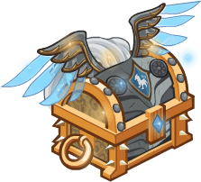

[Back to Main](index.md)

# Upcoming Weekends

Here are the upcoming weekends with their *estimated* dates - the *estimated* purchase reward - and the current expected champions.

    
        
            
            ID: 816**Gold Rising Darkness Chest**Loot for: Minsc, Tyril, Nahara, Valentine and Y4E15<code>"for_crusaders":[7,10,102,103,112]</code>
        
        
            
                
                    **Darkness Rises**
                
                
                    12 June 2026
                
            
            
                
                    
                        Assumed Reward:
                    
                    
                        Golden Epic for Y4E15
                    
                
                
                    
                        Minsc
                        ID: 7**Minsc**
                    
                    
                        Tyril
                        ID: 10**Tyril Tallguy**
                    
                    
                        Nahara
                        ID: 102**Nahara**
                    
                    
                        Valentine
                        ID: 103**Valentine**
                    
                    
                        Y4E15
                        ID: 112**???**
                    
                
            
        
    
    
        
            
            ID: 817**Gold Clawed Chest**Loot for: Celeste, Calliope, Hew Maan, Dark Urge and BBEG<code>"for_crusaders":[2,5,75,146,125]</code>
        
        
            
                
                    **Rise of Undeath**
                
                
                    19 June 2026
                
            
            
                
                    
                        Assumed Reward:
                    
                    
                        Golden Epic for BBEG
                    
                
                
                    
                        Celeste
                        ID: 2**Celeste**
                    
                    
                        Calliope
                        ID: 5**Calliope**
                    
                    
                        Hew Maan
                        ID: 75**Hew Maan**
                    
                    
                        Dark Urge
                        ID: 146**The Dark Urge**
                    
                    
                        BBEG
                        ID: 125**Bartholemew Beelzebub Ezekiel Grubbe**
                    
                
            
        
    
    
        
            
            ID: 818**Gold Forbidden Lore Chest**Loot for: Jarlaxle, Bruenor, Tasslehoff, Raistlin and Laurana<code>"for_crusaders":[4,1,174,173,175]</code>
        
        
            
                
                    **Forbidden Lore**
                
                
                    26 June 2026
                
            
            
                
                    
                        Assumed Reward:
                    
                    
                        Golden Epic for Laurana
                    
                
                
                    
                        Jarlaxle
                        ID: 4**Jarlaxle Baenre**
                    
                    
                        Bruenor
                        ID: 1**Bruenor Battlehammer**
                    
                    
                        Tasslehoff
                        ID: 174**Tasslehoff Burrfoot**
                    
                    
                        Raistlin
                        ID: 173**Raistlin Majere**
                    
                    
                        Laurana
                        ID: 175**Lauralanthalasa Kanan**
                    
                
            
        
    
    
        
            
            ID: 822**Gold Mist-Shrouded Chest**Loot for: Minsc, Hitch, Briv, Diana and Van Richten<code>"for_crusaders":[7,13,58,148,177]</code>
        
        
            
                
                    **Barovian**
                
                
                    03 July 2026
                
            
            
                
                    
                        Assumed Reward:
                    
                    
                        Golden Epic for Van Richten
                    
                
                
                    
                        Minsc
                        ID: 7**Minsc**
                    
                    
                        Hitch
                        ID: 13**Hitch**
                    
                    
                        Briv
                        ID: 58**Briv Steelmarrow**
                    
                    
                        Diana
                        ID: 148**Diana**
                    
                    
                        Van Richten
                        ID: 177**Van Richten**
                    
                
            
        
    
    
        
            
            ID: 823**Gold Celestial Wings Chest**Loot for: Nayeli, Tyril, Warduke, Karlach and Strongheart<code>"for_crusaders":[3,10,116,143,126]</code>
        
        
            
                
                    **Wings of Freedom**
                
                
                    10 July 2026
                
            
            
                
                    
                        Assumed Reward:
                    
                    
                        Golden Epic for Strongheart
                    
                
                
                    
                        Nayeli
                        ID: 3**Nayeli Goldflower**
                    
                    
                        Tyril
                        ID: 10**Tyril Tallguy**
                    
                    
                        Warduke
                        ID: 116**Warduke**
                    
                    
                        Karlach
                        ID: 143**Karlach**
                    
                    
                        Strongheart
                        ID: 126**Strongheart**
                    
                
            
        
    
    
        
            
            ID: 824**Gold Misunderstood Chest**Loot for: Bruenor, Makos, Lae'zel, Ellywick and Nahara<code>"for_crusaders":[1,9,128,83,102]</code>
        
        
            
                
                    **Misunderstood Heroes**
                
                
                    17 July 2026
                
            
            
                
                    
                        Assumed Reward:
                    
                    
                        Golden Epic for Nahara
                    
                
                
                    
                        Bruenor
                        ID: 1**Bruenor Battlehammer**
                    
                    
                        Makos
                        ID: 9**Makos**
                    
                    
                        Lae'zel
                        ID: 128**Lae'zel**
                    
                    
                        Ellywick
                        ID: 83**Ellywick Tumblestrum**
                    
                    
                        Nahara
                        ID: 102**Nahara**
                    
                
            
        
    
    
        
            
            ID: 825**Gold Dazzling Chest**Loot for: Asharra, Calliope, Artemis, Hew Maan and Ezmerelda<code>"for_crusaders":[6,5,54,75,70]</code>
        
        
            
                
                    **Dazzling**
                
                
                    24 July 2026
                
            
            
                
                    
                        Assumed Reward:
                    
                    
                        Golden Epic for Ezmerelda
                    
                
                
                    
                        Asharra
                        ID: 6**Asharra**
                    
                    
                        Calliope
                        ID: 5**Calliope**
                    
                    
                        Artemis
                        ID: 54**Artemis Entreri**
                    
                    
                        Hew Maan
                        ID: 75**Hew Maan**
                    
                    
                        Ezmerelda
                        ID: 70**Ezmerelda**
                    
                
            
        
    
    
        
            
            ID: 826**Gold Pranked Chest**Loot for: Jarlaxle, Celeste, Kalix, Thellora and Fen<code>"for_crusaders":[4,2,158,139,118]</code>
        
        
            
                
                    **Mischief Makers**
                
                
                    31 July 2026
                
            
            
                
                    
                        Assumed Reward:
                    
                    
                        Golden Epic for Fen
                    
                
                
                    
                        Jarlaxle
                        ID: 4**Jarlaxle Baenre**
                    
                    
                        Celeste
                        ID: 2**Celeste**
                    
                    
                        Kalix
                        ID: 158**Kalix**
                    
                    
                        Thellora
                        ID: 139**Thellora**
                    
                    
                        Fen
                        ID: 118**Fen**
                    
                
            
        
    

[Back to Top](#top)

*Last Modified: {{ site.time }}*