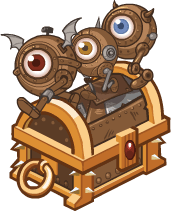
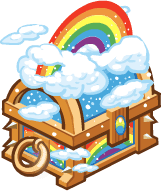
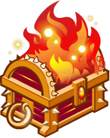
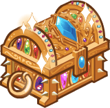
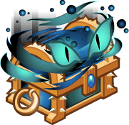
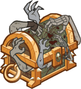
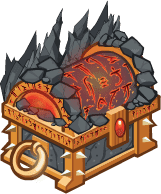

[Back to Main](index.md)

# Upcoming Weekends

Here are the upcoming weekends with their *estimated* dates - the *estimated* purchase reward - and the current expected champions.

    
        
            
            ID: 809**Gold Marching Chest**Loot for: Jarlaxle, Tyril, Tasslehoff, Raistlin and Laurana<code>"for_crusaders":[4,10,174,173,175]</code>
        
        
            
                
                    **March of the Modrons**
                
                
                    08 May 2026
                
            
            
                
                    
                        Assumed Reward:
                    
                    
                        Golden Epic for Laurana
                    
                
                
                    
                        Jarlaxle
                    
                    
                        Tyril
                    
                    
                        Tasslehoff
                    
                    
                        Raistlin
                    
                    
                        Laurana
                    
                
            
        
    
    
        
            
            ID: 810**Gold Commercial Chest**Loot for: Celeste, Asharra, Briv, Hank and Diana<code>"for_crusaders":[2,6,58,163,148]</code>
        
        
            
                
                    **We'll Be Right Back**
                
                
                    15 May 2026
                
            
            
                
                    
                        Assumed Reward:
                    
                    
                        Golden Epic for Diana
                    
                
                
                    
                        Celeste
                    
                    
                        Asharra
                    
                    
                        Briv
                    
                    
                        Hank
                    
                    
                        Diana
                    
                
            
        
    
    
        
            
            ID: 811**Gold Rainbow Chest**Loot for: Nayeli, Makos, Ellywick, Gale and Evelyn<code>"for_crusaders":[3,9,83,147,26]</code>
        
        
            
                
                    **Rainbow Awareness**
                
                
                    22 May 2026
                
            
            
                
                    
                        Assumed Reward:
                    
                    
                        Golden Epic for Evelyn
                    
                
                
                    
                        Nayeli
                    
                    
                        Makos
                    
                    
                        Ellywick
                    
                    
                        Gale
                    
                    
                        Evelyn
                    
                
            
        
    
    
        
            
            ID: 812**Gold FIREBALL Chest**Loot for: Bruenor, Calliope, Tasslehoff, Laurana and Raistlin<code>"for_crusaders":[1,5,174,175,173]</code>
        
        
            
                
                    **FIREBALL**
                
                
                    29 May 2026
                
            
            
                
                    
                        Assumed Reward:
                    
                    
                        Golden Epic for Raistlin
                    
                
                
                    
                        Bruenor
                    
                    
                        Calliope
                    
                    
                        Tasslehoff
                    
                    
                        Laurana
                    
                    
                        Raistlin
                    
                
            
        
    
    
        
            
            ID: 815**Gold Fanciful Chest**Loot for: Nayeli, Asharra, Widdle, Ellywick and Trixie<code>"for_crusaders":[3,6,91,83,176]</code>
        
        
            
                
                    **Fanciful**
                
                
                    05 June 2026
                
            
            
                
                    
                        Assumed Reward:
                    
                    
                        Golden Epic for Trixie
                    
                
                
                    
                        Nayeli
                    
                    
                        Asharra
                    
                    
                        Widdle
                    
                    
                        Ellywick
                    
                    
                        Trixie
                    
                
            
        
    
    
        
            
            ID: 816**Gold Rising Darkness Chest**Loot for: Minsc, Tyril, Nahara, Valentine and Y4E15<code>"for_crusaders":[7,10,102,103,112]</code>
        
        
            
                
                    **Darkness Rises**
                
                
                    12 June 2026
                
            
            
                
                    
                        Assumed Reward:
                    
                    
                        Golden Epic for Y4E15
                    
                
                
                    
                        Minsc
                    
                    
                        Tyril
                    
                    
                        Nahara
                    
                    
                        Valentine
                    
                    
                        Y4E15
                    
                
            
        
    
    
        
            
            ID: 817**Gold Clawed Chest**Loot for: Celeste, Calliope, Hew Maan, Dark Urge and BBEG<code>"for_crusaders":[2,5,75,146,125]</code>
        
        
            
                
                    **Rise of Undeath**
                
                
                    19 June 2026
                
            
            
                
                    
                        Assumed Reward:
                    
                    
                        Golden Epic for BBEG
                    
                
                
                    
                        Celeste
                    
                    
                        Calliope
                    
                    
                        Hew Maan
                    
                    
                        Dark Urge
                    
                    
                        BBEG
                    
                
            
        
    
    
        
            
            ID: 818**Gold Forbidden Lore Chest**Loot for: Jarlaxle, Bruenor, Tasslehoff, Raistlin and Laurana<code>"for_crusaders":[4,1,174,173,175]</code>
        
        
            
                
                    **Forbidden Lore**
                
                
                    26 June 2026
                
            
            
                
                    
                        Assumed Reward:
                    
                    
                        Golden Epic for Laurana
                    
                
                
                    
                        Jarlaxle
                    
                    
                        Bruenor
                    
                    
                        Tasslehoff
                    
                    
                        Raistlin
                    
                    
                        Laurana
                    
                
            
        
    

[Back to Top](#top)

*Last Modified: {{ site.time }}*