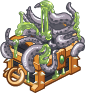
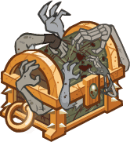

[Back to Main](index.md)

# Upcoming Weekends

Here are the upcoming weekends with their *estimated* dates - the *estimated* purchase reward - and the current expected champions.

    
        
            
            ID: 838**Gold Galaxy Chest**Loot for: Prudence, Rust, Nayeli, Tyril and Corazón<code>"for_crusaders":[84,94,3,10,85]</code>
        
        
            
                
                    **Adventures in Space**
                
                
                    18 September 2026
                
            
            
                
                    
                        Assumed Reward:
                    
                    
                        Golden Epic for Corazón
                    
                
                
                    
                        Prudence
                        ID: 84**Prudence**Increases the damage of Prudence by 400%.<code>hero_dps_multiplier_mult,400</code>
                    
                    
                        Rust
                        ID: 94**Rust on the Harbour**
                    
                    
                        Nayeli
                        ID: 3**Nayeli Goldflower**Increases the effect of Nayeli's Aura of Courage ability by 200%.<code>buff_upgrade,200,38</code>
                    
                    
                        Tyril
                        ID: 10**Tyril Tallguy**Increases the effect of Tyril's Moonbeam and Wild Inspiration by 200%.<code>buff_upgrades,200,145,344</code>
                    
                    
                        Corazón
                        ID: 85**Corazón de Ballena**
                    
                
            
        
    
    
        
            
            ID: 839**Gold Commercial Chest**Loot for: Diana, Eric, Calliope, Celeste and Hank<code>"for_crusaders":[148,157,5,2,163]</code>
        
        
            
                
                    **We'll Be Right Back**
                
                
                    25 September 2026
                
            
            
                
                    
                        Assumed Reward:
                    
                    
                        Golden Epic for Hank
                    
                
                
                    
                        Diana
                        ID: 148**Diana**
                    
                    
                        Eric
                        ID: 157**Eric**
                    
                    
                        Calliope
                        ID: 5**Calliope**Increases the effect of Calliope's Bardic Inspiration ability by 200%.<code>buff_upgrade,200,71</code>
                    
                    
                        Celeste
                        ID: 2**Celeste**Increases the effect of Celeste's Crusader's Mantle ability by 200%.<code>buff_upgrade,200,24</code>
                    
                    
                        Hank
                        ID: 163**Hank**Increases the effect of Hank's Stalwart Encouragement ability by 200%.<code>buff_upgrade,200,17079</code>
                    
                
            
        
    
    
        
            
            ID: 840**Gold Durge Chest**Loot for: Dark Urge, Karlach, Minsc, Asharra and Wyll<code>"for_crusaders":[146,143,7,6,142]</code>
        
        
            
                
                    **Durge Run**
                
                
                    02 October 2026
                
            
            
                
                    
                        Assumed Reward:
                    
                    
                        Golden Epic for Wyll
                    
                
                
                    
                        Dark Urge
                        ID: 146**The Dark Urge**Increases the effect of Dark Urge's The Urge ability by 200%.<code>buff_upgrade,200,14379</code>
                    
                    
                        Karlach
                        ID: 143**Karlach**
                    
                    
                        Minsc
                        ID: 7**Minsc**Increases the effect of Minsc's Favored Enemy: Beasts, Favored Enemy: Fey, Favored Enemy: Humanoids, Favored Enemy: Monstrosities and Favored Enemy: Undead by 200%.<code>buff_upgrades,200,109,111,108,112,110</code>
                    
                    
                        Asharra
                        ID: 6**Asharra**Increases the effect of Asharra's Bond: Dwarves and Elves, Bond: Exotic Species, Bond: Half n' Half, Bond: Humans, Bond: Potpourri and Bond: Short-folk by 200%.<code>buff_upgrades,200,91,976,975,90,92,977</code>
                    
                    
                        Wyll
                        ID: 142**Wyll**
                    
                
            
        
    
    
        
            
            ID: 845**Gold Distinguished Chest**Loot for: Bruenor, Tyril, Caramon, Laurana and Kitiara<code>"for_crusaders":[1,10,179,175,180]</code>
        
        
            
                
                    **Renown**
                
                
                    09 October 2026
                
            
            
                
                    
                        Assumed Reward:
                    
                    
                        Golden Epic for Kitiara
                    
                
                
                    
                        Bruenor
                        ID: 1**Bruenor Battlehammer**Increases the effect of Bruenor's Rally ability by 200%.<code>buff_upgrade,200,4</code>
                    
                    
                        Tyril
                        ID: 10**Tyril Tallguy**Increases the effect of Tyril's Moonbeam and Wild Inspiration by 200%.<code>buff_upgrades,200,145,344</code>
                    
                    
                        Caramon
                        ID: 179**Caramon Majere**Increases the effect of Caramon's Raise Spirits: Encirclement, Raise Spirits: Overwatch and Raise Spirits: Spearhead by 200%.<code>buff_upgrades,200,20177,20178,20179</code>
                    
                    
                        Laurana
                        ID: 175**Lauralanthalasa Kanan**Increases the effect of Laurana's Battle Plan: Charge, Battle Plan: Fortify and Battle Plan: Outflank by 200%.<code>buff_upgrades,200,19354,19356,19355</code>
                    
                    
                        Kitiara
                        ID: 180**Kitiara Uth Matar**
                    
                
            
        
    
    
        
            
            ID: 846**Gold Tentacled Chest**Loot for: Nayeli, Celeste, Prudence, Corazón and Dob<code>"for_crusaders":[3,2,84,85,105]</code>
        
        
            
                
                    **Echoes from the Far Realm**
                
                
                    16 October 2026
                
            
            
                
                    
                        Assumed Reward:
                    
                    
                        Golden Epic for Dob
                    
                
                
                    
                        Nayeli
                        ID: 3**Nayeli Goldflower**Increases the effect of Nayeli's Aura of Courage ability by 200%.<code>buff_upgrade,200,38</code>
                    
                    
                        Celeste
                        ID: 2**Celeste**Increases the effect of Celeste's Crusader's Mantle ability by 200%.<code>buff_upgrade,200,24</code>
                    
                    
                        Prudence
                        ID: 84**Prudence**Increases the damage of Prudence by 400%.<code>hero_dps_multiplier_mult,400</code>
                    
                    
                        Corazón
                        ID: 85**Corazón de Ballena**
                    
                    
                        Dob
                        ID: 105**Dob**
                    
                
            
        
    
    
        
            
            ID: 847**Gold Rising Darkness Chest**Loot for: Avren, Calliope, Arkhan, Widdle and Hew Maan<code>"for_crusaders":[51,5,12,91,75]</code>
        
        
            
                
                    **Darkness Rises**
                
                
                    23 October 2026
                
            
            
                
                    
                        Assumed Reward:
                    
                    
                        Golden Epic for Hew Maan
                    
                
                
                    
                        Avren
                        ID: 51**Avren**
                    
                    
                        Calliope
                        ID: 5**Calliope**Increases the effect of Calliope's Bardic Inspiration ability by 200%.<code>buff_upgrade,200,71</code>
                    
                    
                        Arkhan
                        ID: 12**Arkhan**
                    
                    
                        Widdle
                        ID: 91**Widdle**
                    
                    
                        Hew Maan
                        ID: 75**Hew Maan**Increases the effect of Hew Maan's Hello, Fellow Humans ability by 200%.<code>buff_upgrade,200,10649</code>
                    
                
            
        
    
    
        
            
            ID: 848**Gold Clawed Chest**Loot for: Asharra, Jarlaxle, Briv, Lae'zel and Brig<code>"for_crusaders":[6,4,58,128,90]</code>
        
        
            
                
                    **Rise of Undeath**
                
                
                    30 October 2026
                
            
            
                
                    
                        Assumed Reward:
                    
                    
                        Golden Epic for Brig
                    
                
                
                    
                        Asharra
                        ID: 6**Asharra**Increases the effect of Asharra's Bond: Dwarves and Elves, Bond: Exotic Species, Bond: Half n' Half, Bond: Humans, Bond: Potpourri and Bond: Short-folk by 200%.<code>buff_upgrades,200,91,976,975,90,92,977</code>
                    
                    
                        Jarlaxle
                        ID: 4**Jarlaxle Baenre**Increases the effect of Jarlaxle's Master of Disguise and Master of Piracy by 200%.<code>buff_upgrades,200,52,2188</code>
                    
                    
                        Briv
                        ID: 58**Briv Steelmarrow**
                    
                    
                        Lae'zel
                        ID: 128**Lae'zel**Increases the effect of Lae'zel's Lethal Coordination ability by 200%.<code>buff_upgrade,200,12113</code>
                    
                    
                        Brig
                        ID: 90**Brig Hellclaw**
                    
                
            
        
    

[Back to Top](#top)

*Last Modified: {{ site.time }}*