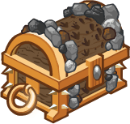
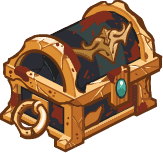

[Back to Main](index.md)

# Upcoming Weekends

Here are the upcoming weekends with their *estimated* dates - the *estimated* purchase reward - and the current expected champions.

    
        
            
            ID: 835**Gold Footprint Chest**Loot for: Dark Urge, Shadowheart, Makos, Minsc and Lae'zel<code>"for_crusaders":[146,141,9,7,128]</code>
        
        
            
                
                    **Feats of Leadership**
                
                
                    28 August 2026
                
            
            
                
                    
                        Assumed Reward:
                    
                    
                        Golden Epic for Lae'zel
                    
                
                
                    
                        Dark Urge
                        ID: 146**The Dark Urge**
                    
                    
                        Shadowheart
                        ID: 141**Shadowheart**
                    
                    
                        Makos
                        ID: 9**Makos**Increases the effect of Makos's Dark Blessing and Dark Luck by 200%.<code>buff_upgrades,200,140,139</code>
                    
                    
                        Minsc
                        ID: 7**Minsc**
                    
                    
                        Lae'zel
                        ID: 128**Lae'zel**Increases the effect of Lae'zel's Lethal Coordination ability by 200%.<code>buff_upgrade,200,12113</code>
                    
                
            
        
    
    
        
            
            ID: 836**Gold Distinguished Chest**Loot for: Flint, Raistlin, Jarlaxle, Bruenor and Caramon<code>"for_crusaders":[178,173,4,1,179]</code>
        
        
            
                
                    **Renown**
                
                
                    04 September 2026
                
            
            
                
                    
                        Assumed Reward:
                    
                    
                        Golden Epic for Caramon
                    
                
                
                    
                        Flint
                        ID: 178**Flint Fireforge**Increases the effect of Flint's Forged Bonds ability by 200%. (Prestack)<code>buff_upgrade,200,20130</code>
                    
                    
                        Raistlin
                        ID: 173**Raistlin Majere**Increases the effect of Raistlin's Prodigy of High Sorcery ability by 200%.<code>buff_upgrade,200,18929</code>
                    
                    
                        Jarlaxle
                        ID: 4**Jarlaxle Baenre**Increases the effect of Jarlaxle's Master of Disguise and Master of Piracy by 200%.<code>buff_upgrades,200,52,2188</code>
                    
                    
                        Bruenor
                        ID: 1**Bruenor Battlehammer**Increases the effect of Bruenor's Rally ability by 200%.<code>buff_upgrade,200,4</code>
                    
                    
                        Caramon
                        ID: 179**Caramon Majere**
                    
                
            
        
    
    
        
            
            ID: 837**Gold Trophy Chest**Loot for: Melf, Ellywick, Makos, Jamilah and Pwent<code>"for_crusaders":[59,83,9,11,50]</code>
        
        
            
                
                    **Contest of Champions**
                
                
                    11 September 2026
                
            
            
                
                    
                        Assumed Reward:
                    
                    
                        Golden Epic for Pwent
                    
                
                
                    
                        Melf
                        ID: 59**Melf**
                    
                    
                        Ellywick
                        ID: 83**Ellywick Tumblestrum**All Champions damage +200%.<code>global_dps_multiplier_mult,200</code>
                    
                    
                        Makos
                        ID: 9**Makos**Increases the effect of Makos's Dark Blessing and Dark Luck by 200%.<code>buff_upgrades,200,140,139</code>
                    
                    
                        Jamilah
                        ID: 11**Jamilah**Increases the effect of Jamilah's Berserker Confidence and Frontline Fighter by 200%.<code>buff_upgrades,200,2198,238</code>
                    
                    
                        Pwent
                        ID: 50**Thibbledorf Pwent**
                    
                
            
        
    
    
        
            
            ID: 838**Gold Galaxy Chest**Loot for: Prudence, Rust, Nayeli, Tyril and Corazón<code>"for_crusaders":[84,94,3,10,85]</code>
        
        
            
                
                    **Adventures in Space**
                
                
                    18 September 2026
                
            
            
                
                    
                        Assumed Reward:
                    
                    
                        Golden Epic for Corazón
                    
                
                
                    
                        Prudence
                        ID: 84**Prudence**Increases the damage of Prudence by 400%.<code>hero_dps_multiplier_mult,400</code>
                    
                    
                        Rust
                        ID: 94**Rust on the Harbour**
                    
                    
                        Nayeli
                        ID: 3**Nayeli Goldflower**Increases the effect of Nayeli's Aura of Courage ability by 200%.<code>buff_upgrade,200,38</code>
                    
                    
                        Tyril
                        ID: 10**Tyril Tallguy**Increases the effect of Tyril's Moonbeam and Wild Inspiration by 200%.<code>buff_upgrades,200,145,344</code>
                    
                    
                        Corazón
                        ID: 85**Corazón de Ballena**
                    
                
            
        
    
    
        
            
            ID: 839**Gold Commercial Chest**Loot for: Diana, Eric, Calliope, Celeste and Hank<code>"for_crusaders":[148,157,5,2,163]</code>
        
        
            
                
                    **We'll Be Right Back**
                
                
                    25 September 2026
                
            
            
                
                    
                        Assumed Reward:
                    
                    
                        Golden Epic for Hank
                    
                
                
                    
                        Diana
                        ID: 148**Diana**
                    
                    
                        Eric
                        ID: 157**Eric**
                    
                    
                        Calliope
                        ID: 5**Calliope**Increases the effect of Calliope's Bardic Inspiration ability by 200%.<code>buff_upgrade,200,71</code>
                    
                    
                        Celeste
                        ID: 2**Celeste**Increases the effect of Celeste's Crusader's Mantle ability by 200%.<code>buff_upgrade,200,24</code>
                    
                    
                        Hank
                        ID: 163**Hank**Increases the effect of Hank's Stalwart Encouragement ability by 200%.<code>buff_upgrade,200,17079</code>
                    
                
            
        
    
    
        
            
            ID: 840**Gold Durge Chest**Loot for: Dark Urge, Karlach, Minsc, Asharra and Wyll<code>"for_crusaders":[146,143,7,6,142]</code>
        
        
            
                
                    **Durge Run**
                
                
                    02 October 2026
                
            
            
                
                    
                        Assumed Reward:
                    
                    
                        Golden Epic for Wyll
                    
                
                
                    
                        Dark Urge
                        ID: 146**The Dark Urge**
                    
                    
                        Karlach
                        ID: 143**Karlach**
                    
                    
                        Minsc
                        ID: 7**Minsc**
                    
                    
                        Asharra
                        ID: 6**Asharra**Increases the effect of Asharra's Bond: Dwarves and Elves, Bond: Exotic Species, Bond: Half n' Half, Bond: Humans, Bond: Potpourri and Bond: Short-folk by 200%.<code>buff_upgrades,200,91,976,975,90,92,977</code>
                    
                    
                        Wyll
                        ID: 142**Wyll**
                    
                
            
        
    

[Back to Top](#top)

*Last Modified: {{ site.time }}*