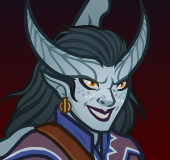

[Back to Main](index.md)

    
        
            
        
        
        Portrait
        
    
    
        
            
        
        
        Model
        
    

# Windfall

A dedicated champion of Tiamat, Windfall has been granted phenomenal power by her master. She is the proprietor of the Red Belvedere, a monument to Tiamat and a remnant of Avernus's original existence as a bucolic paradise designed to tempt mortals. Its edifice was destroyed in the carnage of the Blood War, but Windfall rebuilt the casino and rededicated it to the Dragon Queen as a celebration of her god's greed and vanity. Windfall is ostentatious and charismatic, making small talk with regular patrons and jovially welcoming new faces to the casino. She once plotted to assemble the Rod of Seven Parts to create a gift for her cruel goddess, but has instead joined the Champions at Tiamat's behest.

# Basic Information

Windfall will be an upcoming Evergreen champion set to release on 28 May 2025 with the [Vecna 8 content drop](contentdrops.md#vecna-8---28-may-2025).

    
        
            **Seat**:
        
        
            5
        
        
            **Stat**
        
        
            **Value**
        
        
            **Day 1 Trials**
        
        
            **Patrons**
        
    
    
        
            **Species**:
        
        
            Tiefling
        
        
            **Strength**:
        
        
            14
        
        
            Yes
        
        
            Mirt
        
    
    
        
            **Class**:
        
        
            Bard
        
        
            **Dexterity**:
        
        
            24
        
        
            Yes
        
        
            Vajra
        
    
    
        
            **Roles**:
        
        
            DPS / Support / Gold
        
        
            **Constitution**:
        
        
            20
        
        
            Yes
        
        
            Strahd
        
    
    
        
            **Age**:
        
        
            35
        
        
            **Intelligence**:
        
        
            22
        
        
            Yes
        
        
            Zariel
        
    
    
        
            **Gender**:
        
        
            Female
        
        
            **Wisdom**:
        
        
            18
        
        
            Yes
        
        
            Elminster
        
    
    
        
            **Alignment**:
        
        
            Chaotic Evil
        
        
            **Charisma**:
        
        
            26
        
        
            Yes
        
        
            &nbsp;
        
    
    
        
            **Affiliation**:
        
        
            -
        
        
            **Total**:
        
        
            124
        
        
            Champion ID:
        
        
            167
        
    

# Attacks

 **Base Attack: Chromatic Rapier** (Melee)
> Windfall attacks a random enemy for 1 hit.  
> Cooldown: 2.75s (Cap 0.6875s)

<em>Raw Data</em>

<pre>
{
    "id": 857,
    "name": "Chromatic Rapier",
    "description": "Windfall attacks a random enemy for 1 hit.",
    "long_description": "",
    "graphic_id": 0,
    "target": "random",
    "num_targets": 1,
    "aoe_radius": 0,
    "damage_modifier": 1,
    "cooldown": 2.75,
    "animations": [
        {
            "type": "melee_attack",
            "target_offset_x": -34,
            "damage_frame": 2,
            "jump_sound": 30,
            "sound_frames": {
                "2": 154
            }
        }
    ],
    "tags": [
        "melee"
    ],
    "damage_types": [
        "melee"
    ]
}
</pre>

  **Base Attack: Red Dragon's Greed** (Melee / Magic)
> With the fury of a red dragon, Windfall prefers to attack enemies that drop gold.  
> Cooldown: 2.75s (Cap 0.6875s)

<em>Raw Data</em>

<pre>
{
    "id": 846,
    "name": "Red Dragon's Greed",
    "description": "With the fury of a red dragon, Windfall prefers to attack enemies that drop gold.",
    "long_description": "",
    "graphic_id": 0,
    "target": "avoid_filler_or_random",
    "num_targets": 1,
    "aoe_radius": 0,
    "damage_modifier": 1,
    "cooldown": 2.75,
    "animations": [
        {
            "type": "melee_attack",
            "target_offset_x": -34,
            "damage_frame": 2,
            "jump_sound": 30,
            "sound_frames": {
                "2": 154
            }
        }
    ],
    "tags": [
        "melee"
    ],
    "damage_types": [
        "melee",
        "magic"
    ]
}
</pre>

  **Base Attack: Blue Dragon's Spark** (Melee / Magic)
> With the cunning of a blue dragon, Windfall prefers to attack stunned enemies.  
> Cooldown: 2.75s (Cap 0.6875s)

<em>Raw Data</em>

<pre>
{
    "id": 853,
    "name": "Blue Dragon's Spark",
    "description": "With the cunning of a blue dragon, Windfall prefers to attack stunned enemies.",
    "long_description": "",
    "graphic_id": 0,
    "target": "stunned_or_random",
    "num_targets": 1,
    "aoe_radius": 0,
    "damage_modifier": 1,
    "cooldown": 2.75,
    "animations": [
        {
            "type": "melee_attack",
            "damage_frame": 8,
            "stun_on_hit": 3,
            "return_to_formation": false,
            "chain_attack_id": 854,
            "chain_attack_can_target_same": false
        }
    ],
    "tags": [
        "melee"
    ],
    "damage_types": [
        "melee",
        "magic"
    ]
}
</pre>

  **Base Attack: Green Dragon's Spite** (Melee / Magic)
> With the guile of a green dragon, Windfall prefers to attack distant enemies.  
> Cooldown: 2.75s (Cap 0.6875s)

<em>Raw Data</em>

<pre>
{
    "id": 849,
    "name": "Green Dragon's Spite",
    "description": "With the guile of a green dragon, Windfall prefers to attack distant enemies.",
    "long_description": "",
    "graphic_id": 0,
    "target": "back",
    "num_targets": 1,
    "aoe_radius": 0,
    "damage_modifier": 1,
    "cooldown": 2.75,
    "animations": [
        {
            "type": "melee_attack",
            "target_offset_x": -34,
            "damage_frame": 2,
            "jump_sound": 30,
            "sound_frames": {
                "2": 154
            }
        }
    ],
    "tags": [
        "melee"
    ],
    "damage_types": [
        "melee",
        "magic"
    ]
}
</pre>

  **Base Attack: Black Dragon's Corrosion** (Melee / Magic)
> With the malice of a black dragon, Windfall prefers to attack armored enemies.  
> Cooldown: 2.75s (Cap 0.6875s)

<em>Raw Data</em>

<pre>
{
    "id": 848,
    "name": "Black Dragon's Corrosion",
    "description": "With the malice of a black dragon, Windfall prefers to attack armored enemies.",
    "long_description": "",
    "graphic_id": 0,
    "target": "armored_and_hits_or_random",
    "num_targets": 1,
    "aoe_radius": 0,
    "damage_modifier": 1,
    "cooldown": 2.75,
    "animations": [
        {
            "type": "melee_attack",
            "target_offset_x": -34,
            "damage_frame": 2,
            "jump_sound": 30,
            "sound_frames": {
                "2": 154
            },
            "effects_on_monsters": [
                {
                    "effect_string": "do_nothing,0",
                    "overlay": 26391
                }
            ]
        }
    ],
    "tags": [
        "melee"
    ],
    "damage_types": [
        "melee",
        "magic"
    ]
}
</pre>

  **Base Attack: White Dragon's Chill** (Melee / Magic)
> With the icy wrath of a white dragon, Windfall prefers to attack slow enemies.  
> Cooldown: 2.75s (Cap 0.6875s)

<em>Raw Data</em>

<pre>
{
    "id": 852,
    "name": "White Dragon's Chill",
    "description": "With the icy wrath of a white dragon, Windfall prefers to attack slow enemies.",
    "long_description": "",
    "graphic_id": 0,
    "target": "slowed_or_random",
    "num_targets": 1,
    "aoe_radius": 0,
    "damage_modifier": 1,
    "cooldown": 2.75,
    "animations": [
        {
            "type": "melee_attack",
            "target_offset_x": -34,
            "damage_frame": 2,
            "jump_sound": 30,
            "sound_frames": {
                "2": 154
            }
        }
    ],
    "tags": [
        "melee"
    ],
    "damage_types": [
        "melee",
        "magic"
    ]
}
</pre>

 **Ultimate Attack: Stunning Scintillation** (Level: 0)
> Windfall's blinding coat erupts in a scintillating flash, dealing 1 ultimate hit to all enemies, stunning and then slowing them.  
> Cooldown: 220s (Cap 55s)

<em>Raw Data</em>

<pre>
{
    "id": 855,
    "name": "Stunning Scintillation",
    "description": "Windfall deals 1 ultimate hit to all enemies, stunning them before slowing them.",
    "long_description": "Windfall's blinding coat erupts in a scintillating flash, dealing 1 ultimate hit to all enemies, stunning and then slowing them.",
    "graphic_id": 26385,
    "target": "all",
    "num_targets": 1,
    "aoe_radius": 0,
    "damage_modifier": 1,
    "cooldown": 220,
    "animations": [
        {
            "type": "ultimate_attack",
            "ultimate": "windfall",
            "duration": 8,
            "stun_duration": 3,
            "animation_sequence_name": "ultimate",
            "projectile_details": {
                "chain_targets": 0,
                "fixed_time_to_target": 0.15,
                "follow_source": true,
                "has_trail": false,
                "hit_effect_graphic": "Effect_Windfall_Lightning_Hit",
                "segment_graphics": [
                    "Effect_WindfallChainLightningSegment1",
                    "Effect_WindfallChainLightningSegment2",
                    "Effect_WindfallChainLightningSegment3"
                ]
            },
            "effects_on_monsters": [
                {
                    "effect_string": "monster_speed_reduce,50",
                    "for_time": 6
                }
            ],
            "force_count_for_bud": false
        }
    ],
    "tags": [
        "melee"
    ],
    "damage_types": [
        "melee",
        "magic"
    ]
}
</pre>

# Abilities

**Proprietor of the Red Belvedere** (Level: 0)
> Windfall can be used in any Vecna: Eve of Ruin campaign adventure or variant, even if she would not normally be available to be used due to variant or patron restrictions.

<em>Raw Data</em>

<pre>
{
    "id": 17052,
    "hero_id": 167,
    "required_level": 0,
    "required_upgrade_id": 0,
    "upgrade_type": "unlock_ability",
    "effect": "effect_def,2292",
    "static_dps_mult": null,
    "default_enabled": 1,
    "name": "Proprietor of the Red Belvedere"
}
{
    "id": 2292,
    "flavour_text": "",
    "description": {
        "desc": "Windfall can be used in any Vecna: Eve of Ruin campaign adventure or variant, even if she would not normally be available to be used due to variant or patron restrictions."
    },
    "effect_keys": [],
    "requirements": "",
    "graphic_id": 0,
    "large_graphic_id": 0,
    "properties": {
        "is_formation_ability": true,
        "formation_circle_icon": false
    }
}
</pre>

 **The Long Game** (Level: 30)
> Windfall increases the damage of all Champions in the column(s) with the most slots by 100%. If multiple columns are tied for the most slots, then each of them are affected.

<em>Raw Data</em>

<pre>
{
    "id": 17053,
    "hero_id": 167,
    "required_level": 30,
    "required_upgrade_id": 0,
    "upgrade_type": "unlock_ability",
    "effect": "effect_def,2296",
    "static_dps_mult": null,
    "default_enabled": 1,
    "name": "The Long Game",
    "tip_text": "Windfall increases the damage of all Champions in the longest column(s)."
}
{
    "id": 2296,
    "flavour_text": "",
    "description": {
        "desc": "Windfall increases the damage of all Champions in the column(s) with the most slots by $amount%. If multiple columns are tied for the most slots, then each of them are affected."
    },
    "effect_keys": [
        {
            "effect_string": "hero_dps_multiplier_mult,100",
            "targets": [
                "tallest_column"
            ],
            "use_computed_amount_for_description": true,
            "off_when_benched": true
        }
    ],
    "requirements": "",
    "graphic_id": 26379,
    "large_graphic_id": 26376,
    "properties": {
        "is_formation_ability": true
    }
}
</pre>

 **The Gambler** (Level: 60)
> When Windfall attacks and defeats an enemy, she gains a Raise stack. Otherwise, she gains a Call stack. Gold find is increased by 100% for each Raise stack, stacking multiplicatively. Windfall's damage and The Long Game are both increased by $amount___2% for each Call stack, stacking multiplicatively. Both are capped at 25 stacks and reset upon changing areas.

<em>Raw Data</em>

<pre>
{
    "id": 17054,
    "hero_id": 167,
    "required_level": 60,
    "required_upgrade_id": 0,
    "upgrade_type": "unlock_ability",
    "effect": "effect_def,2297",
    "static_dps_mult": null,
    "default_enabled": 1,
    "name": "The Gambler"
}
{
    "id": 2297,
    "flavour_text": "",
    "description": {
        "desc": "When Windfall attacks and defeats an enemy, she gains a Raise stack. Otherwise, she gains a Call stack. Gold find is increased by $amount% for each Raise stack, stacking multiplicatively. Windfall's damage and The Long Game are both increased by $amount___2% for each Call stack, stacking multiplicatively. Both are capped at 25 stacks and reset upon changing areas."
    },
    "effect_keys": [
        {
            "effect_string": "gold_multiplier_mult,100",
            "stacks_on_trigger": "monster_killed_by_owner",
            "more_triggers": [
                {
                    "trigger": "area_changed",
                    "action": {
                        "type": "reset_stacks"
                    }
                }
            ],
            "stack_title": "Raise Stacks",
            "total_title": "Raise Stack Bonus",
            "max_stacks": 25,
            "stacks_multiply": true,
            "show_bonus": true,
            "off_when_benched": true
        },
        {
            "effect_string": "do_nothing,400",
            "stacks_on_trigger": "owner_attack_no_kill",
            "more_triggers": [
                {
                    "trigger": "area_changed",
                    "action": {
                        "type": "reset_stacks"
                    }
                }
            ],
            "stack_title": "Call Stacks",
            "total_title": "Call Stack Bonus",
            "max_stacks": 25,
            "stacks_multiply": true,
            "show_bonus": true,
            "off_when_benched": true
        },
        {
            "effect_string": "hero_dps_multiplier_mult,400",
            "amount_expr": "upgrade_amount(17054,1)",
            "targets": [
                "self"
            ],
            "off_when_benched": true,
            "show_bonus": false
        },
        {
            "effect_string": "buff_upgrade,400,17053",
            "amount_expr": "upgrade_amount(17054,1)",
            "off_when_benched": true,
            "show_bonus": false
        }
    ],
    "requirements": "",
    "graphic_id": 26378,
    "large_graphic_id": 26375,
    "properties": {
        "is_formation_ability": true,
        "indexed_effect_properties": true,
        "per_effect_index_bonuses": true,
        "formation_circle_icon": false,
        "owner_use_outgoing_description": true
    }
}
</pre>

**Stunning Scintillation** (Level: 150)
> Unlocks Windfall's Stunning Scintillation Ultimate Attack.

<em>Raw Data</em>

<pre>
{
    "id": 17078,
    "hero_id": 167,
    "required_level": 150,
    "required_upgrade_id": 0,
    "upgrade_type": "unlock_ultimate",
    "effect": "effect_def,2316",
    "static_dps_mult": null,
    "default_enabled": 1,
    "name": "Stunning Scintillation"
}
{
    "id": 2316,
    "flavour_text": "",
    "description": {
        "desc": "Unlocks Windfall's Stunning Scintillation Ultimate Attack"
    },
    "effect_keys": [
        {
            "effect_string": "windfall_ult",
            "duration": 4,
            "fade_duration": 0.6
        },
        {
            "effect_string": "set_ultimate_attack"
        },
        {
            "effect_string": "chance_attack_adds_dot,300,6,1,100,855",
            "pop_damage": true,
            "use_bud": true,
            "extends_time": false,
            "fixed_damage": true,
            "graphic": {
                "active_graphic_id": 26298,
                "scale_y": 0.3,
                "random_tint": [
                    "#FF0000",
                    "#00FF00",
                    "#0000FF",
                    "#000000",
                    "#FFFFFF"
                ]
            },
            "after_damage": true
        }
    ],
    "requirements": "",
    "graphic_id": 0,
    "large_graphic_id": 26385,
    "properties": {
        "is_formation_ability": true,
        "owner_use_outgoing_description": true,
        "formation_circle_icon": false,
        "show_outgoing_desc_when_benched": false
    }
}
</pre>

 **Dragon's Pride** (Level: 200)
> Windfall increases the effect of The Long Game by 20% for each adventure, variant, and Patron variant you have completed in the Vecna: Eve of Ruin campaign, stacking multiplicatively.

<em>Raw Data</em>

<pre>
{
    "id": 17055,
    "hero_id": 167,
    "required_level": 200,
    "required_upgrade_id": 0,
    "upgrade_type": "unlock_ability",
    "effect": "effect_def,2298",
    "static_dps_mult": null,
    "default_enabled": 1,
    "name": "Dragon's Pride",
    "tip_text": "Windfall increases the effect of The Long Game for each adventure, variant, and Patron variant you have completed in the Vecna: Eve of Ruin campaign."
}
{
    "id": 2298,
    "flavour_text": "",
    "description": {
        "desc": "Windfall increases the effect of The Long Game by $(not_buffed amount)% for each adventure, variant, and Patron variant you have completed in the Vecna: Eve of Ruin campaign, stacking multiplicatively."
    },
    "effect_keys": [
        {
            "off_when_benched": true,
            "effect_string": "buff_upgrade,20,17053",
            "stacks_multiply": true,
            "show_bonus": true,
            "amount_func": "mult",
            "stack_func": "get_stat",
            "stat": "VecnaAdventuresCompleted",
            "ided_stat_id": 31,
            "ided_stat_handler": "CompletedAdventuresVariantsAndPatronVariants",
            "use_computed_amount_for_description": true,
            "stack_title": "Vecna: Eve of Ruin Adventures Completed",
            "amount_updated_listeners": [
                "stat_changed,VecnaAdventuresCompleted"
            ]
        }
    ],
    "requirements": "",
    "graphic_id": 26377,
    "large_graphic_id": 26374,
    "properties": {
        "is_formation_ability": true,
        "formation_circle_icon": false
    }
}
</pre>

# Specialisations

 **Red Dragon's Greed** (Level: 100)
> Windfall tries to avoid attacking enemies that don't drop gold or count for quest progress. Her normal attacks light her target on fire, dealing $amount___3 seconds of BUD-based damage to the enemy every second for 5 seconds.

<em>Raw Data</em>

<pre>
{
    "id": 17056,
    "hero_id": 167,
    "required_level": 100,
    "required_upgrade_id": 0,
    "upgrade_type": "unlock_ability",
    "effect": "effect_def,2299",
    "static_dps_mult": null,
    "default_enabled": 1,
    "name": "Red Dragon's Greed",
    "specialization_name": "Red Dragon's Greed",
    "specialization_description": "Windfall's attacks take on the aspect of a greedy red dragon.",
    "specialization_graphic_id": 26383
}
{
    "id": 2299,
    "flavour_text": "",
    "description": {
        "desc": "Windfall tries to avoid attacking enemies that don't drop gold or count for quest progress. Her normal attacks light her target on fire, dealing $amount___3 seconds of BUD-based damage to the enemy every second for $time___2 seconds."
    },
    "effect_keys": [
        {
            "effect_string": "change_base_attack,846"
        },
        {
            "effect_string": "chance_attack_adds_dot,300,5,1,100,846",
            "pop_damage": true,
            "use_bud": true,
            "fixed_damage": true,
            "graphic": {
                "active_graphic_id": 26299,
                "scale_y": 0.3
            }
        },
        {
            "effect_string": "do_nothing,3"
        },
        {
            "effect_string": "expression_on_trigger,owner_attack_with_id",
            "trigger_params": [
                "846"
            ],
            "per_trigger_expr": "{AppendToSaveStat(`windfall_spec_0_attack`, false, trigger_count) NotifyStatChanged(`WindfallFiveHeadsOfTiamat`, false)}",
            "off_when_benched": true
        }
    ],
    "requirements": "",
    "graphic_id": 26383,
    "large_graphic_id": 0,
    "properties": {
        "is_formation_ability": true,
        "indexed_effect_properties": true,
        "per_effect_index_bonuses": true,
        "owner_use_outgoing_description": true
    }
}
</pre>

 **Blue Dragon's Spark** (Level: 100)
> Windfall gains the Control role and she prefers to attack stunned enemies. Her normal attacks are charged with lightning, striking out at up to two other random enemies, dealing $amount___3 seconds of BUD-based damage to them, and stunning all enemies damaged for 3 seconds.

<em>Raw Data</em>

<pre>
{
    "id": 17057,
    "hero_id": 167,
    "required_level": 100,
    "required_upgrade_id": 0,
    "upgrade_type": "unlock_ability",
    "effect": "effect_def,2300",
    "static_dps_mult": null,
    "default_enabled": 1,
    "name": "Blue Dragon's Spark",
    "specialization_name": "Blue Dragon's Spark",
    "specialization_description": "Windfall's attacks take on the aspect of a shocking blue dragon.",
    "specialization_graphic_id": 26381
}
{
    "id": 2300,
    "flavour_text": "",
    "description": {
        "desc": "Windfall gains the Control role and she prefers to attack stunned enemies. Her normal attacks are charged with lightning, striking out at up to two other random enemies, dealing $amount___3 seconds of BUD-based damage to them, and stunning all enemies damaged for 3 seconds."
    },
    "effect_keys": [
        {
            "effect_string": "add_hero_tags,0,control"
        },
        {
            "effect_string": "change_base_attack,853"
        },
        {
            "effect_string": "do_nothing,5"
        },
        {
            "effect_string": "expression_on_trigger,owner_attack_with_id",
            "trigger_params": [
                "853"
            ],
            "per_trigger_expr": "{AppendToSaveStat(`windfall_spec_1_attack`, false, trigger_count) NotifyStatChanged(`WindfallFiveHeadsOfTiamat`, false)}",
            "off_when_benched": true
        }
    ],
    "requirements": "",
    "graphic_id": 26381,
    "large_graphic_id": 0,
    "properties": {
        "is_formation_ability": true,
        "indexed_effect_properties": true,
        "per_effect_index_bonuses": true,
        "owner_use_outgoing_description": true,
        "default_bonus_index": 2
    }
}
</pre>

 **Green Dragon's Spite** (Level: 100)
> Windfall prefers to attack the farthest target. Her normal attacks exude a small cloud of poisonous gas around the target for 10 seconds. Enemies in the gas cloud take 2 seconds of BUD-based damage every second while they are in the area.

<em>Raw Data</em>

<pre>
{
    "id": 17058,
    "hero_id": 167,
    "required_level": 100,
    "required_upgrade_id": 0,
    "upgrade_type": "unlock_ability",
    "effect": "effect_def,2301",
    "static_dps_mult": null,
    "default_enabled": 1,
    "name": "Green Dragon's Spite",
    "specialization_name": "Green Dragon's Spite",
    "specialization_description": "Windfall's attacks take on the aspect of a noxious green dragon.",
    "specialization_graphic_id": 26382
}
{
    "id": 2301,
    "flavour_text": "",
    "description": {
        "desc": "Windfall prefers to attack the farthest target. Her normal attacks exude a small cloud of poisonous gas around the target for 10 seconds. Enemies in the gas cloud take $amount___2 seconds of BUD-based damage every second while they are in the area."
    },
    "effect_keys": [
        {
            "effect_string": "change_base_attack,849"
        },
        {
            "effect_string": "add_monster_hit_effects,2",
            "optional_attack_ids": [
                849
            ],
            "monster_effect": {
                "effect_string": "ground_effect_area,$amount",
                "area_key": "green_dragon_poison_clouds",
                "drop_on_hero": true,
                "radius": 100,
                "duration": 10,
                "area_effects": [
                    {
                        "effect_string": "bud_dot,$amount",
                        "tick_rate": 1,
                        "total_ticks": 9999,
                        "for_time": "10",
                        "time_stack_type": "time_reset",
                        "use_collection_source": true,
                        "stack_across_effects": false
                    }
                ],
                "cloud_graphics": [
                    "Effect_WyrmspeakerGreen_CloudKill1",
                    "Effect_WyrmspeakerGreen_CloudKill2"
                ],
                "density": 7,
                "use_static_position": true,
                "do_not_stack": true
            }
        },
        {
            "effect_string": "expression_on_trigger,owner_attack_with_id",
            "trigger_params": [
                "849"
            ],
            "per_trigger_expr": "{AppendToSaveStat(`windfall_spec_2_attack`, false, trigger_count) NotifyStatChanged(`WindfallFiveHeadsOfTiamat`, false)}",
            "off_when_benched": true
        }
    ],
    "requirements": "",
    "graphic_id": 26382,
    "large_graphic_id": 0,
    "properties": {
        "is_formation_ability": true,
        "indexed_effect_properties": true,
        "per_effect_index_bonuses": true,
        "owner_use_outgoing_description": true,
        "default_bonus_index": 1
    }
}
</pre>

 **Black Dragon's Corrosion** (Level: 100)
> Windfall gains the Breaker role and she prefers to attack armored or hits-based enemies. Her normal attacks coat the target in Acid, dealing 10 seconds of BUD-based damage and all successful attacks against those targets break an additional piece of armored or segmented health.

<em>Raw Data</em>

<pre>
{
    "id": 17059,
    "hero_id": 167,
    "required_level": 100,
    "required_upgrade_id": 0,
    "upgrade_type": "unlock_ability",
    "effect": "effect_def,2302",
    "static_dps_mult": null,
    "default_enabled": 1,
    "name": "Black Dragon's Corrosion",
    "specialization_name": "Black Dragon's Corrosion",
    "specialization_description": "Windfall's attacks take on the aspect of a vile black dragon.",
    "specialization_graphic_id": 26380
}
{
    "id": 2302,
    "flavour_text": "",
    "description": {
        "desc": "Windfall gains the Breaker role and she prefers to attack armored or hits-based enemies. Her normal attacks coat the target in Acid, dealing $amount___3 seconds of BUD-based damage and all successful attacks against those targets break an additional piece of armored or segmented health."
    },
    "effect_keys": [
        {
            "effect_string": "add_hero_tags,0,breaking"
        },
        {
            "effect_string": "change_base_attack,848"
        },
        {
            "effect_string": "hero_deal_bud_on_attack,10"
        },
        {
            "effect_string": "windfall_black_dragon_debuff,0",
            "debuff_max_stacks": 1,
            "debuffing_attack_ids": [
                848
            ],
            "debuff_before_damage": false,
            "off_when_benched": true,
            "debuff_effects": [
                {
                    "effect_string": "increase_damage_on_armor_and_hits,1",
                    "active_graphic_id": 26391,
                    "stacks_on_reapply": false,
                    "manual_stacking": true,
                    "default_stacks": 0,
                    "max_stacks": 1,
                    "stacks_multiply": false,
                    "use_collection_source": true
                }
            ]
        },
        {
            "effect_string": "expression_on_trigger,owner_attack_with_id",
            "trigger_params": [
                "848"
            ],
            "per_trigger_expr": "{AppendToSaveStat(`windfall_spec_3_attack`, false, trigger_count) NotifyStatChanged(`WindfallFiveHeadsOfTiamat`, false)}",
            "off_when_benched": true
        }
    ],
    "requirements": "",
    "graphic_id": 26380,
    "large_graphic_id": 0,
    "properties": {
        "is_formation_ability": true,
        "indexed_effect_properties": true,
        "per_effect_index_bonuses": true,
        "owner_use_outgoing_description": true
    }
}
</pre>

 **White Dragon's Chill** (Level: 100)
> Windfall gains the Control role and she prefers to attack slowed enemies. Her normal attacks create a medium cloud of icy air for 5 seconds around the target. Enemies in the cloud take 1 second of BUD-based damage every second while they are in the area and are slowed by 50%.

<em>Raw Data</em>

<pre>
{
    "id": 17060,
    "hero_id": 167,
    "required_level": 100,
    "required_upgrade_id": 0,
    "upgrade_type": "unlock_ability",
    "effect": "effect_def,2303",
    "static_dps_mult": null,
    "default_enabled": 1,
    "name": "White Dragon's Chill",
    "specialization_name": "White Dragon's Chill",
    "specialization_description": "Windfall's attacks take on the aspect of a chilling white dragon.",
    "specialization_graphic_id": 26384
}
{
    "id": 2303,
    "flavour_text": "",
    "description": {
        "desc": "Windfall gains the Control role and she prefers to attack slowed enemies. Her normal attacks create a medium cloud of icy air for 5 seconds around the target. Enemies in the cloud take $amount___3 second of BUD-based damage every second while they are in the area and are slowed by 50%."
    },
    "effect_keys": [
        {
            "effect_string": "add_hero_tags,0,control"
        },
        {
            "effect_string": "change_base_attack,852"
        },
        {
            "effect_string": "add_monster_hit_effects,1",
            "optional_attack_ids": [
                852
            ],
            "monster_effect": {
                "effect_string": "ground_effect_area,$amount",
                "area_key": "white_dragon_ice_clouds",
                "drop_on_hero": true,
                "radius": 150,
                "duration": 5,
                "area_effects": [
                    {
                        "effect_string": "bud_dot,$amount",
                        "tick_rate": 1,
                        "total_ticks": 9999,
                        "for_time": "5",
                        "time_stack_type": "time_reset",
                        "use_collection_source": true,
                        "stack_across_effects": false
                    },
                    {
                        "effect_string": "monster_speed_reduce,50",
                        "use_collection_source": false
                    }
                ],
                "cloud_graphics": [
                    "Effect_FluffyCloud1",
                    "Effect_FluffyCloud2"
                ],
                "density": 10,
                "use_static_position": true,
                "do_not_stack": true
            }
        },
        {
            "effect_string": "expression_on_trigger,owner_attack_with_id",
            "trigger_params": [
                "852"
            ],
            "per_trigger_expr": "{AppendToSaveStat(`windfall_spec_4_attack`, false, trigger_count) NotifyStatChanged(`WindfallFiveHeadsOfTiamat`, false)}",
            "off_when_benched": true
        }
    ],
    "requirements": "",
    "graphic_id": 26384,
    "large_graphic_id": 0,
    "properties": {
        "is_formation_ability": true,
        "indexed_effect_properties": true,
        "per_effect_index_bonuses": true,
        "owner_use_outgoing_description": true,
        "default_bonus_index": 2
    }
}
</pre>

# Items

    
        
            **Icons**
        
        
            **Slot**
        
        
            **Epic Name**
        
        
            **Effect**
        
    
    
        
            ID: 3962**Urchin's Knife**When you grow up on the street, you learn to cut or be cut.<code>global_dps_multiplier_mult,10 allow_ge:false</code>ID: 3963**Occult Dagger**The Cult of the Dragon took me in. Through them, I found my queen.<code>global_dps_multiplier_mult,65 allow_ge:false</code>ID: 3964**Chromatic Rapier**I outgrew the cult, and took to Avernus to worship my queen directly.<code>global_dps_multiplier_mult,120 allow_ge:false</code>ID: 3965**Queen's Blade**She rewarded me with this on the day I opened the Red Belvedere.<code>global_dps_multiplier_mult,230 allow_ge:false</code>
        
        
            1
        
        
            Queen's Blade
        
        
            All Champion Damage
        
    
    
        
            ID: 3966**Weathered Windpipe**I took this from a dying man. Taught myself how to play. It was easy.<code>buff_upgrade,25,17053 allow_ge:false</code>ID: 3967**Favored Flute**A little tune and a wink is all it takes to make most fools do whatever I want.<code>buff_upgrade,87.5,17053 allow_ge:false</code>ID: 3968**Lucky Lute**It's such a burden to be cursed with this much talent, beauty, and luck.<code>buff_upgrade,150,17053 allow_ge:false</code>ID: 3969**Harbinger's Harp**The dirge it plays is the last sound you'll ever hear. Shall I?<code>buff_upgrade,275,17053 allow_ge:false</code>
        
        
            2
        
        
            Harbinger's Harp
        
        
            The Long Game
        
    
    
        
            ID: 3970**Corrupting Token**The more you have, the more you want.<code>buff_upgrade,25,17054,0 buff_upgrade,25,17054,1 allow_ge:false</code>ID: 3971**Talon Coin**Win a thousand of these and I'll let you into the VIP area. Maybe.<code>buff_upgrade,87.5,17054,0 buff_upgrade,87.5,17054,1 allow_ge:false</code>ID: 3972**Tome of Leadership & Influence**A gift from one of my many admirers. I fed them to a dragon.<code>buff_upgrade,150,17054,0 buff_upgrade,150,17054,1 allow_ge:false</code>ID: 3973**The Final Piece**Tasked with a crusade to save the multiverse. What a pain.<code>buff_upgrade,275,17054,0 buff_upgrade,275,17054,1 allow_ge:false</code>
        
        
            3
        
        
            The Final Piece
        
        
            The Gambler
        
    
    
        
            ID: 3974**Fizzy Swill**Gross. Remind me to have someone flay the bartender.<code>buff_upgrade,25,17055 allow_ge:false</code>ID: 3975**Salubra Slinger**Enough of this and your mouth goes numb. Aw, can't talk? Good.<code>buff_upgrade,87.5,17055 allow_ge:false</code>ID: 3976**Blazing Bloody Jack**Coagulated bottled bliss. Spicy and sweet. Just like me, right? Don't answer.<code>buff_upgrade,150,17055 allow_ge:false</code>ID: 3977**Joker's Sky**My favorite. This stuff gives you wings. No, literally. Drink up.<code>buff_upgrade,275,17055 allow_ge:false</code>
        
        
            4
        
        
            Joker's Sky
        
        
            Dragon's Pride
        
    
    
        
            ID: 3978**Cursed Doll**We sell these in our gift shop, for anyone stupid enough to buy.<code>buff_upgrade,25,17056,1 buff_upgrade,25,17056,2 buff_upgrade,25,17057,2 buff_upgrade,25,17058,1 buff_upgrade,25,17059,2 buff_upgrade,25,17060,2 allow_ge:false</code>ID: 3979**Tiawut Plush**Tell a soul I sleep with this and no one will ever hear from you again.<code>buff_upgrade,87.5,17056,1 buff_upgrade,87.5,17056,2 buff_upgrade,87.5,17057,2 buff_upgrade,87.5,17058,1 buff_upgrade,87.5,17059,2 buff_upgrade,87.5,17060,2 allow_ge:false</code>ID: 3980**Mark of Pride**If you want to be let into Dragon's Pride, you'll need to impress me.<code>buff_upgrade,150,17056,1 buff_upgrade,150,17056,2 buff_upgrade,150,17057,2 buff_upgrade,150,17058,1 buff_upgrade,150,17059,2 buff_upgrade,150,17060,2 allow_ge:false</code>ID: 3981**Tiamat Idol**All that I do is for your glory, my queen.<code>buff_upgrade,275,17056,1 buff_upgrade,275,17056,2 buff_upgrade,275,17057,2 buff_upgrade,275,17058,1 buff_upgrade,275,17059,2 buff_upgrade,275,17060,2 allow_ge:false</code>
        
        
            5
        
        
            Tiamat Idol
        
        
            All Specialisations
        
    
    
        
            ID: 3982**Street Cloak**It's all I had to keep me warm, until I learned how to get what I want.<code>reduce_ultimate_cooldown,6 allow_ge:false</code>ID: 3983**Performer's Cape**Song and dance are for children. Performance is an art. Watch and learn.<code>reduce_ultimate_cooldown,11 allow_ge:false</code>ID: 3984**Enchanted Robe**Jealous? Of course you are. I look exactly the way you wish you could.<code>reduce_ultimate_cooldown,22 allow_ge:false</code>ID: 3985**Scintillating Tailcoat**Tailored just for me, and blessed by my queen. Stunning, I know.<code>reduce_ultimate_cooldown,55 allow_ge:false</code>
        
        
            6
        
        
            Scintillating Tailcoat
        
        
            Ultimate Cooldown Reduction Cap: 501 dull / 251 shiny / 126 golden.
        
    

<em>Item Names and Descriptions</em>

<pre>
Slot 1:
                Urchin's Knife: When you grow up on the street, you learn to cut or be cut.
                 Occult Dagger: The Cult of the Dragon took me in. Through them, I found my
                                queen.
              Chromatic Rapier: I outgrew the cult, and took to Avernus to worship my queen
                                directly.
                 Queen's Blade: She rewarded me with this on the day I opened the Red
                                Belvedere.

Slot 2:
            Weathered Windpipe: I took this from a dying man. Taught myself how to play. It was
                                easy.
                 Favored Flute: A little tune and a wink is all it takes to make most fools do
                                whatever I want.
                    Lucky Lute: It's such a burden to be cursed with this much talent, beauty,
                                and luck.
              Harbinger's Harp: The dirge it plays is the last sound you'll ever hear. Shall I?

Slot 3:
              Corrupting Token: The more you have, the more you want.
                    Talon Coin: Win a thousand of these and I'll let you into the VIP area.
                                Maybe.
Tome of Leadership & Influence: A gift from one of my many admirers. I fed them to a dragon.
               The Final Piece: Tasked with a crusade to save the multiverse. What a pain.

Slot 4:
                   Fizzy Swill: Gross. Remind me to have someone flay the bartender.
               Salubra Slinger: Enough of this and your mouth goes numb. Aw, can't talk? Good.
           Blazing Bloody Jack: Coagulated bottled bliss. Spicy and sweet. Just like me, right?
                                Don't answer.
                   Joker's Sky: My favorite. This stuff gives you wings. No, literally. Drink
                                up.

Slot 5:
                   Cursed Doll: We sell these in our gift shop, for anyone stupid enough to
                                buy.
                  Tiawut Plush: Tell a soul I sleep with this and no one will ever hear from
                                you again.
                 Mark of Pride: If you want to be let into Dragon's Pride, you'll need to
                                impress me.
                   Tiamat Idol: All that I do is for your glory, my queen.

Slot 6:
                  Street Cloak: It's all I had to keep me warm, until I learned how to get what
                                I want.
              Performer's Cape: Song and dance are for children. Performance is an art. Watch
                                and learn.
                Enchanted Robe: Jealous? Of course you are. I look exactly the way you wish you
                                could.
        Scintillating Tailcoat: Tailored just for me, and blessed by my queen. Stunning, I
                                know.
</pre>

 

# Feats

This list will only show feats that are going to be available on the release of this champion. The separate [Feats](feats.md) page may show others that could be available later if they exist.

    
        
            **Feat**
        
        
            **Effect**
        
        
            **Source**
        
    
    
        
            ID: 2181**Tavern Brawler (Windfall)**Start a fight in my bar, and I'll be the one who finishes it.<code>hero_dps_multiplier_mult,30</code>Tavern Brawler
        
        
            30% Self DPS
        
        
            Free
        
    
    
        
            ID: 2182**Grappler (Windfall)**You have no idea what these hands can do. Try me.<code>hero_dps_multiplier_mult,60</code>Grappler
        
        
            60% Self DPS
        
        
            Gold Chest
        
    
    
        
            ID: 2183**Selflessness (Windfall)**Pffft hahaha! Selfless!? ME!? Gods, that's hilarious. You're funny.<code>global_dps_multiplier_mult,10</code>Selflessness
        
        
            10% All Champion Damage
        
        
            Free
        
    
    
        
            ID: 2184**Inspiring Leader (Windfall)**We all serve a greater purpose. I know mine. Now, do as I say.<code>global_dps_multiplier_mult,25</code>Inspiring Leader
        
        
            25% All Champion Damage
        
        
            12,500 Gems
        
    
    
        
            ID: 2185**Hustler (Windfall)**Hey! Welcome to the Red Belvedere! We have SO much to show you!<code>buff_upgrade,20,17053</code>Hustler
        
        
            20% The Long Game
        
        
            Free
        
    
    
        
            ID: 2186**Viper (Windfall)**Oh sweetie, you thought I was your friend? Aww, that is so sad.<code>buff_upgrade,40,17053</code>Viper
        
        
            40% The Long Game
        
        
            Gold Chest
        
    
    
        
            ID: 2187**Ante Up (Windfall)**If you're going to play the game, you have to learn to play it right.<code>buff_upgrade,20,17054,0 buff_upgrade,20,17054,1</code>Ante Up
        
        
            20% The Gambler
        
        
            Free
        
    
    
        
            ID: 2188**Poker Face (Windfall)**Know when to hold, when to fold, when to walk away, and when to run.<code>buff_upgrade,40,17054,0 buff_upgrade,40,17054,1</code>Poker Face
        
        
            40% The Gambler
        
        
            12,500 Gems
        
    
    
        
            ID: 2189**Proven Worth (Windfall)**Meeting me is literally the best thing to ever happen to you.<code>buff_upgrade,40,17055</code>Proven Worth
        
        
            40% Dragon's Pride
        
        
            Gold Chest
        
    
    
        
            ID: 2191**Razzle Dazzle (Windfall)**There are so many colorful ways to die. Let's begin.<code>buff_upgrade,40,17056,1 buff_upgrade,40,17056,2 buff_upgrade,40,17057,2 buff_upgrade,40,17058,1 buff_upgrade,40,17059,2 buff_upgrade,40,17060,2</code>Razzle Dazzle
        
        
            40% All Specialisations
        
        
            12,500 Gems
        
    

# Legendaries

* Increases the damage of all Champions by 100%.
* Increases the damage of all Champions by 20% for each Female Champion in the formation.
* Increases the damage of all Tiefling Champions by 150%.
* Increases the damage of all Champions with a CHA score of 11 or higher by 100%.
* Increases the damage of all Champions by 30% for each Champion with a CON score of 13 or higher in the formation.
* Increases the damage of all Champions by 40% for each Champion in the formation with a EVIL alignment.

<em>DPS Applicable</em>

<pre>
     Arkhan: 5 / 6
    Artemis: 5 / 6
    Asharra: 5 / 6
      Azaka: 5 / 6
     Binwin: 5 / 6
   Birdsong: 5 / 6
Black Viper: 5 / 6
      Bobby: 4 / 6
 Catti-brie: 5 / 6
     D'hani: 4 / 6
  Dark Urge: 5 / 6
     Delina: 5 / 6
     Drizzt: 5 / 6
    Farideh: 6 / 6
        Fen: 5 / 6
      Grimm: 5 / 6
     Gromma: 5 / 6
       Ishi: 5 / 6
    Jaheira: 5 / 6
    Jamilah: 5 / 6
   Jarlaxle: 5 / 6
        Jim: 5 / 6
    Karlach: 6 / 6
        Kas: 5 / 6
       Kent: 6 / 6
      Krond: 4 / 6
       Krux: 5 / 6
    Lae'zel: 4 / 6
     Lucius: 5 / 6
      Makos: 6 / 6
      Minsc: 4 / 6
      NERDS: 5 / 6
     Nahara: 5 / 6
      Nixie: 6 / 6
     Orisha: 5 / 6
      Rosie: 5 / 6
      Strix: 6 / 6
    Torogar: 5 / 6
     Warden: 5 / 6
    Warduke: 5 / 6
   Windfall: 6 / 6
       Wren: 5 / 6
     Yorven: 5 / 6
      Zorbu: 5 / 6
</pre>

<em>Non-DPS Applicable</em>

<pre>
          Aeon: 5 / 6
          Aila: 4 / 6
       Alyndra: 5 / 6
       Antrius: 5 / 6
      Astarion: 4 / 6
         Avren: 5 / 6
          BBEG: 5 / 6
       Baeloth: 5 / 6
      Barrowin: 4 / 6
        Beadle: 4 / 6
       Blooshi: 5 / 6
          Brig: 5 / 6
       Bruenor: 5 / 6
       Celeste: 4 / 6
       Corazn: 5 / 6
        Deekin: 5 / 6
       Desmond: 5 / 6
         Diana: 5 / 6
           Dob: 5 / 6
        Donaar: 5 / 6
    Dragonbait: 5 / 6
Dungeon Master: 5 / 6
      Dynaheir: 5 / 6
        Egbert: 5 / 6
      Ellywick: 5 / 6
          Eric: 4 / 6
        Evelyn: 5 / 6
     Ezmerelda: 5 / 6
        Freely: 5 / 6
          Gale: 5 / 6
       Gazrick: 5 / 6
        Halsin: 5 / 6
       Havilar: 6 / 6
      Hew Maan: 5 / 6
         Hitch: 5 / 6
         Imoen: 5 / 6
      Jang Sao: 4 / 6
      K'thriss: 5 / 6
         Korth: 5 / 6
         Krull: 5 / 6
        Krydle: 5 / 6
       Lazaapz: 4 / 6
         Mehen: 5 / 6
          Melf: 4 / 6
      Merilwen: 5 / 6
      Minthara: 5 / 6
         Miria: 5 / 6
        Mrgn: 4 / 6
        Nayeli: 5 / 6
         Nerys: 5 / 6
        Nordom: 4 / 6
          Nova: 5 / 6
         Nrakk: 5 / 6
          Omin: 5 / 6
        Orkira: 5 / 6
       Paultin: 5 / 6
      Penelope: 5 / 6
        Presto: 5 / 6
     Ravengard: 5 / 6
         Regis: 5 / 6
          Reya: 5 / 6
          Rust: 5 / 6
        Selise: 5 / 6
        Sentry: 5 / 6
     Sgt. Knox: 5 / 6
   Shadowheart: 4 / 6
         Shaka: 6 / 6
       Shandie: 5 / 6
        Sheila: 5 / 6
      Sisaspia: 5 / 6
        Solaak: 5 / 6
         Spurt: 4 / 6
         Stoki: 5 / 6
   Strongheart: 5 / 6
         Talin: 6 / 6
       Tatyana: 5 / 6
      Thellora: 5 / 6
        Turiel: 5 / 6
         Tyril: 5 / 6
       Ulkoria: 5 / 6
       Umberto: 5 / 6
         Uriah: 5 / 6
            Vi: 5 / 6
      Vin Ursa: 4 / 6
        Virgil: 5 / 6
       Vlahnya: 5 / 6
      Vlithryn: 4 / 6
          Volo: 5 / 6
      Voronika: 5 / 6
        Walnut: 4 / 6
        Widdle: 5 / 6
       Wulfgar: 5 / 6
          Wyll: 5 / 6
      Xerophon: 5 / 6
</pre>

 

# Adventures and Variants

Unknown.

# Other Champion Images

    
        
            Console Portrait
        
    
    
        
            Gold Chest Icon
        
    

[Back to Top](#top)

*Last Modified: {{ site.time }}*