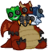

[Back to Main](index.md)

    
        
            
        
        
        Portrait
        
    
    
        
            
        
        
        Model
        
    

# Windfall

As a dedicated champion of Tiamat, Windfall has been granted phenomenal power by her master. Her skin glitters with patches of multicolored scales, and in combat, her blade sings with all five of the chromatic dragons' elements. Windfall's enchanted tailcoat shimmers with the colors of the Dragon Queen, and she uses this coat to dazzle patrons and enemies alike.  
A performer at heart, Windfall is ostentatious and charismatic, making small talk with regular patrons and jovially welcoming new faces to the casino.

[5e Tools Bestiary](https://5e.tools/bestiary/windfall-veor.html)

# Basic Information

Windfall will be an upcoming Evergreen champion guesstimated to release on 28 May 2025 with the [Vecna 8 content drop](contentdrops.md#vecna-8---28-may-2025).

    
        
            **Seat**:
        
        
            Unknown
        
    
    
        
            **Species**:
        
        
            Tiefling (Guess)
        
    
    
        
            **Class**:
        
        
            Bard (Guess)
        
    
    
        
            **Roles**:
        
        
            Unknown
        
    
    
        
            **Age**:
        
        
            Unknown
        
    
    
        
            **Gender**:
        
        
            Female (Guess)
        
    
    
        
            **Alignment**:
        
        
            Chaotic Evil (Guess)
        
    
    
        
            **Affiliation**:
        
        
            Unknown
        
    

# Attacks

Unknown.

# Abilities

Unknown.

# Specialisations

Unknown.

# Items

    
        
            **Icons**
        
        
            **Name**
        
    
    
        
            
        
        
            Casino I Drink
        
    
    
        
            
        
        
            Casino Item
        
    
    
        
            
        
        
            Cloak
        
    
    
        
            
        
        
            Instrument
        
    
    
        
            
        
        
            Tiamat Item
        
    
    
        
            
        
        
            Weapons
        
    

# Feats

Unknown.

# Legendaries

Unknown.

# Adventures and Variants

Unknown.

# Other Champion Images

    
        
            Console Portrait
        
    

[Back to Top](#top)

*Last Modified: {{ site.time }}*