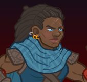
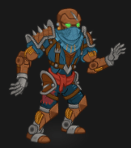

[Back to Main](index.md)

    
        Base Portrait
    
    
        Tabaxi Portrait
    
    
        Warforged Portrait
    
    
        Base Model
    
    
        Dwarf Astral Arms Model
    
    
        Tabaxi Model
    
    
        Warforged Model
    

# Wren

Wren looks to be a CNE original Evergreen from the Fortune's Wheel campaign story.

# Basic Information

Wren will be an upcoming Evergreen champion guesstimated to release on 24 July 2024 with the [Fortune's Wheel 6 content drop](contentdrops.md#fortune's-wheel-6---24-july-2024).

    
        
            **Seat**:
        
        
            Unknown
        
    
    
        
            **Race**:
        
        
            Dwarf / Tabaxi / Warforged (Guess)
        
    
    
        
            **Class**:
        
        
            Monk / Barbarian / Sorcerer (Guess)
        
    
    
        
            **Roles**:
        
        
            Tanking / DPS / Support / Debuff (Guess)
        
    
    
        
            **Age**:
        
        
            Unknown
        
    
    
        
            **Gender**:
        
        
            Female (Guess)
        
    
    
        
            **Alignment**:
        
        
            Unknown
        
    
    
        
            **Affiliation**:
        
        
            Unknown
        
    

# Abilities

**Base Attack: Unarmed Strike** (Melee)
> Wren strikes the most damaged enemy for one hit.  
> Cooldown: 5s (Cap 1.25s)

<em>Raw Data</em>

<pre>
{
    "id": 772,
    "name": "Unarmed Strike",
    "description": "Wren strikes the most damaged enemy for one hit.",
    "long_description": "",
    "graphic_id": 0,
    "target": "least_health",
    "num_targets": 1,
    "aoe_radius": 0,
    "damage_modifier": 1,
    "cooldown": 5,
    "animations": [
        {
            "type": "melee_attack",
            "target_offset_x": -34,
            "damage_frame": 12,
            "jump_sound": 30,
            "sound_frames": {
                "2": 154
            }
        }
    ],
    "tags": [
        "melee"
    ],
    "damage_types": [
        "melee"
    ]
}
</pre>

**Base Attack: Unarmed Strike - Astral Self Form** (Melee)
> Wren strikes the most damaged enemy for one hit of ultimate damage.  
> Cooldown: 5s (Cap 1.25s)

<em>Raw Data</em>

<pre>
{
    "id": 780,
    "name": "Unarmed Strike - Astral Self Form",
    "description": "Wren strikes the most damaged enemy for one hit of ultimate damage.",
    "long_description": "",
    "graphic_id": 0,
    "target": "least_health",
    "num_targets": 1,
    "aoe_radius": 100,
    "damage_modifier": 1,
    "cooldown": 5,
    "animations": [
        {
            "type": "melee_attack",
            "target_offset_x": -34,
            "damage_frame": 12,
            "jump_sound": 30,
            "sound_frames": {
                "2": 154
            },
            "force_count_for_bud": false,
            "is_bud_damage": true
        }
    ],
    "tags": [
        "melee",
        "aoe"
    ],
    "damage_types": [
        "melee"
    ]
}
</pre>

**Base Attack: Greataxe** (Melee)
> Wren attacks the closest enemy for one hit.  
> Cooldown: 5s (Cap 1.25s)

<em>Raw Data</em>

<pre>
{
    "id": 773,
    "name": "Greataxe",
    "description": "Wren attacks the closest enemy for one hit.",
    "long_description": "",
    "graphic_id": 0,
    "target": "front",
    "num_targets": 1,
    "aoe_radius": 0,
    "damage_modifier": 1,
    "cooldown": 5,
    "animations": [
        {
            "type": "melee_attack",
            "target_offset_x": -34,
            "damage_frame": 4,
            "jump_sound": 30,
            "sound_frames": {
                "2": 154
            }
        }
    ],
    "tags": [
        "melee"
    ],
    "damage_types": [
        "melee"
    ]
}
</pre>

**Base Attack: Greataxe - Colossal Rage** (Melee)
> Wren attacks the closest enemy for one hit of ultimate damage.  
> Cooldown: 5s (Cap 1.25s)

<em>Raw Data</em>

<pre>
{
    "id": 781,
    "name": "Greataxe - Colossal Rage",
    "description": "Wren attacks the closest enemy for one hit of ultimate damage.",
    "long_description": "",
    "graphic_id": 0,
    "target": "front",
    "num_targets": 1,
    "aoe_radius": 0,
    "damage_modifier": 1,
    "cooldown": 5,
    "animations": [
        {
            "type": "melee_attack",
            "target_offset_x": -34,
            "damage_frame": 4,
            "jump_sound": 30,
            "sound_frames": {
                "2": 154
            },
            "force_count_for_bud": false,
            "is_bud_damage": true
        }
    ],
    "tags": [
        "melee"
    ],
    "damage_types": [
        "melee"
    ]
}
</pre>

**Base Attack: Firebolt** (Magic)
> Wren blasts the enemy with the most remaining health for one hit.  
> Cooldown: 5s (Cap 1.25s)

<em>Raw Data</em>

<pre>
{
    "id": 774,
    "name": "Fire Bolt",
    "description": "Wren blasts the enemy with the most remaining health for one hit.",
    "long_description": "",
    "graphic_id": 0,
    "target": "highest_health",
    "num_targets": 1,
    "aoe_radius": 0,
    "damage_modifier": 1,
    "cooldown": 5,
    "animations": [
        {
            "type": "ranged_attack",
            "projectile": "pd_generic_projectile",
            "shoot_offset_y": -45,
            "shoot_offset_x": 35,
            "shoot_frame": 10,
            "shoot_sound": 149,
            "hit_sound": 133,
            "projectile_details": {
                "hash": "0c98a3a8d199a16617e0b0256eeefde5",
                "use_auto_rotation": true,
                "projectile_speed": 2000,
                "projectile_graphic_id": 24057,
                "trail": {
                    "particle_graphic_ids": [
                        "24057"
                    ],
                    "lifespan": 0.15,
                    "spawn_rate": 200,
                    "spawn_shape_scale": {
                        "x": 5,
                        "y": 5
                    },
                    "initial_velocity": {
                        "x": 0,
                        "y": 0
                    },
                    "velocity_jitter": {
                        "x": 30,
                        "y": 30
                    },
                    "rotation_jitter": 10,
                    "alpha_lerp": {
                        "0": 0,
                        "0.1": 0.75,
                        "0.5": 0.3,
                        "1": 0
                    },
                    "scale_lerp": [
                        {
                            "x": 0.65,
                            "y": 0.65
                        },
                        {
                            "x": 1.5,
                            "y": 1.5
                        }
                    ],
                    "tint_lerp": {
                        "0": "#FFFFFF",
                        "0.6": "#7777FF",
                        "0.9": "#000000"
                    }
                },
                "projectile_hit_graphic_id": 1318
            }
        }
    ],
    "tags": [
        "ranged"
    ],
    "damage_types": [
        "magic"
    ]
}
</pre>

**Ultimate Attack: Astral Self Form**
> Wren manifests her Astral Self form for 15 seconds. For the duration, when she attacks, she hits her target and all nearby enemies for ultimate damage.  
> Cooldown: 230s (Cap 57.5s)

<em>Raw Data</em>

<pre>
{
    "id": 775,
    "name": "Astral Self Form",
    "description": "For 15 seconds, Wren deals ultimate damage in a small radius when she attacks.",
    "long_description": "Wren manifests her Astral Self form for 15 seconds. For the duration, when she attacks, she hits her target and all nearby enemies for ultimate damage.",
    "graphic_id": 24083,
    "target": "front",
    "num_targets": 1,
    "aoe_radius": 0,
    "damage_modifier": 1,
    "cooldown": 230,
    "animations": [
        {
            "type": "ultimate_attack",
            "ultimate": "wren",
            "no_damage_display": true,
            "animation_sequence_name": "ultimate"
        }
    ],
    "tags": [
        "melee",
        "ultimate"
    ],
    "damage_types": [
        "melee"
    ]
}
</pre>

**Ultimate Attack: Colossal Rage**
> Wren grows in size for 15 seconds. For the duration, enemies prefer attacking her, she takes 50% less damage, and her attacks deal ultimate damage.  
> Cooldown: 230s (Cap 57.5s)

<em>Raw Data</em>

<pre>
{
    "id": 776,
    "name": "Colossal Rage",
    "description": "For 15 seconds, Wren taunts enemies and deals ultimate damage with her attacks.",
    "long_description": "Wren grows in size for 15 seconds. For the duration, enemies prefer attacking her, she takes 50% less damage, and her attacks deal ultimate damage.",
    "graphic_id": 24084,
    "target": "front",
    "num_targets": 1,
    "aoe_radius": 0,
    "damage_modifier": 1,
    "cooldown": 230,
    "animations": [
        {
            "type": "ultimate_attack",
            "ultimate": "wren",
            "no_damage_display": true,
            "animation_sequence_name": "ultimate"
        }
    ],
    "tags": [
        "melee",
        "ultimate"
    ],
    "damage_types": [
        "melee"
    ]
}
</pre>

**Ultimate Attack: Time Stop**
> Wren freezes enemies in time for 15 seconds. For the duration, enemies do nothing and heroes deal +400% damage to them.  
> Cooldown: 230s (Cap 57.5s)

<em>Raw Data</em>

<pre>
{
    "id": 777,
    "name": "Time Stop",
    "description": "For 15 seconds, monsters are frozen in time and take +400% damage.",
    "long_description": "Wren freezes enemies in time for 15 seconds. For the duration, enemies do nothing and heroes deal +400% damage to them.",
    "graphic_id": 24085,
    "target": "all",
    "num_targets": 1,
    "aoe_radius": 0,
    "damage_modifier": 1,
    "cooldown": 230,
    "animations": [
        {
            "type": "ultimate_attack",
            "ultimate": "wren_timestop",
            "no_damage_display": false,
            "animation_sequence_name": "ultimate",
            "projectile_details": {
                "hash": "wren_time_stop",
                "target_offset_y": 10,
                "face_target": false,
                "projectile_speed": 300,
                "time_to_target": 1,
                "trail": {
                    "particle_graphic_ids": [
                        "9823"
                    ],
                    "lifespan": 0.5,
                    "spawn_rate": 1000,
                    "spawn_shape_scale": {
                        "x": 100,
                        "y": 30
                    },
                    "initial_velocity": {
                        "x": 0,
                        "y": -500
                    },
                    "velocity_jitter": {
                        "x": 0,
                        "y": 100
                    },
                    "rotation_jitter": 0,
                    "alpha_lerp": {
                        "0": 0,
                        "0.1": 0.5,
                        "1": 0
                    },
                    "scale_lerp": [
                        {
                            "x": 1,
                            "y": 1
                        },
                        {
                            "x": 0,
                            "y": 0
                        }
                    ],
                    "tint_lerp": {
                        "0": "#00FFFF",
                        "0.3": "#00CCFF",
                        "0.7": "#0066AA",
                        "0.9": "#001177"
                    }
                }
            }
        }
    ],
    "tags": [
        "magic",
        "ultimate"
    ],
    "damage_types": [
        "magic"
    ]
}
</pre>

**Unknown** (Guess)
> Wren always counts as all her Glitch forms, regardless of the form she has chosen for the current adventure. She can also be used in any Turn of Fortune's Wheel adventure or variant, regardless of any restrictions.

<em>Raw Data</em>

<pre>
{
    "id": 2012,
    "flavour_text": "",
    "description": {
        "desc": "Wren always counts as all her Glitch forms, regardless of the form she has chosen for the current adventure. She can also be used in any Turn of Fortune's Wheel adventure or variant, regardless of any restrictions."
    },
    "effect_keys": [
        {
            "effect_string": "do_nothing"
        }
    ],
    "requirements": "",
    "graphic_id": 0,
    "large_graphic_id": 0,
    "properties": {
        "is_formation_ability": true,
        "owner_use_outgoing_description": true,
        "formation_circle_icon": false
    }
}
</pre>

**Hero's Call** (Guess)
> Wren increases the damage of all Champions in her column (including herself) and the column behind her by 100%.

<em>Raw Data</em>

<pre>
{
    "id": 2013,
    "flavour_text": "",
    "description": {
        "desc": "Wren increases the damage of all Champions in her column (including herself) and the column behind her by $(amount)%."
    },
    "effect_keys": [
        {
            "effect_string": "hero_dps_multiplier_mult,100",
            "targets": [
                "col_and_prev_col"
            ],
            "off_when_benched": true
        }
    ],
    "requirements": "",
    "graphic_id": 24095,
    "large_graphic_id": 24088,
    "properties": {
        "is_formation_ability": true
    }
}
</pre>

**Instability** (Guess)
> All three of Wren's glitch forms yearn to be utilized. For each area completed, all three forms gain a yearning stack, which generally persists between adventures. Wren's chosen form buffs her Hero's Call by 100% for each yearning stack for her chosen form, stacking additively. Yearning stacks for any glitch form she has specialized in during your current adventure are set to zero at the end of the adventure.

<em>Raw Data</em>

<pre>
{
    "id": 2014,
    "flavour_text": "",
    "description": {
        "desc": "All three of Wren's glitch forms yearn to be utilized. For each area completed, all three forms gain a yearning stack, which generally persists between adventures. Wren's chosen form buffs her Hero's Call by $(amount___6)% for each yearning stack for her chosen form, stacking additively. Yearning stacks for any glitch form she has specialized in during your current adventure are set to zero at the end of the adventure."
    },
    "effect_keys": [
        {
            "effect_string": "expression_on_trigger,area_complete",
            "per_trigger_expr": "{ AppendToSaveStat(`wren_monk_yearn_stacks`, false, trigger_count) AppendToSaveStat(`wren_barbarian_yearn_stacks`, false, trigger_count) AppendToSaveStat(`wren_sorcerer_yearn_stacks`, false, trigger_count) }"
        },
        {
            "effect_string": "expression_on_trigger,adventure_reset",
            "per_trigger_expr": "{ if (StatIsBitFlagSet(`wren_spec_bits`, false, 0)) { SetSaveStat(`wren_monk_yearn_stacks`, false, 0) } if (StatIsBitFlagSet(`wren_spec_bits`, false, 1)) { SetSaveStat(`wren_barbarian_yearn_stacks`, false, 0) } if (StatIsBitFlagSet(`wren_spec_bits`, false, 2)) { SetSaveStat(`wren_sorcerer_yearn_stacks`, false, 0) } SetSaveStat(`wren_spec_bits`, false, 0) }"
        },
        {
            "effect_string": "do_nothing",
            "amount_func": "add",
            "stacks_multiply": false,
            "stack_func": "per_other_stack_count",
            "other_stack_count_expr": "GetSaveStat(`wren_monk_yearn_stacks`, false)",
            "amount_updated_listeners": [
                "area_changed"
            ],
            "desc_forced_order": 0,
            "stack_title": "Monk Stacks",
            "show_stacks": true,
            "stack_string_newline": true
        },
        {
            "effect_string": "do_nothing",
            "amount_func": "add",
            "stacks_multiply": false,
            "stack_func": "per_other_stack_count",
            "other_stack_count_expr": "GetSaveStat(`wren_barbarian_yearn_stacks`, false)",
            "amount_updated_listeners": [
                "area_changed"
            ],
            "desc_forced_order": 1,
            "stack_title": "Barbarian Stacks",
            "show_stacks": true,
            "stack_string_newline": true
        },
        {
            "effect_string": "do_nothing",
            "amount_func": "add",
            "stacks_multiply": false,
            "stack_func": "per_other_stack_count",
            "other_stack_count_expr": "GetSaveStat(`wren_sorcerer_yearn_stacks`, false)",
            "amount_updated_listeners": [
                "area_changed"
            ],
            "desc_forced_order": 2,
            "stack_title": "Sorcerer Stacks",
            "show_stacks": true
        },
        {
            "effect_string": "buff_upgrade,100,15208",
            "amount_func": "add",
            "stacks_multiply": false,
            "stack_func": "per_other_stack_count",
            "other_stack_count_expr": "((as_int(GetUpgradeUnlocked(15217)) * GetSaveStat(`wren_monk_yearn_stacks`, false)) + (as_int(GetUpgradeUnlocked(15218)) * GetSaveStat(`wren_barbarian_yearn_stacks`, false)) + (as_int(GetUpgradeUnlocked(15219)) * GetSaveStat(`wren_sorcerer_yearn_stacks`, false)))",
            "amount_updated_listeners": [
                "area_changed",
                "stat_changed,wren_monk_yearn_stacks"
            ],
            "desc_forced_order": 3,
            "show_bonus": true
        },
        {
            "effect_string": "expr_action",
            "expr": "{ if (GetUpgradeUnlocked(15217)) { StatSetBitFlag(`wren_spec_bits`, false, 0) } if (GetUpgradeUnlocked(15218)) { StatSetBitFlag(`wren_spec_bits`, false, 1) } if (GetUpgradeUnlocked(15219)) { StatSetBitFlag(`wren_spec_bits`, false, 2) } }"
        }
    ],
    "requirements": "",
    "graphic_id": 24099,
    "large_graphic_id": 24092,
    "properties": {
        "is_formation_ability": true,
        "owner_use_outgoing_description": true,
        "indexed_effect_properties": true,
        "per_effect_index_bonuses": true,
        "default_bonus_index": 5
    }
}
</pre>

**Incarnations (Monk)** (Guess)
> Wren increases her damage by 1000%.

<em>Raw Data</em>

<pre>
{
    "id": 2015,
    "flavour_text": "",
    "description": {
        "desc": "Wren increases her damage by $(amount)%."
    },
    "effect_keys": [
        {
            "effect_string": "hero_dps_multiplier_mult,1000"
        }
    ],
    "requirements": "",
    "graphic_id": 24097,
    "large_graphic_id": 24090,
    "properties": {
        "is_formation_ability": true
    }
}
</pre>

**Incarnations (Barbarian)** (Guess)
> Wren increases her health by 200% and then further increases her health by 75% (multiplicatively) for every 50 areas completed in the current adventure, up to area 600.

<em>Raw Data</em>

<pre>
{
    "id": 2016,
    "flavour_text": "",
    "description": {
        "desc": "Wren increases her health by $(amount)% and then further increases her health by $(amount___2)% (multiplicatively) for every $(areas_per_stack___2) areas completed in the current adventure, up to area $(max_stacking_area___2)."
    },
    "effect_keys": [
        {
            "effect_string": "health_mult,200"
        },
        {
            "effect_string": "health_mult,75",
            "amount_func": "mult",
            "stacks_multiply": true,
            "stack_func": "per_other_stack_count",
            "other_stack_count_expr": "floor(min(highest_available_area,max_stacking_area)/areas_per_stack)",
            "areas_per_stack": 50,
            "max_stacking_area": 600,
            "amount_updated_listeners": [
                "area_changed"
            ],
            "show_bonus": true
        }
    ],
    "requirements": "",
    "graphic_id": 24096,
    "large_graphic_id": 24089,
    "properties": {
        "is_formation_ability": true,
        "owner_use_outgoing_description": true,
        "indexed_effect_properties": true,
        "per_effect_index_bonuses": true,
        "default_bonus_index": 0
    }
}
</pre>

**Incarnations (Sorcerer)** (Guess)
> Enemies damaged by Wren catch fire and take 100% more damage from subsequent Champion attacks.

<em>Raw Data</em>

<pre>
{
    "id": 2017,
    "flavour_text": "",
    "description": {
        "desc": "Enemies damaged by Wren catch fire and take $(amount)% more damage from subsequent Champion attacks."
    },
    "effect_keys": [
        {
            "off_when_benched": true,
            "effect_string": "wren_incarnations_class_sorcerer,100",
            "debuff_before_damage": true,
            "debuffing_attack_ids": [
                774
            ],
            "debuff_effects": [
                {
                    "effect_string": "increase_monster_damage,100",
                    "active_graphic_id": 2921,
                    "stacks_on_reapply": true,
                    "manual_stacking": true,
                    "default_stacks": 1,
                    "max_stacks": 1,
                    "stacks_multiply": true,
                    "use_collection_source": true
                },
                {
                    "effect_string": "expr_action",
                    "expr": "{AppendToSaveStat(`wren_ignite_enemies`, false, 1) NotifyStatChanged(`WrenBirdPlane`, false)}"
                }
            ]
        },
        {
            "effect_string": "expression_on_trigger,offline_monsters_killed_by_owner",
            "per_trigger_expr": "{AppendToSaveStat(`wren_ignite_enemies`, false, trigger_count) NotifyStatChanged(`WrenBirdPlane`, false)}"
        }
    ],
    "requirements": "",
    "graphic_id": 24098,
    "large_graphic_id": 24091,
    "properties": {
        "is_formation_ability": true,
        "owner_use_outgoing_description": true,
        "retain_on_slot_changed": true
    }
}
</pre>

**Glitch Trick** (Guess)
> When Wren defeats an enemy, her base attack cooldown immediately recharges.

<em>Raw Data</em>

<pre>
{
    "id": 2018,
    "flavour_text": "",
    "description": {
        "desc": "When Wren defeats an enemy, her base attack cooldown immediately recharges."
    },
    "effect_keys": [
        {
            "effect_string": "expression_on_trigger,owner_kill",
            "triggers": [
                {
                    "name": "offline_monsters_killed_by_owner"
                }
            ],
            "per_trigger_expr": "{ResetAttackCooldown(owner_hero_id,`base`) AppendToSaveStat(`wren_flurry_of_blows`, false, trigger_count)  NotifyStatChanged(`WrenBirdPlane`, false)}"
        }
    ],
    "requirements": "",
    "graphic_id": 24094,
    "large_graphic_id": 24087,
    "properties": {
        "is_formation_ability": true,
        "owner_use_outgoing_description": true
    }
}
</pre>

**Glitch Trick** (Guess)
> Wren increases the health of all other Champions by 25% of her max health, and healing effects on all Champions is increased by 25%.

<em>Raw Data</em>

<pre>
{
    "id": 2019,
    "flavour_text": "",
    "description": {
        "desc": "Wren increases the health of all other Champions by $(amount)% of her max health, and healing effects on all Champions is increased by $(amount___2)%."
    },
    "effect_keys": [
        {
            "off_when_benched": true,
            "effect_string": "increase_health_by_source_percent,25",
            "targets": [
                "other"
            ]
        },
        {
            "off_when_benched": true,
            "effect_string": "healing_add_mult,25",
            "targets": [
                "all"
            ]
        }
    ],
    "requirements": "",
    "graphic_id": 24094,
    "large_graphic_id": 24087,
    "properties": {
        "is_formation_ability": true,
        "owner_use_outgoing_description": true,
        "indexed_effect_properties": true,
        "per_effect_index_bonuses": true,
        "default_bonus_index": 0
    }
}
</pre>

**Glitch Trick** (Guess)
> Wren's base attack Stuns enemies for 5 seconds.

<em>Raw Data</em>

<pre>
{
    "id": 2020,
    "flavour_text": "",
    "description": {
        "desc": "Wren's base attack Stuns enemies for $(duration) seconds."
    },
    "effect_keys": [
        {
            "effect_string": "add_attack_stun,100,5,1509,774"
        }
    ],
    "requirements": "",
    "graphic_id": 24094,
    "large_graphic_id": 24087,
    "properties": {
        "is_formation_ability": true,
        "owner_use_outgoing_description": true
    }
}
</pre>

**Experienced Incarnation** (Guess)
> Wren increases the effect of Hero's Call by 25% for each Turn of Fortune's Wheel adventure, variant, or patron variant completed, stacking multiplicatively.

<em>Raw Data</em>

<pre>
{
    "id": 2021,
    "flavour_text": "",
    "description": {
        "desc": "Wren increases the effect of Hero's Call by $(not_buffed amount)% for each Turn of Fortune's Wheel adventure, variant, or patron variant completed, stacking multiplicatively."
    },
    "effect_keys": [
        {
            "effect_string": "buff_upgrade,25,15208",
            "amount_func": "mult",
            "stacks_multiply": true,
            "stack_func": "per_other_stack_count",
            "other_stack_count_expr": "GetSaveStat(`completed_adventures_variants_and_patron_variants_c29`,false)",
            "stack_title": "Adventures Completed",
            "show_bonus": true
        }
    ],
    "requirements": "",
    "graphic_id": 24093,
    "large_graphic_id": 24086,
    "properties": {
        "is_formation_ability": true
    }
}
</pre>

# Specialisations

**Dwarf Monk** (Guess)
> Wren remains in her dwarf monk form, unlocks the Astral Self Form ultimate, and focuses on her DPS role. She also gains +4 DEX and +4 WIS.

<em>Raw Data</em>

<pre>
{
    "id": 2022,
    "flavour_text": "",
    "description": {
        "desc": "Wren remains in her dwarf monk form, unlocks the Astral Self Form ultimate, and focuses on her DPS role. She also gains +$(amount) DEX and +$(amount___2) WIS."
    },
    "effect_keys": [
        {
            "effect_string": "increase_ability_score_not_always_on,dex,4"
        },
        {
            "effect_string": "increase_ability_score_not_always_on,wis,4"
        },
        {
            "effect_string": "wren_astral_self_form",
            "buff_indicies": [
                6,
                7
            ],
            "change_crusader_world_graphic_id": 24042,
            "change_crusader_portrait_graphic_id": 24053,
            "override_name": "monk"
        },
        {
            "effect_string": "change_base_attack,772"
        },
        {
            "effect_string": "set_ultimate_attack,775"
        },
        {
            "effect_string": "fire_things_transformed,1"
        },
        {
            "apply_manually": true,
            "effect_string": "change_base_attack,780"
        },
        {
            "apply_manually": true,
            "effect_string": "fire_things_transformed,1"
        }
    ],
    "requirements": "",
    "graphic_id": 0,
    "large_graphic_id": 0,
    "properties": {
        "is_formation_ability": true,
        "owner_use_outgoing_description": true,
        "type": "upgrade",
        "formation_circle_icon": false,
        "indexed_effect_properties": true,
        "per_effect_index_bonuses": true,
        "default_bonus_index": 0
    }
}
</pre>

**Tabaxi Barbarian** (Guess)
> Wren takes on the form of a Tabaxi Barbarian. She unlocks the Colossal Rage ultimate, the Battleaxe base attack, gains 20 overwhelm, and focuses on her Tanking role. She also gains +4 STR and +4 CON.

<em>Raw Data</em>

<pre>
{
    "id": 2023,
    "flavour_text": "",
    "description": {
        "desc": "Wren takes on the form of a Tabaxi Barbarian. She unlocks the Colossal Rage ultimate, the Battleaxe base attack, gains 20 overwhelm, and focuses on her Tanking role. She also gains +$(amount) STR and +$(amount___2) CON."
    },
    "effect_keys": [
        {
            "effect_string": "increase_ability_score_not_always_on,str,4"
        },
        {
            "effect_string": "increase_ability_score_not_always_on,con,4"
        },
        {
            "effect_string": "wren_colossal_rage",
            "buff_indicies": [
                7,
                8,
                9,
                10,
                11
            ],
            "change_crusader_world_graphic_id": 24045,
            "change_crusader_portrait_graphic_id": 24054,
            "override_name": "barbarian"
        },
        {
            "effect_string": "change_base_attack,773"
        },
        {
            "effect_string": "overwhelm_start_increase,20"
        },
        {
            "effect_string": "set_ultimate_attack,776"
        },
        {
            "effect_string": "fire_things_transformed,1"
        },
        {
            "apply_manually": true,
            "effect_string": "change_base_attack,781"
        },
        {
            "apply_manually": true,
            "effect_string": "increase_hero_scale,25"
        },
        {
            "apply_manually": true,
            "effect_string": "damage_reduction,50"
        },
        {
            "apply_manually": true,
            "effect_string": "fire_things_transformed,1"
        },
        {
            "apply_manually": true,
            "effect_string": "expr_action",
            "expr": "{AppendToSaveStat(`wren_grow_size`, false, 1) NotifyStatChanged(`WrenBirdPlane`, false)}"
        }
    ],
    "requirements": "",
    "graphic_id": 0,
    "large_graphic_id": 0,
    "properties": {
        "is_formation_ability": true,
        "owner_use_outgoing_description": true,
        "type": "upgrade",
        "formation_circle_icon": false,
        "indexed_effect_properties": true,
        "per_effect_index_bonuses": true,
        "default_bonus_index": 0
    }
}
</pre>

**Warforged Sorcerer** (Guess)
> Wren takes on the form of a Warforged Sorcerer. She unlocks the Time Stop ultimate, the Fire Bolt base attack, and focuses on her Debuff role. She also gains +4 INT and +4 CHA.

<em>Raw Data</em>

<pre>
{
    "id": 2024,
    "flavour_text": "",
    "description": {
        "desc": "Wren takes on the form of a Warforged Sorcerer. She unlocks the Time Stop ultimate, the Fire Bolt base attack, and focuses on her Debuff role. She also gains +$(amount) INT and +$(amount___2) CHA."
    },
    "effect_keys": [
        {
            "effect_string": "increase_ability_score_not_always_on,int,4"
        },
        {
            "effect_string": "increase_ability_score_not_always_on,cha,4"
        },
        {
            "effect_string": "wren_time_stop",
            "buff_indicies": [],
            "change_crusader_world_graphic_id": 24044,
            "change_crusader_portrait_graphic_id": 24055,
            "override_name": "sorcerer",
            "debuff_effects": [
                {
                    "effect_string": "time_stop"
                },
                {
                    "effect_string": "increase_monster_damage,400",
                    "active_graphic_y": -45,
                    "active_graphic_id": 24056
                }
            ]
        },
        {
            "effect_string": "change_base_attack,774"
        },
        {
            "effect_string": "set_ultimate_attack,777"
        },
        {
            "effect_string": "fire_things_transformed,1"
        }
    ],
    "requirements": "",
    "graphic_id": 0,
    "large_graphic_id": 0,
    "properties": {
        "is_formation_ability": true,
        "owner_use_outgoing_description": true,
        "type": "upgrade",
        "formation_circle_icon": false,
        "indexed_effect_properties": true,
        "per_effect_index_bonuses": true,
        "default_bonus_index": 0
    }
}
</pre>

# Items

    
        
            **Icons**
        
        
            **Name**
        
    
    
        
            
        
        
            Dwarf Keepsakes
        
    
    
        
            
        
        
            Dwarf Magic Items
        
    
    
        
            
        
        
            Tabaxi Keepsakes
        
    
    
        
            
        
        
            Tabaxi Magic Items
        
    
    
        
            
        
        
            Warforged Keepsakes
        
    
    
        
            
        
        
            Warforged Magic Items
        
    

# Feats

Unknown.

# Legendaries

Unknown.

# Adventures and Variants

Unknown.

# Other Champion Images

    
        
            Console Portrait
        
    
    
        
            Tabaxi Console Portrait
        
    
    
        
            Warforged Console Portrait
        
    
    
        
            Gold Chest Icon
        
    

[Back to Top](#top)

*Last Modified: {{ site.time }}*