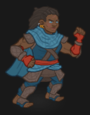
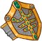

[Back to Main](index.md)

    
        Base Portait
    
    
        Tabaxi Portait
    
    
        Warforged Portait
    
    
        Base Model
    
    
        Dwarf Astral Arms Model
    
    
        Tabaxi Model
    
    
        Warforged Model
    

# Wren

Wren looks to be a CNE original Evergreen from the Fortune's Wheel campaign story.

# Basic Information

Wren will be an upcoming Evergreen champion guesstimated to release on 24 July 2024 with the [Fortune's Wheel 6 content drop](contentdrops.md#fortune's-wheel-6---24-july-2024).

    
        
            **Seat**:
        
        
            Unknown
        
    
    
        
            **Race**:
        
        
            Dwarf / Tabaxi / Warforged (Guess)
        
    
    
        
            **Class**:
        
        
            Monk / Barbarian / Sorcerer (Guess)
        
    
    
        
            **Roles**:
        
        
            Unknown
        
    
    
        
            **Age**:
        
        
            Unknown
        
    
    
        
            **Gender**:
        
        
            Female (Guess)
        
    
    
        
            **Alignment**:
        
        
            Unknown
        
    
    
        
            **Affiliation**:
        
        
            Unknown
        
    

# Abilities

**Base Attack: Unknown**
> Unknown effect.

<em>Raw Data</em>

<pre>
</pre>

**Ultimate Attack: Unknown**
> Unknown effect.

<em>Raw Data</em>

<pre>
</pre>

**Experienced Incarnation** (Guess)
> Unknown effect.

<em>Raw Data</em>

<pre>
{
    "id": 24093,
    "graphic": "Icons/Champions/Wren/Icon_Wren_Formation_ExperiencedIncarnation",
    "v": 2,
    "fs": 0,
    "p": 0,
    "type": 1,
    "export_params": {
        "uses": [
            "icon"
        ]
    }
}
</pre>

**Glitch Trick** (Guess)
> Unknown effect.

<em>Raw Data</em>

<pre>
{
    "id": 24094,
    "graphic": "Icons/Champions/Wren/Icon_Wren_Formation_GlitchTrick",
    "v": 2,
    "fs": 0,
    "p": 0,
    "type": 1,
    "export_params": {
        "uses": [
            "icon"
        ]
    }
}
</pre>

**Hero's Call** (Guess)
> Unknown effect.

<em>Raw Data</em>

<pre>
{
    "id": 24095,
    "graphic": "Icons/Champions/Wren/Icon_Wren_Formation_HerosCall",
    "v": 2,
    "fs": 0,
    "p": 0,
    "type": 1,
    "export_params": {
        "uses": [
            "icon"
        ]
    }
}
</pre>

**Incarnations (Barbarian)** (Guess)
> Unknown effect.

<em>Raw Data</em>

<pre>
{
    "id": 24096,
    "graphic": "Icons/Champions/Wren/Icon_Wren_Formation_IncarnationsClassBarb",
    "v": 2,
    "fs": 0,
    "p": 0,
    "type": 1,
    "export_params": {
        "uses": [
            "icon"
        ]
    }
}
</pre>

**Incarnations (Monk)** (Guess)
> Unknown effect.

<em>Raw Data</em>

<pre>
{
    "id": 24097,
    "graphic": "Icons/Champions/Wren/Icon_Wren_Formation_IncarnationsClassMonk",
    "v": 2,
    "fs": 0,
    "p": 0,
    "type": 1,
    "export_params": {
        "uses": [
            "icon"
        ]
    }
}
</pre>

**Incarnations (Sorcerer)** (Guess)
> Unknown effect.

<em>Raw Data</em>

<pre>
{
    "id": 24098,
    "graphic": "Icons/Champions/Wren/Icon_Wren_Formation_IncarnationsClassSorcerer",
    "v": 2,
    "fs": 0,
    "p": 0,
    "type": 1,
    "export_params": {
        "uses": [
            "icon"
        ]
    }
}
</pre>

**Instability** (Guess)
> Unknown effect.

<em>Raw Data</em>

<pre>
{
    "id": 24099,
    "graphic": "Icons/Champions/Wren/Icon_Wren_Formation_Instability",
    "v": 2,
    "fs": 0,
    "p": 0,
    "type": 1,
    "export_params": {
        "uses": [
            "icon"
        ]
    }
}
</pre>

# Specialisations

**Dwarf Monk** (Guess)
> Unknown effect.

<em>Raw Data</em>

<pre>
{
    "id": 24080,
    "graphic": "Icons/Champions/Wren/Icon_Specialization_WrenDwarfMonk",
    "v": 2,
    "fs": 0,
    "p": 0,
    "type": 1,
    "export_params": {
        "uses": [
            "icon"
        ]
    }
}
</pre>

**Tabaxi Barbarian** (Guess)
> Unknown effect.

<em>Raw Data</em>

<pre>
{
    "id": 24081,
    "graphic": "Icons/Champions/Wren/Icon_Specialization_WrenTabaxiBarb",
    "v": 2,
    "fs": 0,
    "p": 0,
    "type": 1,
    "export_params": {
        "uses": [
            "icon"
        ]
    }
}
</pre>

**Warforged Sorcerer** (Guess)
> Unknown effect.

<em>Raw Data</em>

<pre>
{
    "id": 24082,
    "graphic": "Icons/Champions/Wren/Icon_Specialization_WrenWarforgedSorcerer",
    "v": 2,
    "fs": 0,
    "p": 0,
    "type": 1,
    "export_params": {
        "uses": [
            "icon"
        ]
    }
}
</pre>

# Items

    
        
            **Icons**
        
        
            **Name**
        
    
    
        
            
        
        
            Dwarf Keepsakes
        
    
    
        
            
        
        
            Dwarf Magic Items
        
    
    
        
            
        
        
            Tabaxi Keepsakes
        
    
    
        
            
        
        
            Tabaxi Magic Items
        
    
    
        
            
        
        
            Warforged Keepsakes
        
    
    
        
            
        
        
            Warforged Magic Items
        
    

# Feats

Unknown.

# Legendaries

Unknown.

# Adventures and Variants

Unknown.

# Other Champion Images

    
        
            Console Portait
        
    
    
        
            Tabaxi Console Portait
        
    
    
        
            Warforged Console Portait
        
    

[Back to Top](#top)

*Last Modified: {{ site.time }}*