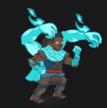
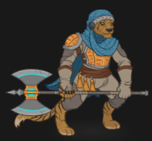
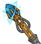
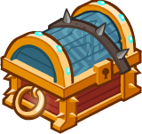

[Back to Main](index.md)

    
        Base Portrait
    
    
        Tabaxi Portrait
    
    
        Warforged Portrait
    
    
        Base Model
    
    
        Dwarf Astral Arms Model
    
    
        Tabaxi Model
    
    
        Tabaxi Rage Model
    
    
        Warforged Model
    

# Wren

Wren woke up in the Mortuary with the Champions and, like them, had no memory of who she was. The talking skull, Morte, gave her a name and from there she journeyed with the Champions on a quest to discover who they were. Along the way, disaster struck twice and Wren was killed - but each time she quickly returned in the form of herself from somewhere else in the Multiverse!

# Basic Information

Wren will be an upcoming Evergreen champion guesstimated to release on 31 July 2024 with the [Mixed 10 content drop](contentdrops.md#mixed-10---31-july-2024).

    
        
            **Seat**:
        
        
            3
        
        
            **Stat**
        
        
            **Value**
        
        
            **Day 1 Trials**
        
        
            **Patrons**
        
    
    
        
            **Race**:
        
        
            Dwarf / Tabaxi / Warforged
        
        
            **Strength**:
        
        
            14
        
        
            Yes
        
        
            Mirt
        
    
    
        
            **Class**:
        
        
            Monk / Barbarian / Sorcerer
        
        
            **Dexterity**:
        
        
            12
        
        
            Yes
        
        
            Vajra
        
    
    
        
            **Roles**:
        
        
            Support / DPS / Tanking / Debuff
        
        
            **Constitution**:
        
        
            14
        
        
            Yes
        
        
            Strahd
        
    
    
        
            **Age**:
        
        
            31
        
        
            **Intelligence**:
        
        
            13
        
        
            Yes
        
        
            Zariel
        
    
    
        
            **Gender**:
        
        
            Female
        
        
            **Wisdom**:
        
        
            13
        
        
            Yes
        
        
            Elminster
        
    
    
        
            **Alignment**:
        
        
            Neutral Good
        
        
            **Charisma**:
        
        
            13
        
        
            Yes
        
        
            &nbsp;
        
    
    
        
            **Affiliation**:
        
        
            -
        
        
            **Total**:
        
        
            79
        
        
            Champion ID:
        
        
            155
        
    

# Attacks

 **Base Attack: Unarmed Strike** (Melee)
> Wren strikes the most damaged enemy for one hit.  
> Cooldown: 5s (Cap 1.25s)

<em>Raw Data</em>

<pre>
{
    "id": 772,
    "name": "Unarmed Strike",
    "description": "Wren strikes the most damaged enemy for one hit.",
    "long_description": "",
    "graphic_id": 0,
    "target": "least_health",
    "num_targets": 1,
    "aoe_radius": 0,
    "damage_modifier": 1,
    "cooldown": 5,
    "animations": [
        {
            "type": "melee_attack",
            "target_offset_x": -34,
            "damage_frame": 12,
            "jump_sound": 30,
            "sound_frames": {
                "2": 154
            }
        }
    ],
    "tags": [
        "melee"
    ],
    "damage_types": [
        "melee"
    ]
}
</pre>

 **Base Attack: Unarmed Strike** (Melee)
> Wren strikes the most damaged enemy for one hit.  
> Cooldown: 5s (Cap 1.25s)

<em>Raw Data</em>

<pre>
{
    "id": 772,
    "name": "Unarmed Strike",
    "description": "Wren strikes the most damaged enemy for one hit.",
    "long_description": "",
    "graphic_id": 0,
    "target": "least_health",
    "num_targets": 1,
    "aoe_radius": 0,
    "damage_modifier": 1,
    "cooldown": 5,
    "animations": [
        {
            "type": "melee_attack",
            "target_offset_x": -34,
            "damage_frame": 12,
            "jump_sound": 30,
            "sound_frames": {
                "2": 154
            }
        }
    ],
    "tags": [
        "melee"
    ],
    "damage_types": [
        "melee"
    ]
}
</pre>

 **Base Attack: Unarmed Strike - Astral Self Form** (Melee)
> Wren strikes the most damaged enemy for one hit of ultimate damage.  
> Cooldown: 5s (Cap 1.25s)

<em>Raw Data</em>

<pre>
{
    "id": 780,
    "name": "Unarmed Strike - Astral Self Form",
    "description": "Wren strikes the most damaged enemy for one hit of ultimate damage.",
    "long_description": "",
    "graphic_id": 0,
    "target": "least_health",
    "num_targets": 1,
    "aoe_radius": 100,
    "damage_modifier": 1,
    "cooldown": 5,
    "animations": [
        {
            "type": "melee_attack",
            "target_offset_x": -34,
            "damage_frame": 12,
            "jump_sound": 30,
            "sound_frames": {
                "2": 154
            },
            "force_count_for_bud": false,
            "is_bud_damage": true
        }
    ],
    "tags": [
        "melee",
        "aoe"
    ],
    "damage_types": [
        "melee"
    ]
}
</pre>

 **Base Attack: Greataxe** (Melee)
> Wren attacks the closest enemy for one hit.  
> Cooldown: 5s (Cap 1.25s)

<em>Raw Data</em>

<pre>
{
    "id": 773,
    "name": "Greataxe",
    "description": "Wren attacks the closest enemy for one hit.",
    "long_description": "",
    "graphic_id": 0,
    "target": "front",
    "num_targets": 1,
    "aoe_radius": 0,
    "damage_modifier": 1,
    "cooldown": 5,
    "animations": [
        {
            "type": "melee_attack",
            "target_offset_x": -34,
            "damage_frame": 4,
            "jump_sound": 30,
            "sound_frames": {
                "2": 154
            }
        }
    ],
    "tags": [
        "melee"
    ],
    "damage_types": [
        "melee"
    ]
}
</pre>

 **Base Attack: Greataxe - Colossal Rage** (Melee)
> Wren attacks the closest enemy for one hit of ultimate damage.  
> Cooldown: 5s (Cap 1.25s)

<em>Raw Data</em>

<pre>
{
    "id": 781,
    "name": "Greataxe - Colossal Rage",
    "description": "Wren attacks the closest enemy for one hit of ultimate damage.",
    "long_description": "",
    "graphic_id": 0,
    "target": "front",
    "num_targets": 1,
    "aoe_radius": 0,
    "damage_modifier": 1,
    "cooldown": 5,
    "animations": [
        {
            "type": "melee_attack",
            "target_offset_x": -34,
            "damage_frame": 4,
            "jump_sound": 30,
            "sound_frames": {
                "2": 154
            },
            "force_count_for_bud": false,
            "is_bud_damage": true
        }
    ],
    "tags": [
        "melee"
    ],
    "damage_types": [
        "melee"
    ]
}
</pre>

 **Base Attack: Fire Bolt** (Magic)
> Wren blasts the enemy with the most remaining health for one hit.  
> Cooldown: 5s (Cap 1.25s)

<em>Raw Data</em>

<pre>
{
    "id": 774,
    "name": "Fire Bolt",
    "description": "Wren blasts the enemy with the most remaining health for one hit.",
    "long_description": "",
    "graphic_id": 0,
    "target": "highest_health",
    "num_targets": 1,
    "aoe_radius": 0,
    "damage_modifier": 1,
    "cooldown": 5,
    "animations": [
        {
            "type": "ranged_attack",
            "projectile": "pd_generic_projectile",
            "shoot_offset_y": -45,
            "shoot_offset_x": 35,
            "shoot_frame": 10,
            "shoot_sound": 149,
            "hit_sound": 133,
            "projectile_details": {
                "hash": "0c98a3a8d199a16617e0b0256eeefde5",
                "use_auto_rotation": true,
                "projectile_speed": 2000,
                "projectile_graphic_id": 24057,
                "trail": {
                    "particle_graphic_ids": [
                        "24057"
                    ],
                    "lifespan": 0.15,
                    "spawn_rate": 200,
                    "spawn_shape_scale": {
                        "x": 5,
                        "y": 5
                    },
                    "initial_velocity": {
                        "x": 0,
                        "y": 0
                    },
                    "velocity_jitter": {
                        "x": 30,
                        "y": 30
                    },
                    "rotation_jitter": 10,
                    "alpha_lerp": {
                        "0": 0,
                        "0.1": 0.75,
                        "0.5": 0.3,
                        "1": 0
                    },
                    "scale_lerp": [
                        {
                            "x": 0.65,
                            "y": 0.65
                        },
                        {
                            "x": 1.5,
                            "y": 1.5
                        }
                    ],
                    "tint_lerp": {
                        "0": "#FFFFFF",
                        "0.6": "#7777FF",
                        "0.9": "#000000"
                    }
                },
                "projectile_hit_graphic_id": 1318
            }
        }
    ],
    "tags": [
        "ranged"
    ],
    "damage_types": [
        "magic"
    ]
}
</pre>

 **Ultimate Attack: Astral Self Form** (Level: 0)
> Wren manifests her Astral Self form for 15 seconds. For the duration, when she attacks, she hits her target and all nearby enemies for ultimate damage.  
> Cooldown: 230s (Cap 57.5s)

<em>Raw Data</em>

<pre>
{
    "id": 775,
    "name": "Astral Self Form",
    "description": "For 15 seconds, Wren deals ultimate damage in a small radius when she attacks.",
    "long_description": "Wren manifests her Astral Self form for 15 seconds. For the duration, when she attacks, she hits her target and all nearby enemies for ultimate damage.",
    "graphic_id": 24083,
    "target": "front",
    "num_targets": 1,
    "aoe_radius": 0,
    "damage_modifier": 1,
    "cooldown": 230,
    "animations": [
        {
            "type": "ultimate_attack",
            "ultimate": "wren",
            "no_damage_display": true,
            "animation_sequence_name": "ultimate"
        }
    ],
    "tags": [
        "melee",
        "ultimate"
    ],
    "damage_types": [
        "melee"
    ]
}
</pre>

# Abilities

**Slightly Glitched** (Level: 0)
> Wren always counts as all her Glitch forms, regardless of the form she has chosen for the current adventure. She can also be used in any Turn of Fortune's Wheel adventure or variant, regardless of any restrictions.

<em>Raw Data</em>

<pre>
{
    "id": 15207,
    "hero_id": 155,
    "required_level": 0,
    "required_upgrade_id": 0,
    "upgrade_type": "unlock_ability",
    "effect": "effect_def,2012",
    "static_dps_mult": null,
    "default_enabled": 1,
    "name": "Slightly Glitched"
}
{
    "id": 2012,
    "flavour_text": "",
    "description": {
        "desc": "Wren always counts as all her Glitch forms, regardless of the form she has chosen for the current adventure. She can also be used in any Turn of Fortune's Wheel adventure or variant, regardless of any restrictions."
    },
    "effect_keys": [
        {
            "effect_string": "do_nothing"
        }
    ],
    "requirements": "",
    "graphic_id": 0,
    "large_graphic_id": 0,
    "properties": {
        "is_formation_ability": true,
        "owner_use_outgoing_description": true,
        "formation_circle_icon": false
    }
}
</pre>

 **Hero's Call** (Level: 20)
> Wren increases the damage of all Champions in her column (including herself) and the column behind her by 100%.

<em>Upgrade Data</em>

<pre>
Upgrades:
      100: 100%
      260: 100%
      400: 100%
      570: 100%
      740: 100%
      910: 100%
    1,070: 100%
    1,230: 100%
    1,380: 100%
    1,540: 100%
    1,700: 100%
    1,860: 100%
    2,010: 100%
    2,170: 100%
    2,330: 100%
    2,500: 100%
    2,650: 100%
    2,800: 100%
    2,960: 100%
    3,070: 100%
    3,200: 100%

    Total Upgrade Bonus: 2.10e08%
</pre>

<em>Raw Data</em>

<pre>
{
    "id": 15208,
    "hero_id": 155,
    "required_level": 20,
    "required_upgrade_id": 0,
    "upgrade_type": "unlock_ability",
    "effect": "effect_def,2013",
    "static_dps_mult": null,
    "default_enabled": 1,
    "name": "Hero's Call",
    "tip_text": "Wren increases the damage of all Champions in her column and the column behind her, including herself."
}
{
    "id": 2013,
    "flavour_text": "",
    "description": {
        "desc": "Wren increases the damage of all Champions in her column (including herself) and the column behind her by $(amount)%."
    },
    "effect_keys": [
        {
            "effect_string": "hero_dps_multiplier_mult,100",
            "targets": [
                "col_and_prev_col"
            ],
            "off_when_benched": true
        }
    ],
    "requirements": "",
    "graphic_id": 24095,
    "large_graphic_id": 24088,
    "properties": {
        "is_formation_ability": true
    }
}
{
    "id": 15223,
    "hero_id": 155,
    "required_level": 100,
    "required_upgrade_id": 0,
    "upgrade_type": "upgrade_ability",
    "effect": "buff_upgrade,100,15208",
    "static_dps_mult": null,
    "default_enabled": 1,
    "name": ""
}
{
    "id": 15375,
    "hero_id": 155,
    "required_level": 260,
    "required_upgrade_id": 0,
    "upgrade_type": "upgrade_ability",
    "effect": "buff_upgrade,100,15208",
    "static_dps_mult": null,
    "default_enabled": 1,
    "name": ""
}
{
    "id": 15380,
    "hero_id": 155,
    "required_level": 400,
    "required_upgrade_id": 0,
    "upgrade_type": "upgrade_ability",
    "effect": "buff_upgrade,100,15208",
    "static_dps_mult": null,
    "default_enabled": 1,
    "name": ""
}
{
    "id": 15385,
    "hero_id": 155,
    "required_level": 570,
    "required_upgrade_id": 0,
    "upgrade_type": "upgrade_ability",
    "effect": "buff_upgrade,100,15208",
    "static_dps_mult": null,
    "default_enabled": 1,
    "name": ""
}
{
    "id": 15390,
    "hero_id": 155,
    "required_level": 740,
    "required_upgrade_id": 0,
    "upgrade_type": "upgrade_ability",
    "effect": "buff_upgrade,100,15208",
    "static_dps_mult": null,
    "default_enabled": 1,
    "name": ""
}
{
    "id": 15394,
    "hero_id": 155,
    "required_level": 910,
    "required_upgrade_id": 0,
    "upgrade_type": "upgrade_ability",
    "effect": "buff_upgrade,100,15208",
    "static_dps_mult": null,
    "default_enabled": 1,
    "name": ""
}
{
    "id": 15397,
    "hero_id": 155,
    "required_level": 1070,
    "required_upgrade_id": 0,
    "upgrade_type": "upgrade_ability",
    "effect": "buff_upgrade,100,15208",
    "static_dps_mult": null,
    "default_enabled": 1,
    "name": ""
}
{
    "id": 15402,
    "hero_id": 155,
    "required_level": 1230,
    "required_upgrade_id": 0,
    "upgrade_type": "upgrade_ability",
    "effect": "buff_upgrade,100,15208",
    "static_dps_mult": null,
    "default_enabled": 1,
    "name": ""
}
{
    "id": 15404,
    "hero_id": 155,
    "required_level": 1380,
    "required_upgrade_id": 0,
    "upgrade_type": "upgrade_ability",
    "effect": "buff_upgrade,100,15208",
    "static_dps_mult": null,
    "default_enabled": 1,
    "name": ""
}
{
    "id": 15408,
    "hero_id": 155,
    "required_level": 1540,
    "required_upgrade_id": 0,
    "upgrade_type": "upgrade_ability",
    "effect": "buff_upgrade,100,15208",
    "static_dps_mult": null,
    "default_enabled": 1,
    "name": ""
}
{
    "id": 15411,
    "hero_id": 155,
    "required_level": 1700,
    "required_upgrade_id": 0,
    "upgrade_type": "upgrade_ability",
    "effect": "buff_upgrade,100,15208",
    "static_dps_mult": null,
    "default_enabled": 1,
    "name": ""
}
{
    "id": 15415,
    "hero_id": 155,
    "required_level": 1860,
    "required_upgrade_id": 0,
    "upgrade_type": "upgrade_ability",
    "effect": "buff_upgrade,100,15208",
    "static_dps_mult": null,
    "default_enabled": 1,
    "name": ""
}
{
    "id": 15418,
    "hero_id": 155,
    "required_level": 2010,
    "required_upgrade_id": 0,
    "upgrade_type": "upgrade_ability",
    "effect": "buff_upgrade,100,15208",
    "static_dps_mult": null,
    "default_enabled": 1,
    "name": ""
}
{
    "id": 15421,
    "hero_id": 155,
    "required_level": 2170,
    "required_upgrade_id": 0,
    "upgrade_type": "upgrade_ability",
    "effect": "buff_upgrade,100,15208",
    "static_dps_mult": null,
    "default_enabled": 1,
    "name": ""
}
{
    "id": 15423,
    "hero_id": 155,
    "required_level": 2330,
    "required_upgrade_id": 0,
    "upgrade_type": "upgrade_ability",
    "effect": "buff_upgrade,100,15208",
    "static_dps_mult": null,
    "default_enabled": 1,
    "name": ""
}
{
    "id": 15427,
    "hero_id": 155,
    "required_level": 2500,
    "required_upgrade_id": 0,
    "upgrade_type": "upgrade_ability",
    "effect": "buff_upgrade,100,15208",
    "static_dps_mult": null,
    "default_enabled": 1,
    "name": ""
}
{
    "id": 15428,
    "hero_id": 155,
    "required_level": 2650,
    "required_upgrade_id": 0,
    "upgrade_type": "upgrade_ability",
    "effect": "buff_upgrade,100,15208",
    "static_dps_mult": null,
    "default_enabled": 1,
    "name": ""
}
{
    "id": 15431,
    "hero_id": 155,
    "required_level": 2800,
    "required_upgrade_id": 0,
    "upgrade_type": "upgrade_ability",
    "effect": "buff_upgrade,100,15208",
    "static_dps_mult": null,
    "default_enabled": 1,
    "name": ""
}
{
    "id": 15432,
    "hero_id": 155,
    "required_level": 2960,
    "required_upgrade_id": 0,
    "upgrade_type": "upgrade_ability",
    "effect": "buff_upgrade,100,15208",
    "static_dps_mult": null,
    "default_enabled": 1,
    "name": ""
}
{
    "id": 15436,
    "hero_id": 155,
    "required_level": 3070,
    "required_upgrade_id": 0,
    "upgrade_type": "upgrade_ability",
    "effect": "buff_upgrade,100,15208",
    "static_dps_mult": null,
    "default_enabled": 1,
    "name": ""
}
{
    "id": 15440,
    "hero_id": 155,
    "required_level": 3200,
    "required_upgrade_id": 0,
    "upgrade_type": "upgrade_ability",
    "effect": "buff_upgrade,100,15208",
    "static_dps_mult": null,
    "default_enabled": 1,
    "name": ""
}
</pre>

 **Instability** (Level: 130)
> All three of Wren's glitch forms yearn to be utilized. For each area completed, all three forms gain a yearning stack, which generally persists between adventures. Wren's chosen form buffs her Hero's Call by 100% for each yearning stack for her chosen form, stacking additively. Yearning stacks for any glitch form she has specialized in during your current adventure are set to zero at the end of the adventure.

<em>Raw Data</em>

<pre>
{
    "id": 15209,
    "hero_id": 155,
    "required_level": 130,
    "required_upgrade_id": 0,
    "upgrade_type": "unlock_ability",
    "effect": "effect_def,2014",
    "static_dps_mult": null,
    "default_enabled": 1,
    "name": "Instability"
}
{
    "id": 2014,
    "flavour_text": "",
    "description": {
        "desc": "All three of Wren's glitch forms yearn to be utilized. For each area completed, all three forms gain a yearning stack, which generally persists between adventures. Wren's chosen form buffs her Hero's Call by $(amount___6)% for each yearning stack for her chosen form, stacking additively. Yearning stacks for any glitch form she has specialized in during your current adventure are set to zero at the end of the adventure."
    },
    "effect_keys": [
        {
            "effect_string": "expression_on_trigger,area_complete",
            "per_trigger_expr": "{ AppendToSaveStat(`wren_monk_yearn_stacks`, false, trigger_count) AppendToSaveStat(`wren_barbarian_yearn_stacks`, false, trigger_count) AppendToSaveStat(`wren_sorcerer_yearn_stacks`, false, trigger_count) }"
        },
        {
            "effect_string": "expression_on_trigger,adventure_reset",
            "per_trigger_expr": "{ if (StatIsBitFlagSet(`wren_spec_bits`, false, 0)) { SetSaveStat(`wren_monk_yearn_stacks`, false, 0) } if (StatIsBitFlagSet(`wren_spec_bits`, false, 1)) { SetSaveStat(`wren_barbarian_yearn_stacks`, false, 0) } if (StatIsBitFlagSet(`wren_spec_bits`, false, 2)) { SetSaveStat(`wren_sorcerer_yearn_stacks`, false, 0) } SetSaveStat(`wren_spec_bits`, false, 0) }"
        },
        {
            "effect_string": "do_nothing",
            "amount_func": "add",
            "stacks_multiply": false,
            "stack_func": "per_other_stack_count",
            "other_stack_count_expr": "GetSaveStat(`wren_monk_yearn_stacks`, false)",
            "amount_updated_listeners": [
                "area_changed"
            ],
            "desc_forced_order": 0,
            "stack_title": "Monk Stacks",
            "show_stacks": true,
            "stack_string_newline": true
        },
        {
            "effect_string": "do_nothing",
            "amount_func": "add",
            "stacks_multiply": false,
            "stack_func": "per_other_stack_count",
            "other_stack_count_expr": "GetSaveStat(`wren_barbarian_yearn_stacks`, false)",
            "amount_updated_listeners": [
                "area_changed"
            ],
            "desc_forced_order": 1,
            "stack_title": "Barbarian Stacks",
            "show_stacks": true,
            "stack_string_newline": true
        },
        {
            "effect_string": "do_nothing",
            "amount_func": "add",
            "stacks_multiply": false,
            "stack_func": "per_other_stack_count",
            "other_stack_count_expr": "GetSaveStat(`wren_sorcerer_yearn_stacks`, false)",
            "amount_updated_listeners": [
                "area_changed"
            ],
            "desc_forced_order": 2,
            "stack_title": "Sorcerer Stacks",
            "show_stacks": true
        },
        {
            "effect_string": "buff_upgrade,100,15208",
            "amount_func": "add",
            "stacks_multiply": false,
            "stack_func": "per_other_stack_count",
            "other_stack_count_expr": "((as_int(GetUpgradeUnlocked(15217)) * GetSaveStat(`wren_monk_yearn_stacks`, false)) + (as_int(GetUpgradeUnlocked(15218)) * GetSaveStat(`wren_barbarian_yearn_stacks`, false)) + (as_int(GetUpgradeUnlocked(15219)) * GetSaveStat(`wren_sorcerer_yearn_stacks`, false)))",
            "amount_updated_listeners": [
                "area_changed",
                "stat_changed,wren_monk_yearn_stacks"
            ],
            "desc_forced_order": 3,
            "show_bonus": true
        },
        {
            "effect_string": "expr_action",
            "expr": "{ if (GetUpgradeUnlocked(15217)) { StatSetBitFlag(`wren_spec_bits`, false, 0) } if (GetUpgradeUnlocked(15218)) { StatSetBitFlag(`wren_spec_bits`, false, 1) } if (GetUpgradeUnlocked(15219)) { StatSetBitFlag(`wren_spec_bits`, false, 2) } }"
        }
    ],
    "requirements": "",
    "graphic_id": 24099,
    "large_graphic_id": 24092,
    "properties": {
        "is_formation_ability": true,
        "owner_use_outgoing_description": true,
        "indexed_effect_properties": true,
        "per_effect_index_bonuses": true,
        "default_bonus_index": 5
    }
}
</pre>

 **Incarnation's Class - Barbarian's Resilience** (Level: 180)
> Wren increases her health by 200% and then further increases her health by 75% (multiplicatively) for every 50 areas completed in the current adventure, up to area 600.

<em>Raw Data</em>

<pre>
{
    "id": 15211,
    "hero_id": 155,
    "required_level": 180,
    "required_upgrade_id": 15218,
    "upgrade_type": "unlock_ability",
    "effect": "effect_def,2016",
    "static_dps_mult": null,
    "default_enabled": 1,
    "name": "Incarnation's Class - Barbarian's Resilience",
    "tip_text": "Depending on which glitch form you choose, Wren focuses on her dps, tanking, or debuffing abilities."
}
{
    "id": 2016,
    "flavour_text": "",
    "description": {
        "desc": "Wren increases her health by $(amount)% and then further increases her health by $(amount___2)% (multiplicatively) for every $(areas_per_stack___2) areas completed in the current adventure, up to area $(max_stacking_area___2)."
    },
    "effect_keys": [
        {
            "effect_string": "health_mult,200"
        },
        {
            "effect_string": "health_mult,75",
            "amount_func": "mult",
            "stacks_multiply": true,
            "stack_func": "per_other_stack_count",
            "other_stack_count_expr": "floor(min(highest_available_area,max_stacking_area)/areas_per_stack)",
            "areas_per_stack": 50,
            "max_stacking_area": 600,
            "amount_updated_listeners": [
                "area_changed"
            ],
            "show_bonus": true
        }
    ],
    "requirements": "",
    "graphic_id": 24096,
    "large_graphic_id": 24089,
    "properties": {
        "is_formation_ability": true,
        "owner_use_outgoing_description": true,
        "indexed_effect_properties": true,
        "per_effect_index_bonuses": true,
        "default_bonus_index": 0
    }
}
</pre>

 **Incarnation's Class - Monk's Tenacity** (Level: 180)
> Wren increases her damage by 1000%.

<em>Raw Data</em>

<pre>
{
    "id": 15210,
    "hero_id": 155,
    "required_level": 180,
    "required_upgrade_id": 15217,
    "upgrade_type": "unlock_ability",
    "effect": "effect_def,2015",
    "static_dps_mult": null,
    "default_enabled": 1,
    "name": "Incarnation's Class - Monk's Tenacity",
    "tip_text": "Depending on which glitch form you choose, Wren focuses on her dps, tanking, or debuffing abilities."
}
{
    "id": 2015,
    "flavour_text": "",
    "description": {
        "desc": "Wren increases her damage by $(amount)%."
    },
    "effect_keys": [
        {
            "effect_string": "hero_dps_multiplier_mult,1000"
        }
    ],
    "requirements": "",
    "graphic_id": 24097,
    "large_graphic_id": 24090,
    "properties": {
        "is_formation_ability": true
    }
}
</pre>

 **Incarnation's Class - Sorcerer's Flames** (Level: 180)
> Enemies damaged by Wren catch fire and take 100% more damage from subsequent Champion attacks.

<em>Raw Data</em>

<pre>
{
    "id": 15212,
    "hero_id": 155,
    "required_level": 180,
    "required_upgrade_id": 15219,
    "upgrade_type": "unlock_ability",
    "effect": "effect_def,2017",
    "static_dps_mult": null,
    "default_enabled": 1,
    "name": "Incarnation's Class - Sorcerer's Flames",
    "tip_text": "Depending on which glitch form you choose, Wren focuses on her dps, tanking, or debuffing abilities."
}
{
    "id": 2017,
    "flavour_text": "",
    "description": {
        "desc": "Enemies damaged by Wren catch fire and take $(amount)% more damage from subsequent Champion attacks."
    },
    "effect_keys": [
        {
            "off_when_benched": true,
            "effect_string": "wren_incarnations_class_sorcerer,100",
            "debuff_before_damage": true,
            "debuffing_attack_ids": [
                774
            ],
            "debuff_effects": [
                {
                    "effect_string": "increase_monster_damage,100",
                    "active_graphic_id": 2921,
                    "stacks_on_reapply": true,
                    "manual_stacking": true,
                    "default_stacks": 1,
                    "max_stacks": 1,
                    "stacks_multiply": true,
                    "use_collection_source": true
                },
                {
                    "effect_string": "expr_action",
                    "expr": "{AppendToSaveStat(`wren_ignite_enemies`, false, 1) NotifyStatChanged(`WrenBirdPlane`, false)}"
                }
            ]
        },
        {
            "effect_string": "expression_on_trigger,offline_monsters_killed_by_owner",
            "per_trigger_expr": "{AppendToSaveStat(`wren_ignite_enemies`, false, trigger_count) NotifyStatChanged(`WrenBirdPlane`, false)}"
        }
    ],
    "requirements": "",
    "graphic_id": 24098,
    "large_graphic_id": 24091,
    "properties": {
        "is_formation_ability": true,
        "owner_use_outgoing_description": true,
        "retain_on_slot_changed": true
    }
}
</pre>

 **Glitch Trick - Battle Cry** (Level: 230)
> Wren increases the health of all other Champions by 25% of her max health, and healing effects on all Champions is increased by 25%.

<em>Raw Data</em>

<pre>
{
    "id": 15214,
    "hero_id": 155,
    "required_level": 230,
    "required_upgrade_id": 15218,
    "upgrade_type": "unlock_ability",
    "effect": "effect_def,2019",
    "static_dps_mult": null,
    "default_enabled": 1,
    "name": "Glitch Trick - Battle Cry"
}
{
    "id": 2019,
    "flavour_text": "",
    "description": {
        "desc": "Wren increases the health of all other Champions by $(amount)% of her max health, and healing effects on all Champions is increased by $(amount___2)%."
    },
    "effect_keys": [
        {
            "off_when_benched": true,
            "effect_string": "increase_health_by_source_percent,25",
            "targets": [
                "other"
            ]
        },
        {
            "off_when_benched": true,
            "effect_string": "healing_add_mult,25",
            "targets": [
                "all"
            ]
        }
    ],
    "requirements": "",
    "graphic_id": 24094,
    "large_graphic_id": 24087,
    "properties": {
        "is_formation_ability": true,
        "owner_use_outgoing_description": true,
        "indexed_effect_properties": true,
        "per_effect_index_bonuses": true,
        "default_bonus_index": 0
    }
}
</pre>

 **Glitch Trick - Flurry of Blows** (Level: 230)
> When Wren defeats an enemy, her base attack cooldown immediately recharges.

<em>Raw Data</em>

<pre>
{
    "id": 15213,
    "hero_id": 155,
    "required_level": 230,
    "required_upgrade_id": 15217,
    "upgrade_type": "unlock_ability",
    "effect": "effect_def,2018",
    "static_dps_mult": null,
    "default_enabled": 1,
    "name": "Glitch Trick - Flurry of Blows"
}
{
    "id": 2018,
    "flavour_text": "",
    "description": {
        "desc": "When Wren defeats an enemy, her base attack cooldown immediately recharges."
    },
    "effect_keys": [
        {
            "effect_string": "expression_on_trigger,owner_kill",
            "triggers": [
                {
                    "name": "offline_monsters_killed_by_owner"
                }
            ],
            "per_trigger_expr": "{ResetAttackCooldown(owner_hero_id,`base`) AppendToSaveStat(`wren_flurry_of_blows`, false, trigger_count)  NotifyStatChanged(`WrenBirdPlane`, false)}"
        }
    ],
    "requirements": "",
    "graphic_id": 24094,
    "large_graphic_id": 24087,
    "properties": {
        "is_formation_ability": true,
        "owner_use_outgoing_description": true
    }
}
</pre>

 **Glitch Trick - Stunning Blast** (Level: 230)
> Wren's base attack Stuns enemies for 5 seconds.

<em>Raw Data</em>

<pre>
{
    "id": 15215,
    "hero_id": 155,
    "required_level": 230,
    "required_upgrade_id": 15219,
    "upgrade_type": "unlock_ability",
    "effect": "effect_def,2020",
    "static_dps_mult": null,
    "default_enabled": 1,
    "name": "Glitch Trick - Stunning Blast"
}
{
    "id": 2020,
    "flavour_text": "",
    "description": {
        "desc": "Wren's base attack Stuns enemies for $(duration) seconds."
    },
    "effect_keys": [
        {
            "effect_string": "add_attack_stun,100,5,1509,774"
        }
    ],
    "requirements": "",
    "graphic_id": 24094,
    "large_graphic_id": 24087,
    "properties": {
        "is_formation_ability": true,
        "owner_use_outgoing_description": true
    }
}
</pre>

 **Experienced Incarnation** (Level: 530)
> Wren increases the effect of Hero's Call by 25% for each Turn of Fortune's Wheel adventure, variant, or patron variant completed, stacking multiplicatively.

<em>Raw Data</em>

<pre>
{
    "id": 15216,
    "hero_id": 155,
    "required_level": 530,
    "required_upgrade_id": 0,
    "upgrade_type": "unlock_ability",
    "effect": "effect_def,2021",
    "static_dps_mult": null,
    "default_enabled": 1,
    "name": "Experienced Incarnation"
}
{
    "id": 2021,
    "flavour_text": "",
    "description": {
        "desc": "Wren increases the effect of Hero's Call by $(not_buffed amount)% for each Turn of Fortune's Wheel adventure, variant, or patron variant completed, stacking multiplicatively."
    },
    "effect_keys": [
        {
            "effect_string": "buff_upgrade,25,15208",
            "amount_func": "mult",
            "stacks_multiply": true,
            "stack_func": "per_other_stack_count",
            "other_stack_count_expr": "GetSaveStat(`completed_adventures_variants_and_patron_variants_c29`,false)",
            "stack_title": "Adventures Completed",
            "show_bonus": true
        }
    ],
    "requirements": "",
    "graphic_id": 24093,
    "large_graphic_id": 24086,
    "properties": {
        "is_formation_ability": true
    }
}
</pre>

# Specialisations

 **Glitch Form: Dwarf Monk** (Level: 80)
> Wren remains in her dwarf monk form, unlocks the Astral Self Form ultimate, and focuses on her DPS role. She also gains +4 DEX and +4 WIS.

<em>Raw Data</em>

<pre>
{
    "id": 15217,
    "hero_id": 155,
    "required_level": 80,
    "required_upgrade_id": 0,
    "upgrade_type": "unlock_ultimate",
    "effect": "effect_def,2022",
    "static_dps_mult": null,
    "default_enabled": 1,
    "name": "Glitch Form: Dwarf Monk",
    "specialization_name": "Glitch Form: Dwarf Monk",
    "specialization_description": "Wren remains in her dwarf monk form from Krynn, focusing on directly dealing damage to enemies.",
    "specialization_graphic_id": 24080
}
{
    "id": 2022,
    "flavour_text": "",
    "description": {
        "desc": "Wren remains in her dwarf monk form, unlocks the Astral Self Form ultimate, and focuses on her DPS role. She also gains +$(amount) DEX and +$(amount___2) WIS."
    },
    "effect_keys": [
        {
            "effect_string": "increase_ability_score_not_always_on,dex,4"
        },
        {
            "effect_string": "increase_ability_score_not_always_on,wis,4"
        },
        {
            "effect_string": "wren_astral_self_form",
            "buff_indicies": [
                6,
                7
            ],
            "change_crusader_world_graphic_id": 24042,
            "change_crusader_portrait_graphic_id": 24053,
            "override_name": "monk"
        },
        {
            "effect_string": "change_base_attack,772"
        },
        {
            "effect_string": "set_ultimate_attack,775"
        },
        {
            "effect_string": "fire_things_transformed,1"
        },
        {
            "apply_manually": true,
            "effect_string": "change_base_attack,780"
        },
        {
            "apply_manually": true,
            "effect_string": "fire_things_transformed,1"
        }
    ],
    "requirements": "",
    "graphic_id": 0,
    "large_graphic_id": 0,
    "properties": {
        "is_formation_ability": true,
        "owner_use_outgoing_description": true,
        "type": "upgrade",
        "formation_circle_icon": false,
        "indexed_effect_properties": true,
        "per_effect_index_bonuses": true,
        "default_bonus_index": 0
    }
}
</pre>

 **Glitch Form: Tabaxi Barbarian** (Level: 80)
> Wren takes on the form of a Tabaxi Barbarian. She unlocks the Colossal Rage ultimate, the Battleaxe base attack, gains 20 overwhelm, and focuses on her Tanking role. She also gains +4 STR and +4 CON.

<em>Raw Data</em>

<pre>
{
    "id": 15218,
    "hero_id": 155,
    "required_level": 80,
    "required_upgrade_id": 0,
    "upgrade_type": "unlock_ultimate",
    "effect": "effect_def,2023",
    "static_dps_mult": null,
    "default_enabled": 1,
    "name": "Glitch Form: Tabaxi Barbarian",
    "specialization_name": "Glitch Form: Tabaxi Barbarian",
    "specialization_description": "Wren takes on the form of a Tabaxi Barbarian from Toril, focusing on protecting her allies.",
    "specialization_graphic_id": 24081
}
{
    "id": 2023,
    "flavour_text": "",
    "description": {
        "desc": "Wren takes on the form of a Tabaxi Barbarian. She unlocks the Colossal Rage ultimate, the Battleaxe base attack, gains 20 overwhelm, and focuses on her Tanking role. She also gains +$(amount) STR and +$(amount___2) CON."
    },
    "effect_keys": [
        {
            "effect_string": "increase_ability_score_not_always_on,str,4"
        },
        {
            "effect_string": "increase_ability_score_not_always_on,con,4"
        },
        {
            "effect_string": "wren_colossal_rage",
            "buff_indicies": [
                7,
                8,
                9,
                10,
                11
            ],
            "change_crusader_world_graphic_id": 24045,
            "change_crusader_portrait_graphic_id": 24054,
            "override_name": "barbarian"
        },
        {
            "effect_string": "change_base_attack,773"
        },
        {
            "effect_string": "overwhelm_start_increase,20"
        },
        {
            "effect_string": "set_ultimate_attack,776"
        },
        {
            "effect_string": "fire_things_transformed,1"
        },
        {
            "apply_manually": true,
            "effect_string": "change_base_attack,781"
        },
        {
            "apply_manually": true,
            "effect_string": "increase_hero_scale,25"
        },
        {
            "apply_manually": true,
            "effect_string": "damage_reduction,50"
        },
        {
            "apply_manually": true,
            "effect_string": "fire_things_transformed,1"
        },
        {
            "apply_manually": true,
            "effect_string": "expr_action",
            "expr": "{AppendToSaveStat(`wren_grow_size`, false, 1) NotifyStatChanged(`WrenBirdPlane`, false)}"
        }
    ],
    "requirements": "",
    "graphic_id": 0,
    "large_graphic_id": 0,
    "properties": {
        "is_formation_ability": true,
        "owner_use_outgoing_description": true,
        "type": "upgrade",
        "formation_circle_icon": false,
        "indexed_effect_properties": true,
        "per_effect_index_bonuses": true,
        "default_bonus_index": 0
    }
}
</pre>

 **Glitch Form: Warforged Sorcerer** (Level: 80)
> Wren takes on the form of a Warforged Sorcerer. She unlocks the Time Stop ultimate, the Fire Bolt base attack, and focuses on her Debuff role. She also gains +4 INT and +4 CHA.

<em>Raw Data</em>

<pre>
{
    "id": 15219,
    "hero_id": 155,
    "required_level": 80,
    "required_upgrade_id": 0,
    "upgrade_type": "unlock_ultimate",
    "effect": "effect_def,2024",
    "static_dps_mult": null,
    "default_enabled": 1,
    "name": "Glitch Form: Warforged Sorcerer",
    "specialization_name": "Glitch Form: Warforged Sorcerer",
    "specialization_description": "Wren takes on the form of a Warforged Sorcerer from Eberron, focusing on debuffing her enemies.",
    "specialization_graphic_id": 24082
}
{
    "id": 2024,
    "flavour_text": "",
    "description": {
        "desc": "Wren takes on the form of a Warforged Sorcerer. She unlocks the Time Stop ultimate, the Fire Bolt base attack, and focuses on her Debuff role. She also gains +$(amount) INT and +$(amount___2) CHA."
    },
    "effect_keys": [
        {
            "effect_string": "increase_ability_score_not_always_on,int,4"
        },
        {
            "effect_string": "increase_ability_score_not_always_on,cha,4"
        },
        {
            "effect_string": "wren_time_stop",
            "buff_indicies": [],
            "change_crusader_world_graphic_id": 24044,
            "change_crusader_portrait_graphic_id": 24055,
            "override_name": "sorcerer",
            "debuff_effects": [
                {
                    "effect_string": "time_stop"
                },
                {
                    "effect_string": "increase_monster_damage,400",
                    "active_graphic_y": -45,
                    "active_graphic_id": 24056
                }
            ]
        },
        {
            "effect_string": "change_base_attack,774"
        },
        {
            "effect_string": "set_ultimate_attack,777"
        },
        {
            "effect_string": "fire_things_transformed,1"
        }
    ],
    "requirements": "",
    "graphic_id": 0,
    "large_graphic_id": 0,
    "properties": {
        "is_formation_ability": true,
        "owner_use_outgoing_description": true,
        "type": "upgrade",
        "formation_circle_icon": false,
        "indexed_effect_properties": true,
        "per_effect_index_bonuses": true,
        "default_bonus_index": 0
    }
}
</pre>

# Items

    
        
            **Icons**
        
        
            **Slot**
        
        
            **Epic Name**
        
        
            **Effect**
        
    
    
        
            **Ancestral Connection**History teaches us important lessons about our future.<code>global_dps_multiplier_mult,10</code>**History of the Neidar**Handed down through the generations by my family.<code>global_dps_multiplier_mult,65</code>**Family Scarf**My great-grandfather made this. He poured all of his hope for my family into it.<code>global_dps_multiplier_mult,120</code>**Memory of Hope**No matter how dark things get, I will never give up my hope.<code>global_dps_multiplier_mult,230</code>
        
        
            1
        
        
            Memory of Hope
        
        
            All Champion Damage
        
    
    
        
            **A Quick Escape**The red dragon's flames would have for sure ended me...<code>buff_upgrade,25,15208</code>**Ring of Evasion**...if it were not for this gift from my brother.<code>buff_upgrade,87.5,15208</code>**Ring of Protection**In an ancient tomb, in a sunlit altar, I found the protection I needed.<code>buff_upgrade,150,15208</code>**Ring of Spell Turning**They told me I couldn't block spells, but nothing about returning them!<code>buff_upgrade,275,15208</code>
        
        
            2
        
        
            Ring of Spell Turning
        
        
            Hero's Call
        
    
    
        
            **Lost Wanderer**Some believe they know their destination, but cannot find the path...<code>buff_upgrade,10,15209</code>**Broken Compass**...others know the path is their destination.<code>buff_upgrade,30,15209</code>**Purple Worm Plate**I hacked my way out and took this as my prize.<code>buff_upgrade,50,15209</code>**Memory of Protection**No matter how dark things get, I will always protect the light at all costs.<code>buff_upgrade,100,15209</code>
        
        
            3
        
        
            Memory of Protection
        
        
            Instability
        
    
    
        
            **Monster Slayer**Evil has no place in this world.<code>buff_upgrades,25,15210,15211,15212</code>**Vicious Greataxe**Forged in primordial fire and imbued with arcane secrets of the giants.<code>buff_upgrades,87.5,15210,15211,15212</code>**Gauntlets of Flaming Fury**My rage is a roaring flame, but these turn it into a blaze.<code>buff_upgrades,150,15210,15211,15212</code>**Belt of Stone Giant Strength**I may not be a giant in size, but this gets me close in strength.<code>buff_upgrades,230,15210,15211,15212</code>
        
        
            4
        
        
            Belt of Stone Giant Strength
        
        
            Incarnation's Class - Monk's Tenacity, Incarnation's Class - Barbarian's Resilience and Incarnation's Class - Sorcerer's Flames
        
    
    
        
            **A Piece of Home**The Mournland is a scar on Eberron...<code>buff_ultimate,25</code>**Bag of Sand**...but it's the first memory I have. It will always be my home.<code>buff_ultimate,87.5</code>**Khyber Dragonshards**Perhaps with these, I can not only stop time but begin to reverse it.<code>buff_ultimate,150</code>**Memory of Ages**No matter how dark things get, I can reverse them. But not my memories...<code>buff_ultimate,275</code>
        
        
            5
        
        
            Memory of Ages
        
        
            Ultimate Damage
        
    
    
        
            **A Blade in the Dark**I used to fear what lurked in the dark...<code>reduce_ultimate_cooldown,6</code>**Dagger of Blindsight**...before the dark became as clear as day to me.<code>reduce_ultimate_cooldown,12</code>**Ring of Spell Storing**An old friend gave me this. I will never forget them. I won't. Not again.<code>reduce_ultimate_cooldown,23</code>**Rod of Alertness**No foe can hide from me. Their time is up.<code>reduce_ultimate_cooldown,58</code>
        
        
            6
        
        
            Rod of Alertness
        
        
            Ultimate Cooldown Reduction Cap: 501 dull / 251 shiny / 126 golden.
        
    

<em>Item Names and Descriptions</em>

<pre>
Slot 1:
                Family Scarf: My great-grandfather made this. He poured all of his hope for my
                              family into it.
              Memory of Hope: No matter how dark things get, I will never give up my hope.
       History of the Neidar: Handed down through the generations by my family.
        Ancestral Connection: History teaches us important lessons about our future.

Slot 2:
              A Quick Escape: The red dragon's flames would have for sure ended me...
             Ring of Evasion: ...if it were not for this gift from my brother.
          Ring of Protection: In an ancient tomb, in a sunlit altar, I found the protection I
                              needed.
       Ring of Spell Turning: They told me I couldn't block spells, but nothing about returning
                              them!

Slot 3:
               Lost Wanderer: Some believe they know their destination, but cannot find the
                              path...
              Broken Compass: ...others know the path is their destination.
           Purple Worm Plate: I hacked my way out and took this as my prize.
        Memory of Protection: No matter how dark things get, I will always protect the light at
                              all costs.

Slot 5:
             A Piece of Home: The Mournland is a scar on Eberron...
                 Bag of Sand: ...but it's the first memory I have. It will always be my home.
         Khyber Dragonshards: Perhaps with these, I can not only stop time but begin to reverse
                              it.
              Memory of Ages: No matter how dark things get, I can reverse them. But not my
                              memories...

Slot 6:
         A Blade in the Dark: I used to fear what lurked in the dark...
        Dagger of Blindsight: ...before the dark became as clear as day to me.
       Ring of Spell Storing: An old friend gave me this. I will never forget them. I won't.
                              Not again.
            Rod of Alertness: No foe can hide from me. Their time is up.
              Monster Slayer: Evil has no place in this world.
            Vicious Greataxe: Forged in primordial fire and imbued with arcane secrets of the
                              giants.
   Gauntlets of Flaming Fury: My rage is a roaring flame, but these turn it into a blaze.
Belt of Stone Giant Strength: I may not be a giant in size, but this gets me close in strength.
</pre>

 

# Feats

This list will only show feats that are going to be available on the release of this champion. The separate [Feats](feats.md) page may show others that could be available later if they exist.

    
        
            **Feat**
        
        
            **Effect**
        
        
            **Source**
        
    
    
        
            **Skilled (Wren)**We may not remember where we got these skills, but we can still use them.<code>hero_dps_multiplier_mult,30</code>Skilled
        
        
            30% Self DPS
        
        
            Free
        
    
    
        
            **Savage Attacker (Wren)**The strength of the giants guides our attack!<code>hero_dps_multiplier_mult,60</code>Savage Attacker
        
        
            60% Self DPS
        
        
            12,500 Gems
        
    
    
        
            **Selflessness (Wren)**It's what heroes do.<code>global_dps_multiplier_mult,10</code>Selflessness
        
        
            10% All Champion Damage
        
        
            Free
        
    
    
        
            **Inspiring Leader (Wren)**We will never back down. Evil has no place here!<code>global_dps_multiplier_mult,25</code>Inspiring Leader
        
        
            25% All Champion Damage
        
        
            Gold Chest
        
    
    
        
            **Tough (Wren)**It's going to take a lot more to take us down!<code>health_mult,15</code>Tough
        
        
            15% Health
        
        
            Free
        
    
    
        
            **Resilient (Wren)**When our backs are against a wall, we will always find a way out.<code>health_mult,30</code>Resilient
        
        
            30% Health
        
        
            12,500 Gems
        
    
    
        
            **Defensive Duelist (Wren)**We were hoping to fight more than this.<code>overwhelm_start_increase,5</code>Defensive Duelist
        
        
            +5 Overwhelm
        
        
            Free
        
    
    
        
            **Calm Under Pressure (Wren)**Now THIS is what we're talking about!<code>overwhelm_start_increase,10</code>Calm Under Pressure
        
        
            +10 Overwhelm
        
        
            Gold Chest
        
    
    
        
            **Zero to Hero (Wren)**Being a hero is much different than just wanting to be one.<code>buff_upgrade,20,15208</code>Zero to Hero
        
        
            20% Hero's Call
        
        
            Free
        
    
    
        
            **Go the Distance (Wren)**Heroes need training and skill. You can do this.<code>buff_upgrade,40,15208</code>Go the Distance
        
        
            40% Hero's Call
        
        
            Gold Chest
        
    
    
        
            **Battle Within (Wren)**We don't always agree with who is in control, but we always work together.<code>buff_upgrade,40,15209</code>Battle Within
        
        
            40% Instability
        
        
            Gold Chest
        
    
    
        
            **Become Legend (Wren)**Heroes never die. They just become legends.<code>buff_upgrades,40,15210,15211,15212</code>Become Legend
        
        
            40% Incarnation's Class - Monk's Tenacity, Incarnation's Class - Barbarian's Resilience and Incarnation's Class - Sorcerer's Flames
        
        
            12,500 Gems
        
    
    
        
            **The Hero's Journey (Wren)**Gather around, and listen to the tale of the Champions...<code>buff_upgrade,40,15216</code>The Hero's Journey
        
        
            40% Experienced Incarnation
        
        
            12,500 Gems
        
    

# Legendaries

* Increases the damage of all Champions by 100%.
* Increases the damage of all Champions by 20% for each Female Champion in the formation.
* Increases the damage of all Warforged Champions by 150%.
* Increases the damage of all Champions by 20% for each Champion with a WIS score of 11 or higher in the formation.
* Increases the damage of all Champions by 30% for each Champion with a WIS score of 13 or higher in the formation.
* Increases the damage of all Neutral Champions by 150%.

<em>DPS Applicable</em>

<pre>
     Arkhan: 5 / 6
    Asharra: 5 / 6
      Azaka: 5 / 6
   Birdsong: 5 / 6
Black Viper: 5 / 6
 Catti-brie: 4 / 6
     D'hani: 4 / 6
  Dark Urge: 4 / 6
     Delina: 4 / 6
    Dhadius: 5 / 6
     Drizzt: 4 / 6
    Farideh: 5 / 6
        Fen: 4 / 6
      Grimm: 4 / 6
       Ishi: 4 / 6
    Jaheira: 5 / 6
    Jamilah: 5 / 6
   Jarlaxle: 5 / 6
        Jim: 5 / 6
    Karlach: 4 / 6
       Kent: 5 / 6
      Krond: 4 / 6
       Krux: 4 / 6
    Lae'zel: 4 / 6
     Lucius: 5 / 6
      Makos: 5 / 6
      Minsc: 4 / 6
      NERDS: 5 / 6
      Nixie: 5 / 6
     Orisha: 5 / 6
   Prudence: 4 / 6
      Rosie: 4 / 6
      Strix: 4 / 6
    Torogar: 4 / 6
     Warden: 5 / 6
    Warduke: 4 / 6
       Wren: 6 / 6
     Yorven: 5 / 6
      Zorbu: 4 / 6
</pre>

<em>Non-DPS Applicable</em>

<pre>
          Aeon: 4 / 6
          Aila: 5 / 6
       Alyndra: 5 / 6
       Antrius: 4 / 6
      Astarion: 5 / 6
         Avren: 5 / 6
       Baeloth: 4 / 6
      Barrowin: 4 / 6
        Beadle: 5 / 6
       Blooshi: 5 / 6
          Briv: 4 / 6
       Bruenor: 5 / 6
      Calliope: 4 / 6
       Celeste: 4 / 6
     Certainty: 5 / 6
       Corazn: 5 / 6
        Deekin: 5 / 6
       Desmond: 4 / 6
         Diana: 4 / 6
           Dob: 4 / 6
        Donaar: 4 / 6
    Dragonbait: 4 / 6
Dungeon Master: 4 / 6
        Egbert: 4 / 6
      Ellywick: 5 / 6
       Evandra: 5 / 6
        Evelyn: 5 / 6
     Ezmerelda: 4 / 6
        Freely: 5 / 6
          Gale: 5 / 6
       Gazrick: 5 / 6
       Havilar: 4 / 6
      Hew Maan: 4 / 6
         Hitch: 4 / 6
         Imoen: 5 / 6
      Jang Sao: 5 / 6
      K'thriss: 5 / 6
         Korth: 5 / 6
         Krull: 4 / 6
        Krydle: 4 / 6
       Lazaapz: 5 / 6
          Melf: 5 / 6
      Merilwen: 5 / 6
         Miria: 4 / 6
        Mrgn: 5 / 6
         Nerys: 4 / 6
        Nordom: 5 / 6
          Nova: 4 / 6
         Nrakk: 5 / 6
        Orkira: 4 / 6
       Paultin: 5 / 6
      Penelope: 4 / 6
        Presto: 5 / 6
         Pwent: 4 / 6
        Qillek: 4 / 6
     Ravengard: 5 / 6
         Regis: 5 / 6
          Reya: 4 / 6
          Rust: 5 / 6
        Selise: 5 / 6
        Sentry: 5 / 6
     Sgt. Knox: 5 / 6
   Shadowheart: 5 / 6
         Shaka: 5 / 6
       Shandie: 4 / 6
      Sisaspia: 5 / 6
        Solaak: 5 / 6
         Stoki: 5 / 6
   Strongheart: 4 / 6
         Talin: 4 / 6
       Tatyana: 5 / 6
      Thellora: 5 / 6
        Turiel: 4 / 6
         Tyril: 5 / 6
       Ulkoria: 5 / 6
       Umberto: 4 / 6
         Uriah: 4 / 6
     Valentine: 5 / 6
            Vi: 5 / 6
       Viconia: 5 / 6
      Vin Ursa: 4 / 6
        Virgil: 5 / 6
       Vlahnya: 5 / 6
      Voronika: 4 / 6
        Walnut: 5 / 6
        Widdle: 5 / 6
       Wulfgar: 4 / 6
          Wyll: 5 / 6
        Xander: 4 / 6
      Xerophon: 5 / 6
</pre>

 

# Adventures and Variants

Unknown.

# Other Champion Images

    
        
            Console Portrait
        
    
    
        
            Tabaxi Console Portrait
        
    
    
        
            Warforged Console Portrait
        
    
    
        
            Gold Chest Icon
        
    

[Back to Top](#top)

*Last Modified: {{ site.time }}*