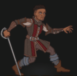
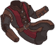
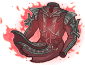
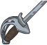
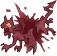
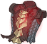
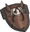
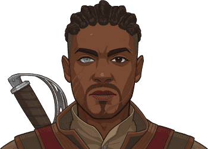

[Back to Main](index.md)

    
        Portait
    
    
        Base Model
    
    
        Mizora Model
    

# Wyll

The son of Grand Duke Ulder Ravengard, Wyll observed many of the political inner workings of Baldur's Gate while growing up. His mother died in childbirth, and he spent a largely happy childhood being trained by his father, who came from a working-class background and taught Wyll practical skills, including swordplay.

[Wyll - Baldur's Gate 3 Wiki](https://bg3.wiki/wiki/Wyll)

# Basic Information

Wyll will be the new champion in the Wintershield event on 20 December 2023.

    
        
            **Seat**:
        
        
            Unknown
        
    
    
        
            **Race**:
        
        
            Human (Guess)
        
    
    
        
            **Class**:
        
        
            Warlock (Guess)
        
    
    
        
            **Roles**:
        
        
            Support (Guess)
        
    
    
        
            **Age**:
        
        
            Unknown
        
    
    
        
            **Gender**:
        
        
            Male (Guess)
        
    
    
        
            **Alignment**:
        
        
            Unknown
        
    
    
        
            **Affiliation**:
        
        
            Absolute Adversaries (Guess)
        
    

# Formation

Unknown.


    



# Abilities

**Base Attack: Blade & Blast** (Melee and Magic)
> Wyll stabs the closest foe, then casts Eldritch Blast on the most damaged foe.  
> Cooldown: 5s (Cap 1.25s)

<em>Raw Data</em>

<pre>
{
    "description": "Wyll stabs the closest foe, then casts Eldritch Blast on the most damaged foe.",
    "long_description": "",
    "damage_modifier": 1,
    "damage_types": [
        "melee",
        "magic"
    ],
    "graphic_id": 0,
    "target": "front",
    "aoe_radius": 0,
    "tags": [
        "melee",
        "ranged"
    ],
    "num_targets": 1,
    "animations": [{
        "target_offset": [
            -250,
            0
        ],
        "special_melee": "wyll",
        "type": "melee_attack"
    }],
    "name": "Blade & Blast",
    "cooldown": 5,
    "id": 708
}
</pre>

**Ultimate Attack: Mizora**
> Wyll's patron Mizora appears behind him for 15 seconds, increasing his damage and attack rate for the duration.  
> Cooldown: 5s (Cap 1.25s)

ⓘ *Note: Very short ultimate cooldowns are almost always for testing purposes and are likely to be increased later.*

<em>Raw Data</em>

<pre>
{
    "description": "Mizora increases Wyll's damage and attack rate for 15 seconds.",
    "long_description": "Wyll's patron Mizora appears behind him for 15 seconds, increasing his damage and attack rate for the duration.",
    "damage_modifier": 1,
    "damage_types": ["magic"],
    "graphic_id": 0,
    "target": "none",
    "aoe_radius": 0,
    "tags": ["ultimate"],
    "num_targets": 0,
    "animations": [{
        "percent_to_formation_start": 0,
        "type": "warden_ultimate"
    }],
    "name": "Mizora",
    "cooldown": 5,
    "id": 709
}
</pre>

**Bravado** (Guess)
> Wyll increases the damage of all Champions that belong to the most represented race, class, or affiliation(s) in the formation by 100%. If there is a tie, all tied groups gain the buff, and Champions who are part of several groups can gain multiple stacks of the buff (up to a max of 4 stacks), stacking multiplicatively. Buffs apply to the pre-stack value.

ⓘ *Note: This ability might be prestack.*

<em>Raw Data</em>

<pre>
{
    "effect_keys": [
        {
            "effect_string": "pre_stack_amount,100",
            "skip_effect_key_desc": true
        },
        {
            "amount_updated_listeners": [
                "slot_changed",
                "feat_changed"
            ],
            "show_bonus_on_receiver_only": true,
            "amount_func": "mult",
            "stack_func": "per_hero_attribute",
            "use_computed_amount_for_description": true,
            "effect_string": "hero_dps_multiplier_mult,0",
            "show_stacks": true,
            "targets": ["all"],
            "post_process_expr": "min(input,max_stacks)",
            "amount_expr": "upgrade_amount(13429,0)",
            "show_stats_on_owner": false,
            "off_when_benched": true,
            "per_hero_targets": ["effect_key_slot"],
            "per_hero_expr": "get_num_most_common_affiliations() + get_num_most_common_races() + get_num_most_common_classes()",
            "show_stats_on_receiver": true,
            "max_stacks": 4
        }
    ],
    "requirements": "",
    "description": {"desc": "Wyll increases the damage of all Champions that belong to the most represented race, class, or affiliation(s) in the formation by $(amount)%. If there is a tie, all tied groups gain the buff, and Champions who are part of several groups can gain multiple stacks of the buff (up to a max of $(max_stacks___2) stacks), stacking multiplicatively. Buffs apply to the pre-stack value."},
    "id": 1792,
    "flavour_text": "",
    "graphic_id": 0,
    "properties": {
        "indexed_effect_properties": true,
        "is_formation_ability": true,
        "default_bonus_index": 0,
        "per_effect_index_bonuses": true
    }
}
</pre>

**Ceremorphosis** (Guess)
> Your formation gains one Ceremorphosis stack due to the mind flayer tadpole in Wyll's brain. Wyll increases the effect of `$(upgrade_name id___2: 13429)` by 100% for each Ceremorphosis stack, stacking multiplicatively.

ⓘ *Note: This ability might be prestack.*

<em>Raw Data</em>

<pre>
{
    "effect_keys": [
        {"effect_string": "pre_stack_amount,100"},
        {
            "amount_expr": "upgrade_amount(13430,0)",
            "stack_title": "Total Ceremorphosis Stacks",
            "amount_updated_listeners": ["slot_changed"],
            "stacks_multiply": true,
            "total_title": "Total Bonus",
            "off_when_benched": true,
            "show_bonus": true,
            "amount_func": "mult",
            "stack_func": "per_ceremorphosis_stacks",
            "effect_string": "buff_upgrade,0,13429",
            "desc_forced_order": 2
        },
        {
            "stack_title": "Wyll Ceremorphosis Stacks",
            "manual_stacking": true,
            "stacks_multiply": false,
            "off_when_benched": true,
            "outgoing_buffs": false,
            "effect_string": "wyll_ceremorphosis_stacks,1",
            "show_stacks": true,
            "desc_forced_order": 1
        }
    ],
    "requirements": "",
    "description": {"desc": "Your formation gains one Ceremorphosis stack due to the mind flayer tadpole in Wyll's brain. Wyll increases the effect of $(upgrade_name id___2) by $(amount)% for each Ceremorphosis stack, stacking multiplicatively."},
    "id": 1793,
    "flavour_text": "",
    "graphic_id": 0,
    "properties": {
        "indexed_effect_properties": true,
        "retain_on_slot_changed": true,
        "is_formation_ability": true,
        "default_bonus_index": 0,
        "owner_use_outgoing_description": true,
        "per_effect_index_bonuses": true
    }
}
</pre>

**Folk Hero** (Guess)
> Fiends are Wyll's Favored Foes. All Champions deal 400% more damage against Wyll's Favored Foes.

<em>Raw Data</em>

<pre>
{
    "effect_keys": [
        {
            "off_when_benched": true,
            "effect_string": "increase_damage_against_monster_tag,400,fiend",
            "targets": ["all"]
        },
        {
            "off_when_benched": true,
            "effect_string": "favored_foe,fiend"
        }
    ],
    "requirements": "",
    "description": {"desc": "Fiends are Wyll's Favored Foes. All Champions deal $(amount)% more damage against Wyll's Favored Foes."},
    "id": 1794,
    "flavour_text": "",
    "graphic_id": 0,
    "properties": {
        "indexed_effect_properties": true,
        "is_formation_ability": true,
        "default_bonus_index": 0,
        "owner_use_outgoing_description": true,
        "per_effect_index_bonuses": true
    }
}
</pre>

**Heartless Contract** (Guess)
> Each time an enemy or distraction is defeated, Wyll increases the effect of `$(upgrade_name id: 13429)` by 25%, stacking multiplicatively up to 10 times, until the area changes.

<em>Raw Data</em>

<pre>
{
    "effect_keys": [{
        "stacks_multiply": true,
        "show_bonus": true,
        "effect_string": "buff_upgrade,25,13429",
        "max_stacks": 10,
        "more_triggers": [
            {
                "action": {"type": "add_stack"},
                "trigger": "monster_killed"
            },
            {
                "action": {"type": "add_stack"},
                "trigger": "distraction_clicked"
            },
            {
                "action": {"type": "reset_stacks"},
                "trigger": "area_changed"
            }
        ]
    }],
    "requirements": "",
    "description": {"desc": "Each time an enemy or distraction is defeated, Wyll increases the effect of $(upgrade_name id) by $(not_buffed amount)%, stacking multiplicatively up to $(max_stacks) times, until the area changes."},
    "id": 1795,
    "flavour_text": "",
    "graphic_id": 0,
    "properties": {
        "is_formation_ability": true,
        "owner_use_outgoing_description": true
    }
}
</pre>

# Specialisations

**Specialisation: Pact of the Blade** (Guess)
> Wyll increases the effect of 13429 by 200% on Champions with a Melee base attack.

<em>Raw Data</em>

<pre>
{
    "effect_keys": [{
        "amount_updated_listeners": [
            "slot_changed",
            "attack_changed"
        ],
        "off_when_benched": true,
        "effect_string": "buff_incoming_upgrade,200,13429",
        "filter_targets": [
            {
                "upgrade_id": 13429,
                "type": "affected_by_upgrade"
            },
            {
                "attack": "melee",
                "type": "attack_type"
            }
        ],
        "targets": ["all"]
    }],
    "requirements": "",
    "description": {"desc": "Wyll increases the effect of $(upgrade_name upgrade_id) by $(amount)% on Champions with a Melee base attack."},
    "id": 1796,
    "flavour_text": "",
    "graphic_id": 0,
    "properties": {
        "is_formation_ability": true,
        "formation_circle_icon": false
    }
}
</pre>

**Specialisation: Pact of the Chain** (Guess)
> Wyll increases the effect of Folk Hero by 10% for each Familiar assigned to his party, stacking multiplicatively.

<em>Raw Data</em>

<pre>
{
    "effect_keys": [{
        "amount_updated_listeners": ["familiar_changed"],
        "stacks_multiply": true,
        "off_when_benched": true,
        "show_bonus": true,
        "amount_func": "mult",
        "stack_func": "per_familiar_in_play",
        "effect_string": "buff_upgrade,10,13429"
    }],
    "requirements": "",
    "description": {"desc": "Wyll increases the effect of Folk Hero by $(amount)% for each Familiar assigned to his party, stacking multiplicatively."},
    "id": 1797,
    "flavour_text": "",
    "graphic_id": 0,
    "properties": {
        "is_formation_ability": true,
        "owner_use_outgoing_description": true,
        "formation_circle_icon": false
    }
}
</pre>

**Specialisation: Pact of the Tome** (Guess)
> Wyll increases the effect of Folk Hero by 25% for each Champion in the formation with a Magic base attack, stacking multiplicatively.

<em>Raw Data</em>

<pre>
{
    "effect_keys": [{
        "amount_updated_listeners": [
            "slot_changed",
            "feat_changed",
            "attack_changed"
        ],
        "off_when_benched": true,
        "show_bonus": true,
        "per_hero_targets": ["all"],
        "amount_func": "mult",
        "stack_func": "per_hero_attribute",
        "use_computed_amount_for_description": true,
        "per_hero_expr": "has_base_attack_dmg_type_magic",
        "effect_string": "buff_upgrade,25,13429"
    }],
    "requirements": "",
    "description": {"desc": "Wyll increases the effect of Folk Hero by $(amount)% for each Champion in the formation with a Magic base attack, stacking multiplicatively."},
    "id": 1798,
    "flavour_text": "",
    "graphic_id": 0,
    "properties": {
        "is_formation_ability": true,
        "owner_use_outgoing_description": true,
        "formation_circle_icon": false
    }
}
</pre>

# Items

    
        
            **Icons**
        
        
            **Name**
        
    
    
        
            
        
        
            Armor
        
    
    
        
            
        
        
            Blades
        
    
    
        
            
        
        
            Camp Comforts
        
    
    
        
            
        
        
            Fiend Clues
        
    
    
        
            
        
        
            Folk Hero Stuff
        
    
    
        
            
        
        
            Pact Items
        
    

# Feats

Unknown.

# Legendaries

Unknown.

# Other Champion Images

    
        
            Console Portait
        
    
    
        
            Gold Chest Icon
        
        
            Silver Chest Icon
        
    

[Back to Top](#top)

*Last Modified: {{ site.time }}*