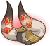

[Back to Main](index.md)

    
        Portait
    
    
        Base Model
    
    
        Mizora Model
    

# Wyll

The son of Grand Duke Ulder Ravengard, Wyll observed many of the political inner workings of Baldur's Gate while growing up. His mother died in childbirth, and he spent a largely happy childhood being trained by his father, who came from a working-class background and taught Wyll practical skills, including swordplay.

[Wyll - Baldur's Gate 3 Wiki](https://bg3.wiki/wiki/Wyll)

# Basic Information

Wyll will be the new champion in the Wintershield event on 20 December 2023.

    
        
            **Seat**:
        
        
            Unknown
        
    
    
        
            **Race**:
        
        
            Human (Guess)
        
    
    
        
            **Class**:
        
        
            Warlock (Guess)
        
    
    
        
            **Roles**:
        
        
            Support (Guess)
        
    
    
        
            **Age**:
        
        
            Unknown
        
    
    
        
            **Gender**:
        
        
            Male (Guess)
        
    
    
        
            **Alignment**:
        
        
            Unknown
        
    
    
        
            **Affiliation**:
        
        
            Absolute Adversaries (Guess)
        
    

# Formation

    

# Abilities

**Base Attack: Blade & Blast** (Melee and Magic)
> Wyll stabs the closest foe, then casts Eldritch Blast on the lowest health enemy.  
> Cooldown: 5s (Cap 1.25s)

<em>Raw Data</em>

<pre>
{
    "id": 708,
    "name": "Blade & Blast",
    "description": "Wyll stabs the closest foe, then casts Eldritch Blast on the lowest health enemy.",
    "long_description": "",
    "graphic_id": 0,
    "target": "front",
    "num_targets": 1,
    "aoe_radius": 0,
    "damage_modifier": 1,
    "cooldown": 5,
    "animations": [
        {
            "type": "melee_attack",
            "special_melee": "wyll",
            "target_offset": [
                -200,
                0
            ],
            "seq_chargeloop": 1,
            "attack_sounds": {
                "melee": 179,
                "eb": 184
            }
        }
    ],
    "tags": [
        "melee",
        "ranged"
    ],
    "damage_types": [
        "melee",
        "magic"
    ]
}
</pre>

**Ultimate Attack: Mizora**
> Wyll's patron Mizora appears behind him for 15 seconds, increasing his damage and attack rate for the duration.  
> Cooldown: 400s (Cap 100s)

<em>Raw Data</em>

<pre>
{
    "id": 709,
    "name": "Mizora",
    "description": "Mizora increases Wyll's damage and attack rate for 15 seconds.",
    "long_description": "Wyll's patron Mizora appears behind him for 15 seconds, increasing his damage and attack rate for the duration.",
    "graphic_id": 21729,
    "target": "none",
    "num_targets": 0,
    "aoe_radius": 0,
    "damage_modifier": 0.03,
    "cooldown": 400,
    "animations": [
        {
            "type": "ultimate_attack",
            "ultimate": "wyll",
            "no_damage_display": true
        }
    ],
    "tags": [
        "ultimate"
    ],
    "damage_types": [
        "magic"
    ]
}
</pre>

**Bravado** (Guess)
> Wyll increases the damage of all Champions that belong to the most represented race, class, or affiliation(s) in the formation by 100%. If there is a tie, all tied groups gain the buff, and Champions who are part of several groups can gain multiple stacks of the buff (up to a max of 4 stacks), stacking multiplicatively. Buffs apply to the pre-stack value.
>  
> - Most Represented
> - Race: `$(most_common_race)`
> - Class: `$(most_common_class)`
> - Affiliation: .

ⓘ *Note: This ability might be prestack.*

<em>Raw Data</em>

<pre>
{
    "id": 1792,
    "flavour_text": "",
    "description": {
        "desc": "Wyll increases the damage of all Champions that belong to the most represented race, class, or affiliation(s) in the formation by $(amount)%. If there is a tie, all tied groups gain the buff, and Champions who are part of several groups can gain multiple stacks of the buff (up to a max of $(max_stacks___2) stacks), stacking multiplicatively. Buffs apply to the pre-stack value.",
        "post": {
            "conditions": [
                {
                    "condition": "not static_desc",
                    "desc": "^^Most Represented^Race: $(most_common_race)^Class: $(most_common_class)^Affiliation: $(most_common_affiliation)"
                }
            ]
        }
    },
    "effect_keys": [
        {
            "effect_string": "pre_stack_amount,100",
            "skip_effect_key_desc": true
        },
        {
            "off_when_benched": true,
            "effect_string": "hero_dps_multiplier_mult,0",
            "amount_expr": "upgrade_amount(13429,0)",
            "targets": [
                "all"
            ],
            "show_stacks": true,
            "show_stats_on_owner": false,
            "show_stats_on_receiver": true,
            "show_bonus_on_receiver_only": true,
            "amount_func": "mult",
            "max_stacks": 4,
            "stack_func": "per_hero_attribute",
            "per_hero_expr": "get_num_most_common_affiliations + get_num_most_common_races + get_num_most_common_classes",
            "post_process_expr": "min(input,max_stacks)",
            "per_hero_targets": [
                "effect_key_slot"
            ],
            "amount_updated_listeners": [
                "slot_changed",
                "feat_changed"
            ],
            "use_computed_amount_for_description": true
        }
    ],
    "requirements": "",
    "graphic_id": 21724,
    "properties": {
        "is_formation_ability": true,
        "indexed_effect_properties": true,
        "per_effect_index_bonuses": true,
        "default_bonus_index": 0
    }
}
</pre>

**Ceremorphosis** (Guess)
> Your formation gains one Ceremorphosis stack due to the mind flayer tadpole in Wyll's brain. Wyll increases the effect of `$(upgrade_name id___2: 13429)` by 100% for each Ceremorphosis stack, stacking multiplicatively.

ⓘ *Note: This ability might be prestack.*

<em>Raw Data</em>

<pre>
{
    "id": 1793,
    "flavour_text": "",
    "description": {
        "desc": "Your formation gains one Ceremorphosis stack due to the mind flayer tadpole in Wyll's brain. Wyll increases the effect of $(upgrade_name id___2) by $(amount)% for each Ceremorphosis stack, stacking multiplicatively."
    },
    "effect_keys": [
        {
            "effect_string": "pre_stack_amount,100"
        },
        {
            "off_when_benched": true,
            "effect_string": "buff_upgrade,0,13429",
            "amount_expr": "upgrade_amount(13430,0)",
            "stack_func": "per_ceremorphosis_stacks",
            "amount_func": "mult",
            "stacks_multiply": true,
            "show_bonus": true,
            "stack_title": "Total Ceremorphosis Stacks",
            "total_title": "Total Bonus",
            "desc_forced_order": 2,
            "amount_updated_listeners": [
                "upgrade_unlocked",
                "slot_changed",
                "feat_changed"
            ]
        },
        {
            "off_when_benched": true,
            "outgoing_buffs": false,
            "effect_string": "wyll_ceremorphosis_stacks,1",
            "manual_stacking": true,
            "stacks_multiply": false,
            "show_stacks": true,
            "stack_title": "Wyll Ceremorphosis Stacks",
            "desc_forced_order": 1
        }
    ],
    "requirements": "",
    "graphic_id": 21723,
    "properties": {
        "is_formation_ability": true,
        "owner_use_outgoing_description": true,
        "indexed_effect_properties": true,
        "per_effect_index_bonuses": true,
        "default_bonus_index": 0,
        "retain_on_slot_changed": true
    }
}
</pre>

**Folk Hero** (Guess)
> $(Wylls_favored_foe_list_and fiend) are Wyll's Favored Foes. All Champions deal 400% more damage against Wyll's Favored Foes.

<em>Raw Data</em>

<pre>
{
    "id": 1794,
    "flavour_text": "",
    "description": {
        "desc": "$(sources_favored_foe_list_and fiend) are Wyll's Favored Foes. All Champions deal $(amount)% more damage against Wyll's Favored Foes."
    },
    "effect_keys": [
        {
            "effect_string": "increase_damage_against_monster,400",
            "monster_is_favored_foe_of_effect_owner": true,
            "targets": [
                "all"
            ],
            "off_when_benched": true,
            "override_key_desc": "$source does $amount% more damage against Wyll's Favored Foes"
        },
        {
            "off_when_benched": true,
            "effect_string": "favored_foe,fiend"
        }
    ],
    "requirements": "",
    "graphic_id": 21725,
    "properties": {
        "is_formation_ability": true,
        "owner_use_outgoing_description": true,
        "indexed_effect_properties": true,
        "per_effect_index_bonuses": true,
        "default_bonus_index": 0
    }
}
</pre>

**Heartless Contract** (Guess)
> Each time an enemy or distraction is defeated, Wyll increases the effect of `$(upgrade_name id: 13429)` by 25%, stacking multiplicatively up to 10 times, until the area changes.

<em>Raw Data</em>

<pre>
{
    "id": 1795,
    "flavour_text": "",
    "description": {
        "desc": "Each time an enemy or distraction is defeated, Wyll increases the effect of $(upgrade_name id) by $(not_buffed amount)%, stacking multiplicatively up to $(max_stacks) times, until the area changes."
    },
    "effect_keys": [
        {
            "effect_string": "buff_upgrade,25,13429",
            "show_bonus": true,
            "stacks_multiply": true,
            "max_stacks": 10,
            "more_triggers": [
                {
                    "trigger": "monster_killed",
                    "action": {
                        "type": "add_stack"
                    }
                },
                {
                    "trigger": "distraction_clicked",
                    "action": {
                        "type": "add_stack"
                    }
                },
                {
                    "trigger": "area_changed",
                    "action": {
                        "type": "reset_stacks"
                    }
                }
            ]
        }
    ],
    "requirements": "",
    "graphic_id": 21722,
    "properties": {
        "is_formation_ability": true,
        "owner_use_outgoing_description": true
    }
}
</pre>

**Unknown** (Guess)
> Constructs are now one of Wyll's Favored Foes.

<em>Raw Data</em>

<pre>
{
    "id": 1846,
    "flavour_text": "",
    "description": {
        "desc": "Constructs are now one of Wyll's Favored Foes."
    },
    "effect_keys": [
        {
            "off_when_benched": true,
            "effect_string": "favored_foe,construct"
        }
    ],
    "requirements": "",
    "graphic_id": 0,
    "properties": {
        "is_formation_ability": false
    }
}
</pre>

**Unknown** (Guess)
> Undead are now one of Wyll's Favored Foes.

<em>Raw Data</em>

<pre>
{
    "id": 1847,
    "flavour_text": "",
    "description": {
        "desc": "Undead are now one of Wyll's Favored Foes."
    },
    "effect_keys": [
        {
            "off_when_benched": true,
            "effect_string": "favored_foe,undead"
        }
    ],
    "requirements": "",
    "graphic_id": 0,
    "properties": {
        "is_formation_ability": false
    }
}
</pre>

# Specialisations

**Specialisation: Pact of the Blade** (Guess)
> Wyll increases the effect of 13429},{ by 200% on Champions with a Melee base attack.

<em>Raw Data</em>

<pre>
{
    "id": 1796,
    "flavour_text": "",
    "description": {
        "desc": "Wyll increases the effect of $(upgrade_name upgrade_id) by $(amount)% on Champions with a Melee base attack."
    },
    "effect_keys": [
        {
            "off_when_benched": true,
            "effect_string": "buff_incoming_upgrade,200,13429",
            "optional_effect_index": 1,
            "targets": [
                "all"
            ],
            "filter_targets": [
                {
                    "type": "affected_by_upgrade",
                    "upgrade_id": 13429
                },
                {
                    "type": "attack_type",
                    "attack": "melee"
                }
            ],
            "amount_updated_listeners": [
                "slot_changed",
                "attack_changed"
            ]
        }
    ],
    "requirements": "",
    "graphic_id": 0,
    "properties": {
        "is_formation_ability": true,
        "formation_circle_icon": false,
        "spec_option_post_apply_info": "Melee Champions: $num_targets"
    }
}
</pre>

**Specialisation: Pact of the Chain** (Guess)
> Wyll increases the effect of Folk Hero by 10% for each Familiar assigned to his party, stacking multiplicatively.

<em>Raw Data</em>

<pre>
{
    "id": 1797,
    "flavour_text": "",
    "description": {
        "desc": "Wyll increases the effect of Folk Hero by $(not_buffed amount)% for each Familiar assigned to his party, stacking multiplicatively."
    },
    "effect_keys": [
        {
            "off_when_benched": true,
            "effect_string": "buff_upgrade,10,13429",
            "stack_func": "per_familiar_in_play",
            "amount_func": "mult",
            "stacks_multiply": true,
            "show_bonus": true,
            "amount_updated_listeners": [
                "familiar_changed"
            ]
        }
    ],
    "requirements": "",
    "graphic_id": 0,
    "properties": {
        "is_formation_ability": true,
        "owner_use_outgoing_description": true,
        "formation_circle_icon": false,
        "spec_option_post_apply_info": "Assigned Familiars: $num_stacks"
    }
}
</pre>

**Specialisation: Pact of the Tome** (Guess)
> Wyll increases the effect of Folk Hero by 25% for each Champion in the formation with a Magic base attack, stacking multiplicatively.

<em>Raw Data</em>

<pre>
{
    "id": 1798,
    "flavour_text": "",
    "description": {
        "desc": "Wyll increases the effect of Folk Hero by $(not_buffed amount)% for each Champion in the formation with a Magic base attack, stacking multiplicatively."
    },
    "effect_keys": [
        {
            "off_when_benched": true,
            "effect_string": "buff_upgrade,25,13429",
            "amount_func": "mult",
            "show_bonus": true,
            "stack_func": "per_hero_attribute",
            "per_hero_expr": "has_base_attack_dmg_type_magic",
            "per_hero_targets": [
                "all"
            ],
            "amount_updated_listeners": [
                "slot_changed",
                "feat_changed",
                "attack_changed"
            ],
            "use_computed_amount_for_description": true
        }
    ],
    "requirements": "",
    "graphic_id": 0,
    "properties": {
        "is_formation_ability": true,
        "owner_use_outgoing_description": true,
        "formation_circle_icon": false,
        "spec_option_post_apply_info": "Magic Champions: $num_stacks"
    }
}
</pre>

# Items

    
        
            **Icons**
        
        
            **Name**
        
    
    
        
            
        
        
            Armor
        
    
    
        
            
        
        
            Blades
        
    
    
        
            
        
        
            Camp Comforts
        
    
    
        
            
        
        
            Fiend Clues
        
    
    
        
            
        
        
            Folk Hero Stuff
        
    
    
        
            
        
        
            Pact Items
        
    

# Feats

Unknown.

# Legendaries

Unknown.

# Other Champion Images

    
        
            Console Portait
        
    
    
        
            Gold Chest Icon
        
        
            Silver Chest Icon
        
    

[Back to Top](#top)

*Last Modified: {{ site.time }}*