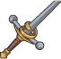
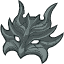
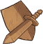

[Back to Main](index.md)

    
        Portait
    
    
        Base Model
    
    
        Mizora Model
    

# Wyll

From a scion of a famed Baldurian house to a life of adventure on the road, Wyll's life as the monster hunter called the Blade of Frontiers has made him one of the beating hearts of the Sword Coast. While he has done great deeds for the Coast's people, the source of his power remains secret. The cambion Mizora drew Wyll into a warlock's pact in a moment with many lives at stake, and cursed him with the duty of hunting her enemies. Mizora only asks Wyll to sacrifice devilish creatures to her, but a cambion's ambitions are ever fickle, and Wyll wishes to escape the pact before its price grows cruel.

# Basic Information

Wyll will be the new champion in the Wintershield event on 20 December 2023.

    
        
            **Seat**:
        
        
            12
        
        
            **Stat**
        
        
            **Value**
        
        
            **Day 1 Trials**
        
        
            **Patrons**
        
    
    
        
            **Race**:
        
        
            Human
        
        
            **Strength**:
        
        
            9
        
        
            Yes
        
        
            Mirt
        
    
    
        
            **Class**:
        
        
            Warlock
        
        
            **Dexterity**:
        
        
            13
        
        
            Yes
        
        
            Vajra
        
    
    
        
            **Roles**:
        
        
            Support
        
        
            **Constitution**:
        
        
            15
        
        
            Yes
        
        
            Strahd
        
    
    
        
            **Age**:
        
        
            24
        
        
            **Intelligence**:
        
        
            14
        
        
            Yes
        
        
            Zariel (with Feat)
        
    
    
        
            **Gender**:
        
        
            Male
        
        
            **Wisdom**:
        
        
            11
        
        
            Yes
        
        
            &nbsp;
        
    
    
        
            **Alignment**:
        
        
            Neutral Good
        
        
            **Charisma**:
        
        
            16
        
        
            Yes
        
        
            &nbsp;
        
    
    
        
            **Affiliation**:
        
        
            Absolute Adversaries
        
        
            **Total**:
        
        
            78
        
        
            Champion ID:
        
        
            142
        
    

# Formation

    

# Abilities

  **Base Attack: Blade & Blast** (Melee / Magic)
> Wyll stabs the closest foe, then casts Eldritch Blast on the lowest health enemy.  
> Cooldown: 5s (Cap 1.25s)

<em>Raw Data</em>

<pre>
{
    "id": 708,
    "name": "Blade & Blast",
    "description": "Wyll stabs the closest foe, then casts Eldritch Blast on the lowest health enemy.",
    "long_description": "",
    "graphic_id": 0,
    "target": "front",
    "num_targets": 1,
    "aoe_radius": 0,
    "damage_modifier": 1,
    "cooldown": 5,
    "animations": [
        {
            "type": "melee_attack",
            "special_melee": "wyll",
            "target_offset": [
                -200,
                0
            ],
            "seq_chargeloop": 1,
            "attack_sounds": {
                "melee": 179,
                "eb": 184
            }
        }
    ],
    "tags": [
        "melee",
        "ranged"
    ],
    "damage_types": [
        "melee",
        "magic"
    ]
}
</pre>

 **Ultimate Attack: Mizora** (Level: 70)
> Wyll's patron Mizora appears behind him for 15 seconds, increasing his attack rate and making him deal ultimate damage for the duration.  
> Cooldown: 400s (Cap 100s)

<em>Raw Data</em>

<pre>
{
    "id": 709,
    "name": "Mizora",
    "description": "Mizora causes Wyll to attack faster and deal ultimate damage for 15 seconds.",
    "long_description": "Wyll's patron Mizora appears behind him for 15 seconds, increasing his attack rate and making him deal ultimate damage for the duration.",
    "graphic_id": 21729,
    "target": "none",
    "num_targets": 0,
    "aoe_radius": 0,
    "damage_modifier": 0.03,
    "cooldown": 400,
    "animations": [
        {
            "type": "ultimate_attack",
            "ultimate": "wyll",
            "no_damage_display": true
        }
    ],
    "tags": [
        "ultimate"
    ],
    "damage_types": [
        "magic"
    ]
}
</pre>

 **Folk Hero** (Level: 10)
> Wyll increases the damage of all Champions that belong to the most represented race, class, or affiliation(s) in the formation by 400%. If there is a tie, all tied groups gain the buff, and Champions who are part of several groups can gain multiple stacks of the buff (up to a max of 4 stacks), stacking multiplicatively. Buffs apply to the pre-stack value.
>  
> - Most Represented
> - Race: `$(most_common_race)`
> - Class: `$(most_common_class)`
> - Affiliation: .

<em>Upgrade Data</em>

<pre>
Upgrades:
       50: 200%
      100: 200%
      160: 200%
      260: 100%
      350: 100%
      440: 100%
      530: 100%
      620: 100%
      750: 200%
      840: 100%
      990: 200%
    1,070: 100%
    1,200: 200%
    1,300: 100%
    1,440: 200%

    Total Upgrade Bonus: 5.60e07%
</pre>

ⓘ *Note: This ability might be prestack.*

<em>Raw Data</em>

<pre>
{
    "id": 13429,
    "hero_id": 142,
    "required_level": 10,
    "required_upgrade_id": 0,
    "upgrade_type": "unlock_ability",
    "effect": "effect_def,1792",
    "static_dps_mult": null,
    "default_enabled": 1,
    "name": "Folk Hero",
    "tip_text": "Wyll increases the damage of Champions that belong to the most represented race, class, or affiliation(s)."
}
{
    "id": 1792,
    "flavour_text": "",
    "description": {
        "desc": "Wyll increases the damage of all Champions that belong to the most represented race, class, or affiliation(s) in the formation by $(amount)%. If there is a tie, all tied groups gain the buff, and Champions who are part of several groups can gain multiple stacks of the buff (up to a max of $(max_stacks___2) stacks), stacking multiplicatively. Buffs apply to the pre-stack value.",
        "post": {
            "conditions": [
                {
                    "condition": "not static_desc",
                    "desc": "^^Most Represented^Race: $(most_common_race)^Class: $(most_common_class)^Affiliation: $(most_common_affiliation)"
                }
            ]
        }
    },
    "effect_keys": [
        {
            "effect_string": "pre_stack_amount,400",
            "skip_effect_key_desc": true
        },
        {
            "off_when_benched": true,
            "effect_string": "hero_dps_multiplier_mult,0",
            "amount_expr": "upgrade_amount(13429,0)",
            "targets": [
                "all"
            ],
            "show_stacks": true,
            "show_stats_on_owner": false,
            "show_stats_on_receiver": true,
            "show_bonus_on_receiver_only": true,
            "amount_func": "mult",
            "max_stacks": 4,
            "stack_func": "per_hero_attribute",
            "per_hero_expr": "get_num_most_common_affiliations + get_num_most_common_races + get_num_most_common_classes",
            "post_process_expr": "min(input,max_stacks)",
            "per_hero_targets": [
                "effect_key_slot"
            ],
            "amount_updated_listeners": [
                "slot_changed",
                "feat_changed"
            ],
            "use_computed_amount_for_description": true
        }
    ],
    "requirements": "",
    "graphic_id": 21724,
    "properties": {
        "is_formation_ability": true,
        "indexed_effect_properties": true,
        "per_effect_index_bonuses": true,
        "default_bonus_index": 0
    }
}
</pre>

 **Ceremorphosis** (Level: 40)
> Your formation gains one Ceremorphosis stack due to the mind flayer tadpole in Wyll's brain. Wyll increases the effect of Folk Hero by 100% for each Ceremorphosis stack, stacking multiplicatively.

ⓘ *Note: This ability might be prestack.*

<em>Raw Data</em>

<pre>
{
    "id": 13430,
    "hero_id": 142,
    "required_level": 40,
    "required_upgrade_id": 0,
    "upgrade_type": "unlock_ability",
    "effect": "effect_def,1793",
    "static_dps_mult": null,
    "default_enabled": 1,
    "name": "Ceremorphosis"
}
{
    "id": 1793,
    "flavour_text": "",
    "description": {
        "desc": "Your formation gains one Ceremorphosis stack due to the mind flayer tadpole in Wyll's brain. Wyll increases the effect of $(upgrade_name id___2) by $(amount)% for each Ceremorphosis stack, stacking multiplicatively."
    },
    "effect_keys": [
        {
            "effect_string": "pre_stack_amount,100"
        },
        {
            "off_when_benched": true,
            "effect_string": "buff_upgrade,0,13429",
            "amount_expr": "upgrade_amount(13430,0)",
            "stack_func": "per_ceremorphosis_stacks",
            "amount_func": "mult",
            "stacks_multiply": true,
            "show_bonus": true,
            "stack_title": "Total Ceremorphosis Stacks",
            "total_title": "Total Bonus",
            "desc_forced_order": 2,
            "amount_updated_listeners": [
                "upgrade_unlocked",
                "slot_changed",
                "feat_changed"
            ]
        },
        {
            "off_when_benched": true,
            "outgoing_buffs": false,
            "effect_string": "wyll_ceremorphosis_stacks,1",
            "manual_stacking": true,
            "stacks_multiply": false,
            "show_stacks": true,
            "stack_title": "Wyll Ceremorphosis Stacks",
            "desc_forced_order": 1
        }
    ],
    "requirements": "",
    "graphic_id": 21723,
    "properties": {
        "is_formation_ability": true,
        "owner_use_outgoing_description": true,
        "indexed_effect_properties": true,
        "per_effect_index_bonuses": true,
        "default_bonus_index": 0,
        "retain_on_slot_changed": true
    }
}
</pre>

 **A Heartless Contract** (Level: 60)
> $(Wylls_favored_foe_list_and fiend) are Wyll's Favored Foes. All Champions deal 400% more damage against Wyll's Favored Foes.

<em>Raw Data</em>

<pre>
{
    "id": 13431,
    "hero_id": 142,
    "required_level": 60,
    "required_upgrade_id": 0,
    "upgrade_type": "unlock_ability",
    "effect": "effect_def,1794",
    "static_dps_mult": null,
    "default_enabled": 1,
    "name": "A Heartless Contract",
    "tip_text": "Fiends are Wyll's Favored Foes and all Champions deal increased damage to them"
}
{
    "id": 1794,
    "flavour_text": "",
    "description": {
        "desc": "$(sources_favored_foe_list_and fiend) are Wyll's Favored Foes. All Champions deal $(amount)% more damage against Wyll's Favored Foes."
    },
    "effect_keys": [
        {
            "effect_string": "increase_damage_against_monster,400",
            "monster_is_favored_foe_of_effect_owner": true,
            "targets": [
                "all"
            ],
            "off_when_benched": true,
            "override_key_desc": "$source does $amount% more damage against Wyll's Favored Foes"
        },
        {
            "off_when_benched": true,
            "effect_string": "favored_foe,fiend"
        }
    ],
    "requirements": "",
    "graphic_id": 21725,
    "properties": {
        "is_formation_ability": true,
        "owner_use_outgoing_description": true,
        "indexed_effect_properties": true,
        "per_effect_index_bonuses": true,
        "default_bonus_index": 0
    }
}
</pre>

 **Bravado** (Level: 90)
> Each time an enemy or distraction is defeated, Wyll increases the effect of Folk Hero by 25%, stacking multiplicatively up to 10 times, until the area changes.

<em>Raw Data</em>

<pre>
{
    "id": 13432,
    "hero_id": 142,
    "required_level": 90,
    "required_upgrade_id": 0,
    "upgrade_type": "unlock_ability",
    "effect": "effect_def,1795",
    "static_dps_mult": null,
    "default_enabled": 1,
    "name": "Bravado"
}
{
    "id": 1795,
    "flavour_text": "",
    "description": {
        "desc": "Each time an enemy or distraction is defeated, Wyll increases the effect of $(upgrade_name id) by $(not_buffed amount)%, stacking multiplicatively up to $(max_stacks) times, until the area changes."
    },
    "effect_keys": [
        {
            "effect_string": "buff_upgrade,25,13429",
            "show_bonus": true,
            "stacks_multiply": true,
            "max_stacks": 10,
            "more_triggers": [
                {
                    "trigger": "monster_killed",
                    "action": {
                        "type": "add_stack"
                    }
                },
                {
                    "trigger": "distraction_clicked",
                    "action": {
                        "type": "add_stack"
                    }
                },
                {
                    "trigger": "area_changed",
                    "action": {
                        "type": "reset_stacks"
                    }
                }
            ]
        }
    ],
    "requirements": "",
    "graphic_id": 21722,
    "properties": {
        "is_formation_ability": true,
        "owner_use_outgoing_description": true
    }
}
</pre>

# Specialisations

 **Pact of the Blade** (Level: 110)
> Wyll increases the effect of 13429 by 200% on Champions with a Melee base attack.

<em>Raw Data</em>

<pre>
{
    "id": 13433,
    "hero_id": 142,
    "required_level": 110,
    "required_upgrade_id": 0,
    "upgrade_type": "unlock_ability",
    "effect": "effect_def,1796",
    "static_dps_mult": null,
    "default_enabled": 1,
    "name": "Pact of the Blade",
    "specialization_name": "Pact of the Blade",
    "specialization_description": "Wyll focuses on his blade and empowers his allies with a Melee attack.",
    "specialization_graphic_id": 21726
}
{
    "id": 1796,
    "flavour_text": "",
    "description": {
        "desc": "Wyll increases the effect of $(upgrade_name upgrade_id) by $(amount)% on Champions with a Melee base attack."
    },
    "effect_keys": [
        {
            "off_when_benched": true,
            "effect_string": "buff_incoming_upgrade,200,13429",
            "optional_effect_index": 1,
            "targets": [
                "all"
            ],
            "filter_targets": [
                {
                    "type": "affected_by_upgrade",
                    "upgrade_id": 13429
                },
                {
                    "type": "attack_type",
                    "attack": "melee"
                }
            ],
            "amount_updated_listeners": [
                "slot_changed",
                "attack_changed"
            ]
        }
    ],
    "requirements": "",
    "graphic_id": 0,
    "properties": {
        "is_formation_ability": true,
        "formation_circle_icon": false,
        "spec_option_post_apply_info": "Melee Champions: $num_targets"
    }
}
</pre>

 **Pact of the Chain** (Level: 110)
> Wyll increases the effect of Folk Hero by 10% for each Familiar assigned to his party, stacking multiplicatively.

<em>Raw Data</em>

<pre>
{
    "id": 13434,
    "hero_id": 142,
    "required_level": 110,
    "required_upgrade_id": 0,
    "upgrade_type": "unlock_ability",
    "effect": "effect_def,1797",
    "static_dps_mult": null,
    "default_enabled": 1,
    "name": "Pact of the Chain",
    "specialization_name": "Pact of the Chain",
    "specialization_description": "Wyll's abilities increase with the number of Familiars assigned to the party.",
    "specialization_graphic_id": 21727
}
{
    "id": 1797,
    "flavour_text": "",
    "description": {
        "desc": "Wyll increases the effect of Folk Hero by $(not_buffed amount)% for each Familiar assigned to his party, stacking multiplicatively."
    },
    "effect_keys": [
        {
            "off_when_benched": true,
            "effect_string": "buff_upgrade,10,13429",
            "stack_func": "per_familiar_in_play",
            "amount_func": "mult",
            "stacks_multiply": true,
            "show_bonus": true,
            "amount_updated_listeners": [
                "familiar_changed"
            ]
        }
    ],
    "requirements": "",
    "graphic_id": 0,
    "properties": {
        "is_formation_ability": true,
        "owner_use_outgoing_description": true,
        "formation_circle_icon": false,
        "spec_option_post_apply_info": "Assigned Familiars: $num_stacks"
    }
}
</pre>

 **Pact of the Tome** (Level: 110)
> Wyll increases the effect of Folk Hero by 25% for each Champion in the formation with a Magic base attack, stacking multiplicatively.

<em>Raw Data</em>

<pre>
{
    "id": 13435,
    "hero_id": 142,
    "required_level": 110,
    "required_upgrade_id": 0,
    "upgrade_type": "unlock_ability",
    "effect": "effect_def,1798",
    "static_dps_mult": null,
    "default_enabled": 1,
    "name": "Pact of the Tome",
    "specialization_name": "Pact of the Tome",
    "specialization_description": "Wyll's magic strengthens with each ally that has a Magical attack.",
    "specialization_graphic_id": 21728
}
{
    "id": 1798,
    "flavour_text": "",
    "description": {
        "desc": "Wyll increases the effect of Folk Hero by $(not_buffed amount)% for each Champion in the formation with a Magic base attack, stacking multiplicatively."
    },
    "effect_keys": [
        {
            "off_when_benched": true,
            "effect_string": "buff_upgrade,25,13429",
            "amount_func": "mult",
            "show_bonus": true,
            "stack_func": "per_hero_attribute",
            "per_hero_expr": "has_base_attack_dmg_type_magic",
            "per_hero_targets": [
                "all"
            ],
            "amount_updated_listeners": [
                "slot_changed",
                "feat_changed",
                "attack_changed"
            ],
            "use_computed_amount_for_description": true
        }
    ],
    "requirements": "",
    "graphic_id": 0,
    "properties": {
        "is_formation_ability": true,
        "owner_use_outgoing_description": true,
        "formation_circle_icon": false,
        "spec_option_post_apply_info": "Magic Champions: $num_stacks"
    }
}
</pre>

# Items

    
        
            **Icons**
        
        
            **Slot**
        
        
            **Epic Name**
        
        
            **Effect**
        
    
    
        
            &nbsp;
        
        
            1
        
        
            Infernal Rapier
        
        
            All Champion Damage
        
    
    
        
            
        
        
            2
        
        
            Legend of the Frontier
        
        
            Folk Hero
        
    
    
        
            
        
        
            3
        
        
            Baldurian Goblet
        
        
            Ceremorphosis
        
    
    
        
            
        
        
            4
        
        
            Bloody Tabard of Tyr
        
        
            Bravado
        
    
    
        
            
        
        
            5
        
        
            Infernal Contract
        
        
            All Specialisations
        
    
    
        
            
        
        
            6
        
        
            Infernal Robes
        
        
            Ultimate Cooldown Reduction Cap: 501 dull / 251 shiny / 126 golden.
        
    

<em>Item Names and Descriptions</em>

<pre>
Slot 1:
       Well-Worn Weapon: This weapon taught me the importance of always keeping your blade
                         sharp.
     Flaming Fist Sword: I may be no Flaming Fist, but I am well-versed in swordplay.
 The Blade of Frontiers: Oh, the stories this blade could tell...
        Infernal Rapier: I can't tell if I'm wielding the blade or if the blade is wielding
                         me...

Slot 2:
        A Turning Point: Moments like these need to be remembered.
    Dragon Cultist Mask: I did everything I could to stop them.
   Goblin Raider Shield: The day The Blade of Frontiers was born.
 Legend of the Frontier: The original owner gave me more than a few scratches before I felled
                         it.

Slot 3:
   Final Communications: These were the last letters I received from... never mind.
         Old Stationery: Just some old papers. Nothing to worry about. Trust me.
             Amn Abacus: A merchant gave me this for saving him near the Chionthar.
       Baldurian Goblet: Wine just doesn't taste as good from anything else.

Slot 4:
           Poor Bastard: Karlach cuts down even her own.
    Evidence of Karlach: I'll chase her to the ends of Avernus.
        Singed Tentacle: Burned with the fires of the Hells. She's close.
   Bloody Tabard of Tyr: These were good people. Karlach will pay for this.

Slot 5:
          A Replacement: I needed a new eye...
      Sending Stone Eye: ...and Mizora wanted a shorter leash.
      Mizora's Necklace: There are some things even Mizora isn't allowed to speak about.
      Infernal Contract: I can still remember that night as if it just happened.

Slot 6:
            First Steps: Father wanted me ready from the start.
Wooden Sword and Shield: They aren't close to the real thing, but I pretended they were.
          Padded Armour: Someone told me they knew me by my armour. Guess I have a look!
         Infernal Robes: The blade now burns with a fiendish light.
</pre>

# Feats

This list will only show feats that are going to be available on the release of this champion. The separate [Feats](feats.md) page may show others that could be available later if they exist.

    
        
            **Feat**
        
        
            **Effect**
        
        
            **Source**
        
    
    
        
            Selflessness
        
        
            10% All Champion Damage
        
        
            Free
        
    
    
        
            Inspiring Leader
        
        
            25% All Champion Damage
        
        
            12,500 Gems
        
    
    
        
            Team Player
        
        
            20% Folk Hero
        
        
            Free
        
    
    
        
            Renowned Heroes
        
        
            40% Folk Hero
        
        
            Gold Chest
        
    
    
        
            Creeping Presence
        
        
            20% Ceremorphosis
        
        
            Free
        
    
    
        
            Illithid Connection
        
        
            40% Ceremorphosis
        
        
            Gold Chest
        
    
    
        
            Fulfilling the Pact
        
        
            40% A Heartless Contract
        
        
            12,500 Gems
        
    
    
        
            Become Legend
        
        
            20% Bravado
        
        
            Free
        
    
    
        
            Near Myth
        
        
            40% Bravado
        
        
            Gold Chest
        
    
    
        
            Mizora's Chosen
        
        
            40% All Specialisations
        
        
            Gold Chest
        
    
    
        
            The Heartless
        
        
            +Construct as Favoured Foe
        
        
            12,500 Gems
        
    
    
        
            The Soulless
        
        
            +Undead as Favoured Foe
        
        
            12,500 Gems
        
    
    
        
            Distracting Imps
        
        
            Imp distractions will spawn regardless of the current area.
        
        
            50,000 Gems
        
    
    
        
            Athlete
        
        
            Stat: +1 Strength
        
        
            Gold Chest
        
    

# Legendaries

* Increases the damage of all Champions by 10% for each Champion in the formation.
* Increases the damage of all Male Champions by 125%.
* Increases the damage of all Human Champions by 150%.
* Increases the damage of all Champions with a CON score of 11 or higher by 100%.
* Increases the damage of all Champions with a INT score of 13 or higher by 150%.
* Increases the damage of all Good Champions by 150%.

<em>DPS Applicable</em>

<pre>
    Artemis: 5 / 6
    Asharra: 2 / 6
     Binwin: 4 / 6
   Birdsong: 3 / 6
Black Viper: 3 / 6
 Catti-brie: 5 / 6
     D'hani: 3 / 6
     Delina: 4 / 6
    Dhadius: 4 / 6
     Drizzt: 4 / 6
    Farideh: 4 / 6
        Fen: 3 / 6
      Grimm: 5 / 6
     Gromma: 2 / 6
       Ishi: 3 / 6
    Jaheira: 2 / 6
    Jamilah: 3 / 6
   Jarlaxle: 4 / 6
        Jim: 4 / 6
    Karlach: 3 / 6
       Kent: 5 / 6
      Krond: 4 / 6
       Krux: 4 / 6
    Lae'zel: 2 / 6
     Lucius: 3 / 6
      Makos: 4 / 6
      Minsc: 5 / 6
      NERDS: 2 / 6
     Nahara: 2 / 6
      Nixie: 2 / 6
     Orisha: 3 / 6
   Prudence: 3 / 6
      Rosie: 3 / 6
      Strix: 4 / 6
    Torogar: 3 / 6
     Warden: 2 / 6
    Warduke: 4 / 6
     Yorven: 3 / 6
</pre>

<em>Non-DPS Applicable</em>

<pre>
          Aila: 2 / 6
       Alyndra: 3 / 6
       Antrius: 5 / 6
      Astarion: 4 / 6
         Avren: 4 / 6
          BBEG: 3 / 6
       Baeloth: 4 / 6
      Barrowin: 3 / 6
        Beadle: 4 / 6
       Blooshi: 3 / 6
          Brig: 5 / 6
          Briv: 4 / 6
       Bruenor: 4 / 6
      Calliope: 3 / 6
       Celeste: 4 / 6
     Certainty: 4 / 6
       Corazón: 5 / 6
        Deekin: 3 / 6
       Desmond: 5 / 6
        Donaar: 4 / 6
    Dragonbait: 5 / 6
Dungeon Master: 6 / 6
        Egbert: 4 / 6
      Ellywick: 3 / 6
       Evandra: 2 / 6
        Evelyn: 4 / 6
     Ezmerelda: 5 / 6
        Freely: 3 / 6
       Gazrick: 5 / 6
       Havilar: 3 / 6
      Hew Maan: 4 / 6
         Hitch: 6 / 6
         Imoen: 5 / 6
      Jang Sao: 2 / 6
      K'thriss: 3 / 6
         Korth: 3 / 6
         Krull: 3 / 6
        Krydle: 5 / 6
       Lazaapz: 3 / 6
         Mehen: 5 / 6
      Merilwen: 3 / 6
        Môrgæn: 3 / 6
        Nayeli: 4 / 6
        Nordom: 3 / 6
          Nova: 4 / 6
         Nrakk: 3 / 6
          Omin: 3 / 6
        Orkira: 3 / 6
       Paultin: 5 / 6
         Pwent: 4 / 6
        Qillek: 5 / 6
         Regis: 4 / 6
          Reya: 5 / 6
          Rust: 3 / 6
        Sentry: 3 / 6
     Sgt. Knox: 5 / 6
   Shadowheart: 2 / 6
         Shaka: 5 / 6
       Shandie: 4 / 6
      Sisaspia: 3 / 6
        Solaak: 5 / 6
         Spurt: 3 / 6
         Stoki: 3 / 6
   Strongheart: 5 / 6
         Talin: 5 / 6
       Tatyana: 2 / 6
      Thellora: 2 / 6
        Turiel: 5 / 6
         Tyril: 5 / 6
       Ulkoria: 4 / 6
         Uriah: 5 / 6
     Valentine: 2 / 6
       Viconia: 2 / 6
      Vin Ursa: 3 / 6
        Virgil: 5 / 6
       Vlahnya: 3 / 6
      Voronika: 2 / 6
        Walnut: 2 / 6
        Widdle: 3 / 6
       Wulfgar: 5 / 6
          Wyll: 6 / 6
        Xander: 5 / 6
      Xerophon: 2 / 6
</pre>

 

# Other Champion Images

    
        
            Console Portait
        
    
    
        
            Gold Chest Icon
        
        
            Silver Chest Icon
        
    

[Back to Top](#top)

*Last Modified: {{ site.time }}*