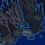
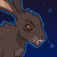
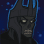

[Back to Main](index.md)

    
        
            
        
        
        Portrait
        
    

# Yorven

Yorven Springpaw disappeared from the Feywild as a child after an encounter with a malicious coven of hags. He ended up lost in the Shadowfell, where he embraced his innate primal spirit to survive. The power of this ancient feral beast helped Yorven do more than survive the dangers of the Shadowfell -- he thrived. When Yorven came across the Witchlight Carnival he managed to convince the owners to bring him on board. When the Witchlight Carnival returned to the Feywild years later, Yorven moved on, seeking his childhood home - and the hags who banished him.

# Changes

Yorven will be a reworked champion in the The Great Modron March event on 14 May 2025 (guesstimated a week after event start potentially due to the Worst the Wait event augment).

Only abilities that have seen some changes will be displayed here - and be aware that there's a lot of guesswork involved. Some abilities may not have names - some may have the *wrong* names - or specialisations might not be marked as such - etc.. Focus on the effect data itself.

Please do me a favour and don't get all melodramatic about what you find here. I - and CNE - don't appreciate it. These are spoilers and will almost certainly change before release - likely multiple times. That and we don't have access to any upgrade data prior to release. Making assumptions on how the champions will turn out based on this information would be premature.

# Attacks

**Base Attack: Ferocious Maul** (Guess)
> Yorven leaps at the nearest enemy, rooting it in place and attacking it once every second for 5 seconds.  
> Cooldown: 8s (Cap 2s)

<em>Raw Data</em>

<pre>
{
    "id": 847,
    "name": "Ferocious Maul",
    "description": "Yorven leaps out at the nearest enemy, pinning it in place and attacking it once a second for 5 seconds",
    "long_description": "Yorven leaps at the nearest enemy, rooting it in place and attacking it once every second for 5 seconds.",
    "graphic_id": 0,
    "target": "front",
    "num_targets": 1,
    "aoe_radius": 0,
    "damage_modifier": 1,
    "cooldown": 8,
    "animations": [
        {
            "type": "melee_attack",
            "special_melee": "yorven_v2",
            "target_offset_x": -150,
            "damage_frame": 8,
            "effect_frames": {
                "hit": {
                    "effect_string": "monster_speed_reduce,100",
                    "for_time": 1,
                    "apply_to_hit_monsters": true
                }
            }
        }
    ],
    "tags": [
        "melee"
    ],
    "damage_types": [
        "melee"
    ]
}
</pre>

**Base Attack: Eldritch Tendril** (Guess)
>   
> Cooldown: 1s (Cap 0.25s)

<em>Raw Data</em>

<pre>
{
    "id": 850,
    "name": "Yorven Eldritch Tendril",
    "description": "",
    "long_description": "",
    "graphic_id": 0,
    "target": "random",
    "num_targets": 0,
    "aoe_radius": 0,
    "damage_modifier": 1,
    "cooldown": 1,
    "animations": [
        {
            "type": "ranged_attack",
            "projectile": "eldritch_tendril",
            "projectile_details": {
                "shoot_offset_y": -50,
                "impact_graphic_id": 751
            }
        }
    ],
    "tags": [
        "melee"
    ],
    "damage_types": [
        "melee"
    ]
}
</pre>

**Ultimate: Fey Wild Shape** (Guess)
> Yorven Springpaw wild shapes into a shadow mastiff-like creature for 30 seconds. During this time his attack cooldown is reduced and his damage is increased  
> Cooldown: 220s (Cap 55s)

<em>Raw Data</em>

<pre>
{
    "id": 851,
    "name": "Fey Wild Shape",
    "description": "Yorven Springpaw wild shapes into a powerful shadow mastiff-like creature for 30 seconds.",
    "long_description": "Yorven Springpaw wild shapes into a shadow mastiff-like creature for 30 seconds. During this time his attack cooldown is reduced and his damage is increased",
    "graphic_id": 12276,
    "target": "none",
    "num_targets": 0,
    "aoe_radius": 0,
    "damage_modifier": 1,
    "cooldown": 220,
    "animations": [
        {
            "type": "ultimate_attack",
            "ultimate": "yorven",
            "no_damage_display": true
        }
    ],
    "tags": [
        "ultimate"
    ],
    "damage_types": ""
}
</pre>

**Ultimate: Fey Wild Shape** (Guess)
> Yorven Springpaw wild shapes into a shadow mastiff-like creature for 30 seconds. During this time his attack cooldown is reduced and his damage is increased.  
> Cooldown: 220s (Cap 55s)

<em>Raw Data</em>

<pre>
{
    "id": 856,
    "name": "Fey Wild Shape",
    "description": "Yorven Springpaw wild shapes into a powerful shadow mastiff-like creature for 30 seconds.",
    "long_description": "Yorven Springpaw wild shapes into a shadow mastiff-like creature for 30 seconds. During this time his attack cooldown is reduced and his damage is increased.",
    "graphic_id": 12276,
    "target": "none",
    "num_targets": 0,
    "aoe_radius": 0,
    "damage_modifier": 0,
    "cooldown": 220,
    "animations": [
        {
            "type": "ultimate_attack",
            "ultimate": "yorven",
            "no_damage_display": true
        }
    ],
    "tags": [
        "ultimate"
    ],
    "damage_types": []
}
</pre>

# Abilities

**Witchlight Hand** (Guess)
> Yorven can be used in any Wild Beyond the Witchlight campaign adventure or variant, even if he would not normally be available to be used due to variant or patron restrictions.

<em>Raw Data</em>

<pre>
{
    "id": 2304,
    "flavour_text": "",
    "description": {
        "desc": "Yorven can be used in any Wild Beyond the Witchlight campaign adventure or variant, even if he would not normally be available to be used due to variant or patron restrictions."
    },
    "effect_keys": [
        {
            "effect_string": "do_nothing"
        }
    ],
    "requirements": "",
    "graphic_id": 0,
    "large_graphic_id": 0,
    "properties": {
        "show_in_owner_outgoing": true,
        "effect_name": "Witchlight Hand",
        "use_outgoing_description": true
    }
}
</pre>

**Rag Tag Team** (Guess)
> Yorven increases the damage of all Champions in the formation by 100% for each unique species in the formation, stacking multiplicatively.

ⓘ *Note: This ability is prestack.*

<em>Raw Data</em>

<pre>
{
    "id": 2305,
    "flavour_text": "",
    "description": {
        "desc": "Yorven increases the damage of all Champions in the formation by $amount% for each unique species in the formation, stacking multiplicatively."
    },
    "effect_keys": [
        {
            "effect_string": "pre_stack,100",
            "skip_effect_key_desc": true
        },
        {
            "effect_string": "hero_dps_multiplier_mult,0",
            "off_when_benched": true,
            "targets": [
                "all"
            ],
            "amount_expr": "upgrade_amount(17063,0)",
            "amount_func": "mult",
            "use_computed_amount_for_description": true,
            "stack_func": "per_unique_race",
            "amount_updated_listeners": [
                "slot_changed",
                "feat_changed"
            ],
            "show_bonus": true
        }
    ],
    "requirements": "",
    "graphic_id": 26237,
    "large_graphic_id": 26244,
    "properties": {
        "is_formation_ability": true,
        "owner_use_outgoing_description": true,
        "indexed_effect_properties": true,
        "per_effect_index_bonuses": true,
        "default_bonus_index": 0
    }
}
</pre>

**Blood Fury Tattoo** (Guess)
> Yorven gains a Blood Fury stack for each enemy that has been damaged in the current area. His damage is increased by 100% for each Blood Fury stack, stacking multiplicatively. Bosses provide 15 stacks when they are damaged. Caps at 25 stacks.

<em>Raw Data</em>

<pre>
{
    "id": 2306,
    "flavour_text": "",
    "description": {
        "desc": "Yorven gains a Blood Fury stack for each enemy that has been damaged in the current area. His damage is increased by $(not_buffed amount___2)% for each Blood Fury stack, stacking multiplicatively. Bosses provide 15 stacks when they are damaged. Caps at $max_stacks stacks."
    },
    "effect_keys": [
        {
            "effect_string": "yorven_blood_fury_tattoo_v2",
            "max_stacks": 25,
            "stacks_on_trigger": "will_manually_stack",
            "buff_effect_key_index": 1
        },
        {
            "effect_string": "hero_dps_multiplier_mult,100",
            "stacks_on_trigger": "will_manually_stack",
            "stack_title": "Blood Fury Stacks",
            "max_stacks": 25,
            "stacks_multiply": true,
            "more_triggers": [
                {
                    "trigger": "area_changed",
                    "action": {
                        "type": "reset"
                    }
                }
            ],
            "active_graphic_id": 26252,
            "active_graphic_owner_only": true,
            "active_graphic_y": -60,
            "active_graphic_frame_from_stacks": true,
            "amount_updated_listeners": [
                "slot_changed",
                "feat_changed"
            ],
            "show_bonus": true
        }
    ],
    "requirements": "",
    "graphic_id": 12271,
    "large_graphic_id": 12268,
    "properties": {
        "is_formation_ability": true,
        "owner_use_outgoing_description": true,
        "indexed_effect_properties": true,
        "per_effect_index_bonuses": true,
        "default_bonus_index": 1
    }
}
</pre>

**Danger Sense** (Guess)
> All Champions take 5 less damage from all attacks, and Rag Tag Team is increased by 500% each time Yorven's max health is doubled, stacking multiplicatively.

<em>Raw Data</em>

<pre>
{
    "id": 2307,
    "flavour_text": "",
    "description": {
        "desc": "All Champions take $amount less damage from all attacks, and Rag Tag Team is increased by $(not_buffed amount___2)% each time Yorven's max health is doubled, stacking multiplicatively."
    },
    "effect_keys": [
        {
            "effect_string": "fixed_damage_reduction_all_enemy_attacks,5",
            "off_when_benched": true,
            "targets": [
                "all"
            ],
            "percent_values": false,
            "total_title": "Current Damage Reduction"
        },
        {
            "effect_string": "buff_upgrade,500,17063,1",
            "off_when_benched": true,
            "amount_func": "mult",
            "stack_func": "per_hero_attribute",
            "health_divisor": 47,
            "post_process_expr": "floor(log(GetHeroHP(109)/health_divisor)/log(2))",
            "amount_updated_listeners": [
                "max_health_changed",
                "feat_changed"
            ],
            "show_bonus": true
        }
    ],
    "requirements": "",
    "graphic_id": 12272,
    "large_graphic_id": 12269,
    "properties": {
        "is_formation_ability": true,
        "owner_use_outgoing_description": true,
        "indexed_effect_properties": true,
        "per_effect_index_bonuses": true,
        "default_bonus_index": 0
    }
}
</pre>

# Specialisations

**Specialisation: Down the Rabbit Hole** (Guess)
> Yorven increases the effect of Rag Tag Team by 20% for each adventure, variant, and Patron variant you have completed in the Wild Beyond the Witchlight campaign, stacking multiplicatively.

<em>Raw Data</em>

<pre>
{
    "id": 2308,
    "flavour_text": "",
    "description": {
        "desc": "Yorven increases the effect of Rag Tag Team by $(not_buffed amount)% for each adventure, variant, and Patron variant you have completed in the Wild Beyond the Witchlight campaign, stacking multiplicatively."
    },
    "effect_keys": [
        {
            "off_when_benched": true,
            "effect_string": "buff_upgrade,20,17063,1",
            "stacks_multiply": true,
            "show_bonus": true,
            "amount_func": "mult",
            "stack_func": "get_stat",
            "stat": "WitchlightAdventuresCompleted",
            "ided_stat_id": 27,
            "ided_stat_handler": "CompletedAdventuresVariantsAndPatronVariants",
            "stack_title": "Witchlight Adventures Completed",
            "amount_updated_listeners": [
                "stat_changed,WitchlightAdventuresCompleted"
            ]
        }
    ],
    "requirements": "",
    "graphic_id": 26243,
    "large_graphic_id": 26236,
    "properties": {
        "is_formation_ability": true,
        "owner_use_outgoing_description": true,
        "indexed_effect_properties": true,
        "per_effect_index_bonuses": true,
        "default_bonus_index": 0
    }
}
</pre>

**Specialisation: Hunger for Blood** (Guess)
> Yorven's damage is increased by 1000% and if an enemy dies while he is attacking it with Ferocious Maul, he immediately leaps to another enemy and begins attacking that one. This adds one additional attack to Ferocious Maul each time it triggers.

<em>Raw Data</em>

<pre>
{
    "id": 2309,
    "flavour_text": "",
    "description": {
        "desc": "Yorven's damage is increased by $amount% and if an enemy dies while he is attacking it with Ferocious Maul, he immediately leaps to another enemy and begins attacking that one. This adds one additional attack to Ferocious Maul each time it triggers."
    },
    "effect_keys": [
        {
            "effect_string": "hero_dps_multiplier_mult,1000",
            "off_when_benched": true,
            "targets": [
                "self"
            ]
        }
    ],
    "requirements": "",
    "graphic_id": 0,
    "large_graphic_id": 12275,
    "properties": {
        "is_formation_ability": true,
        "owner_use_outgoing_description": true,
        "indexed_effect_properties": true,
        "per_effect_index_bonuses": true,
        "default_bonus_index": 0
    }
}
</pre>

**Specialisation: Eldritch Claw Tattoo** (Guess)
> Each time Yorven Springpaw attacks during Ferocious Maul, an inky tendril of Eldritch energy shoots out and zaps a different random enemy, dealing $amount second of BUD-based damage. The amount is increased by 400% if Yorven is the BUD-setting Champion. If no other enemies are on screen, this ability does nothing.

<em>Raw Data</em>

<pre>
{
    "id": 2310,
    "flavour_text": "",
    "description": {
        "desc": "Each time Yorven Springpaw attacks during Ferocious Maul, an inky tendril of Eldritch energy shoots out and zaps a different random enemy, dealing $amount second of BUD-based damage. The amount is increased by 400% if Yorven is the BUD-setting Champion. If no other enemies are on screen, this ability does nothing."
    },
    "effect_keys": [
        {
            "effect_string": "do_nothing,1"
        }
    ],
    "requirements": "",
    "graphic_id": 0,
    "large_graphic_id": 12274,
    "properties": {
        "is_formation_ability": true,
        "owner_use_outgoing_description": true,
        "indexed_effect_properties": true,
        "per_effect_index_bonuses": true,
        "default_bonus_index": 0
    }
}
</pre>

**Specialisation: Follow the Mad Rabbit** (Guess)
> Yorven's Rag Tag Team is increased by 50% for each Blood Fury stack Yorven has.

<em>Raw Data</em>

<pre>
{
    "id": 2311,
    "flavour_text": "",
    "description": {
        "desc": "Yorven's Rag Tag Team is increased by $(not_buffed amount)% for each Blood Fury stack Yorven has."
    },
    "effect_keys": [
        {
            "effect_string": "buff_upgrade,50,17063,1",
            "off_when_benched": true,
            "stacks_multiply": true,
            "stacks_on_trigger": "will_manually_stack",
            "max_stacks": 25,
            "amount_updated_listeners": [
                "slot_changed",
                "feat_changed"
            ],
            "show_bonus": true
        }
    ],
    "requirements": "",
    "graphic_id": 0,
    "large_graphic_id": 26248,
    "properties": {
        "is_formation_ability": true,
        "owner_use_outgoing_description": true,
        "indexed_effect_properties": true,
        "per_effect_index_bonuses": true,
        "default_bonus_index": 0
    }
}
</pre>

**Specialisation: Infectious Fury** (Guess)
> Yorven gains the Debuff role and any enemy he has attacked takes 100% additional damage from all Champions each time it attacks a member of the formation, stacking multiplicatively up to 25 times.

<em>Raw Data</em>

<pre>
{
    "id": 2312,
    "flavour_text": "",
    "description": {
        "desc": "Yorven gains the Debuff role and any enemy he has attacked takes $(not_buffed amount)% additional damage from all Champions each time it attacks a member of the formation, stacking multiplicatively up to 25 times."
    },
    "effect_keys": [
        {
            "effect_string": "yorven_infectious_fury_v2,100",
            "off_when_benched": true,
            "debuff": {
                "effect_string": "effect_def,2313"
            }
        },
        {
            "effect_string": "add_hero_tags,0,debuff"
        }
    ],
    "requirements": "",
    "graphic_id": 0,
    "large_graphic_id": 12270,
    "properties": {
        "is_formation_ability": true,
        "owner_use_outgoing_description": true,
        "indexed_effect_properties": true,
        "per_effect_index_bonuses": true,
        "default_bonus_index": 0,
        "retain_on_slot_changed": true
    }
}
</pre>

# Adventures and Variants

**Unlock Adventure: The Simril Spoilsport (Yorven)** (Complete Area 50)
> Simril is ruined! Someone has pilfered the food supplies!

 **Variant 1: Raven Swarm** (Complete Area 75)
> Yorven starts in your formation and can't be moved or removed.  
> Three ravens appear in each area. The ravens drop no gold, nor do they count towards quest progress.  
> Every 10 areas an additional raven spawns in the swarm, capped at 50 ravens.  
>   
> Getting to Know Yorven: If you choose the Hunger for Blood specialization, once Yorven defeats an enemy, he'll jump to another enemy to attack them as well!

 **Variant 2: Fangclaw** (Complete Area 125)
> In each boss area, a vicious rabbit boss enemy appears. It must also be defeated in order to progress.   
> Gold Find is reduced by 99%  
> Only Champions with DEX of 14 or higher can be used.

 **Variant 3: Raven Queen's Memories** (Complete Area 175)
> Yorven Springpaw is haunted by his time in the shadowfell.  
> A Wraith escorts the formation - increasing the base attack cooldown of each adjacent Champion by 4 seconds.   
> If Yorven is in the formation, the increase is only 2 seconds.   
> Enemies move 200% faster.

# Formation

    <svg xmlns="http://www.w3.org/2000/svg" id="Yorven" fill="#aaa" data-formationName="Yorven" data-campaignName="The Great Modron March" width="429" height="140"><circle cx="215" cy="65" r="15"/><circle cx="215" cy="105" r="15"/><circle cx="175" cy="45" r="15"/><circle cx="175" cy="85" r="15"/><circle cx="135" cy="65" r="15"/><circle cx="95" cy="45" r="15"/><circle cx="95" cy="85" r="15"/><circle cx="55" cy="25" r="15"/><circle cx="55" cy="105" r="15"/><circle cx="15" cy="125" r="15"/><text x="245" y="25" fill="#dcdcdc" font-size="25" font-family="Arial" font-weight="bold">Yorven</text><text x="245" y="65" fill="#dcdcdc" font-size="15" font-family="Arial" font-weight="bold">The Great Modron March</text></svg>

[Back to Top](#top)

*Last Modified: {{ site.time }}*